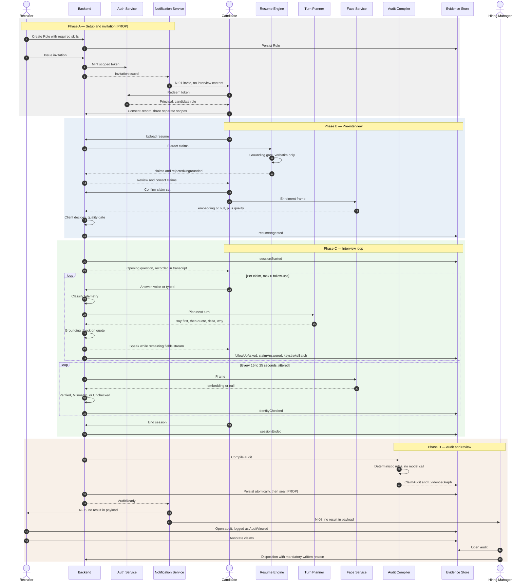
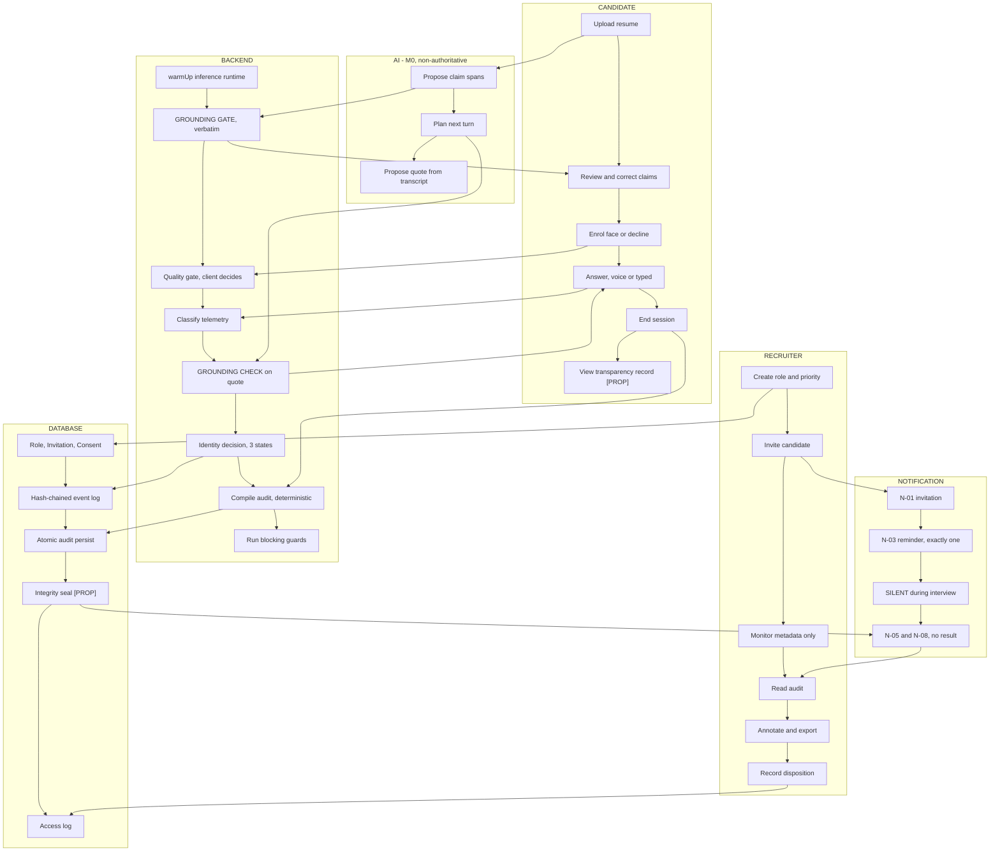
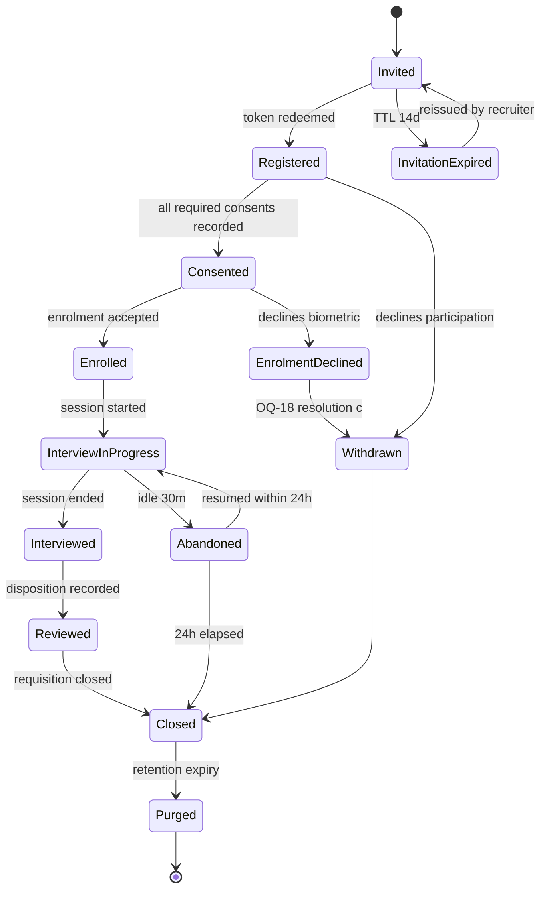
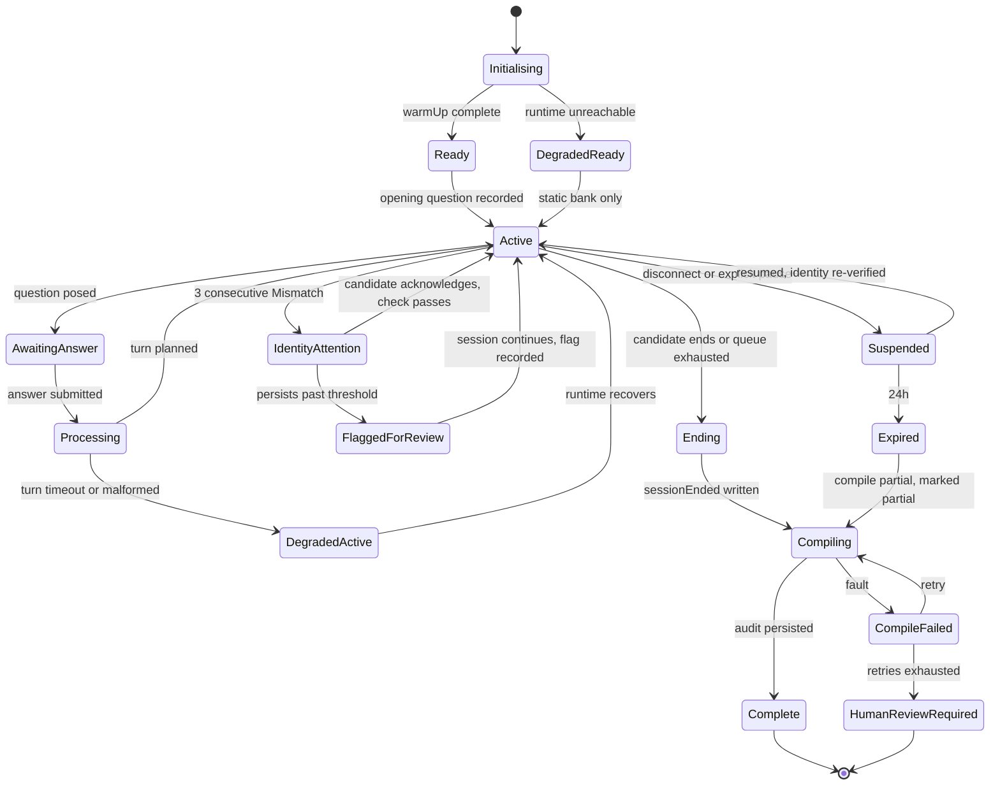
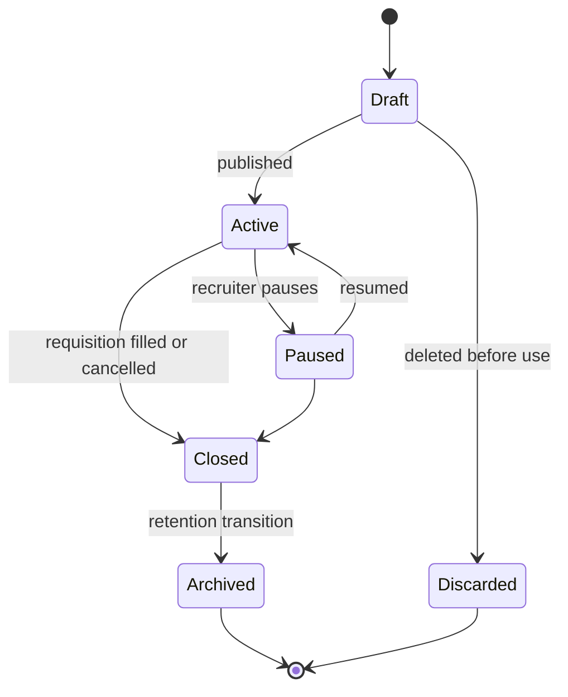
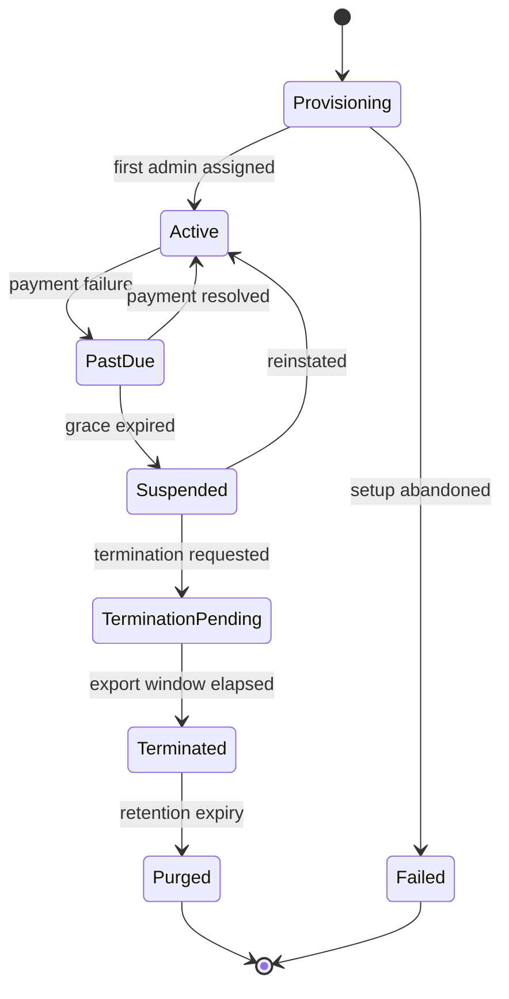
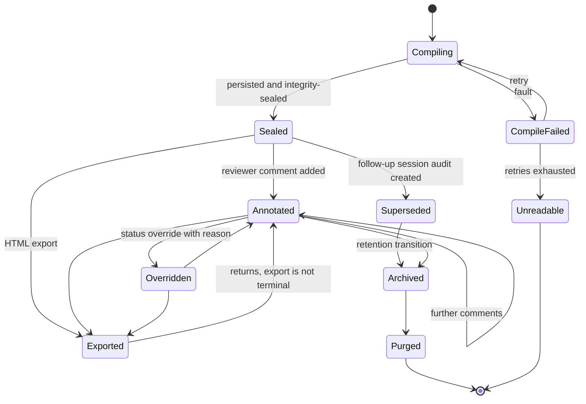
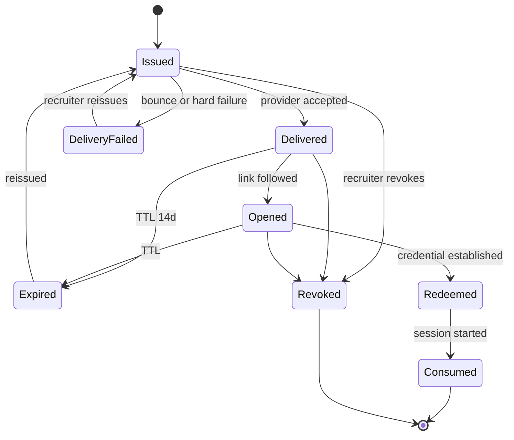
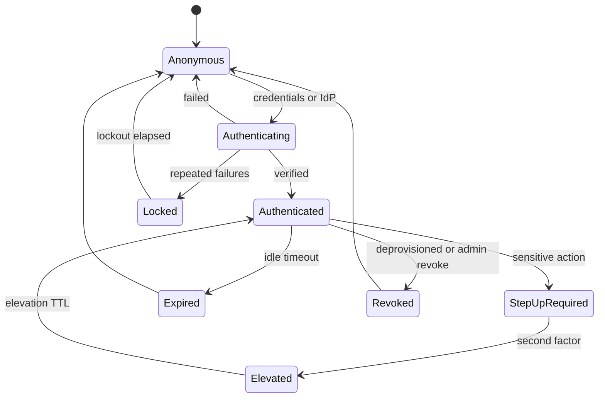

# CogniHire — Engineering Blueprint
# Chapter 2: User Personas & Complete User Journey

| Field | Value |
|---|---|
| Document | Chapter 2 of the CogniHire Engineering Blueprint |
| Version | 1.0 |
| Date | 2026-08-02 |
| Status | Draft for architecture review |
| Source of truth | **Chapter 1 — Product Vision & Scope.** This chapter does not override any decision made there |
| Purpose | The definitive behavioural specification: every actor, every workflow, every state transition |
| Downstream | Ch. 3 System Architecture · Ch. 4 Data Model · Ch. 5 AI/ML Architecture · Ch. 6 Security & Compliance · Ch. 7 Infrastructure & Scale |

---

## 0. Document control

### 0.1 Chapter renumbering — reconciliation with Chapter 1

Chapter 1's header assigned Ch. 2 to *System Architecture*. This chapter occupies Ch. 2 instead. Rather than silently contradict Chapter 1, the downstream map is renumbered:

| Chapter 1 said | Now |
|---|---|
| Ch. 2 System Architecture | **Ch. 3** |
| Ch. 3 Data Model | **Ch. 4** |
| Ch. 4 AI/ML Architecture | **Ch. 5** |
| Ch. 5 Security & Compliance | **Ch. 6** |
| Ch. 6 Infrastructure & Scale | **Ch. 7** |

**Consequence for inherited items.** Chapter 1 closed by handing four items to "Chapter 2": the §12.5 deployment-shape decision, OQ-01, OQ-13, OQ-17. Of these:

| Item | Disposition in this chapter |
|---|---|
| §12.5 deployment shape (local / on-prem / cloud) | **Deferred to Ch. 3.** It is a topology decision, not a behavioural one |
| OQ-01 — which interview screen is the real one | **Deferred to Ch. 3.** This chapter specifies the *behaviour* both candidates must experience; which implementation delivers it is an architecture decision |
| OQ-13 — resumable interviews | **Answered behaviourally here** (§12.6, §13.10). Mechanism deferred to Ch. 3 |
| OQ-17 — escalation on identity-verification failure | **Answered here** (§12.2, §13.14). This is a pure behavioural question and leaving it open would let each screen invent its own answer |

Chapter 1's ownership assignments for OQ-02 … OQ-16 shift by the same +1 renumbering.

### 0.2 Evidence tags

Carried forward unchanged from Chapter 1 §0.2.

| Tag | Meaning |
|---|---|
| `[IMPL]` | Verified in the repository as of 2026-08-02 |
| `[DES]` | Designed in a `docs/*_DESIGN.md`; not implemented |
| `[PROP]` | Proposed by this chapter; not designed or built |
| `[EST]` | Calculated estimate; assumptions stated at point of use |
| `[OPEN]` | Requires a future decision |

### 0.3 Reality gauge — read this before using any journey in this chapter

Chapter 1 §0.3 established that the running system is **single-tenant, single-machine, with no authentication wired in**. That fact dominates this chapter. Most of what a "complete user journey" implies — accounts, organisations, invitations, notifications, billing, identity federation — does not exist in any form.

| Journey | Implemented today | Proposed here |
|---|---|---|
| Candidate — account, invitation, scheduling | 0 % | 100 % `[PROP]` |
| Candidate — enrolment → interview → audit | ~85 % `[IMPL]` | Consent, transparency view, resume `[PROP]` |
| Recruiter — org creation, invites, collaboration | 0 % | 100 % `[PROP]` |
| Recruiter — role definition, review, export | ~70 % `[IMPL]` | Multi-user, override, disposition `[PROP]` |
| Hiring Manager — entire journey | 0 % — the role does not exist | 100 % `[PROP]` |
| Org Admin — entire journey | 0 % — the role does not exist | 100 % `[PROP]` |
| Platform Admin — entire journey | 0 % — no control plane exists | 100 % `[PROP]` |
| AI Agent internal journey | ~75 % `[IMPL]` | Scoring wiring, report agent `[OPEN]` |
| Notifications | 0 % — no email, SMS, push, or webhook code exists | 100 % `[PROP]` |
| Analytics events | ~30 % — `SessionEventKind` has 9 real kinds `[IMPL]`; no aggregation | 70 % `[PROP]` |

> **Rule for readers.** A step in this chapter without an `[IMPL]` tag is a specification, not a description. Do not cite this chapter as evidence that a capability exists. This is the same discipline Chapter 1 §0.2 imposed, and it exists because this project has previously had persuasive prose invent capabilities that were never built.

### 0.4 Naming hazards corrected

Three actor names in common use around this project invite a design error. They are renamed here, and the reason is recorded because the wrong name will re-import the wrong behaviour later.

| Common name | Problem | Name used in this blueprint |
|---|---|---|
| "AI Evaluation Engine" | Implies a model that evaluates a person. Chapter 1 ED-03/ED-04 forbid this: the audit is **deterministic and contains no model call**, and the ML layer is decision-*support* trained on synthetic data only | **Deterministic Audit Compiler** (verdicts) + **Sufficiency Decision-Support Model** (advisory, guarded) |
| "AI Interview Agent" | "Agent" implies autonomy over outcomes. It has none — it selects the next question and nothing else | **Interview Turn Planner** |
| "AI memory" | Implies cross-candidate learning. Any store that lets outputs from candidate A influence outcomes for candidate B is ED-04's prohibition arriving through a side door | **Session working set** (within-session, discarded) — see §9.6 |

---

## 1. Executive Summary

### 1.1 Why journeys precede architecture

Architecture is the set of commitments that are expensive to reverse. A journey specification is the cheapest instrument for discovering which commitments you are about to make. Four concrete reasons, each with a CogniHire example:

**1. Journeys reveal the actors, and actors determine the security model.**
Chapter 1 §6 established that the Platform Administrator must not be an application principal, because an operator who is also a principal can read candidate biometrics through the product UI. That is a security-architecture decision, and it was produced by asking *what does this person actually do all day*, not by drawing a component diagram. A component diagram would have shown one "admin" box.

**2. Journeys reveal state, and state determines the data model.**
"The candidate closes their laptop mid-interview" is one sentence in a journey. It implies: session suspension, a durable state boundary, an identity-verification gap that must be recorded rather than interpolated, a resumption authorisation, and a timeout policy. Chapter 1 recorded this as OQ-13 and noted that `InterviewController` holds state in memory until `saveAudit()` — meaning the current answer is "the session is lost." A data model designed before that sentence was written would not have a session aggregate at all.

**3. Journeys reveal the failure surface, which is where most engineering cost lives.**
§13 of this chapter enumerates 20 edge cases. At least seven of them (camera denied, mic denied, LLM timeout, resume parse failure, face service reachable-but-broken, corrupt audit, schema-version mismatch) have a *correct* behaviour that is materially harder to build than the wrong one — because Chapter 1's P5 requires failure to be loud, and loud failure means every degraded path needs its own state, its own UI, and its own record. Costing that after architecture is committed is how projects discover they built the happy path only.

**4. Journeys are where a product boundary is actually enforced or lost.**
Chapter 1 §15 says CogniHire never ranks candidates. That boundary is not defended by an architecture diagram. It is defended — or surrendered — at one specific step of the recruiter journey: the moment a recruiter has twelve completed audits open and needs to decide what to do next. §5.8 of this chapter specifies what the system offers at that moment. If that step is left unspecified, the pressure described in Chapter 1 R-13 fills it with a score.

### 1.2 What this chapter commits to

| Commitment | Where |
|---|---|
| 17 actors, each with a trust level and an explicit permission set | §2 |
| 5 human personas with accessibility and security requirements | §3 |
| 5 human journeys, step-by-step, with data/notification/failure/recovery per step | §4–§8 |
| The AI's internal progression, including what it is structurally forbidden to do | §9 |
| One end-to-end workflow in ASCII and Mermaid | §10 |
| 6-lane swimlane decomposition | §11 |
| 7 state machines with entry/exit/transition/failure/timeout per state | §12 |
| 20 edge cases with detection, behaviour, and recovery | §13 |
| Every action mapped to a permission, with 9 named privilege-escalation risks | §14 |
| The human/AI responsibility split with explicit override points | §15 |
| A complete notification catalogue with a content-minimisation rule | §16 |
| A complete analytics catalogue with retention and privacy class | §17 |

### 1.3 The single most consequential finding in this chapter

It is in §17.5, and it is stated here because it will otherwise be discovered too late:

> **Recording the hiring outcome ("candidate hired") as an analytics event constructs, incidentally, exactly the labelled dataset that Chapter 1 ED-04 refuses to collect.**

Every analytics implementation records outcomes; it is the most natural event in the catalogue. One `JOIN` between that event stream and the evidence store produces a supervised training set mapping interview evidence to hiring decisions — the precise artifact whose absence is CogniHire's answer to "where does your training data come from." The mitigation is a technical control, not a policy note, and is specified in §17.5 and §20.1.

---

## 2. Actors

### 2.1 Trust model

Actor sections below reference a trust level. The scale is defined once here.

| Level | Name | Definition | Implication |
|---|---|---|---|
| **T0** | Adversarial-assumed | Input is attacker-controlled by default | All input escaped at every sink; nothing self-reported is authoritative |
| **T1** | Authenticated, untrusted content | Identity established; content still T0 | Candidate is T1 as a principal, T0 as a content source |
| **T2** | Authenticated, domain-trusted | Trusted to act within their permission set, audited | Recruiter, Hiring Manager |
| **T3** | Administrative | Configures the system for others, cannot read interview content | Org Admin |
| **T4** | Control plane | Operates infrastructure, structurally excluded from application data | Platform Administrator |
| **M0** | Machine, non-authoritative | Produces output that must be independently validated before use | Interview Turn Planner, Resume Intelligence Engine |
| **M1** | Machine, deterministic-authoritative | Output is a pure function of validated inputs; auditable by re-execution | Deterministic Audit Compiler, Evidence Store |

> **T-levels are about permissions, never about content.** A T2 recruiter's typed note is still escaped before rendering. An M0 model's output is still grounding-checked before it is attributed to a person. Chapter 1 P6: *the model may select; it may never author.*

### 2.2 Actor register

| # | Actor | Class | Trust | Status |
|---|---|---|---|---|
| A-01 | Candidate | Human | T1 / T0 content | `[IMPL]` partial |
| A-02 | Recruiter | Human | T2 | `[IMPL]` partial |
| A-03 | Hiring Manager | Human | T2 | `[PROP]` |
| A-04 | Organization Admin | Human | T3 | `[PROP]` |
| A-05 | Platform Administrator | Human | T4 | `[PROP]` |
| A-06 | Interview Turn Planner ("AI Interview Agent") | Machine | M0 | `[IMPL]` |
| A-07 | Deterministic Audit Compiler | Machine | M1 | `[IMPL]` |
| A-08 | Sufficiency Decision-Support Model | Machine | M0 | `[IMPL]` synthetic-only |
| A-09 | Resume Intelligence Engine | Machine | M0 | `[IMPL]` |
| A-10 | Face Verification Service | Machine | M1 | `[IMPL]` |
| A-11 | Local Inference Runtime (Ollama) | Machine | M0 | `[IMPL]` |
| A-12 | Evidence Store & Integrity Service | Machine | M1 | `[IMPL]` partial |
| A-13 | Notification Service | Machine | M1 | `[PROP]` |
| A-14 | Authentication Service | Machine | M1 | `[PROP]` |
| A-15 | External Identity Provider | External | T2-delegated | `[PROP]` |
| A-16 | Billing Service | External | T3-scoped | `[PROP]` V2+ |
| A-17 | Observability Pipeline | Machine | M1 | `[PROP]` |

---

### A-01 — Candidate

| Field | Detail |
|---|---|
| **Purpose** | The person whose claims are being verified. The only actor whose data the system exists to protect |
| **Responsibilities** | Provide resume; consent to or decline biometric enrolment; review and correct extracted claims before the interview; answer questions; end the session explicitly |
| **Permissions** `[IMPL]` | `takeInterview`, `manageOwnResume`, `configureOwnSession`, `viewOwnHistory`, `viewOwnReports`, `manageOwnProfile`, `managePersonalSettings` |
| **Inputs** | Invitation token; resume document; camera frames; audio or typed text; claim corrections; consent decisions |
| **Outputs** | Resume text; enrolment embedding; transcript utterances; keystroke telemetry; claim confirmations; session-end signal |
| **Dependencies** | A-09 (extraction), A-06 (questions), A-10 (identity), A-14 (auth), A-13 (invitation delivery) |
| **Trust level** | **T1 as principal, T0 as content source.** Both halves matter: authenticated, and simultaneously the assumed source of prompt-injection and XSS payloads. Chapter 1 NFR-SEC5 |
| **Future expansion** | Portable candidate-owned evidence wallet (Ch. 1 §16 long-term direction 1); cross-organisation claim reuse; candidate-initiated re-verification |

**Structural constraints on this actor:**
- Cannot start an interview without completed enrolment — enforced at the type level, not by a runtime check `[IMPL]`
- Sees extracted claims and may correct them *before* the interview begins `[IMPL]`
- Declining enrolment is a supported path with a stated consequence, not an error `[IMPL]`
- Never receives a score, because none exists `[IMPL]`

---

### A-02 — Recruiter

| Field | Detail |
|---|---|
| **Purpose** | Operates the hiring process; converts evidence into a recorded disposition |
| **Responsibilities** | Define job roles and required skills; create sessions; invite candidates; review evidence; record disposition; export audits; annotate claims |
| **Permissions** `[IMPL]` | `viewHrDashboard`, `manageCandidates`, `compareCandidates`, `createSession`, `uploadCandidateResume`, `reviewEvidence`, `viewClaimAudit`, `viewAllReports`, `exportReports`, `viewAnalytics`, `manageJobRoles`, `manageOrganisation`, `managePersonalSettings` |
| **Inputs** | Job requisition; candidate contact details; resumes; completed audits; hiring-manager feedback |
| **Outputs** | `Role` definitions; session configurations; invitations; claim annotations; dispositions; exported audits |
| **Dependencies** | A-14, A-13, A-12, A-07 |
| **Trust level** | **T2.** Domain-trusted, fully audited. Every read of a candidate audit is an auditable event `[PROP]` |
| **Future expansion** | Multi-reviewer consensus (Ch. 1 §9.1); requisition-scoped delegation; ATS write-back |

> ⚠️ **Known defect carried from Chapter 1 §6.3.** `manageOrganisation` is currently granted to every recruiter `[IMPL]`. Correct for a two-role MVP, wrong for V1. It must move to A-04 when that role is introduced. Tracked as **PE-01** in §14.4.

---

### A-03 — Hiring Manager `[PROP]`

| Field | Detail |
|---|---|
| **Purpose** | Owns the requisition and the advance/decline decision. Consumes evidence; does not operate the system |
| **Responsibilities** | Define what "substantiated" must mean for the role; read audits; record advance/decline with a reason; feed observations back into role definitions |
| **Permissions** `[PROP]` | `viewClaimAudit`, `reviewEvidence`, `viewAllReports` **requisition-scoped**, `compareCandidates`, `exportReports`, `managePersonalSettings` |
| **Denied** | `manageOrganisation`, `manageCandidates`, `uploadCandidateResume`, `createSession` |
| **Inputs** | Completed audits; role coverage reports; recruiter annotations |
| **Outputs** | Advance/decline disposition with mandatory written reason; role-definition feedback |
| **Dependencies** | A-02 (session creation), A-07, A-12 |
| **Trust level** | **T2, narrower scope than A-02.** Chapter 1 §6.4: requisition-scoped read is a *different permission*, not the same permission behind a filter |
| **Future expansion** | Calibration across managers; structured scorecard replacement; panel consensus |

---

### A-04 — Organization Admin `[PROP]`

| Field | Detail |
|---|---|
| **Purpose** | Owns the tenant's configuration, compliance posture, and data lifecycle |
| **Responsibilities** | User and role-assignment management; retention policy; disclosure text and jurisdiction; integration configuration; export approval; holds the cross-session administrative audit log |
| **Permissions** `[PROP]` | `manageOrganisation`, `manageUsers`, `manageRetentionPolicy`, `viewAdminAuditLog`, `manageJobRoles`, `viewAnalytics`, `managePersonalSettings` |
| **Denied — deliberately** | `viewClaimAudit`, `reviewEvidence`. Administering the system does not require reading interviews. Granting it makes every admin account a candidate-data breach surface (Ch. 1 §6.5) |
| **Inputs** | Org profile; user roster; IdP metadata; retention configuration; billing account |
| **Outputs** | Role assignments; policy records; retention schedules; admin audit entries |
| **Dependencies** | A-14, A-15, A-16, A-13 |
| **Trust level** | **T3.** High privilege over configuration, **zero** privilege over content |
| **Future expansion** | Delegated departmental admins; policy-as-code; automated compliance attestation |

> **Dual-role rule** `[PROP]`. If a person must both administer and review, they hold two assignments and every audit entry records which one they acted under. There is no combined role. A combined role makes §14.4 PE-04 unpreventable.

---

### A-05 — Platform Administrator `[PROP]`

| Field | Detail |
|---|---|
| **Purpose** | Operates the infrastructure. **Not an application principal.** Chapter 1 §6.6 |
| **Responsibilities** | Deploy, monitor, patch, back up, restore; manage model artifacts and their provenance flags; incident response; capacity |
| **Permissions in the application** | **None.** No `UserRole` value exists or may exist for this actor |
| **Permissions in the control plane** `[PROP]` | `deployRelease`, `viewSystemHealth`, `viewScrubbedTelemetry`, `manageModelRegistry`, `executeBackup`, `executeRestore`, `rotateSecrets`, `viewControlPlaneAuditLog` |
| **Inputs** | Scrubbed telemetry; health signals; alerts; model artifacts; backup manifests |
| **Outputs** | Deployments; restores; incident records; capacity changes |
| **Dependencies** | A-17, A-12 (opaque handles only) |
| **Trust level** | **T4.** Highest infrastructure privilege, **structurally excluded from interview content** |
| **Future expansion** | Break-glass access with dual authorisation, time-boxing, and mandatory candidate notification `[PROP]` |

**Hard constraints:**
1. Telemetry is scrubbed **at emission**, not at query time — a query-time filter is a permission that can be dropped `[IMPL: primitives exist in `core/privacy/`; enforcement `[PROP]`]`
2. Backups are encrypted with keys the platform administrator cannot unilaterally use `[PROP]`
3. Restore operates on opaque blobs; it never requires reading a transcript
4. Break-glass content access requires two-person authorisation, is time-boxed, and generates a candidate-visible disclosure `[PROP]` `[OPEN: OQ-24]`

---

### A-06 — Interview Turn Planner (the "AI Interview Agent")

| Field | Detail |
|---|---|
| **Purpose** | Select the next question. **That is its entire authority.** |
| **Responsibilities** | Given transcript state, claim queue, and telemetry triggers, emit one turn: `{say, kind, quote, difficulty_delta, why}` |
| **Permissions** | Read: current session transcript, current claim, question bank, telemetry trigger. Write: **nothing.** It returns a proposal that the client validates and records |
| **Inputs** | System prompt; transcript; current claim; `consecutive_short`; last-answer score `[OPEN: hardcoded to `1` today]` |
| **Outputs** | One turn object per invocation |
| **Dependencies** | A-11 |
| **Trust level** | **M0.** Every string it returns is validated before use |
| **Future expansion** | Code-authorship probes `[DES]`; engineering-memory probes `[DES]`; multilingual `[OPEN]` |

**Structural prohibitions — each enforced outside the prompt:**

| Prohibition | Enforcement |
|---|---|
| May not author candidate speech | Grounding gate: `quote` must be verbatim-findable in the transcript or the turn is downgraded to `kind: newtopic` with an empty quote, client-side `[IMPL]` |
| May not infer or mention affect | Prompt rule 5 **plus** a test asserting it cannot be coaxed into "you seem nervous" `[IMPL]` |
| May not accuse | Template-first bank plus a deterministic banned-phrase linter over generated text `[DES]` |
| May not produce a score | No score field exists in the turn schema `[IMPL]` |
| May not use identity confidence to select difficulty | Identity confidence affects follow-up *timing* only. Chapter 1 records this as a deliberate boundary: a hidden confidence signal steering question difficulty recreates the hidden score the product rejects `[DES]` |
| May not emit chain-of-thought | `say` serialises first so TTS can start while later fields are still being written; `why` is a one-sentence post-hoc audit line. Key order is mechanically enforced by the eval harness `[IMPL]` |

---

### A-07 — Deterministic Audit Compiler

| Field | Detail |
|---|---|
| **Purpose** | Convert collected evidence into one verdict per claim. **Contains no model call.** |
| **Responsibilities** | Apply authored rules to evidence; emit `ClaimAudit`; derive `ProvenanceQuality`; construct the evidence graph |
| **Permissions** | Read the session's evidence; write one audit |
| **Inputs** | Claims, transcript, telemetry, identity attempts, reviewer assessments |
| **Outputs** | `ClaimAudit` — 4 states; `EvidenceGraph` — 7 node types, 7 edge types, mandatory rationale, **no numeric weights** `[IMPL]` |
| **Dependencies** | A-12 |
| **Trust level** | **M1.** Deterministic and reproducible: same inputs, same audit, verifiable by re-execution |
| **Future expansion** | Multi-reviewer inputs; contested-claim states `[OPEN: OQ-11]` |

**Invariants** `[IMPL]`: derived fields are never persisted — they are recomputed on load so a hand-edited file cannot disagree with the rules; an `Unchecked` identity attempt produces a `derivedFrom` edge, never an evidentiary one, because an unmeasured check neither supports nor contradicts; orphan nodes and dangling edges surface as faults rather than being hidden.

---

### A-08 — Sufficiency Decision-Support Model

| Field | Detail |
|---|---|
| **Purpose** | Advise a reviewer whether the evidence collected for a claim is *sufficient to judge* — never whether the candidate is good |
| **Responsibilities** | Emit a calibrated probability with exact per-feature attribution, or **abstain** |
| **Permissions** | Read features derived from one session; write nothing |
| **Inputs** | 87-feature vector `[IMPL]` |
| **Outputs** | Probability + exact logit decomposition + conformal abstain decision + provenance flags |
| **Dependencies** | Bundled model artifact |
| **Trust level** | **M0, and additionally marked unvalidated.** `isValidatedOnRealData = false`; there is no `fitReal()` path `[IMPL]` |
| **Future expansion** | Real-data validation **only** with an ethically sourced labelled dataset; otherwise it stays explicitly synthetic-only rather than being quietly promoted (Ch. 1 §16 V2) |

**The guard suite is load-bearing UI, not a lint.** The reviewer screen **refuses to render** a decision when any blocking guard fires, showing violations instead `[IMPL]`. Blocking guards: unvalidated-model-presented-as-real, missing synthetic caveat, abstain overridden, no evidence, explanation/model mismatch, probability out of range.

---

### A-09 — Resume Intelligence Engine

| Field | Detail |
|---|---|
| **Purpose** | Turn resume text into discrete, checkable claims stated in the candidate's own words |
| **Responsibilities** | Segment; extract candidate claims; classify into a closed taxonomy; enforce grounding; deduplicate; fall back deterministically |
| **Permissions** | Read one resume; write a claim set plus a rejection set |
| **Inputs** | Resume text (T0 — attacker-controlled) |
| **Outputs** | `ClaimExtraction { claims[], rejectedUngrounded[], kind, degradedReason }` `[IMPL]` |
| **Dependencies** | A-11; deterministic fallback extractor `[IMPL]` |
| **Trust level** | **M0** |
| **Future expansion** | PDF/DOCX text extraction (Ch. 1 V1-09); 11-type taxonomy `[DES]`; multilingual `[OPEN]` |

**Prompt-injection defence is structural, not textual** `[DES]`: `confidence`, `claimType`, and `quote` are never model-settable fields. A resume instructing the model to self-report high confidence has **no field to land in**. This is stronger than any instruction-hardening.

---

### A-10 — Face Verification Service

| Field | Detail |
|---|---|
| **Purpose** | Produce a 512-d embedding and quality signals from a frame. **It does not decide identity** |
| **Responsibilities** | Detect a face; emit an embedding or an honest null; report quality; report engine availability |
| **Permissions** | Process one frame; retain nothing |
| **Inputs** | A single frame |
| **Outputs** | `{engine_available, face_detected, embedding_available, embedding[512]\|null, face_size, brightness, sharpness, recommendations}` `[IMPL]` |
| **Dependencies** | InsightFace `buffalo_l` — SCRFD detection + ArcFace recognition **only**; demographic modules explicitly excluded and verified in the startup log `[IMPL]` |
| **Trust level** | **M1** — it reports measurements, never verdicts |
| **Future expansion** | Passive liveness `[OPEN: OQ-07]`; GPU batching (Ch. 1 NFR-S4) |

**Chapter 1 ED-06 applied here: the service extracts, the client decides.** Comparison, thresholding, and the `Verified`/`Mismatch`/`Unchecked` determination happen in the client. A service that returns verdicts is a service that can invent them. Corollary `[IMPL]`: `embedding` is `null`, never a zero-vector; if InsightFace fails to load the service still starts and reports `engine_available: false` rather than falling back to a heuristic.

---

### A-11 — Local Inference Runtime (Ollama)

| Field | Detail |
|---|---|
| **Purpose** | Execute `qwen2.5:7b` locally so candidate documents never leave the machine (Ch. 1 P4/D4) |
| **Responsibilities** | Serve completions for A-06 and A-09; hold the model warm |
| **Permissions** | None over application data |
| **Inputs** | Prompt + transcript |
| **Outputs** | Streaming JSON |
| **Dependencies** | Local hardware; contends with A-10 for the same GPU memory `[IMPL]` |
| **Trust level** | **M0** |
| **Future expansion** | **This actor does not survive multi-tenant scale unmodified.** Ch. 1 ED-01 and §12.2 require Ch. 7 to re-argue it rather than inherit it |

**Operational contract** `[IMPL]`: cold start ≈ 40 s (21 s weights + 17 s prompt eval); warm ≈ 2.2–2.6 s. `warmUp()` **must** be called before the candidate can submit anything, or turn one eats a cold load that the per-turn timeout was never sized for — a real shipped bug (a 20 s timeout against a 40 s cold load) that presented as a connectivity fault.

---

### A-12 — Evidence Store & Integrity Service

| Field | Detail |
|---|---|
| **Purpose** | Durable, tamper-evident custody of everything the audit rests on |
| **Responsibilities** | Append session events to a hash chain; persist audits atomically; surface unreadable records; enforce retention `[PROP]` |
| **Permissions** | Write-once for events; read scoped by tenant `[PROP]` |
| **Inputs** | 9 real event kinds `[IMPL]`: `sessionStarted`, `sessionEnded`, `claimOpened`, `claimAnswered`, `followUpAsked`, `identityChecked`, `integrityObserved`, `keystrokeBatch`, `resumeIngested` |
| **Outputs** | Chained event log; persisted audits; a session index reporting readable **and unreadable** records `[IMPL]` |
| **Dependencies** | Filesystem today; indexed store from V2 |
| **Trust level** | **M1** |
| **Future expansion** | Tenant scoping (Ch. 1 R-05); indexed store (NFR-S5); audit-file integrity (Ch. 1 V1-06) |

> ⚠️ **Known gap, Chapter 1 R-08.** The hash chain covers the event log. Saved audit files — the artifact that leaves the app and is presented as defensible — have **zero** integrity protection and are silently editable `[IMPL]`.

---

### A-13 — Notification Service `[PROP]`

| Field | Detail |
|---|---|
| **Purpose** | Deliver invitations, reminders, and state-change notices |
| **Responsibilities** | Render templates; dispatch across channels; retry with backoff; enforce idempotency; suppress on unsubscribe; record delivery outcomes |
| **Permissions** | Read minimal recipient identity + event type. **Never** claim content, verdicts, transcripts, or telemetry |
| **Inputs** | Domain events from the event bus |
| **Outputs** | Email/SMS/push/webhook dispatches; delivery receipts; dead-letter entries |
| **Dependencies** | A-14 (recipient resolution); external providers |
| **Trust level** | **M1 internally; every external provider is T0** |
| **Future expansion** | Localisation; quiet hours; digest batching; per-tenant provider bring-your-own |

> **Content-minimisation rule** `[PROP]`, and it is not stylistic. A notification travels to an inbox the organisation does not control, is retained by providers, and is frequently forwarded. **No notification may contain a claim, a verdict, a transcript excerpt, a telemetry observation, or a similarity value.** The permitted payload is: recipient name, event type, a deep link, and a deadline. See §16.2.

---

### A-14 — Authentication Service `[PROP]`

| Field | Detail |
|---|---|
| **Purpose** | Establish a `Principal` — identity, role, tenant |
| **Responsibilities** | Credential verification or IdP federation; session issuance and revocation; MFA; invitation-token redemption |
| **Permissions** | Issue and revoke principals; never read interview data |
| **Inputs** | Credentials, IdP assertions, invitation tokens |
| **Outputs** | `Principal { userId, UserRole, tenantId }` `[PROP: tenantId]` |
| **Dependencies** | A-15; the existing `AuthStore` interface `[IMPL]` |
| **Trust level** | **M1** |
| **Future expansion** | SCIM provisioning; step-up auth for export; device binding for candidates |

> **Current state, Chapter 1 R-04.** `InMemoryAuthStore` holds plaintext passwords in a `Map` compared with `==`, does not persist, and is self-documented as a test double `[IMPL]`. **The good news is structural:** the work is "implement the existing `AuthStore` interface," not "design authentication." The interface does not change. Chapter 1 FR-1.3 is already honoured: an unrecognised stored role is refused rather than defaulted, because guessing a role is a security decision made by a parser `[IMPL]`.

---

### A-15 — External Identity Provider `[PROP]`

| Field | Detail |
|---|---|
| **Purpose** | Federate workforce identity so the organisation controls its own account lifecycle |
| **Responsibilities** | Authenticate; assert identity and group membership; signal deprovisioning |
| **Permissions** | Assert identity only. **Group-to-role mapping is owned by CogniHire, not by the IdP** |
| **Inputs** | Redirects; SCIM events |
| **Outputs** | Signed assertions; provisioning events |
| **Dependencies** | Tenant IdP configuration |
| **Trust level** | **T2-delegated for workforce; explicitly not used for candidates** |
| **Future expansion** | SCIM deprovisioning-driven session revocation; per-tenant multi-IdP |

**Two hard rules** `[PROP]`:
1. **Candidates do not authenticate via the tenant's IdP.** A candidate is not an employee; putting them in the corporate directory leaks the fact and timing of their application to anyone with directory read access. Candidates authenticate against a scoped invitation credential.
2. **An IdP group never grants a permission directly.** It maps to a CogniHire `UserRole`, which maps to permissions through the single deny-by-default table (Ch. 1 ED-08). Otherwise an IdP administrator becomes an unaudited grantor of application privilege — §14.4 PE-07.

---

### A-16 — Billing Service `[PROP]` (V2+)

| Field | Detail |
|---|---|
| **Purpose** | Meter and invoice tenant usage |
| **Responsibilities** | Consume usage counters; apply plan limits; invoice; signal entitlement changes |
| **Permissions** | Read **aggregate counters only** — never candidate records |
| **Inputs** | Counters: sessions started, sessions completed, seats, storage bytes |
| **Outputs** | Invoices; entitlement state; overage signals |
| **Dependencies** | A-17, A-04 |
| **Trust level** | **T3-scoped, external** |
| **Future expansion** | Per-interview pricing; overage grace policy |

> **Billing must never be able to terminate a live interview.** An entitlement lapse suspends *new* session creation. A session already in progress runs to completion. A candidate stranded mid-interview by their prospective employer's expired card is an unrecoverable trust failure, and the fix is a scheduling rule, not a support process. Specified in §12.4 (Organization) and §13.11.

---

### A-17 — Observability Pipeline `[PROP]`

| Field | Detail |
|---|---|
| **Purpose** | Health, latency, and error visibility **without** interview content |
| **Responsibilities** | Collect metrics, scrubbed logs, traces; alert; retain per policy |
| **Permissions** | Read scrubbed telemetry only |
| **Inputs** | Emission-time-scrubbed events |
| **Outputs** | Dashboards, alerts, SLO burn |
| **Dependencies** | `core/privacy/scrubber.dart`, `candidate_id.dart` `[IMPL: primitives]` |
| **Trust level** | **M1** |
| **Future expansion** | SLO automation; anomaly detection on grounding-rejection rate (Ch. 1 NFR-O7) |

**Chapter 1 NFR-O5 applied:** health must distinguish *unreachable* from *reachable but not functional*. `engine_available: false` on a service that answers HTTP 200 is the exact case a naive uptime check reports as green `[IMPL]`.

---

## 3. User Personas

Personas are specified for engineering consequence, not empathy. Each names a requirement the architecture must satisfy.

> ⚠️ **Chapter 1 R-01 applies in full.** These personas are **constructed from competitive analysis and first principles. Zero recruiters, hiring managers, or candidates have been interviewed.** They are hypotheses. This project has previously had generated prose insert fabricated customer research — five recruiter interviews that never happened — so the absence of validation is stated here rather than implied away. Every persona below carries a **validation status of: unvalidated**.

---

### P-1 — Priya, Candidate

| Field | Detail |
|---|---|
| **Background** | 27, backend engineer, 4 years' experience, applying to 6–10 companies concurrently. Has been rejected post-interview with no explanation twice this quarter |
| **Goals** | Be evaluated on what she actually built; know what was concluded and why; not lose an evening to a broken tool |
| **Pain points** | Opaque rejection; re-explaining the same project to four interviewers; proctoring tools that flag her for looking away; no idea what is retained about her |
| **Technical skill** | High — but on *her* stack, not on the interviewing tool. She will read the permission prompt and will decline if the reason is unclear |
| **Success criteria** | Completes without a technical fault; sees her claims and can correct a wrong extraction; receives a record showing what was examined and what was not |
| **Failure criteria** | Camera/mic failure with no fallback; a claim she never made attributed to her; being flagged with no chance to respond; unclear biometric retention |
| **Security concerns** | Where the face embedding goes and for how long; whether the resume reaches a third-party model; whether other candidates can see her data |
| **Accessibility needs** | Screen-reader compatibility; keyboard-only operation; captions for AI speech; **a fully text-based interview path**; no colour-only status encoding; adjustable timing |

**Engineering consequences:**

| Requirement | Status |
|---|---|
| Text-only interview path with parity of outcome | `[IMPL: partial]` — the controller's contract is already "text in, text out"; STT/TTS are named in code as swap points, so a typed path is architecturally free. **It is not yet an offered, first-class candidate choice** `[PROP]` |
| Status conveyed by icon **plus** text, never colour alone | `[IMPL]` — `StatusChip` enforces this |
| No red→amber→green ramp anywhere | `[IMPL]` — deliberate: a colour ramp is a composite score expressed in colour |
| Live-updating figures use tabular figures so the line does not jitter | `[IMPL]` |
| Screen-reader audit | **Never performed** `[OPEN: OQ-19]` |
| Candidate transparency view | Absent — Ch. 1 V1-10 `[PROP]` |

> 🔴 **Accessibility finding, and it is a legal exposure, not a nicety.** A voice-first interview that lacks an equivalent text path systematically disadvantages Deaf, hard-of-hearing, and speech-disabled candidates in a hiring context. That is disability discrimination regardless of intent. The mitigation is already architecturally available — the controller only knows "text in, text out" — but **it must become an explicit, equal, candidate-selectable path with no evidentiary penalty**, and the audit must not record "did not use voice" as an observation of any kind. Tracked as **R-16** in §19.

---

### P-2 — Daniel, Recruiter

| Field | Detail |
|---|---|
| **Background** | 34, technical recruiter, 6 years, mid-market SaaS, ~15 requisitions concurrently, 8–12 screens weekly. Not an engineer |
| **Goals** | Send hiring managers evidence instead of impressions; stop re-litigating rejections; defend the process when asked |
| **Pain points** | Cannot assess technical depth himself; hiring managers dismiss his notes; debriefs run on memory; compliance asks questions he cannot answer |
| **Technical skill** | Moderate — fluent in ATS and spreadsheets, not in code. **Will not read a 40-claim audit end-to-end for every candidate** |
| **Success criteria** | Under 10 minutes to a defensible disposition; can show a hiring manager exactly what was probed; export survives scrutiny |
| **Failure criteria** | The audit is longer than his attention; he cannot tell a good session from a shallow one; he starts inventing his own summary score in a spreadsheet |
| **Security concerns** | Accidentally exporting the wrong candidate; being blamed for a leak; unclear retention obligations |
| **Accessibility needs** | Standard workplace accommodations; high-density display; keyboard navigation |

> ⚠️ **The failure criterion is the product risk.** If Daniel cannot reach a disposition quickly, he will build a private scoring spreadsheet — Chapter 1 R-13 arriving through the user rather than through the roadmap. The architectural answer is **not** to add a score. It is to make the audit *scannable*: claim coverage against the role's required skills (a count, not a judgment) `[IMPL: role_coverage.dart]`, consistent claim-card shape, and `notExamined` visually equal to the other three states. Specified in §5.6.

---

### P-3 — Meera, Hiring Manager `[PROP]`

| Field | Detail |
|---|---|
| **Background** | 41, engineering manager, team of 9, hires 4–6 engineers/year, 3–4 hours weekly on hiring and resents every one |
| **Goals** | Know whether the candidate can actually do the work; avoid re-interviewing to re-verify; make a decision she can justify to her team |
| **Pain points** | Recruiter summaries lack technical substance; cannot distinguish a deep interview from a shallow one; re-covers ground already covered |
| **Technical skill** | High, both domain and tooling |
| **Success criteria** | Under 5 minutes per audit to an advance/decline; can see precisely which claims were probed and how deeply; sees what was *not* covered |
| **Failure criteria** | Has to watch a recording; the audit tells her the candidate "communicated well" instead of what they said about their sharding strategy; unexamined claims are invisible |
| **Security concerns** | Reading candidates outside her requisitions creates bias-claim exposure for her employer |
| **Accessibility needs** | Mobile/tablet reading; offline-capable export; print-friendly |

**Engineering consequences:** requisition-scoped `viewAllReports` is a distinct permission, not a filter (Ch. 1 §6.4). The exported audit is self-contained with no network fetch, print-to-PDF from any browser `[IMPL]` — which is exactly Meera's offline requirement, already satisfied.

---

### P-4 — Arun, Organization Admin `[PROP]`

| Field | Detail |
|---|---|
| **Background** | 38, IT/security operations for a 900-person company; owns SaaS onboarding, SSO, and the annual security review. Hiring is one of forty systems he owns |
| **Goals** | SSO on day one; provable retention; answer an audit without engineering help; no surprises |
| **Pain points** | Vendors that cannot show who accessed what; retention that is a policy document rather than an enforced control; admin roles that can read customer data |
| **Technical skill** | High on identity and infrastructure; zero interest in interview content |
| **Success criteria** | SSO + SCIM working; a retention policy that demonstrably deletes; a cross-session admin audit log he can export |
| **Failure criteria** | Discovers admins can read transcripts; cannot prove deletion; a data-subject request requires a support ticket |
| **Security concerns** | Blast radius of a compromised admin account; biometric data classification; sub-processor list |
| **Accessibility needs** | Standard |

**Engineering consequence — the strongest argument for A-04's content denial.** Arun does not want the ability to read transcripts; it is a liability he must defend at his own security review. Denying `viewClaimAudit` to Org Admin is a **selling point**, not a limitation.

---

### P-5 — Sam, Platform Administrator `[PROP]`

| Field | Detail |
|---|---|
| **Background** | 31, SRE. On call. Has never met a candidate and never will |
| **Goals** | Diagnose without reading customer data; restore fast; no 3 a.m. surprises |
| **Pain points** | Scrubbed logs that scrub the useful part too; incidents needing content access he should not have; backups nobody has test-restored |
| **Technical skill** | Very high |
| **Success criteria** | Diagnoses a failed session from correlation IDs, timings, and error classes alone; restores within RTO; never needs break-glass |
| **Failure criteria** | Root cause requires reading a transcript; break-glass becomes routine; a restore silently loses the last audit |
| **Security concerns** | Being *able* to read candidate data is his risk too — it makes him a target and an audit finding |
| **Accessibility needs** | Terminal-first, high-contrast, keyboard-only |

**Engineering consequence, and it is a real design tension.** Sam's success criterion — diagnose without content — is achievable only if failures are classified richly enough at emission. This is why Chapter 1 NFR-O2 requires degradation to be a first-class event rather than inferred from absence `[IMPL: `degradedReason`, `TurnDegraded`]`. **A scrubbed log that only says "extraction failed" forces break-glass; one that says `extraction_failed{reason=ollama_timeout, elapsed_ms=41200, model=qwen2.5:7b, cold_start=true}` does not.** Error taxonomy is a privacy control.

---

## 4. Candidate Journey

Legend for all journey tables: **SYS** = system action · **AI** = machine-inference action · **HUM** = human action. Status tags are per-step.

### 4.1 Phase C1 — Invitation and account `[PROP]` (0 % implemented)

| # | Step | Type | Data created | Data modified | Notification | Failure | Recovery |
|---|---|---|---|---|---|---|---|
| C1.1 | Recruiter creates candidate record and issues an invitation | SYS | `Candidate`, `Invitation{token, expiresAt, tenantId, roleId}` | — | N-01 invite | Invalid email | Recruiter corrects; prior token revoked |
| C1.2 | Notification service dispatches invite | SYS | `NotificationDispatch` | — | N-01 | Bounce / spam | Retry ×3 exponential; on exhaustion surface to recruiter with a copyable link. **Never auto-resend to a corrected address the system guessed** |
| C1.3 | Candidate opens the link | HUM | `InvitationOpened` event | `Invitation.state → opened` | — | Expired | §13.9 — self-service re-request; recruiter approves |
| C1.4 | Candidate sets a credential or authenticates a scoped session | HUM | `Principal{role: candidate, tenantId}` | `Invitation.state → redeemed` | N-02 welcome | Weak/duplicate credential | Standard validation. **Duplicate detection must not disclose that an email already exists in another tenant** — §13.8 |
| C1.5 | Candidate reads and accepts the disclosure | HUM | `ConsentRecord{version, timestamp, jurisdiction, scope[]}` | — | — | Declines | Session terminates **cleanly with no partial record**; recruiter notified of non-participation, never of the reason |
| C1.6 | Candidate consents (or not) to research use of their data separately | HUM | `ConsentRecord{scope: research}` `[IMPL: `researchConsent` exists in `SessionDraft`]` | — | — | — | Declining research use must have **zero** effect on the interview |

> **Consent granularity rule** `[PROP]`. Interview participation, biometric enrolment, and research use are **three separate consents**. Bundling them makes all three legally fragile — under GDPR Art. 9, consent to special-category processing must be specific. A candidate must be able to interview without enrolling (declining is already a supported path with a stated consequence `[IMPL]`) and to enrol without contributing to research.

### 4.2 Phase C2 — Pre-interview setup

| # | Step | Type | Status | Data created | Notification | Failure | Recovery |
|---|---|---|---|---|---|---|---|
| C2.1 | Environment check: camera, mic, storage durability, service reachability | SYS | `[IMPL: partial]` — durability is surfaced when not durable; the rest `[PROP]` | `EnvironmentCheck` | — | Any unavailable | Report precisely which one, with the consequence. **Never a generic "something went wrong"** |
| C2.2 | Warm the inference runtime | SYS | `[IMPL]` | — | — | Runtime unreachable | Proceed with the deterministic extractor, disclosed `[IMPL]`. **Do not block the candidate on a warm-up** |
| C2.3 | Candidate uploads resume | HUM | `[IMPL]` | `ResumeDocument` | — | Unsupported format | `.txt` parsed; `.pdf`/`.docx` attach and **state plainly that extraction is not wired**, rather than faking success `[IMPL]` |
| C2.4 | Extract claims, grounded | AI | `[IMPL]` | `ClaimExtraction{claims[], rejectedUngrounded[], kind, degradedReason}` | — | Timeout / malformed JSON / unreachable | Fall back to the heuristic extractor with `degradedReason` set and `kind` reporting the *effective* extractor — the UI can never imply a model ran when it did not `[IMPL]` |
| C2.5 | Candidate reviews, edits, confirms claims | HUM | `[IMPL]` | `ConfirmedClaimSet` | — | Rejects all claims | Permitted. Session proceeds with an empty claim set and the audit says so — an empty audit is a truthful audit |
| C2.6 | Face enrolment, with a minimum-quality gate | HUM+SYS | `[IMPL]` | `EnrolmentProfile{embedding[512], capturedAt}` | — | Face too small / no camera / camera busy | Guidance and retry; **never enrol a weak reference**. No virtual-camera fallback — no camera means the system says so and blocks `[IMPL]`. Camera-busy: §13.4 |
| C2.7 | Candidate declines enrolment | HUM | `[IMPL: path exists]` | `ConsentRecord{biometric: declined}` | — | — | Interview cannot proceed under the current type-level constraint (`enrolledEmbedding` is non-nullable) `[IMPL]`. **This is an unresolved product conflict** — see the box below |
| C2.8 | Preview the questions before committing to start | HUM | `[IMPL]` | — | — | — | Reduces surprise mid-flow |

> ⚠️ **Unresolved conflict, surfaced here because the journey exposes it.** Chapter 1 FR-3.5 requires that no interview proceed without enrolment, enforced at the type level. FR-7.2 requires that a candidate may decline enrolment. Both are `[IMPL]`. Together they mean **declining enrolment terminates the process**, which under GDPR is difficult to call freely-given consent — consent conditioned on access to the service is presumptively invalid.
> Three resolutions, none free: (a) an unverified interview mode producing an audit where every claim's provenance is `none` — reintroduces a path deliberately removed on 2026-07-27; (b) a human-proctored alternative outside the product; (c) declining routes to a conventional interview with no CogniHire record. **Recommendation: (c)** — it preserves the type-level guarantee, keeps consent genuinely optional, and costs no code. Tracked as **OQ-18**.

### 4.3 Phase C3 — The interview

| # | Step | Type | Status | Data created | Failure | Recovery |
|---|---|---|---|---|---|---|
| C3.1 | Session starts; identity loop begins | SYS | `[IMPL]` | `sessionStarted` event; `VerificationSession` | Face service down | `engine_available: false`; identity attempts record as `Unchecked` with a reason. **Session continues** — identity is evidence, not a gate |
| C3.2 | Opening question posed and **recorded in the transcript** | AI | `[IMPL]` | `claimOpened`, `followUpAsked` | Question shown but not transcribed | A real shipped bug: the first model call saw only the answer, with no record a question was asked, producing a contextless follow-up. `openWithQuestion()` now does the bookkeeping, with a test asserting the opening line is present in the payload `[IMPL]` |
| C3.3 | Candidate answers by voice or by typing | HUM | `[IMPL]` | Utterance; `keystrokeBatch` | Mic denied/unavailable | Typed path — **must be first-class, see P-1 and R-16** |
| C3.4 | Telemetry classified | SYS | `[IMPL]` | `ProcessTelemetry`; `integrityObserved` | Not measurable | Nulls mean "not measurable", never zero-as-default `[IMPL]` |
| C3.5 | Telemetry trigger selects a follow-up | SYS | `[IMPL]` | `FollowUp{question, trigger, observation}` | — | Structurally nowhere to put a cheating probability `[IMPL]`. A bulk insert **selects a question**, never raises a flag |
| C3.6 | Turn planner emits the next turn | AI | `[IMPL]` | Turn object | Timeout / malformed / empty `say` | `TurnDegraded` — never a raw throw. Falls back to the static question bank. §13.6 |
| C3.7 | Grounding check on `quote` | SYS | `[IMPL]` | `rejectedUngrounded` on failure | Fabricated quote | Downgraded to `kind: newtopic`, `quote: ""`, client-side. A test feeds a fabricated quote and asserts it never reaches the caller ungrounded `[IMPL]` |
| C3.8 | Identity re-check on a jittered 15–25 s cadence | SYS | `[IMPL]` | `identityChecked` → `Verified`/`Mismatch`/`Unchecked` | Any failure | Every failure path produces `Unchecked` carrying a reason and **no similarity field** `[IMPL]` |
| C3.9 | Repeated mismatch escalates | SYS | `[IMPL]` | Strike counter, `onCritical` stream | — | **Escalation behaviour specified in §12.2 — OQ-17 answered.** Never a silent termination, never an accusation |
| C3.10 | Loop C3.2–C3.9 until the claim queue is exhausted or the candidate ends | SYS | `[IMPL]` | — | Cap reached | Max 6 follow-ups per claim; **no cross-claim difficulty carryover** `[DES]` |
| C3.11 | Candidate ends the session | HUM | `[IMPL]` | `sessionEnded` | — | Finalises whatever was collected — **never silently discards it** `[IMPL]` |

### 4.4 Phase C4 — Post-interview

| # | Step | Type | Status | Data | Notification | Failure | Recovery |
|---|---|---|---|---|---|---|---|
| C4.1 | Audit compiled deterministically | SYS | `[IMPL]` | `ClaimAudit` (4 states), `EvidenceGraph` | — | Compilation fault | Session flagged for human review; **never a partial audit presented as complete** |
| C4.2 | Audit persisted atomically | SYS | `[IMPL]` | JSON file, temp+rename | — | Disk full / permission | §13.15 |
| C4.3 | Integrity seal applied | SYS | `[PROP]` — Ch. 1 V1-06 | Signature/chain extension | — | — | Currently **absent**: saved audits are silently editable (R-08) |
| C4.4 | Candidate notified their session is complete | SYS | `[PROP]` | — | N-05 | — | **Contains no result** — §16.2 |
| C4.5 | Candidate opens their transparency view | HUM | `[PROP]` — Ch. 1 V1-10 | `AuditViewed` | — | — | Shows what was recorded, what was concluded, what was *not* examined |
| C4.6 | Candidate contests a claim status | HUM | `[OPEN: OQ-11]` | `ClaimContest` | N-06 to reviewer | — | **Behaviour unspecified. This is a gap, not a decision** |
| C4.7 | Retention clock starts | SYS | `[PROP]` — Ch. 1 V1-11 | `RetentionSchedule` | — | — | Absent today; highest-severity legal exposure (BIPA) |
| C4.8 | Candidate requests deletion | HUM | `[PROP]` | `DeletionRequest` | N-07 | Partial deletion | Must be transactional across every store, **including backups** — §8.5 |

### 4.5 Candidate journey — failure summary

| Failure | Detection | Behaviour | Recovers to |
|---|---|---|---|
| Camera denied | Permission API | Enrolment blocked with a stated reason; no fallback `[IMPL]` | C2.6 or exit |
| Mic denied | Init try/catch `[IMPL]` | "Mic unavailable" is a **state**, never an unhandled rejection; typed path offered | C3.3 typed |
| Camera busy | `CameraException` | Explicit release before handoff + backoff retry — platform release lags Dart dispose `[IMPL]` | C2.6 |
| Resume unparseable | Format check | Attaches and states extraction is unwired `[IMPL]` | C2.5 with 0 claims |
| Extraction model down | Timeout/HTTP/JSON | Heuristic fallback, `degradedReason` set `[IMPL]` | C2.5 degraded |
| Turn planner down | `TurnDegraded` | Static question bank | C3.2 |
| Face service down | `engine_available:false` | All checks `Unchecked` with reason; session continues | C3.8 |
| Disconnect | Heartbeat `[PROP]` | Suspend, not terminate — §12.6 | C3 resumed |
| Client crash | Absent heartbeat | **Session lost today** — state is in-memory until save (Ch. 1 NFR-R4 violated) | §13.10 |

---

## 5. Recruiter Journey

### 5.1 Phase R1 — Organization creation `[PROP]` (0 % implemented)

| # | Step | Data created | Failure | Recovery |
|---|---|---|---|---|
| R1.1 | Sign up, verify email | `Principal`, `EmailVerification` | Domain already claimed | Route to join-request against the existing tenant. **Never disclose the existing tenant's name to an unverified requester** |
| R1.2 | Create organisation | `Organization{tenantId, jurisdiction, retentionDefaults}` | — | Jurisdiction is captured **at creation** because it determines disclosure text and retention floors — retrofitting it means re-consenting every prior candidate |
| R1.3 | First user becomes Org Admin | `RoleAssignment{orgAdmin}` | — | Bootstrap exception, recorded explicitly in the admin audit log |
| R1.4 | Accept terms and DPA | `AgreementRecord` | — | Versioned; a change requires re-acceptance |

> **Tenant identity is created here and must propagate to every aggregate from this moment.** Chapter 1 R-05: no domain model carries a tenant key today. Adding it after data exists is a migration across every aggregate, every codec, and every stored file — against a schema-version check that currently hard-throws with no migration path. **Do this before any data worth preserving exists.**

### 5.2 Phase R2 — Job role definition

| # | Step | Status | Data | Failure | Recovery |
|---|---|---|---|---|---|
| R2.1 | Create a `Role` with required skills | `[IMPL]` | `Role{skills[]}` | — | Editable and disposable — nothing about a role is permanently baked in `[IMPL]` |
| R2.2 | Set claim-queue priority for the role | `[IMPL]` | `RoleQuestionPriority` | — | Reorders the queue so a session cut short still examined what the role author said mattered. **Every claim is still asked; none dropped or hidden** `[IMPL]` |
| R2.3 | Attach the role to a requisition and hiring manager | `[PROP]` | `Requisition` | — | This is what makes HM scoping possible (§6) |
| R2.4 | Publish | `[PROP]` | `Role.state → active` | — | |

### 5.3 Phase R3 — Candidate invitation `[PROP]`

| # | Step | Data | Notification | Failure | Recovery |
|---|---|---|---|---|---|
| R3.1 | Add candidate (single or bulk) | `Candidate` | — | Duplicate within tenant | Merge prompt. **Cross-tenant duplicates are never surfaced** — §14.4 PE-06 |
| R3.2 | Upload resume on the candidate's behalf | `ResumeDocument{uploadedBy}` | — | — | `uploadedBy` is recorded because a recruiter-supplied resume has different provenance than a candidate-supplied one, and the audit must be able to say so |
| R3.3 | Issue invitation | `Invitation{token, expiresAt}` | N-01 | — | Default expiry 14 days `[PROP] [EST: typical scheduling latency]` |
| R3.4 | Track invitation state | — | N-03 reminder | Unopened at 7 days | One reminder. **Exactly one** — §16.4 |
| R3.5 | Revoke or reissue | `Invitation.state → revoked` | N-04 | — | Revocation is immediate and idempotent |

### 5.4 Phase R4 — Monitoring live interviews

| # | Step | Status | Notes |
|---|---|---|---|
| R4.1 | View sessions in progress | `[PROP]` | **Metadata only: state, elapsed time, claims covered.** No live transcript, no live video |
| R4.2 | Receive a critical-event signal | `[IMPL: stream exists]` / `[PROP: surfaced]` | `onCritical` fires on identity escalation |
| R4.3 | Intervene | `[PROP]` | **The only permitted intervention is ending the session.** A recruiter may not inject questions, view the live feed, or message the candidate mid-interview |

> **Why live observation is deliberately not offered.** A recruiter watching live and forming an impression *before* the evidence is compiled reintroduces exactly the unrecorded, unaccountable judgment the product exists to replace — and it does so invisibly, because the impression never enters the audit. Post-hoc review from the compiled record is the product. Live spectating is a feature request to be declined, with this reason. `[PROP]`

### 5.5 Phase R5 — Evidence review

| # | Step | Status | Data | Notes |
|---|---|---|---|---|
| R5.1 | Open the completed audit | `[IMPL]` | `AuditViewed` `[PROP]` | Every read is auditable |
| R5.2 | Read per-claim verdicts | `[IMPL]` | — | 4 states; `notExamined` rendered with equal visual weight — absence of evidence must never read as a quiet pass **or** a quiet fail |
| R5.3 | Drill into the evidence graph | `[IMPL]` | — | Rationale always shown in full; **no summary badge anywhere on the graph screen** `[IMPL]` |
| R5.4 | Open the model decision view | `[IMPL]` | — | Refuses to render under any blocking guard violation, showing violations instead `[IMPL]` |
| R5.5 | Check role coverage | `[IMPL]` | — | A count, not a judgment |
| R5.6 | Annotate a claim | `[PROP]` | `ReviewerAssessment` | Append-only vs editable is `[OPEN: OQ-11]` |
| R5.7 | Override a claim status with a mandatory written reason | `[PROP]` — Ch. 1 V1-12 | `StatusOverride{original, new, reason, by}` | **Original is retained.** An override that erases the original is a rewrite of evidence |

### 5.6 The scannability requirement

P-2's failure criterion (§3) is that Daniel builds a private scoring spreadsheet. The mitigations are structural and all avoid a score:

| Mitigation | Status |
|---|---|
| Claim coverage against the role's required skills — a count | `[IMPL]` |
| Consistent claim-card shape so the audit is scannable rather than readable | `[IMPL]` |
| Ordering by role priority, not by any quality signal | `[IMPL]` |
| `notExamined` visually equal to the other three states | `[IMPL]` |
| Explicit "what was not covered" section | `[PROP]` |
| **Not offered:** sort by verdict, "top claims", coverage percentage as a headline figure | Deliberate — each is one product decision away from a score |

### 5.7 Phase R6 — Export

| # | Step | Status | Notes |
|---|---|---|---|
| R6.1 | Export as self-contained HTML | `[IMPL]` | No network fetch; print-to-PDF from any browser; writes to Downloads and reports the real path |
| R6.2 | Untrusted text escaped | `[IMPL]` | Resume and transcript content is attacker-controlled |
| R6.3 | Export recorded as an auditable event | `[PROP]` | **Export is the primary controlled exfiltration path.** Chapter 1 states the audit is *meant* to leave the app — which makes logging every export mandatory, not optional |
| R6.4 | Export watermarked with recipient and timestamp | `[PROP]` | Deters onward distribution; makes a leak attributable |
| R6.5 | Bulk export gated by step-up auth | `[PROP]` | §14.4 PE-03 |

### 5.8 Phase R7 — Collaboration and disposition

| # | Step | Status | Notes |
|---|---|---|---|
| R7.1 | Share an audit with a hiring manager | `[PROP]` | Grants requisition-scoped read; never a copy |
| R7.2 | Discuss via threaded comments on a claim | `[PROP]` | Comments are `reviewerComment` nodes in the evidence graph — the graph already has that node type `[IMPL]`. **Discussion becomes evidence rather than escaping into email** |
| R7.3 | Record a disposition | `[PROP]` | Free-text reason **mandatory**; the disposition is the human's, never the system's |
| R7.4 | Compare candidates | `[IMPL: permission exists]` / `[PROP: behaviour]` | **Comparison is on claim coverage and claim-level verdicts only. No ranking, no ordering by quality, no aggregate.** This step is where Chapter 1 §15 is enforced or lost |
| R7.5 | Close the requisition | `[PROP]` | Triggers retention transitions for non-selected candidates |

---

## 6. Hiring Manager Journey `[PROP]`

Entirely proposed — the role does not exist in code.

### 6.1 Workflow

| # | Step | Data | Decision point | Notes |
|---|---|---|---|---|
| H1.1 | Receives requisition-scoped access | `RoleAssignment{hiringManager, requisitionId}` | — | Scope is a permission, not a filter (Ch. 1 §6.4) |
| H1.2 | Defines what "substantiated" must mean for the role | `RoleExpectation` | **Decision** | Captured **before** interviews so it is not retrofitted to a candidate she already likes — the cheapest available bias control |
| H1.3 | Notified an audit is ready | — | — | N-08; contains **no result** |
| H1.4 | Opens the audit | `AuditViewed` | — | Read-only |
| H1.5 | Reviews claim-by-claim | — | — | Full evidence graph access |
| H1.6 | Reviews what was **not** examined | — | **Decision** | Explicit surfacing, not a footnote |
| H1.7 | Requests a follow-up session | `FollowUpRequest` | **Decision** | Creates a *new* session against the same role; **never reopens a completed audit** |
| H1.8 | Records advance/decline with a mandatory reason | `Disposition{outcome, reason, by, at}` | **Decision** | The only place a hiring outcome is recorded. See §17.5 — this record is the ED-04 hazard |
| H1.9 | Feeds observations back into the role definition | `RoleExpectation` revision | — | Closes the loop between what was asked for and what was useful |

### 6.2 Approval semantics

| Question | Answer | Rationale |
|---|---|---|
| Does the HM approve the *audit*? | **No** | An audit is a record of what happened. It is not approvable — approving a factual record implies it could be disapproved into something else |
| Does the HM approve the *candidate*? | **Yes — that is the disposition** | And it is recorded as a human act with an author and a reason |
| Can the HM change a claim verdict? | **No** — only annotate | Verdict changes belong to the reviewer override path (R5.7) with the original retained. `[OPEN: OQ-11]` |
| Can the HM see other requisitions' candidates? | **No** | Requisition-scoped read. Reduces her employer's bias-claim exposure (P-3 security concern) |
| Is HM approval required before a candidate advances? | `[OPEN: OQ-20]` | Workflow gating is a tenant-configurable policy question |

---

## 7. Organization Admin Journey `[PROP]`

### 7.1 Setup

| # | Step | Data | Failure | Recovery |
|---|---|---|---|---|
| O1.1 | Configure org profile and jurisdiction | `Organization` | — | Jurisdiction drives disclosure text and retention floors |
| O1.2 | Configure IdP (SAML/OIDC) | `IdpConfiguration` | Metadata invalid | Validate against a live test assertion before activation; **never activate an untested IdP config** — it locks everyone out |
| O1.3 | Map IdP groups to `UserRole` | `GroupRoleMapping` | — | Mapping is owned by CogniHire, not asserted by the IdP — §14.4 PE-07 |
| O1.4 | Enable SCIM provisioning | `ScimConfiguration` | — | Deprovisioning must revoke live sessions, not just future logins |
| O1.5 | Set retention policy | `RetentionPolicy{biometricDays, auditDays, transcriptDays}` | Below statutory floor | **Reject with the specific statute named.** A retention policy shorter than a legal hold is as much a violation as one longer than a limit |

### 7.2 User management, RBAC, audit, billing, security, integrations

| # | Step | Notes |
|---|---|---|
| O2.1 | Invite users and assign roles | Role assignment is the highest-privilege routine action in the product; every change is an admin-audit entry |
| O2.2 | Assign dual roles where a person both administers and reviews | Two assignments, never a combined role. Every action records which role it was taken under |
| O2.3 | Deprovision | Revokes live sessions immediately |
| O3.1 | View the RBAC matrix as it actually is | Rendered **from** the permission table, never hand-maintained. Ch. 1 ED-08: one table, one answer |
| O3.2 | Attempt to grant a permission outside the role model | **Not offered.** No per-user permission grants. Custom roles are `[OPEN: OQ-21]` — they multiply the matrix by an unbounded factor |
| O4.1 | Query the cross-session admin audit log | Distinct artifact from `SessionEventLog`. Records: role assignments, policy changes, exports, break-glass, deletions, IdP changes, **and every audit read** |
| O4.2 | Export the audit log | Itself an audited action |
| O5.1 | Manage plan and payment | `[PROP]` V2+ |
| O5.2 | Entitlement lapse | Suspends **new** session creation only. **Live sessions run to completion** — §12.4, §13.11 |
| O6.1 | Enforce MFA / session lifetime / IP allowlist | Applies to workforce roles; **candidate sessions are exempt from IP allowlisting** — candidates interview from arbitrary networks and an allowlist would silently exclude them |
| O6.2 | Configure break-glass policy | Two-person authorisation, time-boxed, candidate-visible disclosure `[OPEN: OQ-24]` |
| O7.1 | Configure ATS integration | Out of scope for V1 (Ch. 1 §9.1) |
| O7.2 | Configure outbound webhooks | Payload obeys the §16.2 content-minimisation rule identically. A webhook is a notification with a different transport, not an exemption |

### 7.3 The admin's structural blindness

| Admin **can** | Admin **cannot** |
|---|---|
| See that a session occurred, its state, duration, and participants | Read the transcript |
| See that an audit exists and who read it | Read the audit |
| See counts, coverage rates, aggregates | See any individual claim or verdict |
| Delete data under policy | Read what they are deleting |
| Configure retention | Extend retention for an individual candidate |

> This is deliberate and is a **selling point** (P-4). It also creates a real operational constraint: an admin investigating "candidate says the system asked something inappropriate" cannot look. The escape hatch is break-glass — two-person, time-boxed, and disclosed to the candidate. That friction is the control.

---

## 8. Platform Administrator Journey `[PROP]`

**Infrastructure only. This actor never touches candidate interview content.**

### 8.1 Monitoring

| # | Step | Signal | Content exposure |
|---|---|---|---|
| S1.1 | Service health | Liveness + **functional** readiness — `engine_available` is separate from HTTP 200 `[IMPL]` | None |
| S1.2 | Latency SLOs | p50/p95/p99 for inference, embedding, persistence (Ch. 1 NFR-O6, absent today) | None |
| S1.3 | Error-rate by class | Taxonomy, not messages | None — **provided the taxonomy is rich enough**; see P-5 |
| S1.4 | Grounding-rejection rate | A sudden rise means the model, the prompt, or the input distribution changed (Ch. 1 NFR-O7) | **Rate only, never the rejected text** |
| S1.5 | Queue depth and saturation | Concurrency vs. §11.2 capacity model | None |
| S1.6 | Model artifact provenance | `trainedOnSyntheticData`, `isValidatedOnRealData` at load `[IMPL]` | None |

### 8.2 Incident response

| # | Step | Constraint |
|---|---|---|
| S2.1 | Alert fires | Correlation ID only; **never a candidate ID** |
| S2.2 | Triage from scrubbed telemetry | Success measured by: incidents closed without break-glass ÷ total |
| S2.3 | Reproduce with synthetic fixtures | The repo already carries a committed smoke tool for verifying a machine against the real model before a demo `[IMPL]` — extend this pattern |
| S2.4 | Escalate to break-glass **only** if unreproducible | Two-person, time-boxed, logged, candidate-disclosed `[OPEN: OQ-24]` |
| S2.5 | Post-incident record | No content quoted, ever |

### 8.3 Maintenance, backup, restore

| # | Step | Constraint |
|---|---|---|
| S3.1 | Deploy | Blue/green or canary; a schema change is gated on a migration path existing — Ch. 1 NFR-R5 is currently **violated**: a version bump hard-throws and orphans every saved enrolment |
| S3.2 | Model artifact rollout | Registry-versioned; a load **fails closed** if provenance flags are missing or self-contradictory `[IMPL]` |
| S3.3 | Backup | Encrypted; keys not unilaterally usable by this actor |
| S3.4 | **Test-restore on a schedule** | An untested backup is not a backup. RPO for completed audits is 0 (Ch. 1 NFR-A5) |
| S3.5 | Restore | Operates on opaque blobs; never requires reading a transcript |

### 8.4 Security operations

| # | Step | Notes |
|---|---|---|
| S4.1 | Secret rotation | No secret is committed — verified clean `[IMPL]` |
| S4.2 | Dependency and CVE management | |
| S4.3 | Certificate lifecycle | |
| S4.4 | Tighten face-service CORS | `allow_origins=["*"]` today `[IMPL]` — Ch. 1 V1-17 |
| S4.5 | Access review | Including a review of who holds break-glass |

### 8.5 Compliance operations

| # | Step | Notes |
|---|---|---|
| S5.1 | Execute retention deletion | Must include backups. **A deletion that leaves the record in a backup is not a deletion** — this drives backup segmentation and key-shredding design in Ch. 7 |
| S5.2 | Fulfil a data-subject request | Executed by the platform, requested through Org Admin, **verified without reading content** |
| S5.3 | Produce a record-keeping export for a regulator | Structure and metadata; content only under legal process |
| S5.4 | Attest sub-processors | Today the list is empty — a genuine consequence of Chapter 1 P4 |

---

## 9. AI Agent Journey — internal progression

This section describes what the machine actors do, in order, and what they are structurally prevented from doing at each step.

### 9.1 Stage 1 — Resume ingest and segmentation `[IMPL]`

| Aspect | Detail |
|---|---|
| Input | Resume text, treated as T0 |
| Process | Segment into candidate assertion units |
| Output | Segments |
| Forbidden | Interpreting instructions embedded in the resume. Structural defence: `confidence`, `claimType`, and `quote` are not model-settable fields, so an injected "report high confidence" has no field to land in `[DES]` |

### 9.2 Stage 2 — Claim extraction with grounding `[IMPL]`

```
resume_text
    │
    ▼
┌───────────────────────┐
│ LLM: SELECT spans      │   model proposes claim text
└───────────────────────┘
    │
    ▼
┌───────────────────────┐
│ GROUNDING GATE         │   verbatim containment,
│ whitespace-collapsed,  │   case-insensitive.
│ case-insensitive       │   NO fuzzy. NO embedding
│ substring containment  │   similarity. NO token overlap.
└───────────────────────┘
    │                  │
  found            not found
    │                  │
    ▼                  ▼
 claims[]      rejectedUngrounded[]
```

| Aspect | Detail |
|---|---|
| Forbidden | Authoring text. A test proves a same-meaning paraphrase is **rejected** `[IMPL]` |
| Degradation | Unreachable / timeout / HTTP error / malformed JSON → heuristic extractor, `degradedReason` set, `kind` reporting the *effective* extractor. The UI can never imply a model ran when it did not `[IMPL]` |
| Latency | Runs **once**, pre-interview, never in the interview loop. Do not move it anywhere latency-sensitive — the face service competes for the same GPU memory `[IMPL]` |

### 9.3 Stage 3 — Question planning `[IMPL]`

| Aspect | Detail |
|---|---|
| Input | Confirmed claims; role priority |
| Process | Classify each claim into one of **4 types — not 11**. A type exists only if it changes the question you would ask; the other 7 were taxonomy, not signal `[IMPL]` |
| Output | An ordered queue; per claim a ladder: opening → deepening → verifying, every verifying question declaring a `checkableDetail` |
| Critical behaviour | `classify()` returns **null rather than guessing** `[IMPL]`. A wrong guess selects an entire ladder aimed at the wrong thing and is invisible; an admitted gap is actionable |
| Ordering | Role priority reorders; **it never drops or hides a claim** `[IMPL]` |

### 9.4 Stage 4 — Adaptive questioning `[IMPL]`

```
   ┌──────────────────────────────────────────────┐
   │             TURN LOOP (per claim)             │
   └──────────────────────────────────────────────┘

  transcript ─┐
  claim ──────┼──▶ [ TURN PLANNER ]──▶ {say,kind,quote,Δ,why}
  consec_short┤          (M0)                  │
  last_score ─┘   ⚠ hardcoded = 1              │
                                                ▼
                                    ┌────────────────────┐
                                    │  GROUNDING CHECK    │
                                    │  quote ∈ transcript?│
                                    └────────────────────┘
                                       │            │
                                     yes           no
                                       │            ▼
                                       │   downgrade → newtopic
                                       │        quote = ""
                                       ▼            │
                                    ┌───────────────┴──┐
                                    │  BANNED-PHRASE    │
                                    │  LINTER  [DES]    │
                                    └───────────────────┘
                                       │
                                       ▼
                        say ──▶ TTS (streams while later
                                fields are still being written)
```

| Adaptation rule | Basis | Status |
|---|---|---|
| Named tradeoff / number / failure → harder | **What was said** | `[IMPL]` |
| "I don't know" or two consecutive short answers → easier | **What was said** — `consecutive_short` was added to the state, prompt, and eval schema *together*, rather than shipping a rule the model had no way to satisfy | `[IMPL]` |
| Telemetry trigger → forced follow-up on the same claim before the queue advances | Process | `[IMPL]` |
| Identity confidence → question difficulty | **FORBIDDEN** | Identity confidence affects follow-up *timing* only. A hidden confidence signal steering difficulty recreates the hidden score the product rejects |
| Affect / stress / eye contact → anything | **FORBIDDEN** | Test-enforced `[IMPL]`. Chapter 1 §9.2: this is a boundary, not a gap. Re-litigate deliberately; do not wire it in |

> ⚠️ **Known defect, Chapter 1 V1-08.** `_lastAnswerScore` is hardcoded to `1`. `scoring_agent.txt` exists on disk with no call site. **Two of the live prompt's own stated adaptivity rules therefore run on permanently fake data** — the re-ask suppression rule and part of the difficulty rule are inert. `[OPEN: OQ-04]`

### 9.5 Stage 5 — Evidence collection `[IMPL]`

| Signal | Producer | Recorded as |
|---|---|---|
| Utterance | Candidate | Transcript turn |
| Keystroke pattern | Client | `keystrokeBatch` → `ProcessTelemetry` |
| Telemetry classification | Client | `integrityObserved` |
| Identity attempt | Verification session | `identityChecked` → `Verified`/`Mismatch`/`Unchecked` |
| Question asked | Turn planner | `followUpAsked` |
| Claim opened/answered | Controller | `claimOpened` / `claimAnswered` |

Every event is appended to the hash chain. **Nulls mean "not measurable", never zero-as-default** `[IMPL]`.

### 9.6 Stage 6 — "Memory" updates — and the boundary

| Memory kind | Scope | Persisted | Status |
|---|---|---|---|
| Session working set — transcript, claim progress, consecutive-short counter | One session | Yes, as evidence | `[IMPL]` |
| Cross-session candidate memory | One candidate, many sessions | **Not built** | `[OPEN: OQ-22]` |
| Cross-candidate learned memory | Many candidates | **PROHIBITED** | — |

> 🔴 **The prohibition, stated precisely.** Any store in which output from candidate A influences the questions, difficulty, or evaluation of candidate B is Chapter 1 ED-04's prohibition arriving through a side door. It does not become acceptable by being called a "memory," an "embedding index," a "question-effectiveness cache," or "few-shot example selection." **Rule: model inputs derive only from (i) the current session, (ii) the authored question bank, (iii) the current role definition.** Nothing else. This must be a reviewable invariant in Ch. 5, not a convention.

### 9.7 Stage 7 — Evaluation `[IMPL]`

Two distinct components, deliberately separated:

| Component | Nature | Output | Authority |
|---|---|---|---|
| Deterministic Audit Compiler (A-07) | Authored rules, **no model call** | 4-state verdict per claim + evidence graph | Authoritative; reproducible by re-execution |
| Sufficiency Decision-Support Model (A-08) | Logistic, synthetic-only | Probability + exact attribution, or **abstain** | Advisory; blocked from rendering under a guard violation |

> **They must never be merged.** A single "evaluation engine" combining a deterministic verdict with a learned probability produces a number that looks authoritative and is not. The naming correction in §0.4 exists to prevent exactly this merge.

### 9.8 Stage 8 — Report generation

| Path | Status |
|---|---|
| Deterministic audit + evidence graph + self-contained HTML export | `[IMPL]` |
| LLM-generated narrative summary (`report_agent.txt`) | **On disk, no call site** `[IMPL]`. `[OPEN: OQ-05]` |

> **Recommendation, carried forward from Chapter 1 OQ-05: delete it.** A model-generated summary of a deterministic audit reintroduces authored-not-selected text into the product's single most consequential artifact, and contradicts the no-fabricated-summary design of every other component. If a summary is genuinely needed, it should be **templated**, copying every number from the attribution and never recomputing one — the pattern already proven in `explanation_templater.dart`, where a test bans causal and verdict vocabulary outright ("because", "the candidate", "proves", "lied") so the text describes what the model **weighted**, never what a person **did** `[IMPL]`.

---

## 10. Complete End-to-End Workflow

### 10.1 ASCII sequence — Phase A: setup and invitation `[PROP]`

```
 RECRUITER        BACKEND         AUTH SVC        NOTIF SVC        CANDIDATE
     │                │               │               │                │
     │─create role───▶│               │               │                │
     │                │─persist Role──┤               │                │
     │◀────roleId─────│               │               │                │
     │                │               │               │                │
     │─add candidate─▶│               │               │                │
     │─issue invite──▶│               │               │                │
     │                │──mint token──▶│               │                │
     │                │◀───token──────│               │                │
     │                │────────emit InvitationIssued─▶│                │
     │                │               │               │──N-01 email───▶│
     │◀──invite sent──│               │               │                │
     │                │               │               │                │
     │                │               │               │   ┌────────────┤
     │                │               │               │   │ opens link │
     │                │               │               │   └────────────┤
     │                │◀──────────────redeem token────────────────────│
     │                │──verify+────▶ │               │                │
     │                │◀─Principal────│               │                │
     │                │──────────────consent prompt───────────────────▶│
     │                │◀─────────────ConsentRecord────────────────────│
```

### 10.2 ASCII sequence — Phase B: pre-interview

```
 CANDIDATE      CLIENT        RESUME ENGINE    INFERENCE RT     FACE SVC     EVIDENCE STORE
     │             │                │                │              │              │
     │             │────────────── warmUp() ────────▶│              │              │
     │             │◀─────────── ready (~40s cold) ──│              │              │
     │             │                │                │              │              │
     │─upload CV──▶│                │                │              │              │
     │             │──extract──────▶│                │              │              │
     │             │                │──prompt───────▶│              │              │
     │             │                │◀──spans────────│              │              │
     │             │                │                │              │              │
     │             │        ┌───────┴────────┐       │              │              │
     │             │        │ GROUNDING GATE │       │              │              │
     │             │        │ verbatim only  │       │              │              │
     │             │        └───────┬────────┘       │              │              │
     │             │◀─claims[] +────│                │              │              │
     │             │  rejectedUngrounded[]           │              │              │
     │             │──────────────────────── resumeIngested ──────────────────────▶│
     │◀─review────│                │                │              │              │
     │─confirm───▶│                │                │              │              │
     │             │                │                │              │              │
     │─enrol face▶│────────────────────────frame───────────────────▶│              │
     │             │◀───────────{embedding|null, quality}───────────│              │
     │             │  ┌──────────────────────┐                      │              │
     │             │  │ CLIENT decides:      │  service extracts,   │              │
     │             │  │ quality gate, accept │  client decides      │              │
     │             │  │ or reject w/ guidance│                      │              │
     │             │  └──────────────────────┘                      │              │
```

### 10.3 ASCII sequence — Phase C: the interview loop

```
 CANDIDATE      CLIENT      TURN PLANNER    INFERENCE RT    FACE SVC    EVIDENCE STORE
     │             │              │               │             │              │
     │             │─────────────────────────── sessionStarted ───────────────▶│
     │             │              │               │             │              │
     │◀─opening Q──│──openWithQuestion() → transcript────────────────────────▶│
     │             │              │               │             │              │
     │  ╔══════════╪══════════════╪═══════ TURN LOOP ═══════════╪══════════╗   │
     │  ║          │              │               │             │          ║   │
     │──╫─answer──▶│              │               │             │          ║   │
     │  ║          │─keystrokes─┐ │               │             │          ║   │
     │  ║          │◀───────────┘ │               │             │          ║   │
     │  ║          │─classify telemetry           │             │          ║   │
     │  ║          │──────────────────────────────────── keystrokeBatch ───╫──▶│
     │  ║          │              │               │             │          ║   │
     │  ║          │─plan turn───▶│──stream──────▶│             │          ║   │
     │  ║          │              │◀─say first────│             │          ║   │
     │◀─╫─TTS starts while quote/Δ/why still streaming──────────│          ║   │
     │  ║          │              │               │             │          ║   │
     │  ║          │   ┌──────────┴─────────┐     │             │          ║   │
     │  ║          │   │ GROUNDING: quote ∈  │    │             │          ║   │
     │  ║          │   │ transcript? else    │    │             │          ║   │
     │  ║          │   │ kind=newtopic,q=""  │    │             │          ║   │
     │  ║          │   └──────────┬─────────┘     │             │          ║   │
     │  ║          │◀─────────────┘               │             │          ║   │
     │  ║          │──────────────────────────── followUpAsked ─────────────╫──▶│
     │  ║          │              │               │             │          ║   │
     │  ║   ┌──────┴─── every 15–25s, jittered ───┴─────┐       │          ║   │
     │  ║   │      │──────────────frame───────────────────────▶ │          ║   │
     │  ║   │      │◀────{embedding|null}─────────────────────  │          ║   │
     │  ║   │      │ CLIENT: Verified | Mismatch | Unchecked    │          ║   │
     │  ║   │      │        (Unchecked carries reason,          │          ║   │
     │  ║   │      │         and NO similarity field)           │          ║   │
     │  ║   │      │────────────────────── identityChecked ────────────────╫──▶│
     │  ║   └──────┬────────────────────────────────────────────┘          ║   │
     │  ╚══════════╪══════════════╪═══════════════╪═════════════╪══════════╝   │
     │             │              │               │             │              │
     │─end session▶│──────────────────────────── sessionEnded ────────────────▶│
```

### 10.4 ASCII sequence — Phase D: audit and review

```
  CLIENT     AUDIT COMPILER   DECISION MODEL   EVIDENCE STORE   NOTIF    RECRUITER   HM
    │              │                │                │            │          │       │
    │──compile────▶│                │                │            │          │       │
    │              │◀───── evidence ────────────────│            │          │       │
    │              │ deterministic rules,            │            │          │       │
    │              │ NO model call                   │            │          │       │
    │              │─ClaimAudit(4 states)            │            │          │       │
    │              │─EvidenceGraph(7×7, no weights)  │            │          │       │
    │◀─────audit───│                │                │            │          │       │
    │──────────── persist atomic (temp+rename) ─────▶│            │          │       │
    │──────────── integrity seal [PROP] ────────────▶│            │          │       │
    │──────────────────────────── AuditReady ───────────────────▶│          │       │
    │              │                │                │            │─N-05────▶│       │
    │              │                │                │            │  (no result)     │
    │              │                │                │            │─N-08────────────▶│
    │              │                │                │            │          │       │
    │              │                │◀─features──────│            │          │       │
    │              │                │ guards run ────┤            │          │       │
    │              │                │ BLOCKING? → refuse to render │          │       │
    │              │                │                │            │          │       │
    │              │                │                │◀─open audit│          │       │
    │              │                │                │─AuditViewed┤          │       │
    │              │                │                │◀─disposition + reason ─┤       │
```

### 10.5 Mermaid — complete end-to-end



---

## 11. Swimlane Diagrams

### 11.1 Lane responsibilities

| Lane | Owns | Never does |
|---|---|---|
| Candidate | Content, consent, answers, session end | Sees another candidate's data; sees a score |
| AI | Selects questions; proposes spans | Authors candidate text; scores a person; decides |
| Backend | Orchestration, validation, grounding enforcement, authorisation | Trusts model output; trusts client input |
| Recruiter | Configuration, review, disposition | Watches live; sees another tenant |
| Database | Durable custody, integrity, tenant scoping | Serves a cross-tenant read |
| Notification | Delivery, retry, idempotency | Carries claims, verdicts, transcripts, or similarity values |

### 11.2 ASCII swimlane — one complete interview

```
        ┌──────────────────────────────────────────────────────────────────────┐
        │  PRE-INTERVIEW   │   INTERVIEW LOOP        │  AUDIT      │  REVIEW    │
┌───────┼──────────────────┼─────────────────────────┼─────────────┼────────────┤
│CAND-  │ upload CV        │ answer ──┐              │             │ view own   │
│IDATE  │ confirm claims   │          │              │             │ transparency│
│       │ enrol face       │ (typed or voice)        │             │ view [PROP]│
├───────┼──────────────────┼─────────────────────────┼─────────────┼────────────┤
│  AI   │ extract spans    │ plan turn ──┐           │  (none —    │            │
│       │ (M0, proposal)   │ propose quote           │  audit has  │            │
│       │                  │             │           │  NO model   │            │
│       │                  │             │           │  call)      │            │
├───────┼──────────────────┼─────────────┼───────────┼─────────────┼────────────┤
│BACK-  │ GROUNDING GATE   │ GROUNDING   │ classify  │ compile     │ authorise  │
│ END   │ warmUp()         │ CHECK       │ telemetry │ deterministic│ log read  │
│       │ quality gate     │ LINTER      │ identity  │ guards      │ scope      │
│       │ (client decides) │ downgrade   │ decision  │ evaluate    │            │
├───────┼──────────────────┼─────────────┼───────────┼─────────────┼────────────┤
│RECR-  │ create role      │ metadata only:          │             │ read audit │
│UITER  │ invite           │ state, elapsed,         │             │ annotate   │
│       │                  │ claims covered          │             │ export     │
│       │                  │ (NO live transcript)    │             │ disposition│
├───────┼──────────────────┼─────────────────────────┼─────────────┼────────────┤
│  DB   │ Role, Invitation │ append-only hash chain: │ persist     │ AuditViewed│
│       │ Consent, Resume  │ sessionStarted,         │ atomically  │ Override   │
│       │ Enrolment        │ claimOpened/Answered,   │ (temp+      │ Disposition│
│       │                  │ followUpAsked,          │  rename)    │            │
│       │                  │ identityChecked,        │ seal [PROP] │            │
│       │                  │ integrityObserved,      │             │            │
│       │                  │ keystrokeBatch          │             │            │
├───────┼──────────────────┼─────────────────────────┼─────────────┼────────────┤
│NOTIF  │ N-01 invite      │  ── SILENT ──           │ N-05 cand   │ N-09 export│
│       │ N-03 reminder    │  no notification may    │ N-08 HM     │  receipt   │
│       │                  │  reveal in-progress     │ (NO RESULT  │            │
│       │                  │  interview state        │  IN PAYLOAD)│            │
└───────┴──────────────────┴─────────────────────────┴─────────────┴────────────┘
```

### 11.3 Mermaid swimlane



---

## 12. State Machines

Every state below defines entry, exit, transitions, failure transitions, and timeout.

### 12.1 Candidate



| State | Entry | Exit | Failure transition | Timeout |
|---|---|---|---|---|
| Invited | Invitation issued | Token redeemed | Delivery exhausted → recruiter surfaced | 14 d `[PROP][EST]` → InvitationExpired |
| Registered | Principal created | Consents recorded | — | 7 d idle → reminder, exactly one |
| Consented | Required consents recorded | Enrolment resolved | Consent withdrawn → Withdrawn | — |
| Enrolled | Embedding meets quality gate `[IMPL]` | Session starts | Enrolment corrupt/unreadable → re-enrol | Embedding staleness `[OPEN: OQ-23]` |
| EnrolmentDeclined | Candidate declines | OQ-18 resolution | — | — |
| InterviewInProgress | `sessionStarted` | `sessionEnded` | Crash → Abandoned | 30 m idle `[PROP]` |
| Abandoned | Idle timeout / lost heartbeat | Resume or expiry | Partial evidence retained, **never compiled as complete** | 24 h `[PROP]` → Closed |
| Interviewed | `sessionEnded` + audit compiled | Disposition | Compile fault → flagged for human review | — |
| Reviewed | Disposition recorded | Requisition closed | — | — |
| Purged | Retention expiry | — | Partial purge → **alert, retry, never mark complete** | — |

### 12.2 Interview session — and the answer to OQ-17



| State | Entry | Exit | Failure transition | Timeout |
|---|---|---|---|---|
| Initialising | Session created | `warmUp()` returns | Runtime unreachable → DegradedReady | 90 s `[PROP]` — must exceed the ~40 s cold load `[IMPL: measured]` |
| Ready | Warm-up complete | Opening question recorded | — | 10 m → Expired |
| DegradedReady | Runtime unreachable | Opening question | — | Same |
| Active | Question recorded in transcript | Answer, end, or escalation | — | 30 m idle → Suspended |
| AwaitingAnswer | Question posed | Answer submitted | Duplicate submit **ignored while one is in flight** `[IMPL: race-tested]` | 10 m → prompt; 30 m → Suspended |
| Processing | Answer submitted | Turn returned and validated | Timeout/malformed/empty `say` → DegradedActive | 25 s warm `[PROP]` |
| DegradedActive | Turn planner failed | Runtime recovers | — | Retry each turn |
| **IdentityAttention** | 3 consecutive `Mismatch` | Check passes or threshold | — | 3 further checks `[PROP]` |
| **FlaggedForReview** | Escalation persists | Session continues | — | — |
| Suspended | Disconnect or pause | Resume with identity re-verification | — | 24 h `[PROP]` → Expired |
| Compiling | `sessionEnded` written | Audit persisted | Fault → CompileFailed | 60 s `[PROP]` |
| CompileFailed | Compile fault | Retry or escalate | 3 retries → HumanReviewRequired | — |

> ### OQ-17 answered — escalation on identity-verification failure `[PROP]`
>
> | Trigger | Behaviour | Forbidden |
> |---|---|---|
> | 1 `Unchecked` | Record with reason. **No user-visible action** | Interpreting as failure |
> | 3 consecutive `Unchecked` | Neutral message: *"We're having trouble with the camera view."* | Any suggestion of suspicion |
> | 1 `Mismatch` | Record. No action | Accusation |
> | 3 consecutive `Mismatch` | → IdentityAttention. Neutral prompt to re-centre; candidate acknowledges | Naming the cause as identity |
> | Persisting after acknowledgement | → FlaggedForReview. **Session continues.** Flag is evidence for a human | Auto-termination, auto-reject, ranking, any effect on question difficulty |
> | Recruiter observes the critical signal | May end the session; may not intervene otherwise | Live transcript access |
>
> **Rationale.** Auto-termination on identity signal is a machine decision with employment consequence — Chapter 1 P3 and GDPR Art. 22. Identity confidence must never reach question difficulty (§9.4). Chapter 1 D2's stance is **detect, deter, document — never prevent**, and a system that terminates is claiming prevention it cannot deliver, given it has no liveness detection at all (R-03).

### 12.3 Job / Role



| State | Entry | Exit | Failure | Timeout |
|---|---|---|---|---|
| Draft | Created `[IMPL]` | Published | — | 90 d unpublished → prompt `[PROP]` |
| Active | Published | Paused or closed | — | — |
| Paused | Recruiter pauses | Resume or close | — | New sessions blocked; **in-flight sessions complete** |
| Closed | Filled/cancelled | Retention | — | — |
| Archived | Retention transition | Purge | — | Per policy |

> **A role's definition must be immutable once a session has used it, or version-pinned.** Editing required skills after interviews have run silently changes historical coverage reports — the audit would state coverage against a role definition that did not exist when the interview happened. **Recommendation: copy-on-write versioning; sessions bind to a `roleVersionId`.** `[PROP]`

### 12.4 Organization



| State | Entry | Exit | Failure | Timeout |
|---|---|---|---|---|
| Provisioning | Signup | First admin assigned | Abandoned → Failed | 7 d `[PROP]` |
| Active | Admin assigned | Payment failure or termination | — | — |
| PastDue | Payment failure | Resolution or grace expiry | — | 14 d grace `[PROP]` |
| **Suspended** | Grace expired | Reinstatement | — | **New sessions blocked; live sessions run to completion; existing audits remain readable and exportable** |
| TerminationPending | Termination requested | Export window elapses | — | 30 d export window `[PROP]` |
| Terminated | Window elapsed | Purge | — | Read access ends |
| Purged | Retention expiry | — | Partial purge → alert, retry | — |

> **Suspension must never strand a candidate.** A candidate mid-interview when their prospective employer's card fails is an unrecoverable trust failure and is entirely avoidable with a scheduling rule. Equally, suspension must not hide audits an organisation is legally obliged to retain — suspension is a *commercial* state, not a *legal* one.

### 12.5 Report / Audit



| State | Entry | Exit | Failure | Timeout |
|---|---|---|---|---|
| Compiling | `sessionEnded` | Persisted `[IMPL]` | Fault → CompileFailed | 60 s `[PROP]` |
| **Sealed** | Persisted + integrity seal `[PROP]` | Annotation/override/export | — | — |
| Annotated | Reviewer comment | Further transitions | — | — |
| **Overridden** | Status override with mandatory reason `[PROP]` | — | Reason empty → **rejected** | — |
| Exported | Export executed `[IMPL]` | Non-terminal | Write failure → reported with the real path attempted | — |
| **Superseded** | A follow-up session produces a new audit | Archive | — | **Never overwritten.** OQ-12 |
| **Unreadable** | Corrupt on load | — | **Surfaced explicitly, never filtered from the list** `[IMPL]` | — |

> A vanishing audit is a fabricated pass reached by omission. `Unreadable` is a first-class state precisely so that it cannot vanish.

### 12.6 Invitation — and the answer to OQ-13



| State | Entry | Exit | Failure | Timeout |
|---|---|---|---|---|
| Issued | Token minted | Delivery accepted | Provider rejects → DeliveryFailed | — |
| Delivered | Provider accepted | Opened | Bounce → DeliveryFailed | 14 d `[PROP]` |
| DeliveryFailed | Bounce/hard failure | Reissue | 3 retries exponential, then surface to recruiter with a copyable link | — |
| Opened | Link followed | Redeemed | — | 24 h to complete redemption `[PROP]` |
| Redeemed | Credential established | Session started | — | 30 d unused → Revoked `[PROP]` |
| **Consumed** | Session started | — | **Single-use. A token is a bearer credential** — §14.4 PE-05 | — |
| Revoked | Explicit or timeout | — | Idempotent | — |

> ### OQ-13 answered — resumable interviews (behavioural specification) `[PROP]`
>
> | Requirement | Specification |
> |---|---|
> | Resume window | 24 h from suspension |
> | Authorisation | The **original invitation credential**; a new token never resumes an existing session |
> | Identity | Re-verification is **mandatory** before the first post-resume turn |
> | Gap handling | The suspension interval is recorded as `Unchecked` with reason `session_suspended`. **The timeline is never silently stitched** — an unmonitored gap must be visible as a gap |
> | Claim state | The in-progress claim restarts at its current ladder rung; prior answers stand as evidence |
> | Telemetry | Restarts fresh. Cross-suspension keystroke deltas are meaningless and would produce a spurious `pauseThenBulk` |
> | Expiry | Past 24 h the session compiles as **partial**, explicitly labelled, with unreached claims as `notExamined` |
> | Attempt limit | Max 3 resumes per session `[PROP][EST]`; beyond that a human decides |
>
> Mechanism — durable session state, heartbeats, externalised controller state — is Ch. 3. Today the state is in-memory until `saveAudit()`, so none of this is achievable without that change (Ch. 1 NFR-R4).

### 12.7 Auth session



| State | Entry | Exit | Failure | Timeout |
|---|---|---|---|---|
| Authenticating | Credentials submitted | Verified | 5 failures → Locked `[PROP]` | 60 s |
| Authenticated | Principal issued | Step-up, expiry, revocation | Unrecognised stored role → **refuse the session**, never default `[IMPL]` | 8 h workforce; **session-scoped for candidates** `[PROP]` |
| StepUpRequired | Bulk export, retention change, break-glass | Second factor | — | 5 min |
| Elevated | Second factor verified | Elevation TTL | — | 15 min `[PROP]` |
| Revoked | SCIM deprovision or admin action | — | **Must terminate live sessions, not merely block future logins** | Immediate |

---

## 13. Edge Cases

Format: trigger → detection → behaviour → data-integrity consequence → recovery → governing principle.

### 13.1 Candidate disconnects mid-interview
**Detection:** heartbeat gap > 30 s `[PROP]`.
**Behaviour:** → Suspended. Evidence collected so far is durable. The gap is recorded as `Unchecked{reason: session_suspended}`.
**Integrity:** the timeline shows a gap, never interpolation.
**Recovery:** §12.6 resume rules. Past 24 h → partial audit, explicitly labelled.
**Principle:** P1 — absence of evidence is recorded as absence.

### 13.2 Network failure, transient
**Detection:** request failure with retry-eligible class.
**Behaviour:** exponential backoff for idempotent reads; **no automatic retry for a submitted answer** — a duplicate answer would double-count as evidence. `[IMPL]`: a second submit is ignored while one is in flight, verified by a race test.
**Recovery:** candidate re-submits explicitly.

### 13.3 Microphone denied or unavailable
**Detection:** `initialize()` wrapped in try/catch — a widget test has no platform channel and a browser without speech recognition is a normal case `[IMPL]`.
**Behaviour:** "mic unavailable" is a **state**, never an unhandled rejection. Typed path offered.
**Integrity:** the audit must record **nothing** about input modality. Recording "did not use voice" creates an observation about a disability.
**Principle:** P5 + R-16.

### 13.4 Camera denied or busy
**Detection:** permission API; `CameraException(camera_error, ...already exists)`.
**Behaviour:** denied → enrolment blocked with a stated reason and **no virtual-camera fallback** `[IMPL]`. Busy → explicit `dispose()` before handoff plus backoff retry on the receiving screen, because platform release lags Dart dispose by a few hundred ms `[IMPL]`.
**Recovery:** guided retry.

### 13.5 Resume parsing fails
**Detection:** format check; empty extraction.
**Behaviour:** `.pdf`/`.docx` attach and **state plainly that extraction is not wired**, rather than faking success `[IMPL]` — the exact failure mode found in the reference codebase, where a resume analyser ignored the uploaded file and parsed a hardcoded constant.
**Recovery:** paste text, or proceed with zero claims and an audit that says so.

### 13.6 LLM timeout or malformed output
**Detection:** timeout; JSON parse failure; **missing `say` field**.
**Behaviour:** `TurnDegraded` — never a raw throw. Fall back to the static question bank.
**⚠️ Diagnostic warning, from a real shipped bug:** "the local model returned an empty `say` field" reads exactly like a connectivity problem and is not. The cause was a system prompt that was a **placeholder describing itself** — literally sent to the model — so it had no output contract. 100 % reproducible, fires on every call forever, until someone reads the string actually being sent. **Now guarded:** a test reads the on-disk prompt and diffs it against the embedded constant, so drift fails a test instead of resurfacing as a mysterious empty field `[IMPL]`.
**Second known cause:** a per-turn timeout shorter than the machine's cold-load cost — a 20 s timeout against a ~40 s cold load. Fixed by mandatory `warmUp()` `[IMPL]`.

### 13.7 Voice service unavailable
**Detection:** TTS/STT init failure.
**Behaviour:** text-only interview, full parity. TTS fires once per turn on the transition out of `speaking` with the **complete** `say` text, because the TTS layer has no streaming API and speaking partial fragments would repeat and overlap words; the caption still streams live `[IMPL]`.
**Integrity:** no evidentiary difference between modalities.

### 13.8 Duplicate accounts
**Detection:** email collision.
**Behaviour:** within tenant → merge prompt. **Cross-tenant → no disclosure of any kind.** Revealing that an address exists in another tenant leaks that a person is interviewing elsewhere — a genuine harm to the candidate and a §14.4 PE-06 escalation.
**Recovery:** a person may hold independent principals per tenant. Tenant isolation beats account convenience.

### 13.9 Expired invitation
**Detection:** TTL.
**Behaviour:** landing page explains expiry and offers a re-request. **The system never auto-reissues** — reissue is a recruiter action, because auto-reissue turns a leaked expired link into a live one.
**Recovery:** recruiter reissues; the old token is revoked atomically.

### 13.10 Interview resumed
Covered in §12.6. **Critical:** identity re-verification is mandatory, and the suspension gap is recorded as `Unchecked`, never stitched.

### 13.11 Organization suspended
**Detection:** entitlement lapse.
**Behaviour:** new session creation blocked; **live sessions run to completion**; existing audits remain readable and exportable.
**Principle:** a candidate must never be stranded by a billing state, and legal retention obligations do not pause with a subscription.

### 13.12 Deleted user
**Detection:** deprovision event.
**Behaviour:** principal revoked; live sessions terminated. **Their authored artifacts — annotations, dispositions, overrides — are retained with the actor recorded as a stable, non-reassignable identifier.**
**Integrity:** deleting a reviewer must not orphan the evidence they produced, or the audit trail becomes unverifiable. Actor identifiers are **never reused**.
**⚠️ Tension:** a workforce data-subject erasure request conflicts with audit-trail integrity. Resolution is pseudonymisation of the actor with a retained stable handle, not deletion. `[OPEN: OQ-25]`

### 13.13 Corrupted report
**Detection:** decode failure — strict codecs throw on unknown enum names, unknown attempt types, missing fields, or a wrong `schemaVersion` `[IMPL]`.
**Behaviour:** `Unreadable` state; **listed explicitly in the session index alongside readable records** `[IMPL]`.
**Recovery:** restore from backup; re-compile from the event log if it survives — which is the strongest argument for the event log being the authoritative source and the audit a derived artifact.
**Principle:** P5. A silently vanishing audit is a fabricated pass reached by omission.

### 13.14 Identity verification fails repeatedly
Covered in §12.2 (OQ-17). **Never auto-terminate, never accuse, never let it touch question difficulty.**

### 13.15 Storage full or permission denied
**Detection:** write failure.
**Behaviour:** atomic write-then-rename means no half-audit is ever observable `[IMPL]`. Report the **real path attempted**, not a generic error.
**Recovery:** retry to an alternate location; hold the audit in memory and warn loudly that it is unpersisted.

### 13.16 Face service reachable but non-functional
**Detection:** HTTP 200 with `engine_available: false` `[IMPL]`.
**Behaviour:** all checks → `Unchecked{reason: engine_unavailable}`; session continues; `identityCoverage` is **null**, not `1.0`.
**⚠️ This is the case a naive uptime check reports as green.** Chapter 1 NFR-O5 exists for it.

### 13.17 Schema version mismatch on load
**Detection:** `schemaVersion` check.
**Behaviour today:** **hard throw, orphaning every previously saved enrolment. There is no migration path** `[IMPL: Ch. 1 NFR-R5 violated]`.
**Required:** forward-compatible read with an explicit migration step; refuse only when migration is genuinely impossible, and say which version and why.

### 13.18 Second person enters frame
**Detection:** multiple faces detected.
**Behaviour:** recorded as an observation with the count. **Not a violation, not a flag, not a score contribution.** It may select a follow-up.
**Forbidden:** inferring intent. A partner walking behind a candidate is not evidence of anything.
**Principle:** detect, deter, document — never prevent, and never accuse.

### 13.19 Candidate withdraws consent mid-interview
**Detection:** explicit action `[PROP]`.
**Behaviour:** session ends immediately; the candidate chooses whether evidence collected so far is retained or destroyed; biometric enrolment is destroyed on request regardless.
**Integrity:** if destroyed, the record states that a session occurred and evidence was destroyed at the candidate's request — **not** that the candidate performed poorly.

### 13.20 Clock skew between client and services
**Detection:** monotonic vs wall-clock divergence.
**Behaviour:** the hash chain orders by sequence, not timestamp. Wall-clock times are recorded as reported, with source noted.
**Why it matters:** an audit whose events appear out of order is indefensible, and timestamp-ordering is the naive design that produces exactly that.

---

## 14. Permissions Touchpoints

### 14.1 Action → permission map

| Action | Permission | Actor | Boundary | Status |
|---|---|---|---|---|
| Start an interview | `takeInterview` | Candidate | Own session only | `[IMPL]` |
| Upload own resume | `manageOwnResume` | Candidate | Own | `[IMPL]` |
| Upload another's resume | `uploadCandidateResume` | Recruiter | Tenant | `[IMPL]` |
| View own report | `viewOwnReports` | Candidate | Own — **separate permission, not a filter** | `[IMPL]` |
| View any report | `viewAllReports` | Recruiter | Tenant | `[IMPL]` |
| View requisition reports | `viewAllReports` **req-scoped** | Hiring Manager | Requisition | `[PROP]` |
| Read claim audit | `viewClaimAudit` | Recruiter, HM | Tenant / requisition | `[IMPL]` / `[PROP]` |
| Open evidence graph | `reviewEvidence` | Recruiter, HM | Same | `[IMPL]` |
| Annotate a claim | `reviewEvidence` | Recruiter, HM | Same | `[PROP]` |
| Override a claim status | `overrideClaimStatus` | Recruiter | Tenant | `[PROP]` — **must be its own permission** |
| Export a report | `exportReports` | Recruiter, HM | Same | `[IMPL]` |
| Bulk export | `exportReports` **+ step-up** | Recruiter | Tenant | `[PROP]` |
| Compare candidates | `compareCandidates` | Recruiter, HM | Same | `[IMPL]` |
| Create/edit a job role | `manageJobRoles` | Recruiter, Org Admin | Tenant | `[IMPL]` |
| Create a session | `createSession` | Recruiter | Tenant | `[IMPL]` |
| End a live session | `createSession` | Recruiter | Tenant | `[PROP]` |
| Manage candidates | `manageCandidates` | Recruiter | Tenant | `[IMPL]` |
| View analytics | `viewAnalytics` | Recruiter, Org Admin | Tenant aggregate | `[IMPL]` |
| Manage organisation | `manageOrganisation` | **Recruiter today**, Org Admin target | Tenant | `[IMPL]` ⚠️ PE-01 |
| Manage users and roles | `manageUsers` | Org Admin | Tenant | `[PROP]` |
| Set retention policy | `manageRetentionPolicy` **+ step-up** | Org Admin | Tenant | `[PROP]` |
| Read admin audit log | `viewAdminAuditLog` | Org Admin | Tenant | `[PROP]` |
| Record a disposition | `recordDisposition` | Recruiter, HM | Requisition | `[PROP]` |
| Deploy, restore, rotate | Control-plane only | Platform Admin | **No application permission** | `[PROP]` |
| Break-glass content access | Two-person + step-up + disclosure | Platform Admin | Time-boxed | `[PROP]` `[OPEN: OQ-24]` |

### 14.2 Authorisation boundaries

| # | Boundary | Enforced by | Status |
|---|---|---|---|
| B1 | Tenant isolation | Tenant key on every aggregate + query scoping | **Absent — Ch. 1 R-05** |
| B2 | Own vs. all | Two distinct permissions, never one plus a `where` clause | `[IMPL]` |
| B3 | Requisition scope | A distinct permission | `[PROP]` |
| B4 | Content vs. configuration | Org Admin denied `viewClaimAudit` | `[PROP]` |
| B5 | Application vs. control plane | Platform Admin has no `UserRole` | `[PROP]` |
| B6 | Route-level authorisation | Single choke point, deny-by-default | **Built and tested, not wired — Ch. 1 R-04** |
| B7 | Machine actors hold no permissions | Models return proposals; the client validates and writes | `[IMPL]` |

### 14.3 The single choke point

Chapter 1 ED-08: capability is the unit, not role. A widget asks `can(Permission.exportReports)`; the role→capability mapping lives in exactly one table, so "who can export a report?" has exactly one answer and one test asserts the whole matrix.

⚠️ **The invariant that expansion will break.** A test currently asserts the only permission held by more than one role is `managePersonalSettings` `[IMPL]`. Adding Hiring Manager and Org Admin necessarily breaks it. **It must be replaced — not deleted — with a per-pair disjointness assertion**, or the "genuinely separate applications" property degrades silently. Deleting the failing test is the natural move and the wrong one.

### 14.4 Privilege-escalation risks

| ID | Risk | Mechanism | Severity | Mitigation |
|---|---|---|---|---|
| **PE-01** | Recruiter holds `manageOrganisation` | Any recruiter can change org-wide settings today `[IMPL]` | High | Move to Org Admin with the role expansion. **Do not ship V1 with this** |
| **PE-02** | Own/all collapse | A refactor drops a `where` clause and candidates read each other's reports | Critical | Already mitigated: two distinct permissions `[IMPL]` |
| **PE-03** | Export as bulk exfiltration | `exportReports` on 500 candidates is indistinguishable from one | High | Step-up auth above a threshold; rate limit; watermark; alert Org Admin `[PROP]` |
| **PE-04** | Admin who can also review | A combined role makes every admin a content reader | High | No combined role. Dual assignment with per-action role recording `[PROP]` |
| **PE-05** | Invitation token is a bearer credential | Anyone with the link is the candidate | High | Single-use; short TTL; bind to first-redeeming device `[PROP]`; **never resend to a system-guessed address** |
| **PE-06** | Cross-tenant existence disclosure | Duplicate-detection reveals a person is interviewing elsewhere | Medium | Never disclose cross-tenant. §13.8 |
| **PE-07** | IdP group directly grants permission | An IdP admin becomes an unaudited grantor of application privilege | High | Group → `UserRole` → permissions, always through the single table. **Never group → permission** `[PROP]` |
| **PE-08** | Break-glass becomes routine | Operational pressure normalises content access | High | Two-person, time-boxed, candidate-disclosed, reviewed at every access review `[PROP]` |
| **PE-09** | Model output treated as authoritative | A future refactor lets a model write directly to the evidence store | Critical | M0 actors hold no write permission. Grounding and guards sit between proposal and record `[IMPL]` |

---

## 15. Human vs AI Responsibility Matrix

### 15.1 Split

| Responsibility | AI | Human | Shared | Notes |
|---|:--:|:--:|:--:|---|
| Propose claim spans from a resume | ✅ | | | Proposal only; grounding gate validates |
| Confirm the claim set | | ✅ | | Candidate confirms before the interview `[IMPL]` |
| Select the next question | ✅ | | | Its entire authority |
| Answer questions | | ✅ | | |
| Classify telemetry | ✅ | | | Deterministic, not learned |
| Decide identity match | | | ✅ | Machine measures; **authored threshold decides**; human reads the result |
| Compile the audit | ✅ | | | Deterministic, no model call |
| Assign a claim verdict | ✅ | | | Authored rules; overridable by a human with a reason |
| Override a verdict | | ✅ | | Mandatory written reason; original retained `[PROP]` |
| Judge evidence sufficiency | | | ✅ | Model advises **or abstains**; human decides; guards can block rendering |
| Decide advance/decline | | ✅ | | **Never AI. Not configurable** |
| Flag for review | ✅ | | | Flag only — never an outcome |
| Terminate a session | | ✅ | | Candidate or recruiter. **Never AI** |
| Explain a decision | | | ✅ | Exact attribution + human reason |
| Set retention policy | | ✅ | | |
| Approve break-glass | | ✅ | | Two humans `[PROP]` |

### 15.2 Human override points

| # | Override | Enforcement |
|---|---|---|
| OV-1 | Correct an extracted claim before the interview | `[IMPL]` |
| OV-2 | Decline biometric enrolment | `[IMPL]` — but see the OQ-18 conflict |
| OV-3 | End the session at any time | `[IMPL]` — finalises rather than discards |
| OV-4 | Override a claim verdict with a written reason | `[PROP]`, original retained |
| OV-5 | Disregard the decision-support output entirely | `[IMPL]` — it is advisory, and abstention is a first-class result |
| OV-6 | Request a follow-up session | `[PROP]` — new session, never reopening a completed audit |
| OV-7 | Contest a claim status as a candidate | `[OPEN: OQ-11]` |
| OV-8 | Withdraw consent mid-interview | `[PROP]` — §13.19 |

> **There is no override in the other direction.** No configuration makes the AI's output binding without a human. That is not a setting; it is the product (P3).

### 15.3 Escalation conditions

| Condition | Escalates to | Automatic action | Forbidden |
|---|---|---|---|
| 3 consecutive identity mismatches | Candidate prompt → reviewer flag | None | Termination, accusation, difficulty change |
| Blocking guard violation | Reviewer, as violations | Decision **not rendered** | Rendering with a caveat |
| Audit compile failure after retries | Human review queue | None | Presenting a partial audit as complete |
| Conformal abstain | Reviewer | Abstention presented as a result | Substituting a point estimate |
| Grounding-rejection rate spike | Platform Admin | Alert | Loosening the gate |
| Candidate contests a status | Reviewer | `[OPEN]` | Auto-affirming the original |
| Multiple faces detected | Recorded observation | May select a follow-up | Violation, flag, or score |

---

## 16. Notifications

**Status: 0 % implemented.** No email, SMS, push, or webhook code exists anywhere in the repository `[IMPL: verified absent]`. All of §16 is `[PROP]`.

### 16.1 Catalogue

| ID | Event | Recipient | Channels | Timing | Retry | Idempotency key |
|---|---|---|---|---|---|---|
| N-01 | Invitation issued | Candidate | Email (SMS opt-in) | Immediate | 3× exp. backoff | `invitationId` |
| N-02 | Registration complete | Candidate | Email | Immediate | 2× | `principalId` |
| N-03 | Invitation reminder | Candidate | Email | +7 d if unopened | 1× | `invitationId:reminder` |
| N-04 | Invitation revoked | Candidate | Email | Immediate | 2× | `invitationId:revoked` |
| N-05 | Session complete | Candidate | Email, push | On seal | 3× | `sessionId:complete` |
| N-06 | Claim contested | Reviewer | In-app, email digest | Immediate | 3× | `contestId` |
| N-07 | Deletion request received | Candidate + Org Admin | Email | Immediate | 3× | `requestId` |
| N-08 | Audit ready for review | Recruiter, HM | In-app, email | On seal | 3× | `auditId:{recipient}` |
| N-09 | Export executed | Org Admin | In-app | Immediate | 1× | `exportId` |
| N-10 | Bulk export threshold exceeded | Org Admin | Email, in-app | Immediate | 3× | `exportId:bulk` |
| N-11 | Session flagged for review | Recruiter | In-app | Immediate | 3× | `sessionId:flag` |
| N-12 | Retention purge scheduled | Org Admin | Email | −7 d | 2× | `purgeBatchId` |
| N-13 | Retention purge executed | Org Admin | Email | On completion | 3× | `purgeBatchId:done` |
| N-14 | Break-glass access initiated | Org Admin + affected candidate | Email | Immediate, **non-suppressible** | ∞ until delivered | `breakGlassId` |
| N-15 | Payment failed | Org Admin | Email | Immediate | 5× over 14 d | `invoiceId` |
| N-16 | Organisation suspended | Org Admin | Email | On grace expiry | 3× | `orgId:suspended` |
| N-17 | User deprovisioned | Org Admin | In-app | Immediate | 1× | `principalId:deprov` |
| N-18 | Service degradation affecting live sessions | Org Admin | Email, webhook | Immediate | 3× | `incidentId` |
| N-19 | Webhook: session.completed | Tenant endpoint | Webhook | On seal | 5× over 24 h, then dead-letter | `sessionId` |
| N-20 | Webhook: audit.sealed | Tenant endpoint | Webhook | On seal | 5× over 24 h | `auditId` |

### 16.2 Content-minimisation rule

> **No notification, on any channel, may contain: a claim, a verdict, a transcript excerpt, a telemetry observation, a similarity value, a coverage figure, or any evaluative statement about a person.**

**Permitted payload:** recipient name, event type, deep link, deadline, tenant name.

Rationale — three independent reasons:
1. Email and SMS traverse infrastructure the tenant does not control and are retained by providers indefinitely.
2. Notifications are forwarded. A verdict in an inbox becomes a verdict in a group chat.
3. A webhook endpoint is configured by a tenant admin — an actor explicitly denied `viewClaimAudit` (§7.3). A webhook carrying claim content would route content **around** the permission model. **A webhook is a notification with a different transport, not an exemption.**

| Wrong | Right |
|---|---|
| "Priya's audit is ready — 7 of 9 claims substantiated" | "An audit is ready for your review. [Open]" |
| "Identity verification failed 3 times" | "A session has been flagged for review. [Open]" |
| "Your Kafka claim was marked notDemonstrated" | "Your session is complete. [View your record]" |

### 16.3 Retry and delivery

| Aspect | Specification |
|---|---|
| Backoff | Exponential with jitter; base 30 s; cap 6 h |
| Idempotency | Every dispatch carries a key; duplicates suppressed at the provider boundary |
| Dead-letter | After exhaustion, an operational alert — **never a silent drop** (P5) |
| Bounce | Hard bounce → suppress and surface to the recruiter with a copyable link. **Never auto-correct an address** |
| Suppression | Unsubscribe honoured for all except N-07, N-14 — deletion and break-glass notices are legal, not marketing |
| Ordering | Not guaranteed; every notification is self-contained and order-independent |
| Quiet hours | Tenant-configurable except N-14, N-18 |

### 16.4 Notification anti-patterns

| Anti-pattern | Why forbidden |
|---|---|
| Interview-progress notifications to a recruiter | Enables live spectating through a side channel (§5.4) |
| More than one invitation reminder | Repeated nudges to a candidate exert pressure the product should not exert |
| Notifying a recruiter that a candidate declined enrolment **with the reason** | The fact is operational; the reason is the candidate's |
| Notifying anyone of a claim verdict | §16.2 |
| Silently dropping an undeliverable notification | P5 |

---

## 17. Analytics Events

### 17.1 Governing rules

1. **Scrubbed at emission, not at query** — a query-time filter is a permission that can be dropped (Ch. 1 NFR-O3).
2. **No event carries claim text, transcript, verdicts, or similarity values.**
3. **Candidate identity appears only as a pseudonymous, tenant-scoped, non-reversible identifier** — `core/privacy/candidate_id.dart` exists for this `[IMPL]`.
4. **Every event declares a retention period and a privacy class at definition time**, not later.

### 17.2 Privacy classes

| Class | Definition | Default retention |
|---|---|---|
| **PC-0** | No personal data — pure system metrics | 400 d |
| **PC-1** | Pseudonymous — tenant-scoped opaque ID | 180 d |
| **PC-2** | Identifiable — an internal ID resolvable to a person | 90 d |
| **PC-3** | Special-category adjacent — biometric operations, even without the template | 30 d |
| **PC-X** | **Prohibited in analytics** — claim content, verdicts, transcripts, similarity values, hiring outcomes joined to evidence | Never emitted |

### 17.3 Catalogue

| Event | Trigger | Payload | Class | Retention | Privacy impact |
|---|---|---|---|---|---|
| `resume.uploaded` | Upload accepted | `{sessionRef, format, byteSize, source: self\|recruiter}` | PC-1 | 180 d | No content |
| `claims.extracted` | Extraction returns | `{sessionRef, claimCount, rejectedCount, extractorKind, degraded}` | PC-1 | 180 d | **Counts only.** `rejectedCount` is the NFR-O7 monitor |
| `claims.confirmed` | Candidate confirms | `{sessionRef, confirmed, edited, removed}` | PC-1 | 180 d | Counts only |
| `enrolment.attempted` | Capture attempt | `{sessionRef, outcome, rejectionReason}` | **PC-3** | 30 d | Biometric operation; **no embedding, no quality scores** |
| `interview.started` | `sessionStarted` `[IMPL]` | `{sessionRef, roleVersionId, modality}` | PC-1 | 180 d | ⚠️ `modality` risks encoding a disability signal — **emit only as a tenant-level aggregate, never per session** |
| `question.asked` | `followUpAsked` `[IMPL]` | `{sessionRef, claimIndex, ladderRung, trigger, generated\|template}` | PC-1 | 180 d | **No question text** |
| `question.answered` | `claimAnswered` `[IMPL]` | `{sessionRef, claimIndex, latencyMs, lengthBucket}` | PC-1 | 180 d | Bucketed length, never raw text |
| `identity.checked` | `identityChecked` `[IMPL]` | `{sessionRef, result: verified\|mismatch\|unchecked, reasonCode}` | **PC-3** | 30 d | **Never the similarity value** |
| `turn.degraded` | `TurnDegraded` `[IMPL]` | `{sessionRef, reasonCode, elapsedMs, coldStart}` | PC-0 | 400 d | The event that keeps P-5 out of break-glass |
| `interview.completed` | `sessionEnded` `[IMPL]` | `{sessionRef, durationMs, claimsExamined, claimsNotExamined, resumeCount}` | PC-1 | 180 d | Counts only |
| `audit.compiled` | Audit persisted | `{auditRef, claimCount, statusHistogram}` | PC-1 | 180 d | ⚠️ **A status histogram is one step from an outcome distribution. Tenant-level aggregate only; never per candidate** |
| `audit.viewed` | Reviewer opens | `{auditRef, viewerRef, viewerRole, durationMs}` | PC-2 | 90 d | Access audit — a security control |
| `audit.exported` | Export executed | `{auditRef, viewerRef, format, recipientHint}` | PC-2 | **3 y** | Exfiltration audit; longer retention justified by security need |
| `audit.overridden` | Status override | `{auditRef, claimIndex, from, to, actorRef}` | PC-2 | 3 y | **No reason text** — free text is unbounded PII |
| `guard.blocked` | Blocking guard fires | `{sessionRef, guardId}` | PC-0 | 400 d | Correctness signal |
| `model.abstained` | Conformal abstain | `{sessionRef, featureCount}` | PC-1 | 180 d | |
| `disposition.recorded` | Advance/decline | **See §17.5 — restricted** | **PC-X** | — | 🔴 |
| `notification.dispatched` | Dispatch | `{notificationId, channel, outcome, attempt}` | PC-2 | 90 d | No content |
| `session.suspended` / `session.resumed` | State change | `{sessionRef, gapMs, resumeCount}` | PC-1 | 180 d | |
| `service.health` | Poll | `{service, reachable, functional, latencyMs}` | PC-0 | 400 d | The `engine_available` distinction |

### 17.4 Currently implemented

`SessionEventKind` provides 9 real kinds `[IMPL]`: `sessionStarted`, `sessionEnded`, `claimOpened`, `claimAnswered`, `followUpAsked`, `identityChecked`, `integrityObserved`, `keystrokeBatch`, `resumeIngested`. These are **evidence**, not analytics — they are hash-chained, session-scoped, and retained under the evidence policy.

> ⚠️ **Do not repurpose the evidence log as the analytics stream.** They have different retention, different privacy classes, different consumers, and different integrity requirements. Emitting analytics **from** evidence is acceptable; **storing** analytics **in** the evidence chain is not — it would put PC-0 operational data inside a tamper-evident record whose purpose is evidentiary.

### 17.5 🔴 The hiring-outcome hazard

> **Recording "candidate hired" as an analytics event constructs, incidentally, exactly the labelled dataset Chapter 1 ED-04 refuses to collect.**

Chapter 1 ED-04 refuses hire/no-hire training labels because outcome labels encode an organisation's historical hiring decisions — the mechanism by which the Amazon 2018 résumé system learned to penalise women. The refusal is the product's answer to "where does your training data come from."

An analytics implementation that records `disposition.recorded{auditRef, outcome}` alongside an evidence store keyed by the same `auditRef` produces that dataset in one `JOIN`. Nobody decides to build it. It assembles itself from two individually reasonable decisions.

**Required controls** `[PROP]`:

| # | Control | Type |
|---|---|---|
| 1 | Dispositions live in the **operational** store, never the analytics stream | Architectural |
| 2 | The disposition record carries **no** foreign key to the evidence store — only to the candidate and requisition | Schema |
| 3 | Evidence-derived features and outcome labels are **physically separated** with no join key and no service holding credentials to both | Infrastructure |
| 4 | Any feature-store pipeline reading evidence is explicitly denied read access to dispositions | IAM |
| 5 | A CI/review check fails any query joining an evidence table to a disposition table | Automated |
| 6 | Tenant-level outcome aggregates for the recruiter dashboard are computed **without** per-candidate joins | Query design |

Control 5 matters most: **it is the only one that keeps working after everyone who read this chapter has left the project.** Chapter 4 (Data Model) and Chapter 7 (Infrastructure) both inherit this.

---

## 18. Open Questions

Carrying forward Chapter 1's OQ-01 … OQ-17 (renumbered chapter owners per §0.1). New questions from this chapter:

| ID | Question | Owner | Blocks | Default if unanswered |
|---|---|---|---|---|
| **OQ-18** | Enrolment is mandatory (FR-3.5) yet declinable (FR-7.2). Which resolution: unverified mode, external alternative, or no-CogniHire-record? | Ch. 6 | The whole candidate journey; GDPR consent validity | Consent conditioned on service access — presumptively invalid |
| **OQ-19** | What accessibility conformance target, and when is the first audit? | Ch. 3 | P-1; R-16 | No audit ever performed; a voice-first hiring tool with unproven a11y |
| **OQ-20** | Is Hiring Manager approval a required workflow gate or an advisory step? | Ch. 3 | HM journey; disposition state machine | Advisory — likely wrong for regulated tenants |
| **OQ-21** | Are custom roles supported, or is the role set fixed? | Ch. 6 | RBAC scale; the single-table invariant | Fixed — the safe default, but limits enterprise fit |
| **OQ-22** | Is cross-session **same-candidate** memory permitted (e.g. "you described this differently last time")? | Ch. 5 | Repeat-candidate handling; OQ-09 | Not built. **Note: this is the closest legitimate idea to the §9.6 prohibition and needs an explicit, reasoned line** |
| **OQ-23** | Does a face embedding expire? Appearance drifts over months | Ch. 5 | Re-enrolment policy; retention | No expiry — a stale reference produces false mismatches |
| **OQ-24** | Exact break-glass protocol: approvers, time box, candidate disclosure wording, review cadence | Ch. 6 | Platform Admin journey; PE-08 | Undefined — becomes ad-hoc under incident pressure |
| **OQ-25** | Workforce erasure request vs. audit-trail integrity: pseudonymise the actor or delete? | Ch. 6 | §13.12; admin audit log design | Unresolved conflict discovered during a live request |
| **OQ-26** | Is the session event log or the compiled audit the authoritative record? | Ch. 4 | Recovery from corruption; regeneration semantics (OQ-12) | Ambiguous — and §13.13 recovery depends on the answer |
| **OQ-27** | Are role definitions immutable once used, or copy-on-write versioned? | Ch. 4 | §12.3; historical coverage validity | Mutable — silently invalidates historical coverage reports |
| **OQ-28** | Can a recruiter delete a completed audit, and what survives? | Ch. 4 | Retention; tamper-evidence | Deletable — destroys the defensibility claim |
| **OQ-29** | Does a follow-up session produce a new audit or extend the existing one? | Ch. 4 | §12.5 `Superseded`; OQ-12 | Ambiguous |
| **OQ-30** | Is the candidate transparency view the same artifact as the recruiter audit, or a projection? | Ch. 3 | V1-10; the contest flow | Assumed identical — likely wrong, since reviewer annotations should not be candidate-visible by default |

---

## 19. Risks

Continuing Chapter 1's register (R-01 … R-13). New risks surfaced by this chapter.

### 19.1 Register

| ID | Risk | Category | Impact | Likelihood |
|---|---|---|---|---|
| R-14 | Outcome labels reconstructible by joining analytics to evidence | Privacy / Ethics | **Critical** | **High** without controls |
| R-15 | Notification content leaks verdicts outside the permission model | Privacy | High | High without §16.2 |
| R-16 | Voice-first interview without an equal text path discriminates | Legal / Accessibility | **Critical** | Medium |
| R-17 | Enrolment mandatory vs. declinable invalidates consent | Legal | High | High — present today |
| R-18 | Live monitoring reintroduces unrecorded judgment | Product integrity | High | Medium — it will be requested |
| R-19 | Invitation token is an unbound bearer credential | Security | High | Medium |
| R-20 | The multi-role disjointness test is deleted rather than replaced | Security | High | **High** — it is the path of least resistance |
| R-21 | Break-glass normalises into routine content access | Privacy | High | Medium |
| R-22 | Session state is in-memory; a crash loses the interview | Operational | High | **Certain today** |
| R-23 | Role definitions mutate, invalidating historical coverage | Data integrity | Medium | High without OQ-27 |
| R-24 | Cross-tenant existence disclosure via duplicate detection | Privacy | Medium | Medium |
| R-25 | Analytics `modality` field encodes a disability signal | Legal / Privacy | High | Medium |

### 19.2 Detail on the four that dominate

**R-14 — Reconstructible outcome labels.** *Impact:* Critical. It silently reconstructs the dataset whose absence is the product's ethical foundation, and the reconstruction is a single join. Discovery by a customer's security reviewer would be worse than never having made the claim. *Likelihood:* High absent deliberate controls — every analytics implementation records outcomes. *Mitigation:* the six controls in §17.5, of which **control 5 (a CI check failing any evidence↔disposition join) is the only one that survives staff turnover.**

**R-16 — Accessibility discrimination.** *Impact:* Critical. Systematic disadvantage to Deaf, hard-of-hearing, and speech-disabled candidates in a hiring context is discrimination regardless of intent, and it lands on a product whose entire positioning is fairness and defensibility. *Likelihood:* Medium — the text path exists architecturally (the controller's contract is already "text in, text out") but is not an offered first-class choice. *Mitigation:* make the typed path explicit, equal, and selectable at session start with no evidentiary difference; **the audit must record nothing about modality**; commission the accessibility audit that has never been performed (OQ-19); emit `modality` only as a tenant-level aggregate (R-25).

**R-20 — The disjointness test is deleted rather than replaced.** *Impact:* High. The two-role permission disjointness assertion is the mechanical guarantee behind "genuinely separate applications." Expanding to four roles **will** break it, and the fastest green build comes from deleting it. *Likelihood:* High — this is a real pattern under deadline pressure, and this project has already documented shipping a green suite that was structurally blind to a class of defect. *Mitigation:* replace with a per-pair disjointness matrix in the same commit that adds the roles; make the replacement a review gate, not a follow-up ticket.

**R-22 — In-memory session state.** *Impact:* High. A crash or disconnect loses an entire interview — the worst possible failure for the candidate, who cannot recover their own time. *Likelihood:* Certain today; `InterviewController` holds state in memory until `saveAudit()`. *Mitigation:* durable incremental session state is a Ch. 3 prerequisite for §12.6 resumability, and it is also the prerequisite for horizontal scale (Ch. 1 NFR-S2). **One change closes both.**

---

## 20. Engineering Notes — what this chapter obligates downstream

### 20.1 Database design (Ch. 4)

| Obligation | Source |
|---|---|
| Tenant key on **every** aggregate before any data worth preserving exists | Ch. 1 R-05; §5.1 |
| 7 aggregate roots with explicit state columns matching §12 exactly | §12 |
| Append-only event log as the authoritative record; the audit is a **derived** artifact | §13.13, OQ-26 |
| Ordering by sequence, never by timestamp | §13.20 |
| Role definitions copy-on-write versioned; sessions bind `roleVersionId` | §12.3, OQ-27 |
| Actor identifiers stable and **never reused**, so deletion cannot orphan evidence | §13.12 |
| **Physical separation of evidence and disposition stores, with no join key** | §17.5 🔴 |
| Consent records versioned, scoped, and independently revocable | §4.1 |
| Retention schedules as first-class rows, not a background job's constant | §4.4 |
| A real migration path — the current hard-throw orphans every saved enrolment | §13.17 |

### 20.2 API design (Ch. 3)

| Obligation | Source |
|---|---|
| Every endpoint declares its `Permission` — no implicit authorisation | §14 |
| Own-vs-all as distinct endpoints or distinct permissions, never a query parameter | §14.2 B2 |
| Answer submission is **non-idempotent by design** and must not auto-retry | §13.2 |
| Streaming turn endpoint preserves `say`-first key order | §9.4 |
| Model-facing endpoints return **proposals**; the writing path is separate and validated | §14.4 PE-09 |
| Export endpoints are rate-limited, step-up-gated above a threshold, and always audited | §5.7, PE-03 |
| Health endpoints distinguish reachable from functional | §8.1 |
| Error taxonomy rich enough to diagnose without content access | §3 P-5 |

### 20.3 Microservices (Ch. 3)

| Boundary | Justification |
|---|---|
| Face Verification — extracts, never decides | ED-06; §A-10 |
| Inference Runtime — no application data access | §A-11 |
| Audit Compiler — deterministic, reproducible, **no network calls** | §9.7 |
| Notification — deliberately starved of content | §16.2 |
| Auth — issues principals, never reads interview data | §A-14 |
| **Evidence and Disposition as separate services with disjoint credentials** | §17.5 🔴 |
| Control plane physically separate from the application plane | §A-05 |

### 20.4 Event bus (Ch. 3)

| Obligation | Source |
|---|---|
| Domain events carry references, never content | §16.2, §17.1 |
| Every consumer declares its privacy class and retention | §17.2 |
| Notification and analytics consume the **same** events; the evidence chain is not a bus topic | §17.4 |
| Dead-letter is an alert, never a silent drop | §16.3 |
| Idempotency keys on every published event | §16.1 |
| A consumer must not be able to subscribe to both evidence and disposition topics | §17.5 🔴 |

### 20.5 Authentication (Ch. 6)

| Obligation | Source |
|---|---|
| Implement the existing `AuthStore` interface — **the interface does not change** | Ch. 1 R-04 |
| Candidates never authenticate via the tenant IdP | §A-15 |
| Invitation tokens: single-use, TTL-bounded, device-bound on first redemption | PE-05 |
| Step-up for bulk export, retention changes, break-glass | §12.7 |
| Deprovisioning terminates **live** sessions, not just future logins | §12.7 |
| An unrecognised stored role refuses the session — already correct | `[IMPL]` |

### 20.6 RBAC (Ch. 6)

| Obligation | Source |
|---|---|
| Expand to 4 in-product roles; Platform Admin gets **no** `UserRole` | §2, §6.6 |
| **Replace, do not delete, the disjointness test** | §14.3, R-20 |
| Requisition scope is a distinct permission | §14.2 B3 |
| IdP group → `UserRole` → permission, never group → permission | PE-07 |
| Wire the existing route guard — it is built, tested, and imported by nothing | Ch. 1 R-04 |
| Move `manageOrganisation` off Recruiter | PE-01 |

### 20.7 AI architecture (Ch. 5)

| Obligation | Source |
|---|---|
| M0 actors hold no write permission; grounding and guards sit between proposal and record | §14.4 PE-09 |
| **Model inputs derive only from: current session, authored question bank, current role definition** — as a reviewable invariant | §9.6 🔴 |
| Identity confidence never reaches question difficulty | §9.4 |
| Affect inference is a boundary, not a gap — re-litigate deliberately | §9.4 |
| Answer scoring: wire it or delete the concept; it currently runs on a constant | §9.4, OQ-04 |
| Report agent: delete, or replace with the templated pattern that copies numbers rather than recomputing them | §9.8, OQ-05 |
| Prompt drift guarded by a test diffing the on-disk file against the embedded constant | §13.6 `[IMPL]` |
| `warmUp()` is a hard precondition, not an optimisation | §12.2 |

### 20.8 Deployment (Ch. 7)

| Obligation | Source |
|---|---|
| Control plane and application plane deploy and authenticate separately | §8 |
| Backup encryption keys not unilaterally usable by the platform admin | §8.3 |
| **Test-restore on a schedule** — an untested backup is not a backup | §8.3 |
| Deletion must reach backups; drives segmentation and key-shredding | §8.5 |
| Schema changes gated on a migration path existing | §13.17 |
| Model artifacts registry-versioned; load **fails closed** on missing provenance flags | §8.3 `[IMPL]` |
| Suspension blocks new sessions only; live sessions complete | §12.4 |

### 20.9 Future scaling (Ch. 7)

| Obligation | Source |
|---|---|
| Externalised session state — prerequisite for **both** resumability and horizontal scale | R-22; Ch. 1 NFR-S2 |
| Capacity model: ~900 peak concurrent, ~45 embeddings/s, ~15 generations/s | Ch. 1 §11.2 |
| Media never transits the application tier | Ch. 1 NFR-S6 |
| Indexed audit store before ~10 k sessions/tenant | Ch. 1 NFR-S5 |
| **Re-argue local-first inference explicitly; do not inherit it as an axiom** | Ch. 1 ED-01, §12.2 |
| Notification and analytics scale independently of the interview path — neither may ever block a live session | §16, §17 |

---

## Appendix A — Implementation status by section

| Section | Implemented | Designed | Proposed |
|---|:--:|:--:|:--:|
| §2 Actors | 7 of 17 | 0 | 10 |
| §3 Personas | 2 partially exist as roles | 0 | 3 |
| §4 Candidate journey | 18 of 33 steps | 2 | 13 |
| §5 Recruiter journey | 11 of 28 steps | 0 | 17 |
| §6 Hiring Manager | 0 | 0 | 9 |
| §7 Org Admin | 0 | 0 | 18 |
| §8 Platform Admin | 0 | 0 | 21 |
| §9 AI journey | 6 of 8 stages | 2 | 0 |
| §12 State machines | 0 formalised (behaviour partially exists) | 0 | 7 |
| §13 Edge cases | 11 of 20 handled | 0 | 9 |
| §14 Permissions | Matrix built, **not wired** | 0 | 3 roles |
| §16 Notifications | **0 of 20** | 0 | 20 |
| §17 Analytics | 9 evidence kinds; 0 analytics | 0 | 21 |

---

## Appendix B — Decisions made in this chapter

| # | Decision | Section |
|---|---|---|
| 1 | OQ-17 answered: identity escalation never terminates, never accuses, never touches difficulty | §12.2 |
| 2 | OQ-13 answered behaviourally: 24 h window, mandatory identity re-verification, gap recorded as `Unchecked`, telemetry restarts | §12.6 |
| 3 | Platform Administrator holds **no** application permission | §2, §8 |
| 4 | Org Admin denied `viewClaimAudit` and `reviewEvidence` | §7.3 |
| 5 | Notification content-minimisation rule; webhooks are not exempt | §16.2 |
| 6 | Evidence and disposition stores physically separated with no join key | §17.5 |
| 7 | Live interview spectating is declined, with a stated reason | §5.4 |
| 8 | Cross-candidate AI memory prohibited as a reviewable invariant | §9.6 |
| 9 | Consent split into three independent scopes | §4.1 |
| 10 | Candidates never authenticate via the tenant IdP | §A-15 |
| 11 | Suspension blocks new sessions; live sessions complete | §12.4 |
| 12 | The disjointness test must be replaced, not deleted | §14.3 |
| 13 | Text-only interview path must be first-class with no evidentiary difference | §3 P-1, R-16 |
| 14 | Role definitions copy-on-write versioned; sessions bind a version | §12.3 |
| 15 | Report agent recommended for deletion or templated replacement | §9.8 |

---

*End of Chapter 2. Chapter 3 (System Architecture) inherits: the §12.5 deployment-shape decision and OQ-01 from Chapter 1, plus OQ-19, OQ-20, OQ-30 and the API/microservice obligations in §20.2–20.4. Chapter 4 (Data Model) inherits OQ-08 from Chapter 1 — which determines every foreign key — plus OQ-26 … OQ-29 and, above all, the evidence/disposition separation in §17.5.*
