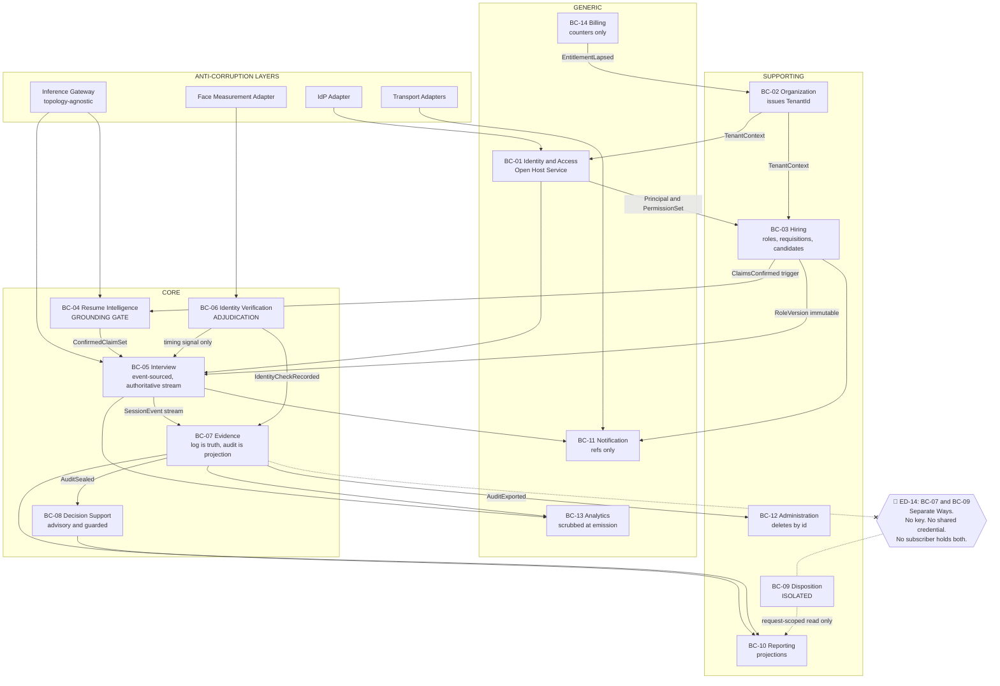

# CogniHire — Engineering Blueprint
# Chapter 3: DDD, Bounded Contexts & System Architecture
## Part A — Domains, Classification, Bounded Contexts, Context Map

| Field | Value |
|---|---|
| Document | Chapter 3, Part A of 3 |
| Version | 1.0 |
| Date | 2026-08-02 |
| Status | Draft for architecture review |
| Immutable sources | **Chapter 1 — Product Vision & Scope**, **Chapter 2 — Personas & User Journey** |
| Parts | **A** Domains & Contexts · **B** Aggregates, Entities, Value Objects, Services, Events, CQRS, AI Architecture · **C** Consistency, Tenancy, Security, Scale, ADRs, Risks, Notes |
| Scope exclusion | **Not infrastructure. Not deployment.** Topology, hosting, and runtime placement belong to Ch. 7 |

---

## 0. Document control

### 0.1 Continuity

| Series | Chapter 1 | Chapter 2 | This chapter continues at |
|---|---|---|---|
| Open Questions | OQ-01 … OQ-17 | OQ-18 … OQ-30 | **OQ-31** |
| Risks | R-01 … R-13 | R-14 … R-25 | **R-26** |
| Engineering Decisions | ED-01 … ED-12 | *(none numbered; Appendix B listed 15 unnumbered decisions)* | **ED-13** |

**ADRs and EDs are the same series.** The request asks both for formal ADRs (§24) and for continued ED numbering. Rather than maintain two registers that will drift, every ADR in Part C is an ED, formatted in ADR form (Context / Decision / Alternatives / Consequences). Chapter 2's Appendix B decisions are retroactively cited by section, not renumbered — renumbering an immutable source document would violate the stated rule.

### 0.2 Evidence tags

Unchanged from Chapter 1 §0.2: `[IMPL]` · `[DES]` · `[PROP]` · `[EST]` · `[OPEN]`.

### 0.3 Contradictions found between Chapters 1 and 2

The instruction is explicit: never silently resolve a contradiction. Five were found. Each is resolved in this chapter, with the resolution named and its cost stated.

| # | Contradiction | Where | Resolution | ADR |
|---|---|---|---|---|
| **X-1** | Ch. 2 §20.1 asserts *"append-only event log as the authoritative record; the audit is a **derived** artifact"* as a binding obligation. Ch. 2 OQ-26 simultaneously lists *"Is the session event log or the compiled audit the authoritative record?"* as **open**, owned by Ch. 4 | Ch. 2 §20.1 vs OQ-26 | **Resolved in favour of the obligation.** The event log is authoritative; `ClaimAudit` is a projection. OQ-26 is **closed here, not in Ch. 4**, because aggregate design cannot proceed without it | **ED-13** |
| **X-2** | Ch. 1 ED-06 states *"the service extracts, the client decides."* In a multi-context architecture "the client" is not a defined actor — the phrase presumes a two-tier desktop app | Ch. 1 ED-06 vs Ch. 2 §2 actor model | **Generalised, not overturned.** The principle is *measurement and adjudication are separate bounded contexts*. The face service measures; the Identity Verification context adjudicates. Ch. 1's intent — a component that returns verdicts can invent them — is preserved and strengthened | **ED-18** |
| **X-3** | Ch. 1 FR-3.5 requires enrolment before an interview, enforced at the type level (`enrolledEmbedding` non-nullable) `[IMPL]`. Ch. 1 FR-7.2 requires that a candidate may decline enrolment `[IMPL]`. Ch. 2 §4.2 escalated this as OQ-18 without resolving it | Ch. 1 FR-3.5 vs FR-7.2 | **Resolved by aggregate non-existence.** Declining enrolment does not produce a nullable field on `InterviewSession`; it produces **no `InterviewSession` aggregate at all**. The invariant is preserved and consent stays genuinely optional. Implements Ch. 2's recommendation (c) | **ED-23** |
| **X-4** | Ch. 1 ED-01 fixes local inference as an architectural privacy property. Ch. 1 §12.2 and Ch. 2 §20.9 require it to be *re-argued* at scale in a later chapter. A bounded-context design must place inference **now** | Ch. 1 ED-01 vs §12.2 | **Deferred by construction.** Inference sits behind an anti-corruption layer (Inference Gateway) whose port is topology-agnostic. The domain is written once; local and remote are adapters. Ch. 7 chooses the adapter without touching a domain type | **ED-16** |
| **X-5** | Ch. 2 §7.3 denies Org Admin `viewClaimAudit` and `reviewEvidence`, yet assigns them `manageRetentionPolicy` — the authority to delete records they may not read | Ch. 2 §7.3 internal | **Not a true contradiction; a requirement.** Retention operates on aggregate identifiers and lifecycle states, never on content. It is architecturally expressible and is specified as such. Recorded because the naive implementation (load the record, check it, delete it) silently violates the boundary | §21, Part C |

### 0.4 Naming corrections carried forward

Chapter 2 §0.4 renamed three actors to prevent design errors. This chapter extends that discipline to two requested artifact names:

| Requested name | Problem | Name used |
|---|---|---|
| `ScoreExplanation` (§8 of the request) | There is no score. A value object named `ScoreExplanation` will acquire a `score` field within one refactor | **`AttributionExplanation`** — carries an exact logit decomposition and copies every number from it |
| "Evaluation Engine" / `Evaluation` aggregate (§6, §16) | Chapter 2 §0.4 already established this implies evaluating a person | **`SufficiencyEvaluation`** — an advisory statement about whether *evidence is sufficient to judge*, never about a person |

---

## 1. Executive Summary

### 1.1 Why Domain-Driven Design

DDD is chosen because CogniHire's defining constraints are **invariants that must survive refactoring by people who did not read this blueprint**. That is precisely the class of problem DDD's tactical patterns address, and it is not the problem that layered-CRUD or transaction-script architectures solve.

Four concrete arguments:

**1. The product's boundaries are invariants, not policies.**
Chapter 1 §15 lists eleven things CogniHire *is not*. Every one is currently defended by the absence of a mechanism — no score field, no `strength()` method on the evidence graph, no `fitReal()` factory `[IMPL]`. In DDD terms these are **aggregate invariants and deliberate model omissions**. An anaemic domain model with service-layer validation cannot hold them: validation is skippable, a constructor is not. Chapter 1 ED-05 already demonstrates the pattern in the small — `Unchecked` carries no similarity field, so it cannot be misread as a weak pass. This chapter generalises that from one type to the whole model.

**2. The most dangerous coupling in the system is one that must never exist.**
Chapter 2 §17.5 established that joining evidence to hiring outcomes reconstructs the dataset Chapter 1 ED-04 refuses to collect — and that it assembles itself from two individually reasonable decisions. Preventing an accidental relationship is not something a schema can do; it requires **two bounded contexts with disjoint identity, disjoint persistence, and disjoint credentials**. Context boundaries are the only architectural tool that expresses "these two concepts must never share a key."

**3. Language precision is a safety control here, not a style preference.**
Chapter 2 §0.4 had to rename three actors because "AI Evaluation Engine" invites a model that evaluates people. A ubiquitous language with enforced context boundaries is how that correction stays applied. `Claim` in Resume Intelligence (a proposed span) and `Claim` in Evidence (a thing with a verdict) are **different concepts**, and a shared `Claim` class across both is how a verdict eventually leaks into extraction.

**4. The system is a set of long-running, event-producing processes.**
A 45-minute interview producing a hash-chained sequence of nine event kinds `[IMPL]`, resumable across a 24-hour window (Ch. 2 §12.6), compiled into an immutable artifact, is a textbook aggregate with an event stream. Modelling it as rows updated in place is what produced Chapter 2 R-22 — session state held in memory until `saveAudit()`, so a crash loses the interview.

### 1.2 Why CogniHire is not a CRUD application

| CRUD assumption | CogniHire reality | Architectural consequence |
|---|---|---|
| State is current; history is a log for debugging | **History is the product.** The audit's defensibility rests entirely on an unbroken record `[IMPL: hash chain]` | Event-sourced session; the projection is disposable, the stream is not |
| Update in place | Evidence is **append-only**. A corrected verdict retains the original (Ch. 1 V1-12) | No `UPDATE` on evidence; overrides are additive events |
| Delete removes a row | Deletion is a **regulated lifecycle transition** with statutory floors and ceilings, spanning contexts and backups | Retention is a first-class domain concept with its own saga |
| Validation rejects bad input | Failure must be **recorded as a distinct state** — "could not measure" ≠ "measured and failed" `[IMPL]` | Three-valued results are value objects, not nullable fields |
| The database is the source of truth | The database is a **projection**; the event stream is the source of truth | Read models may be rebuilt; the stream may not be edited |
| Services own logic; entities own data | Entities that own no logic cannot hold invariants — and invariants are the product | Rich aggregates; thin application services |
| Reads and writes share a model | A recruiter reads a dashboard; a candidate reads a transparency view; neither resembles the write model | CQRS with distinct projections (OQ-30 resolved: ED-20) |
| Consistency is transactional and global | Nine contexts, one of which **must not** be transactionally consistent with another (Evidence ↔ Disposition) | Deliberate eventual consistency, with one deliberate *absence* of consistency |

> **The sharpest test.** In a CRUD system, adding a `score` column to the audit table is a one-line migration. In this architecture it requires: a new value object, an aggregate invariant change, a projection rebuild, an event schema version, and a guard-suite update — five reviewed touchpoints. **That friction is the feature.** Chapter 1 R-13 (customer-driven pressure toward a score) is a real and rising risk; architecture is where it is either resisted or quietly conceded.

### 1.3 The core business domains

CogniHire's domain space divides into three concentric rings:

```
        ┌─────────────────────────────────────────────────────┐
        │  GENERIC — buy, do not build                        │
        │  Identity · Notifications · Billing · Analytics      │
        │  ┌───────────────────────────────────────────────┐  │
        │  │  SUPPORTING — build, but plainly              │  │
        │  │  Organizations · Jobs · Candidates ·          │  │
        │  │  Administration · Audit(admin)                │  │
        │  │  ┌─────────────────────────────────────────┐  │  │
        │  │  │  CORE — the reason the product exists   │  │  │
        │  │  │                                         │  │  │
        │  │  │   Resume Intelligence (grounding)       │  │  │
        │  │  │   Interview Planning & Execution        │  │  │
        │  │  │   Identity Verification (provenance)    │  │  │
        │  │  │   Evidence & Audit (the artifact)       │  │  │
        │  │  │   Decision Support (guarded, advisory)  │  │  │
        │  │  │                                         │  │  │
        │  │  └─────────────────────────────────────────┘  │  │
        │  └───────────────────────────────────────────────┘  │
        └─────────────────────────────────────────────────────┘
                    Disposition sits OUTSIDE all three,
                deliberately unlinked to Evidence — see ED-14
```

The three core assertions of the product map one-to-one onto three core domains — provenance to Identity Verification, process to Interview Execution, non-fabrication to Resume Intelligence and Evidence. **A domain that does not defend one of Chapter 1's differentiators is not core**, no matter how much code it contains.

---

## 2. Business Domains

Sixteen domains. For each: purpose, responsibilities, inputs, outputs, dependencies, ownership, future evolution, and current code location where one exists.

---

### D-01 Identity & Access

| Field | Detail |
|---|---|
| **Purpose** | Establish who is acting and what they may do |
| **Responsibilities** | Credential verification; principal issuance and revocation; role assignment resolution; permission resolution; step-up elevation; invitation-token redemption |
| **Inputs** | Credentials; IdP assertions; invitation tokens; SCIM events |
| **Outputs** | `Principal{userId, UserRole, TenantId}`; `PermissionSet`; revocation signals |
| **Dependencies** | External IdP (A-15); Organizations (for tenant existence) |
| **Ownership** | Platform team |
| **Current code** | `lib/core/auth/` — `Principal`, `UserRole`, `AuthStore`, `InMemoryAuthStore` `[IMPL]`; `lib/core/rbac/` — `Permission`, `AccessPolicy`, `RouteResolver` `[IMPL, unwired]` |
| **Future evolution** | Real `AuthStore` implementation (Ch. 1 V1-01); SAML/OIDC; SCIM; four roles (Ch. 2 §2); device binding for candidate tokens |

> Chapter 1 R-04: the permission matrix and route guard are **built, tested, and imported by nothing but their own tests**. This domain's V1 work is wiring and a store implementation, not design. `AccessPolicy` is already the single deny-by-default table `[IMPL]`.

---

### D-02 Organizations & Tenancy

| Field | Detail |
|---|---|
| **Purpose** | Own the tenant boundary and everything scoped by it |
| **Responsibilities** | Organisation lifecycle (Ch. 2 §12.4); jurisdiction; retention policy; IdP configuration; role assignments; entitlement state |
| **Inputs** | Signup; admin configuration; billing entitlement signals |
| **Outputs** | `Organization`; `RetentionPolicy`; `RoleAssignment`; `TenantId` issuance |
| **Dependencies** | Identity (principals), Billing (entitlement) |
| **Ownership** | Platform team |
| **Current code** | `lib/core/workspace/` — `workspace_loader`, `workspace_stats` `[IMPL, single-tenant]` |
| **Future evolution** | **This domain issues the `TenantId` that Chapter 1 R-05 says no aggregate carries.** See ED-15 |

---

### D-03 Jobs & Requisitions

| Field | Detail |
|---|---|
| **Purpose** | Define what is being hired for, and what evidence would matter |
| **Responsibilities** | Job role definition and required skills; claim-queue priority; role versioning; requisition lifecycle; hiring-manager assignment; approval policy |
| **Inputs** | Recruiter/HM definitions; role expectations |
| **Outputs** | `RoleVersion` (immutable once published); `Requisition`; `RoleQuestionPriority`; `RoleCoverage` specification |
| **Dependencies** | Organizations (tenant), Identity (assignment) |
| **Ownership** | Hiring domain team |
| **Current code** | `lib/core/roles/` — `role.dart`, `role_coverage.dart`, `role_question_priority.dart`, `role_store*` `[IMPL]` |
| **Future evolution** | Copy-on-write versioning (ED-19); requisition entity `[PROP]`; approval policy (OQ-20 → ED-27) |

> `role_question_priority.dart` reorders the claim queue so a session cut short still examined what the role author said mattered — and **every claim is still asked; none dropped or hidden** `[IMPL]`. That restraint is a domain invariant, specified in Part B.

---

### D-04 Candidates & Invitations

| Field | Detail |
|---|---|
| **Purpose** | Represent the person and their consented participation |
| **Responsibilities** | Candidate record; invitation lifecycle (Ch. 2 §12.6); consent records across three independent scopes; withdrawal; data-subject requests |
| **Inputs** | Recruiter entry; candidate self-registration; consent decisions; deletion requests |
| **Outputs** | `Candidate`; `Invitation`; `ConsentRecord`; `DeletionRequest` |
| **Dependencies** | Identity, Organizations, Notification |
| **Ownership** | Hiring domain team |
| **Current code** | `lib/features/candidates/` (UI) `[IMPL]`; `lib/core/session/session_draft.dart` carries `researchConsent` `[IMPL]` |
| **Future evolution** | Full invitation state machine; three-scope consent; DSR orchestration; **candidate-owned portable evidence** (Ch. 1 §16 long-term) |

---

### D-05 Resume Intelligence — **CORE**

| Field | Detail |
|---|---|
| **Purpose** | Turn a resume into discrete, checkable claims **stated in the candidate's own words** |
| **Responsibilities** | Document ingest; segmentation; span proposal; **grounding enforcement**; taxonomy classification; deterministic confidence composition; deduplication; degraded fallback |
| **Inputs** | Resume document (T0, attacker-controlled) |
| **Outputs** | `ClaimSet{claims[], rejectedUngrounded[], extractorKind, degradedReason}` `[IMPL]` |
| **Dependencies** | Inference Gateway (proposals only) |
| **Ownership** | AI domain team |
| **Current code** | `lib/core/claims/` — `claim.dart`, `claim_extractor.dart`, `ollama_claim_extractor.dart` `[IMPL]`; `docs/CLAIM_EXTRACTION_DESIGN.md` `[DES]` |
| **Future evolution** | PDF/DOCX extraction (Ch. 1 V1-09); 11-type taxonomy `[DES]`; multilingual `[OPEN]` |

> **Why core:** the grounding gate is the mechanism behind Chapter 1 P6 — *the model may select; it may never author.* A fabricated claim attributed to a real person is the worst output the system can emit, and this domain is the only thing standing between an LLM and that output.

---

### D-06 Interview Planning & Execution — **CORE**

| Field | Detail |
|---|---|
| **Purpose** | Run the session: sequence claims, plan turns, capture process signal, produce the event stream |
| **Responsibilities** | Claim queue ordering; ladder progression (opening → deepening → verifying); turn planning; **grounding check on quotes**; telemetry classification; follow-up selection; session lifecycle including suspend/resume; event emission |
| **Inputs** | Confirmed `ClaimSet`; `RoleVersion` priority; candidate utterances; keystroke batches; identity results (timing only) |
| **Outputs** | `SessionEvent` stream (9 kinds `[IMPL]`); `Turn`; `FollowUp{question, trigger, observation}` `[IMPL]` |
| **Dependencies** | Resume Intelligence, Jobs, Identity Verification (timing signal only), Inference Gateway |
| **Ownership** | Interview domain team |
| **Current code** | `lib/core/interview/` — `followup.dart`, `question_bank.dart`, `live_turn_client.dart` `[IMPL]`; `lib/core/telemetry/` `[IMPL]`; `lib/features/interview/` `[IMPL]`; `lib/core/session/session_event_log.dart` `[IMPL]` |
| **Future evolution** | Event-sourced aggregate (ED-13); durable resumability (Ch. 2 §12.6); code-authorship probes `[DES]`; engineering-memory probes `[DES]` |

> **Hard boundary, restated because it will be tested:** identity confidence reaches this domain **only as follow-up timing**. It must never influence question difficulty. Chapter 2 §9.4 records this as a deliberate boundary, not a gap — a hidden confidence signal steering difficulty recreates the hidden score the product rejects.

---

### D-07 Identity Verification (Provenance) — **CORE**

| Field | Detail |
|---|---|
| **Purpose** | Establish continuously **whose** work is being observed |
| **Responsibilities** | Enrolment with a quality gate; jittered re-verification scheduling; **adjudication** of measurement into `Verified`/`Mismatch`/`Unchecked`; strike escalation; coverage computation |
| **Inputs** | Frames; embeddings + quality signals from the face service; session timing |
| **Outputs** | `EnrolmentProfile`; `VerificationResult` (sealed, 3 variants) `[IMPL]`; `identityCoverage` (**null**, never 1.0, at zero attempts) `[IMPL]`; escalation signals |
| **Dependencies** | Face measurement service (M1, measurement only) |
| **Ownership** | Verification domain team |
| **Current code** | `lib/core/verification/` — `verification_result.dart`, `identity_matcher.dart`, `face_engine.dart`, `verification_session.dart` `[IMPL]`; `lib/core/integrity/` `[IMPL]`; `service/main.py` `[IMPL]` |
| **Future evolution** | Threshold calibration on real pairs (Ch. 1 V1-13, R-02); liveness `[OPEN: OQ-07]`; embedding expiry `[OPEN: OQ-23]` |

> **ED-18 lives here.** Measurement (the service) and adjudication (this domain) are separate. The service returns `embedding: null` — never a zero-vector — and reports `engine_available: false` rather than falling back to a heuristic `[IMPL]`. This domain decides. The generalisation of Ch. 1 ED-06 from "client" to "bounded context" is contradiction X-2's resolution.

---

### D-08 Evidence & Audit — **CORE**

| Field | Detail |
|---|---|
| **Purpose** | Hold the authoritative record and compile the defensible artifact |
| **Responsibilities** | Append-only hash-chained custody; integrity verification; deterministic audit compilation; evidence-graph construction; reviewer annotation and override; export; unreadable-record surfacing |
| **Inputs** | `SessionEvent` stream; reviewer assessments |
| **Outputs** | `ClaimAudit` (4 states) `[IMPL]`; `EvidenceGraph` (7 node types, 7 edge types, **no numeric weights**) `[IMPL]`; self-contained HTML export `[IMPL]`; GraphML export `[IMPL]` |
| **Dependencies** | Interview Execution (stream), Identity Verification (attempts) |
| **Ownership** | Evidence domain team |
| **Current code** | `lib/core/claims/claim_audit.dart`, `lib/core/graph/`, `lib/core/persistence/`, `lib/core/export/` `[IMPL]` |
| **Future evolution** | Audit-file integrity sealing (Ch. 1 V1-06, R-08); override with retained original (V1-12); superseding audits `[OPEN: OQ-29]` |

> **No `strength()`, no `centrality()`, no summary badge** `[IMPL]`, with a source comment telling the next contributor why: a PageRank over the evidence graph would be a hidden weight in graph-theory costume. That comment is a domain invariant expressed in the only place it will be read.

---

### D-09 Decision Support — **CORE (advisory)**

| Field | Detail |
|---|---|
| **Purpose** | Advise a reviewer whether the evidence is **sufficient to judge** — never whether a person is good |
| **Responsibilities** | Feature assembly (87 features `[IMPL]`); calibrated probability; exact logit attribution; conformal abstention; counterfactual feasibility; guard evaluation; **refusal to render** |
| **Inputs** | Features derived from one session |
| **Outputs** | `SufficiencyEvaluation{probability \| abstained, AttributionExplanation, provenance, guardViolations[]}` |
| **Dependencies** | Evidence (features), model artifact registry |
| **Ownership** | ML domain team |
| **Current code** | `lib/core/ml/` — model, metrics, grouped split, isotonic, conformal, attribution, counterfactual, templater, `decision_guards.dart`, `trained_artifact.dart` `[IMPL]`; `service/ml/` training `[IMPL]`; `lib/features/reviewer/` `[IMPL]` |
| **Future evolution** | Real-data validation **only** with an ethically sourced dataset; otherwise it stays explicitly synthetic-only rather than being quietly promoted |

> Carries `trainedOnSyntheticData: true` / `isValidatedOnRealData: false`; the loader **rejects** an artifact missing them or claiming both; there is no `fitReal()` path `[IMPL]`. The guard suite is load-bearing UI — the reviewer screen refuses to render under any blocking violation `[IMPL]`.

---

### D-10 Disposition — **deliberately isolated**

| Field | Detail |
|---|---|
| **Purpose** | Record the human hiring decision |
| **Responsibilities** | Advance/decline with a mandatory written reason; approval policy; requisition outcome |
| **Inputs** | Human decision, `CandidateRef`, `RequisitionRef`, `ActorRef` |
| **Outputs** | `Disposition{outcome, reason, actorRef, at}` |
| **Dependencies** | Candidates, Jobs, Identity. **Explicitly NOT Evidence, NOT Decision Support** |
| **Ownership** | Hiring domain team, **with separate persistence credentials** |
| **Current code** | None `[PROP]` |
| **Future evolution** | Panel consensus; approval gates (ED-27) |

> 🔴 **This domain exists as a separate context for one reason: Chapter 2 §17.5.** A `Disposition` holding a foreign key to a `ClaimAudit` produces, in one join, the labelled dataset Chapter 1 ED-04 refuses to collect. **`Disposition` carries no reference to any evidence artifact.** See ED-14 for how defensibility is preserved without the key.

---

### D-11 Conversation Memory — **bounded and mostly prohibited**

| Field | Detail |
|---|---|
| **Purpose** | Hold the working state a turn planner needs, and nothing more |
| **Responsibilities** | Within-session transcript; claim progress; `consecutive_short` counter; ladder position |
| **Inputs** | Turns and utterances from the current session |
| **Outputs** | `SessionWorkingSet` — a projection of the current session's stream |
| **Dependencies** | Interview Execution only |
| **Ownership** | Interview domain team |
| **Current code** | In-memory in `InterviewVoiceController` / `InterviewController` `[IMPL]` — **not durable**, Ch. 2 R-22 |
| **Future evolution** | Durable projection rebuildable from the stream (ED-13); same-candidate cross-session memory `[OPEN: OQ-22]` |

> 🔴 **The prohibition, restated as a domain rule.** Cross-candidate memory is forbidden. Model inputs derive only from (i) the current session, (ii) the authored question bank, (iii) the current `RoleVersion`. It does not become acceptable by being called an embedding index, a question-effectiveness cache, or few-shot example selection. Chapter 2 §9.6 and §20.7 require this as a **reviewable invariant**; Part C specifies the review gate.

---

### D-12 Reporting & Read Models

| Field | Detail |
|---|---|
| **Purpose** | Serve every read surface without leaking write-model structure |
| **Responsibilities** | Recruiter dashboard; audit read model; **candidate transparency projection**; role coverage; session monitor (metadata only); admin audit view |
| **Inputs** | Domain events; sealed audits |
| **Outputs** | Query-optimised projections |
| **Dependencies** | Evidence, Jobs, Candidates, Administration |
| **Ownership** | Platform team |
| **Current code** | `lib/features/dashboard/`, `lib/features/reports/`, `lib/core/workspace/workspace_stats.dart` — **computed live from stored audits, no estimated figures** `[IMPL]` |
| **Future evolution** | Materialised projections (Ch. 1 NFR-S5); candidate transparency view (V1-10, ED-20) |

---

### D-13 Notifications

| Field | Detail |
|---|---|
| **Purpose** | Deliver state-change notices without carrying content |
| **Responsibilities** | Template rendering; multi-channel dispatch; retry with backoff; idempotency; suppression; delivery receipts; dead-lettering |
| **Inputs** | Domain events carrying **references only** |
| **Outputs** | Dispatches; receipts; dead-letter entries |
| **Dependencies** | Identity (recipient resolution), external providers (T0) |
| **Ownership** | Platform team |
| **Current code** | **None. Zero email, SMS, push, or webhook code exists** `[IMPL: verified absent]` |
| **Future evolution** | 20 notification types (Ch. 2 §16.1); localisation; digests |

> Chapter 2 §16.2 content-minimisation is a **context boundary**, not a template guideline: this context is never granted read access to Evidence. A webhook is a notification with a different transport, not an exemption.

---

### D-14 Billing `[PROP]` V2+

| Field | Detail |
|---|---|
| **Purpose** | Meter and invoice tenant usage |
| **Responsibilities** | Counter aggregation; plan limits; invoicing; entitlement signalling |
| **Inputs** | Aggregate counters only |
| **Outputs** | Invoices; `EntitlementState` |
| **Dependencies** | Organizations, Analytics (aggregates) |
| **Ownership** | Platform team |
| **Current code** | None |
| **Future evolution** | Per-interview pricing |

> **Billing may never terminate a live session.** Entitlement lapse suspends *new* session creation; in-flight sessions run to completion (Ch. 2 §12.4). This is an architectural rule about which context may command which, not a business courtesy.

---

### D-15 Administration & Compliance Audit

| Field | Detail |
|---|---|
| **Purpose** | Record and govern administrative action across the tenant |
| **Responsibilities** | Cross-session admin audit log; role-assignment history; export receipts; break-glass records; retention execution orchestration; DSR fulfilment |
| **Inputs** | Administrative commands; access events; export events |
| **Outputs** | `AdminAuditEntry` (append-only); `RetentionExecution`; `DsrFulfilment` |
| **Dependencies** | All contexts, as an observer |
| **Ownership** | Platform team |
| **Current code** | None `[PROP]` — Chapter 1 V1-14 |
| **Future evolution** | Regulator-facing export; automated attestation |

> Distinct from `SessionEventLog`. The session log is **evidence about an interview**; the admin log is **evidence about the operation of the system**. Different retention, different readers, different integrity requirements. Merging them puts PC-0 operational data inside a tamper-evident evidentiary record.

---

### D-16 Analytics & Observability

| Field | Detail |
|---|---|
| **Purpose** | Operational and product insight without personal data |
| **Responsibilities** | Event ingestion with emission-time scrubbing; aggregation; SLO computation; grounding-rejection-rate monitoring |
| **Inputs** | Sanitised domain events |
| **Outputs** | Metrics; aggregates; alerts |
| **Dependencies** | All contexts, as a subscriber |
| **Ownership** | Platform team |
| **Current code** | `lib/core/privacy/` — `candidate_id.dart`, `scrubber.dart` `[IMPL: primitives]`; no pipeline |
| **Future evolution** | 21 analytics events (Ch. 2 §17.3) |

> 🔴 **This context must never be able to subscribe to both Evidence and Disposition topics.** Chapter 2 §20.4. A single subscriber with both is the join in streaming form.

---

## 3. Domain Classification

### 3.1 Classification and rationale

| Domain | Class | Rationale | Build/buy |
|---|---|---|---|
| **D-05 Resume Intelligence** | **Core** | The grounding gate *is* Chapter 1 P6. No vendor sells "the model may select but never author" | Build |
| **D-06 Interview Execution** | **Core** | Chapter 1 D3 — process fed forward into a live interview. Explicitly the thing no competitor does | Build |
| **D-07 Identity Verification** | **Core** | Chapter 1 D2 — continuous provenance. The claim that survived competitive analysis intact | Build adjudication; **buy the embedding model** (already: InsightFace) |
| **D-08 Evidence & Audit** | **Core** | The defensible artifact is the product. Four-state verdicts, weightless graph, tamper-evidence | Build |
| **D-09 Decision Support** | **Core (advisory)** | Core because the *guards and refusal* are the differentiator, not the model. A generic ML service would happily render an unguarded number | Build the guards; the model is commodity |
| **D-11 Conversation Memory** | **Core (constrained)** | Core because its **boundary** is a product-defining prohibition (Ch. 2 §9.6). The functionality is trivial; the constraint is not | Build |
| **D-03 Jobs & Requisitions** | **Supporting** | Necessary and domain-specific — `role_coverage` and claim-queue priority are CogniHire-shaped — but not differentiating | Build plainly |
| **D-04 Candidates & Invitations** | **Supporting** | Standard lifecycle with domain-specific consent granularity | Build plainly |
| **D-02 Organizations & Tenancy** | **Supporting** | Every B2B product has it; ours carries jurisdiction and retention, which are domain-specific | Build plainly |
| **D-10 Disposition** | **Supporting** | Trivially simple as a feature. **Its isolation is what matters**, and isolation is an architectural property, not a domain capability | Build minimally |
| **D-12 Reporting** | **Supporting** | Projections over core data | Build |
| **D-15 Administration & Compliance Audit** | **Supporting** | Regulatory necessity, no differentiation — but cannot be bought because it must span our contexts | Build plainly |
| **D-01 Identity & Access** | **Generic** | Authentication is solved. **Exception:** the deny-by-default permission table is already built and is a genuine asset `[IMPL]` | **Buy auth, keep the matrix** |
| **D-13 Notifications** | **Generic** | Delivery is commodity. The content-minimisation rule is ours; the transport is not | Buy transport |
| **D-14 Billing** | **Generic** | Never build billing | Buy |
| **D-16 Analytics** | **Generic** | Commodity pipeline. The scrubbing and topic-isolation rules are ours | Buy pipeline, own the rules |

### 3.2 The classification test applied

> **A domain is core if and only if it defends one of Chapter 1's four differentiators (D1 non-fabrication, D2 provenance, D3 live process adaptation, D4 local-first privacy) or one of Chapter 1 §15's boundaries.**

Applying it produces two results worth stating because they are counter-intuitive:

**Decision Support is core despite being advisory and synthetic-only.** The model is replaceable commodity — logistic regression. What is not replaceable is a reviewer screen that *refuses to render* under a blocking guard violation `[IMPL]`. Chapter 1 §5 P2 notes the guard suite catches "a correct number under a wrong heading," which a passing test suite does not. That refusal behaviour is core.

**Disposition is supporting despite being the commercially most important record.** It is three fields. Its architectural significance is entirely in what it *must not* touch. Effort spent making Disposition sophisticated is effort misallocated; effort spent keeping it isolated is core work performed in a supporting domain — which is exactly why ED-14 is an ADR rather than an implementation note.

### 3.3 Investment implication

| Class | Domains | Engineering posture |
|---|---|---|
| Core | 6 | Highest test density; invariants enforced in constructors; changes require ADRs |
| Supporting | 6 | Conventional quality; CRUD-shaped where genuinely CRUD-shaped |
| Generic | 4 | Buy; own only the policy wrapper |

Chapter 1 §12.1 records a solo engineer against a fixed demo date. This classification is what makes that survivable: **six domains deserve the discipline described in this blueprint; ten do not.** Applying core-level rigour uniformly is how a solo project misses a deadline while feeling productive — the same failure mode Chapter 1 recorded as "five design docs, zero new features."

---

## 4. Bounded Contexts

Fourteen contexts. Domains D-01…D-16 map to contexts with two mergers, justified below.

### 4.0 Domain-to-context mapping

| Context | Domains | Merger justification |
|---|---|---|
| BC-01 Identity & Access | D-01 | — |
| BC-02 Organization | D-02 | — |
| BC-03 Hiring | D-03, D-04 | Requisitions and candidates share a lifecycle and a transaction boundary; splitting them creates a chatty saga for the most common operation (invite a candidate to a requisition) |
| BC-04 Resume Intelligence | D-05 | — |
| BC-05 Interview | D-06, D-11 | Conversation memory is a projection of the interview's own stream; a separate context would own no independent state |
| BC-06 Identity Verification | D-07 | — |
| BC-07 Evidence | D-08 | — |
| BC-08 Decision Support | D-09 | — |
| BC-09 Disposition | D-10 | **Never merged with BC-07 or BC-08** |
| BC-10 Reporting | D-12 | — |
| BC-11 Notification | D-13 | — |
| BC-12 Administration | D-15 | — |
| BC-13 Analytics | D-16 | — |
| BC-14 Billing | D-14 | — |

Plus one **Shared Kernel** (SK) and one **Anti-Corruption Layer cluster** (Inference Gateway, Face Measurement Adapter, IdP Adapter, Notification Transport Adapter).

---

### BC-01 — Identity & Access

| Aspect | Detail |
|---|---|
| **Responsibilities** | Authenticate; issue and revoke `Principal`; resolve `PermissionSet`; redeem invitation tokens; manage elevation |
| **Owned data** | `UserAccount`, `Credential`, `AuthSession`, `RoleAssignment` (assignment record; the *role definition* is code, not data) |
| **Public interface** | `authenticate(credentials) → Principal`; `resolve(Principal) → PermissionSet`; `revoke(principalId)`; `redeem(token) → Principal` |
| **Events published** | `PrincipalIssued`, `PrincipalRevoked`, `RoleAssigned`, `RoleUnassigned`, `ElevationGranted`, `AuthenticationFailed` |
| **Events consumed** | `OrganizationSuspended` (revoke workforce sessions), `CandidateWithdrawn` |
| **ACL** | **IdP Adapter** — translates SAML/OIDC assertions and SCIM events into internal concepts. **An IdP group never maps to a `Permission`; it maps to a `UserRole`, which maps to permissions through `AccessPolicy`** (Ch. 2 PE-07) |
| **Dependencies** | BC-02 (tenant existence) |
| **Isolation** | Holds credentials and **nothing else**. No interview data, no candidate content. A compromise here is an authentication compromise, not a data breach |

> `AccessPolicy` is the single deny-by-default table; a new `Permission` is denied to every role until deliberately granted `[IMPL]`. **Chapter 2 R-20:** expanding to four roles breaks the current single-shared-permission test. It must be *replaced* with a per-pair disjointness matrix, not deleted.

---

### BC-02 — Organization

| Aspect | Detail |
|---|---|
| **Responsibilities** | Organisation lifecycle; jurisdiction; retention policy; entitlement state; tenant issuance |
| **Owned data** | `Organization`, `RetentionPolicy`, `IdpConfiguration`, `EntitlementState` |
| **Public interface** | `createOrganization(...)`; `setRetentionPolicy(...)`; `suspend(orgId)`; `resolveTenant(tenantId) → TenantContext` |
| **Events published** | `OrganizationCreated`, `OrganizationSuspended`, `OrganizationReinstated`, `OrganizationTerminationRequested`, `RetentionPolicyChanged`, `JurisdictionSet` |
| **Events consumed** | `PaymentFailed`, `EntitlementLapsed` from BC-14 |
| **ACL** | None |
| **Dependencies** | BC-14 (advisory only) |
| **Isolation** | **Issues `TenantId`. Every other context treats it as opaque and mandatory.** No context may construct a `TenantId` |

---

### BC-03 — Hiring

| Aspect | Detail |
|---|---|
| **Responsibilities** | Job roles and versions; requisitions; candidates; invitations; consent; withdrawal |
| **Owned data** | `JobRole`, `RoleVersion`, `Requisition`, `Candidate`, `Invitation`, `ConsentRecord` |
| **Public interface** | `publishRoleVersion(...)`; `openRequisition(...)`; `inviteCandidate(...)`; `recordConsent(...)`; `withdrawCandidate(...)`; `resolveRoleVersion(id) → RoleVersionSnapshot` |
| **Events published** | `JobRoleCreated`, `RoleVersionPublished`, `RequisitionOpened`, `RequisitionClosed`, `CandidateCreated`, `CandidateInvited`, `InvitationDelivered`, `InvitationOpened`, `InvitationRedeemed`, `InvitationExpired`, `InvitationRevoked`, `ConsentRecorded`, `ConsentWithdrawn`, `CandidateWithdrawn` |
| **Events consumed** | `SessionCompleted` (advance candidate state), `NotificationDeliveryFailed` |
| **ACL** | None |
| **Dependencies** | BC-01, BC-02 |
| **Isolation** | Owns *who* and *what for*; owns **no** interview content. A `Candidate` here has no claims, no transcript, no verdict |

> **`RoleVersion` is immutable once published** (ED-19). Sessions bind a `roleVersionId`, so a later edit cannot silently invalidate historical coverage reports (Ch. 2 OQ-27, R-23).

---

### BC-04 — Resume Intelligence

| Aspect | Detail |
|---|---|
| **Responsibilities** | Ingest; segment; propose spans; **enforce grounding**; classify; compose confidence deterministically; deduplicate; degrade visibly |
| **Owned data** | `ResumeDocument`, `ClaimSet`, `RejectedSpan` |
| **Public interface** | `ingest(tenantId, candidateRef, document) → ResumeDocumentRef`; `extract(resumeRef) → ClaimSet`; `confirm(claimSetId, edits) → ConfirmedClaimSet` |
| **Events published** | `ResumeUploaded`, `ClaimsExtracted`, `ClaimExtractionDegraded`, `ClaimsConfirmed`, `UngroundedSpansRejected` |
| **Events consumed** | `CandidateWithdrawn` (purge), `RetentionExpired` |
| **ACL** | **Inference Gateway** — the model returns spans; this context validates them. The gateway's port is topology-agnostic (ED-16) |
| **Dependencies** | Inference Gateway |
| **Isolation** | **The grounding gate lives here, not in the AI context.** A context may not grade its own output (ED-17). Resume text is T0 and never leaves this context unescaped |

---

### BC-05 — Interview

| Aspect | Detail |
|---|---|
| **Responsibilities** | Session lifecycle; claim queue; ladder progression; turn planning; **quote grounding**; telemetry classification; follow-up selection; suspend/resume; event stream emission |
| **Owned data** | `InterviewSession` (event-sourced, ED-13), `SessionWorkingSet` (projection), `TurnRecord`, `TelemetryObservation` |
| **Public interface** | `createSession(...)`; `start(sessionId)`; `submitAnswer(sessionId, utterance, telemetry)`; `suspend`; `resume`; `end`; `getWorkingSet(sessionId)` |
| **Events published** | `SessionCreated`, `SessionStarted`, `ClaimOpened`, `QuestionAsked`, `AnswerReceived`, `TelemetryObserved`, `FollowUpSelected`, `TurnDegraded`, `SessionSuspended`, `SessionResumed`, `SessionEnded`, `SessionExpired` |
| **Events consumed** | `ClaimsConfirmed`, `EnrolmentCompleted`, `IdentityCheckRecorded` (**timing only**), `IdentityEscalated`, `OrganizationSuspended` (block new sessions only) |
| **ACL** | **Inference Gateway** for turn planning |
| **Dependencies** | BC-04, BC-03, BC-06 (timing), Inference Gateway |
| **Isolation** | Emits the authoritative stream. **Does not compile the audit** — that is BC-07, and the separation is what keeps compilation reproducible from the stream alone |

> Five invariants enforced here, detailed in Part B: max 6 follow-ups per claim; no cross-claim difficulty carryover; one in-flight turn per session `[IMPL: race-tested]`; the opening question is written to the transcript before the first model call `[IMPL: real bug, now guarded]`; identity confidence never reaches difficulty selection.

---

### BC-06 — Identity Verification

| Aspect | Detail |
|---|---|
| **Responsibilities** | Enrolment with quality gate; jittered scheduling; **adjudication**; strike escalation; coverage |
| **Owned data** | `EnrolmentProfile`, `VerificationAttempt`, `IntegrityTracker` state |
| **Public interface** | `enrol(candidateRef, frame) → EnrolmentOutcome`; `scheduleFor(sessionId)`; `adjudicate(measurement) → VerificationResult`; `coverageFor(sessionId) → double?` |
| **Events published** | `EnrolmentAttempted`, `EnrolmentCompleted`, `EnrolmentRejected`, `IdentityCheckRecorded`, `IdentityEscalated`, `IdentityAttentionRaised` |
| **Events consumed** | `SessionStarted`, `SessionSuspended`, `SessionResumed` (**mandatory re-verification**), `SessionEnded`, `RetentionExpired` |
| **ACL** | **Face Measurement Adapter** — normalises the service contract; a missing or non-boolean `embedding_available` **throws rather than defaulting** `[IMPL]` |
| **Dependencies** | Face measurement service |
| **Isolation** | **The only context that touches biometric templates.** Embeddings never cross its boundary — other contexts receive an `EmbeddingReference`, never an embedding. This is what makes per-tenant biometric key isolation expressible |

---

### BC-07 — Evidence

| Aspect | Detail |
|---|---|
| **Responsibilities** | Hash-chained custody; integrity verification; deterministic compilation; graph construction; annotation; override; export; unreadable surfacing |
| **Owned data** | `SessionEventLog` (authoritative), `ClaimAudit` (projection, immutable once sealed), `EvidenceGraph`, `ReviewerAssessment`, `StatusOverride` |
| **Public interface** | `append(sessionId, event)`; `verifyIntegrity(sessionId)`; `compile(sessionId) → ClaimAudit`; `seal(auditId)`; `annotate(...)`; `override(...)`; `export(auditId, format)` |
| **Events published** | `EvidenceCaptured`, `AuditCompiled`, `AuditSealed`, `AuditCompileFailed`, `AuditAnnotated`, `ClaimStatusOverridden`, `AuditExported`, `AuditUnreadable`, `IntegrityChainBroken` |
| **Events consumed** | every BC-05 and BC-06 event; `RetentionExpired` |
| **ACL** | None |
| **Dependencies** | BC-05, BC-06 |
| **Isolation** | 🔴 **Holds no reference to `Disposition` and is not permitted to.** Its persistence credentials cannot read the Disposition store (ED-14) |

---

### BC-08 — Decision Support

| Aspect | Detail |
|---|---|
| **Responsibilities** | Feature assembly; scoring via the single artifact path; exact attribution; conformal abstention; counterfactual feasibility; guard evaluation |
| **Owned data** | `ModelArtifact` (versioned, provenance-flagged), `FeatureRegistry` (87 `[IMPL]`), `GuardDefinition` |
| **Public interface** | `evaluate(sessionRef) → SufficiencyEvaluation`; `guardsFor(framing) → GuardViolation[]` |
| **Events published** | `SufficiencyEvaluated`, `SufficiencyAbstained`, `GuardBlocked`, `ModelArtifactLoaded`, `ModelArtifactRejected` |
| **Events consumed** | `AuditSealed` |
| **ACL** | Model artifact loader — **rejects** an artifact whose provenance flags are missing or self-contradictory `[IMPL]` |
| **Dependencies** | BC-07 (read-only) |
| **Isolation** | Advisory. **Writes nothing to Evidence.** Its output is never persisted as a verdict `[OPEN: OQ-39 — whether it persists at all]` |

---

### BC-09 — Disposition 🔴

| Aspect | Detail |
|---|---|
| **Responsibilities** | Record advance/decline with a mandatory reason; enforce approval policy |
| **Owned data** | `Disposition`, `ApprovalPolicy` |
| **Public interface** | `record(tenantId, candidateRef, requisitionRef, outcome, reason, actorRef)`; `policyFor(requisitionRef)` |
| **Events published** | `DispositionRecorded`, `ApprovalRequired`, `ApprovalGranted`, `RequisitionOutcomeSet` |
| **Events consumed** | `RequisitionClosed`, `CandidateWithdrawn` |
| **ACL** | None |
| **Dependencies** | BC-03, BC-01 |
| **Isolation** | 🔴 **Maximum. Separate persistence, separate credentials, no join key to any evidence artifact.** Accepts `CandidateRef` and `RequisitionRef`; **rejects `SessionRef` and `AuditRef` at the type level** — the command object has no field for them |

---

### BC-10 — Reporting

| Aspect | Detail |
|---|---|
| **Responsibilities** | Build and serve projections |
| **Owned data** | Read models only — all rebuildable, none authoritative |
| **Public interface** | Query handlers (Part B §14) |
| **Events published** | `ProjectionRebuilt`, `ProjectionLagged` |
| **Events consumed** | Most domain events |
| **ACL** | None |
| **Dependencies** | Read-only across contexts |
| **Isolation** | **Composition of Evidence and Disposition for a human reader is permitted in a request-scoped query handler; persisting that composition is not** (ED-14) |

---

### BC-11 — Notification

| Aspect | Detail |
|---|---|
| **Responsibilities** | Render; dispatch; retry; idempotency; suppression; dead-letter |
| **Owned data** | `NotificationDispatch`, `Suppression`, `DeliveryReceipt`, `Template` |
| **Public interface** | `dispatch(notificationType, recipientRef, contextRefs, deepLink)` |
| **Events published** | `NotificationDispatched`, `NotificationDelivered`, `NotificationFailed`, `NotificationDeadLettered` |
| **Events consumed** | ~20 domain events (Ch. 2 §16.1) |
| **ACL** | **Transport Adapter** per provider; every provider is T0 |
| **Dependencies** | BC-01 (recipient resolution, minimal directory) |
| **Isolation** | 🔴 **Not granted read access to BC-07 or BC-09.** Content-minimisation is enforced by absent capability, not by template review |

---

### BC-12 — Administration

| Aspect | Detail |
|---|---|
| **Responsibilities** | Admin audit log; retention orchestration; DSR fulfilment; break-glass records; export receipts |
| **Owned data** | `AdminAuditEntry` (append-only), `RetentionExecution`, `DsrRequest`, `BreakGlassGrant` |
| **Public interface** | `recordAdminAction(...)`; `executeRetention(batchId)`; `fulfilDsr(requestId)`; `grantBreakGlass(...)` |
| **Events published** | `AdminActionRecorded`, `RetentionScheduled`, `RetentionExecuted`, `RetentionPartiallyFailed`, `DsrReceived`, `DsrFulfilled`, `BreakGlassInitiated` |
| **Events consumed** | `AuditExported`, `AuditViewed`, `RoleAssigned`, `RetentionPolicyChanged`, `OrganizationTerminationRequested` |
| **ACL** | None |
| **Dependencies** | Observes all; **commands deletion by identifier, never by content** (contradiction X-5) |
| **Isolation** | May enumerate and delete aggregate identifiers; **may not read aggregate content** |

---

### BC-13 — Analytics

| Aspect | Detail |
|---|---|
| **Responsibilities** | Ingest sanitised events; aggregate; compute SLOs; monitor grounding-rejection rate |
| **Owned data** | Metric series; aggregates. **No personal records** |
| **Public interface** | `emit(sanitisedEvent)`; aggregate queries |
| **Events published** | `SloBreached`, `AnomalyDetected` |
| **Events consumed** | Sanitised projections of domain events |
| **ACL** | **Scrubber at emission** — `core/privacy/scrubber.dart`, `candidate_id.dart` `[IMPL: primitives]` |
| **Dependencies** | Event bus |
| **Isolation** | 🔴 **Structurally prevented from subscribing to both Evidence and Disposition topics** |

---

### BC-14 — Billing `[PROP]`

| Aspect | Detail |
|---|---|
| **Responsibilities** | Meter; invoice; signal entitlement |
| **Owned data** | `UsageCounter`, `Invoice`, `PlanLimit` |
| **Public interface** | `recordUsage(tenantId, counter, delta)`; `entitlementFor(tenantId)` |
| **Events published** | `PaymentSucceeded`, `PaymentFailed`, `EntitlementLapsed`, `UsageThresholdReached` |
| **Events consumed** | `SessionStarted`, `SessionCompleted` (counters only) |
| **ACL** | Payment provider adapter |
| **Dependencies** | BC-02 |
| **Isolation** | Aggregate counters only. **No command path to terminate a live session** |

---

### SK — Shared Kernel (deliberately tiny)

| Included | Excluded — and why |
|---|---|
| `TenantId` | `Claim` — means a proposed span in BC-04, a thing with a verdict in BC-07. Sharing it is how a verdict leaks into extraction |
| `ActorRef`, `CandidateRef`, `SessionRef`, `AuditRef`, `RequisitionRef` (opaque, typed) | `ClaimStatus` / `ProvenanceQuality` — BC-07's language, meaningless elsewhere |
| `OccurredAt`, `SequenceNumber` | `VerificationResult` — BC-06's adjudication vocabulary |
| `HashLink` | `Permission` — BC-01 resolves; others receive a boolean answer |
| `EventEnvelope{eventId, tenantId, occurredAt, sequence, idempotencyKey}` | `Disposition` — 🔴 never shared under any circumstance |

> **Shared-kernel creep is R-29.** Every addition requires an ADR. The kernel exists to carry identity and time, nothing else. A kernel that grows to hold `Claim` reunifies contexts that were separated for safety reasons, silently.

---

## 5. Context Map

### 5.1 Relationship patterns

| Pattern | Where used | Meaning |
|---|---|---|
| **Customer/Supplier** | BC-05 → BC-04, BC-07 → BC-05 | Downstream has influence over upstream's contract |
| **Conformist** | BC-13 → all | Analytics takes what it is given, sanitised |
| **Anti-Corruption Layer** | BC-04/BC-05 → Inference; BC-06 → Face; BC-01 → IdP; BC-11 → Transports | Foreign model translated at the boundary |
| **Published Language** | Event envelope + refs | The only vocabulary crossing contexts |
| **Separate Ways** | 🔴 **BC-07 ⟂ BC-09** | **Deliberate absence of integration.** Not an oversight |
| **Open Host Service** | BC-01, BC-02 | Stable interfaces many contexts consume |

### 5.2 ASCII context map

```
                              ┌──────────────────────┐
                              │  BC-02 ORGANIZATION  │◀────────┐
                              │  issues TenantId     │         │
                              └──────────┬───────────┘         │
                                         │ TenantContext       │ entitlement
                       ┌─────────────────┼─────────────────┐   │
                       ▼                 ▼                 ▼   │
            ┌────────────────┐  ┌────────────────┐  ┌──────────┴──────┐
            │ BC-01 IDENTITY │  │  BC-03 HIRING  │  │ BC-14 BILLING   │
            │  & ACCESS      │  │  roles, reqs,  │  │  counters only  │
            │  [OHS]         │  │  candidates,   │  │  NO session cmd │
            └───────┬────────┘  │  invitations   │  └─────────────────┘
                    │           └───┬────────┬───┘
              Principal              │        │ RoleVersion
              PermissionSet          │        │ (immutable)
                    │        ClaimsConfirmed  │
                    │                │        │
    ┌───────────────┴────┐           ▼        ▼
    │  ACL: IdP Adapter  │   ┌────────────────────────┐
    └────────────────────┘   │ BC-04 RESUME INTEL     │
                             │  ★ GROUNDING GATE      │
                             │  verbatim only         │
                             └───────────┬────────────┘
                                         │ ConfirmedClaimSet
                                         ▼
   ┌──────────────────────┐   ┌────────────────────────┐   ┌────────────────────┐
   │ BC-06 IDENTITY VERIF │   │   BC-05 INTERVIEW      │   │  ACL: INFERENCE    │
   │  ★ ADJUDICATION      │   │   ★ event-sourced      │◀─▶│  GATEWAY  [ED-16]  │
   │  Verified/Mismatch/  │──▶│   ★ quote grounding    │   │  topology-agnostic │
   │  Unchecked           │   │   ★ 1 in-flight turn   │   └────────────────────┘
   │  TIMING SIGNAL ONLY  │   └───────────┬────────────┘              ▲
   │  never difficulty    │               │ SessionEvent stream       │
   └──────────┬───────────┘               │ (authoritative)           │
              │                           ▼                           │
              │              ┌────────────────────────────┐           │
              │              │      BC-07 EVIDENCE        │           │
              └─────────────▶│  hash-chained log = TRUTH  │           │
                             │  ClaimAudit = PROJECTION   │           │
                             │  graph: 7×7, NO weights    │           │
                             └────┬──────────────────┬────┘           │
                                  │ AuditSealed      │                │
                                  ▼                  │                │
                    ┌──────────────────────┐         │                │
                    │ BC-08 DECISION SUPP  │         │                │
                    │  advisory, guarded,  │         │                │
                    │  refuses to render   │         │                │
                    │  synthetic-only      │         │                │
                    └──────────┬───────────┘         │                │
                               │                     │                │
                               ▼                     ▼                │
                    ┌────────────────────────────────────────┐        │
                    │           BC-10 REPORTING              │        │
                    │  request-scoped composition ONLY;      │        │
                    │  persisting a join is forbidden        │        │
                    └────────────────────────────────────────┘        │
                               ▲                                      │
                               │  (reads, never joins on disk)        │
     ╔═════════════════════════╪══════════════════════════════════╗   │
     ║   🔴  NO EDGE. NO KEY. NO SHARED CREDENTIAL.  [ED-14]      ║   │
     ╚═════════════════════════╪══════════════════════════════════╝   │
                               │                                      │
                    ┌──────────┴───────────┐                          │
                    │  BC-09 DISPOSITION   │                          │
                    │  candidateRef +      │   command object has NO  │
                    │  requisitionRef ONLY │   sessionRef/auditRef    │
                    └──────────────────────┘   field — type-level     │
                                                                      │
   ┌────────────────┐  ┌────────────────┐  ┌────────────────┐         │
   │ BC-11 NOTIFY   │  │ BC-12 ADMIN    │  │ BC-13 ANALYTICS│         │
   │ refs only,     │  │ deletes by ID, │  │ scrubbed at    │         │
   │ NO evidence    │  │ never reads    │  │ emission; may  │         │
   │ read access    │  │ content        │  │ NOT sub to both│─────────┘
   └────────────────┘  └────────────────┘  │ BC-07 & BC-09  │
                                           └────────────────┘
```

### 5.3 Mermaid context map



### 5.4 Dependency rules

| # | Rule | Enforcement |
|---|---|---|
| CR-1 | No context may import another's aggregate types | Module boundaries; dependency-direction test |
| CR-2 | Cross-context references are opaque typed refs from SK | Type system |
| CR-3 | No cyclic context dependency | Static check |
| CR-4 | 🔴 No code path may hold a `SessionRef`/`AuditRef` **and** write to BC-09 | Command object shape + CI check |
| CR-5 | 🔴 No subscriber may consume BC-07 and BC-09 topics | Bus ACL + CI check |
| CR-6 | BC-11 and BC-13 have no read credential for BC-07 or BC-09 | Credential scoping |
| CR-7 | Biometric templates never leave BC-06 | `EmbeddingReference` only |
| CR-8 | BC-12 commands deletion by identifier, never by content predicate | Repository interface shape |
| CR-9 | Every repository method requires a `TenantContext` | Type system (ED-15) |
| CR-10 | Model output enters a context only through an ACL that validates it | ACL placement (ED-17) |

> CR-4 and CR-5 are the two rules that keep working after everyone who read this blueprint has left. Chapter 2 §17.5 control 5 is their concrete form: **a CI check that fails any query joining an evidence table to a disposition table.**

---

*End of Part A. Part B covers Aggregates, Entities, Value Objects, Domain and Application Services, Repositories, Domain Events, Commands, Queries, Event Storming, and AI Architecture. Part C covers Service Communication, Consistency, Transaction Boundaries, Multi-Tenancy, Security Boundaries, Scalability, Failure Scenarios, ADRs (ED-13 …), Open Questions (OQ-31 …), Risks (R-26 …), and Engineering Notes.*
