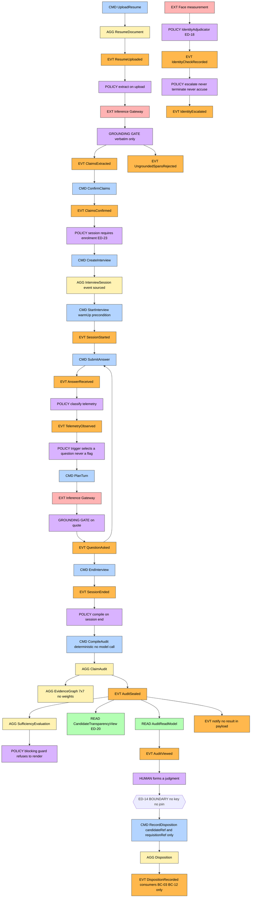

# CogniHire — Engineering Blueprint
# Chapter 3, Part B — Tactical Design
## Aggregates · Entities · Value Objects · Services · Repositories · Events · Commands · Queries · Event Storming · AI Architecture

| Field | Value |
|---|---|
| Document | Chapter 3, Part B of 3 |
| Prerequisite | **Part A** (domains, classification, bounded contexts, context map) |
| Immutable sources | Chapter 1, Chapter 2 |
| Covers | Request sections 6 – 16 |

---

## 6. Aggregates

### 6.0 Aggregate design rules applied here

| # | Rule | Consequence for CogniHire |
|---|---|---|
| AR-1 | One aggregate per transaction | §19 in Part C |
| AR-2 | Reference other aggregates by identity only | SK opaque refs |
| AR-3 | Invariants are enforced in the aggregate, not by callers | Constructors reject; no post-hoc validators |
| AR-4 | Aggregates are as small as the invariants allow | `EnrolmentProfile` is separate from `Candidate` |
| AR-5 | **An invariant that cannot be expressed is a field that must not exist** | Chapter 1 ED-05, generalised |

> AR-5 is CogniHire's addition to the standard list, and it is the tactical form of Chapter 1's whole thesis. `Unchecked` carries no similarity field because there is no valid similarity for an unperformed measurement `[IMPL]`. `EvidenceGraph` has no `strength()` because there is no defensible weight `[IMPL]`. **The absence is the invariant.**

### 6.1 Aggregate register

| # | Aggregate root | Context | Event-sourced | Status |
|---|---|---|---|---|
| AG-01 | `Organization` | BC-02 | No | `[PROP]` |
| AG-02 | `UserAccount` | BC-01 | No | `[IMPL: partial]` |
| AG-03 | `JobRole` | BC-03 | No | `[IMPL]` |
| AG-04 | `Requisition` | BC-03 | No | `[PROP]` |
| AG-05 | `Candidate` | BC-03 | No | `[IMPL: partial]` |
| AG-06 | `Invitation` | BC-03 | No | `[PROP]` |
| AG-07 | `ResumeDocument` | BC-04 | No | `[IMPL]` |
| AG-08 | `ClaimSet` | BC-04 | No | `[IMPL]` |
| AG-09 | `EnrolmentProfile` | BC-06 | No | `[IMPL]` |
| AG-10 | **`InterviewSession`** | BC-05 | **Yes** | `[IMPL: log exists, aggregate not rehydrated]` |
| AG-11 | `ClaimAudit` | BC-07 | Projection → immutable | `[IMPL]` |
| AG-12 | `EvidenceGraph` | BC-07 | Projection | `[IMPL]` |
| AG-13 | `ReviewerAssessment` | BC-07 | No | `[PROP]` |
| AG-14 | `SufficiencyEvaluation` | BC-08 | No | `[IMPL]` |
| AG-15 | `Disposition` 🔴 | BC-09 | No | `[PROP]` |
| AG-16 | `NotificationDispatch` | BC-11 | No | `[PROP]` |
| AG-17 | `RetentionSchedule` | BC-12 | No | `[PROP]` |
| AG-18 | `AdminAuditEntry` | BC-12 | Append-only | `[PROP]` |
| AG-19 | `ModelArtifact` | BC-08 | No | `[IMPL]` |
| AG-20 | `QuestionBank` | BC-05 | No (code-owned) | `[IMPL]` |

---

### AG-01 `Organization`

| Aspect | Detail |
|---|---|
| **Root** | `Organization` |
| **Entities** | `IdpConfiguration`, `RoleAssignment[]`, `EntitlementState` |
| **Value objects** | `TenantId`, `Jurisdiction`, `RetentionPolicy`, `OrganizationState`, `AgreementRecord` |
| **Lifecycle** | Ch. 2 §12.4: Provisioning → Active → PastDue → Suspended → TerminationPending → Terminated → Purged |

**Invariants**
1. `TenantId` is assigned at creation and is immutable.
2. `Jurisdiction` becomes immutable once the first `ConsentRecord` is issued under it — changing it retroactively invalidates every consent (Ch. 2 §5.1).
3. `RetentionPolicy` values must fall within `[statutoryFloor(jurisdiction), statutoryCeiling(jurisdiction)]`. A value outside is **rejected with the specific statute named**, not clamped.
4. Exactly one bootstrap admin at Provisioning; recorded as an explicit exception in the admin audit log.
5. `Suspended` blocks **new session creation only**. It cannot terminate a live session and cannot revoke read access to existing audits (Ch. 2 §13.11).

---

### AG-02 `UserAccount`

| Aspect | Detail |
|---|---|
| **Root** | `UserAccount` |
| **Entities** | `Credential`, `AuthSession[]` |
| **Value objects** | `TenantId`, `UserRole`, `Email`, `PrincipalId`, `ElevationGrant` |
| **Lifecycle** | Invited → Active → Suspended → Deprovisioned |

**Invariants**
1. `UserRole` parsed from storage that matches no known value **refuses the session** rather than defaulting — guessing a role is a security decision made by a parser `[IMPL]`.
2. A `UserAccount` belongs to exactly one `TenantId`. A human interviewing at two organisations holds two accounts (Ch. 2 §13.8).
3. Deprovisioning terminates live `AuthSession`s, not merely future logins.
4. `PrincipalId` is **never reused**, so deletion cannot orphan authored evidence (Ch. 2 §13.12).

---

### AG-03 `JobRole` / AG-03a `RoleVersion`

| Aspect | Detail |
|---|---|
| **Root** | `JobRole` |
| **Entities** | `RoleVersion[]` |
| **Value objects** | `RequiredSkill`, `RoleQuestionPriority`, `RoleExpectation`, `RoleVersionId` |
| **Lifecycle** | Ch. 2 §12.3: Draft → Active → Paused → Closed → Archived |

**Invariants**
1. **A published `RoleVersion` is immutable.** An edit creates a new version (ED-19).
2. A `RoleVersion` referenced by any `InterviewSession` can never be deleted, only archived.
3. `RoleQuestionPriority` **reorders** the claim queue; it may not drop, hide, or filter a claim `[IMPL]`. Expressed as: the priority function is a permutation, and a test asserts output length equals input length.
4. `Paused` blocks new sessions; **in-flight sessions complete** against their bound version.

---

### AG-04 `Requisition` `[PROP]`

| Aspect | Detail |
|---|---|
| **Root** | `Requisition` |
| **Entities** | `HiringManagerAssignment[]` |
| **Value objects** | `RequisitionId`, `RoleVersionId`, `ApprovalPolicy`, `RequisitionState` |

**Invariants**
1. Binds exactly one `RoleVersionId` at opening; rebinding requires closing and reopening.
2. `ApprovalPolicy` is fixed at opening — changing whether HM approval gates advancement mid-requisition treats two candidates differently under the same requisition (ED-27).
3. Closing triggers retention transitions for non-selected candidates; it does not delete.

---

### AG-05 `Candidate`

| Aspect | Detail |
|---|---|
| **Root** | `Candidate` |
| **Entities** | `ConsentRecord[]`, `ParticipationRecord[]` |
| **Value objects** | `CandidateRef`, `TenantId`, `Email`, `PhoneNumber`, `CandidateState`, `ConsentScope` |
| **Lifecycle** | Ch. 2 §12.1 |

**Invariants**
1. Three **independent** consent scopes: `participation`, `biometric`, `research`. Bundling makes all three legally fragile under GDPR Art. 9 (Ch. 2 §4.1). Declining `research` has **zero** effect on the interview `[IMPL: `researchConsent` already separate in `SessionDraft`]`.
2. Consent withdrawal is always permitted and takes effect immediately.
3. `CandidateRef` is tenant-scoped and **not** correlatable across tenants (Ch. 2 PE-06).
4. A `Candidate` holds **no** claims, transcripts, or verdicts — those live in BC-04/BC-05/BC-07.

---

### AG-06 `Invitation` `[PROP]`

| Aspect | Detail |
|---|---|
| **Root** | `Invitation` |
| **Value objects** | `InvitationToken`, `TimeWindow`, `InvitationState`, `DeviceBinding` |
| **Lifecycle** | Ch. 2 §12.6 |

**Invariants**
1. **Single-use.** Redemption is idempotent; a second redemption of a `Consumed` token is refused, not silently re-issued.
2. TTL is mandatory; a token with no expiry cannot be constructed.
3. Reissue **atomically revokes** the prior token — otherwise a leaked expired link becomes live again (Ch. 2 §13.9).
4. Bound to the first redeeming device `[PROP]`; a bearer credential without binding is Ch. 2 PE-05.
5. The system never auto-reissues and never sends to a system-corrected address.

---

### AG-07 `ResumeDocument`

| Aspect | Detail |
|---|---|
| **Root** | `ResumeDocument` |
| **Value objects** | `DocumentFormat`, `SourceAttribution{self \| recruiter}`, `ExtractionCapability` |

**Invariants**
1. `SourceAttribution` is recorded because a recruiter-supplied resume has different provenance than a candidate-supplied one, and the audit must be able to say so (Ch. 2 §5.3).
2. A format whose text cannot be extracted is stored with `ExtractionCapability.unsupported` and **states so plainly rather than faking success** `[IMPL]` — the exact failure mode found in the reference codebase.
3. Content is T0 and is escaped at every sink; the aggregate exposes text only through an escaping accessor.

---

### AG-08 `ClaimSet`

| Aspect | Detail |
|---|---|
| **Root** | `ClaimSet` |
| **Entities** | `Claim[]`, `RejectedSpan[]` |
| **Value objects** | `ClaimText`, `ClaimType`, `ClaimConfidence`, `ExtractorKind`, `DegradedReason` |
| **Lifecycle** | Extracted → Reviewed → Confirmed → (Superseded) |

**Invariants**
1. 🔴 **Every `Claim.text` is verbatim-present in the source `ResumeDocument`**, under whitespace-collapsed case-insensitive containment. Enforced in the `ClaimText` constructor, which takes the source as a parameter and **throws** otherwise. No fuzzy match, no embedding similarity, no token-overlap threshold `[IMPL]`.
2. Model output not satisfying (1) lands in `RejectedSpan[]`. **It is never silently dropped** `[IMPL]`.
3. `ClaimConfidence` is a deterministic composite of five signals; it is **not model-settable**. A resume instructing the model to self-report high confidence has no field to land in `[DES]`.
4. `ExtractorKind` reports the **effective** extractor. The UI can never imply a model ran when it did not `[IMPL]`.
5. A confirmed `ClaimSet` is immutable; candidate edits produce a new version `[OPEN: OQ-31]`.
6. An empty `ClaimSet` is **valid**. A candidate rejecting every claim produces an empty audit, and an empty audit is a truthful audit.

---

### AG-09 `EnrolmentProfile`

| Aspect | Detail |
|---|---|
| **Root** | `EnrolmentProfile` |
| **Value objects** | `FaceEmbedding` (512-d, never crosses BC-06), `EmbeddingReference`, `CaptureQuality`, `CapturedAt` |

**Invariants**
1. 🔴 **The aggregate exists only if the embedding is non-null and quality ≥ gate.** A weak reference is not enrolled at a lower confidence — it is rejected with guidance `[IMPL]`. This is contradiction X-3's resolution: **declining enrolment produces no aggregate, not a nullable field** (ED-23).
2. `FaceEmbedding` never leaves BC-06. Other contexts hold an `EmbeddingReference`.
3. Persisted under a per-tenant key; excluded from any repository the platform administrator can read.
4. Schema version bump requires a migration path — the current hard-throw orphans every saved enrolment `[IMPL: Ch. 1 NFR-R5 violated]`.

---

### AG-10 `InterviewSession` — **event-sourced**

| Aspect | Detail |
|---|---|
| **Root** | `InterviewSession` |
| **Entities** | `ClaimQueueItem[]`, `TurnRecord[]`, `TelemetryObservation[]` |
| **Value objects** | `SessionRef`, `RoleVersionId`, `EmbeddingReference`, `SessionState`, `LadderRung`, `SequenceNumber`, `HashLink`, `Modality` |
| **Lifecycle** | Ch. 2 §12.2 — 13 states |
| **Event stream** | 9 kinds today `[IMPL]`: `sessionStarted`, `sessionEnded`, `claimOpened`, `claimAnswered`, `followUpAsked`, `identityChecked`, `integrityObserved`, `keystrokeBatch`, `resumeIngested` |

**Invariants**
1. 🔴 **`EmbeddingReference` is non-nullable.** An unverified session does not compile `[IMPL]`.
2. The event stream is **append-only, monotonic in `SequenceNumber`, hash-chained**. Each entry carries the SHA-256 of its predecessor, so any change, insertion, or removal breaks the chain from that point and `verifyIntegrity` says exactly where `[IMPL]`.
3. **Exactly one turn in flight.** A second submit while one is in flight is ignored `[IMPL: race-tested]`.
4. **The opening question is written to the transcript before the first model call.** A real shipped bug had the first call see only the answer, with no record a question had been asked, producing a contextless follow-up `[IMPL: now guarded by a test asserting the opening line is in the payload]`.
5. Maximum 6 follow-ups per claim; **no cross-claim difficulty carryover** `[DES]`.
6. 🔴 **Identity confidence may influence follow-up *timing* only, never question difficulty.** Expressed structurally: the turn-planning input type has no field carrying identity confidence.
7. `Modality` (voice/typed) is recorded for operational routing but **never emitted into evidence and never into a per-session analytics event** (Ch. 2 R-25).
8. Resume requires mandatory identity re-verification, and the suspension interval is recorded as `Unchecked{reason: session_suspended}`. **The timeline is never silently stitched** (Ch. 2 §12.6).
9. Ordering is by `SequenceNumber`, never by timestamp (Ch. 2 §13.20).
10. Transition to `Complete` requires a sealed audit.

> **Current gap.** The hash-chained log exists and is append-only `[IMPL]`; the aggregate is **not rehydrated from it** — state is in memory until `saveAudit()` `[IMPL: Ch. 2 R-22]`. Adopting event sourcing is therefore an **extension of an existing substrate**, not a rewrite. That is the single most important implementation fact in this chapter.

---

### AG-11 `ClaimAudit` — projection, then immutable

| Aspect | Detail |
|---|---|
| **Root** | `ClaimAudit` |
| **Entities** | `AuditedClaim[]`, `EvidencePointer[]` |
| **Value objects** | `ClaimStatus` (4), `ProvenanceQuality` (4), `IdentityCoverage` (nullable), `AuditRef`, `SealSignature` |
| **Lifecycle** | Ch. 2 §12.5 |

**Invariants**
1. Exactly one verdict per claim, from `{substantiated, notDemonstrated, contradicted, notExamined}` `[IMPL]`.
2. Every non-`notExamined` verdict carries ≥1 `EvidencePointer` `[IMPL]`.
3. 🔴 **Derived fields are never persisted.** `identityCoverage`, `provenanceQuality`, and `summary` are recomputed on load so a hand-edited file cannot disagree with the rules `[IMPL]`.
4. `IdentityCoverage` is **null**, not `1.0`, at zero attempts `[IMPL]`.
5. Compilation is **deterministic with no model call** — reproducible by re-execution from the stream `[IMPL]`.
6. Once `Sealed`, immutable. Overrides and annotations are **additive**, retaining the original `[PROP]`.
7. **No numeric field of any kind.** AR-5.
8. A `ClaimAudit` that fails to decode surfaces as `Unreadable` and is **listed explicitly** alongside readable records — a vanishing audit is a fabricated pass reached by omission `[IMPL]`.

---

### AG-12 `EvidenceGraph`

| Aspect | Detail |
|---|---|
| **Root** | `EvidenceGraph` |
| **Entities** | `EvidenceNode[]` (7 types), `EvidenceEdge[]` (7 types) |
| **Value objects** | `EdgeBasis`, `Rationale`, `NodeKind`, `EdgeKind` |

**Invariants**
1. 🔴 **Every edge carries a non-empty `Rationale`, rejected at construction with `ArgumentError` — not at save** `[IMPL]`.
2. 🔴 **No numeric edge weight, ever.** No `strength()`, no `centrality()`. A source comment records why, so the next contributor does not "fix" it with PageRank `[IMPL]`.
3. An `Unchecked` identity attempt produces a `derivedFrom` edge, **never an evidentiary one** — an unmeasured check neither supports nor contradicts `[IMPL]`.
4. Orphan nodes and dangling edges are **surfaced in the UI as faults**, never hidden `[IMPL]`.
5. Derivation from an existing `ClaimAudit` emits only `systemDerivation`/`identityCheckResult` bases — re-deriving evidentiary edges from the audit's own `ClaimStatus` would be circular `[IMPL]`.
6. Layout is deterministic and layered — **no force simulation**, because a force simulation has per-edge spring weights and a weight eventually gets promoted into "relationship strength" `[IMPL: Ch. 1 ED-10]`.

---

### AG-13 `ReviewerAssessment` `[PROP]`

| Aspect | Detail |
|---|---|
| **Root** | `ReviewerAssessment` |
| **Value objects** | `ActorRef`, `AssessmentText`, `StatusOverride{original, new, reason}` |

**Invariants**
1. An override with an empty reason is **rejected**.
2. The original status is **always retained**. An override that erases the original is a rewrite of evidence.
3. Append-only vs editable is `[OPEN: OQ-11 from Ch. 1]`; this chapter assumes append-only and flags the assumption.
4. Reviewer annotations are **excluded by default from the candidate transparency projection** (ED-20).

---

### AG-14 `SufficiencyEvaluation`

| Aspect | Detail |
|---|---|
| **Root** | `SufficiencyEvaluation` |
| **Value objects** | `Probability`, `AttributionExplanation`, `ConformalDecision`, `ModelProvenance`, `GuardViolation[]`, `CounterfactualFeasibility` |

**Invariants**
1. Carries `ModelProvenance{trainedOnSyntheticData, isValidatedOnRealData}`; an artifact missing them or claiming both is **rejected at load** `[IMPL]`.
2. `AttributionExplanation` numbers are **copied from** the exact decomposition, never recomputed `[IMPL]`.
3. Abstention is a **first-class result**, not a null probability `[IMPL]`.
4. A counterfactual outside the fitted range is marked `isFeasible: false` — never clamped, never hidden. Extrapolated advice is a fabrication dressed as arithmetic `[IMPL]`.
5. 🔴 **If any blocking guard fires, the evaluation cannot be rendered.** Eight guards; six blocking `[IMPL]`.
6. Scoring goes through the single `TrainedArtifact` path, which applies a calibrator only if one shipped `[IMPL]` — one caller still bypasses it `[IMPL: known loose end]`.
7. **Never persisted as a verdict.** `[OPEN: OQ-39]`

---

### AG-15 `Disposition` 🔴

| Aspect | Detail |
|---|---|
| **Root** | `Disposition` |
| **Value objects** | `CandidateRef`, `RequisitionRef`, `ActorRef`, `Outcome`, `DispositionReason`, `RecordedAt` |

**Invariants**
1. 🔴 **The aggregate has no field for `SessionRef` or `AuditRef`, and the command object that creates it has no such parameter.** Type-level enforcement of ED-14.
2. `DispositionReason` is mandatory and non-empty.
3. `ActorRef` identifies a human. No machine actor can construct this aggregate.
4. Persisted in a store whose credentials cannot read BC-07.
5. Approval-gated dispositions require two `ActorRef`s under `ApprovalPolicy.gated` (ED-27).

---

### AG-16 … AG-20 (condensed)

| Aggregate | Key invariants |
|---|---|
| **AG-16 `NotificationDispatch`** | Payload validated against an allow-list of fields; a payload containing a claim, verdict, transcript, similarity value, or coverage figure is **rejected at construction**. Idempotency key mandatory. Dead-letter is an alert, never a silent drop |
| **AG-17 `RetentionSchedule`** | Operates on identifiers and lifecycle states, never content predicates (contradiction X-5). A partial purge **alerts and retries; it never marks itself complete** |
| **AG-18 `AdminAuditEntry`** | Append-only. Records the acting role, not just the actor, so a dual-assigned person's action is attributable (Ch. 2 §7.2). Never merged with `SessionEventLog` |
| **AG-19 `ModelArtifact`** | Version + provenance flags mandatory; representation declared (`pavaBlocks`) and the loader **refuses anything else** rather than stepping through an interpolated fit `[IMPL]`. Export gates on AUC>0.7 / ECE<0.1 / Brier<0.25 and writes nothing on failure `[IMPL]` |
| **AG-20 `QuestionBank`** | Code-owned, not data. 4 claim types — **a type exists only if it changes the question you would ask** `[IMPL]`. `classify()` returns **null rather than guessing** `[IMPL]`. Every verifying question declares a `checkableDetail` |

---

## 7. Entities

Non-root entities, with attributes, relationships, and owning aggregate.

| Entity | Owner | Key attributes | Relationships | Notes |
|---|---|---|---|---|
| `Claim` | AG-08 | `id`, `text: ClaimText`, `type: ClaimType`, `confidence: ClaimConfidence`, `sourceSpan` | 1 `ClaimSet` : N | **Different concept from BC-07's audited claim.** Not shared (Part A SK) |
| `RejectedSpan` | AG-08 | `proposedText`, `reason`, `at` | 1 : N | Retained so rejection rate is monitorable (Ch. 1 NFR-O7) |
| `AuditedClaim` | AG-11 | `claimRef`, `status: ClaimStatus`, `pointers: EvidencePointer[]`, `provenance` | 1 `ClaimAudit` : N | Carries a verdict; the extraction `Claim` never does |
| `EvidencePointer` | AG-11 | `kind`, `sequenceRange`, `nodeRef` | N : 1 | Points into the event stream by sequence, not timestamp |
| `EvidenceNode` | AG-12 | `id`, `kind: NodeKind`, `label`, `sourceRef` | graph | 7 kinds `[IMPL]` |
| `EvidenceEdge` | AG-12 | `from`, `to`, `kind: EdgeKind`, `basis: EdgeBasis`, `rationale: Rationale` | graph | **No weight field** |
| `TurnRecord` | AG-10 | `sequence`, `say`, `kind`, `quote`, `difficultyDelta`, `why`, `grounded: bool`, `generatedOrTemplate` | 1 `Session` : N | `say` serialises first `[IMPL]` |
| `TelemetryObservation` | AG-10 | `sequence`, `pattern`, `measurable: bool`, `values` | 1 : N | **Nulls mean "not measurable", never zero-as-default** `[IMPL]` |
| `ClaimQueueItem` | AG-10 | `claimRef`, `ladderRung`, `followUpCount`, `state` | 1 : N | `followUpCount ≤ 6` |
| `VerificationAttempt` | AG-09/AG-10 | `sequence`, `result: VerificationResult`, `at` | 1 : N | Result is sealed 3-variant |
| `ConsentRecord` | AG-05 | `scope`, `version`, `jurisdiction`, `grantedAt`, `withdrawnAt?` | 1 `Candidate` : N | Three independent scopes |
| `RoleVersion` | AG-03 | `versionId`, `skills[]`, `priority`, `publishedAt`, `immutable: true` | 1 `JobRole` : N | Copy-on-write |
| `RoleAssignment` | AG-01 | `principalId`, `role`, `scope`, `assignedBy`, `at` | 1 `Org` : N | Dual assignment supported; no combined role |
| `AuthSession` | AG-02 | `sessionId`, `issuedAt`, `expiresAt`, `elevation?` | 1 : N | Candidate sessions are session-scoped |
| `Credential` | AG-02 | `hash`, `algorithm`, `rotatedAt` | 1 : 1 | Today: plaintext in a `Map` compared with `==` `[IMPL: test double]` |
| `DeliveryReceipt` | AG-16 | `channel`, `attempt`, `outcome`, `providerRef` | 1 : N | No content |
| `GuardDefinition` | AG-19 | `guardId`, `blocking: bool`, `predicate` | code-owned | 8 guards, 6 blocking `[IMPL]` |

---

## 8. Value Objects

All immutable, all self-validating in the constructor.

### 8.1 Shared Kernel

| VO | Shape | Validation |
|---|---|---|
| `TenantId` | opaque string | Non-empty; constructible **only** by BC-02 |
| `ActorRef` | `{principalId, actingRole}` | Both required — records which role an action was taken under |
| `CandidateRef` | tenant-scoped opaque | **Not correlatable across tenants** |
| `SessionRef` / `AuditRef` / `RequisitionRef` | typed opaque | Distinct types so a compiler rejects passing one where another is expected |
| `OccurredAt` | UTC instant + source | Source recorded because clock skew is real (Ch. 2 §13.20) |
| `SequenceNumber` | monotonic int | **The ordering authority.** Timestamps are descriptive |
| `HashLink` | SHA-256 of predecessor | `[IMPL]` |
| `EventEnvelope` | `{eventId, tenantId, occurredAt, sequence, idempotencyKey}` | All required |

### 8.2 Domain value objects

| VO | Context | Shape | Invariant |
|---|---|---|---|
| `Email` | BC-01/03 | normalised address | RFC-shaped; normalised for comparison, original retained for display |
| `PhoneNumber` | BC-03 | E.164 | Region required; no free-text |
| **`ClaimText`** | BC-04 | text + source ref | 🔴 Constructor takes the source and **throws** unless verbatim-contained |
| `ClaimType` | BC-04 | closed enum | **4 types** — a type exists only if it changes the question `[IMPL]` |
| `ClaimConfidence` | BC-04 | 5-signal composite | Deterministic; **not model-settable** `[DES]` |
| `ExtractorKind` | BC-04 | enum | Reports the **effective** extractor `[IMPL]` |
| **`VerificationResult`** | BC-06 | sealed: `Verified{similarity}` / `Mismatch{similarity}` / `Unchecked{reason}` | 🔴 `Unchecked` has **no similarity field**; `isVerified=false`, `didMeasure=false` `[IMPL]` |
| `EmbeddingReference` | BC-06 | opaque handle | **The embedding itself never crosses the boundary** |
| `CaptureQuality` | BC-06 | `{faceSize, brightness, sharpness}` | Gate threshold applied in the aggregate, not the service |
| `IdentityCoverage` | BC-07 | `double?` | **Null at zero attempts, never 1.0** `[IMPL]` |
| `ClaimStatus` | BC-07 | 4-member enum | Includes `notExamined` `[IMPL]` |
| `ProvenanceQuality` | BC-07 | 4-member enum | Includes `none` `[IMPL]` |
| `Rationale` | BC-07 | non-empty string | Rejected at construction `[IMPL]` |
| `EdgeBasis` | BC-07 | closed enum | Never free-text |
| **`AttributionExplanation`** | BC-08 | per-feature signed contributions + prose | Numbers **copied**, never recomputed. A test bans causal/verdict vocabulary — "because", "the candidate", "proves", "lied" `[IMPL]` |
| `ConformalDecision` | BC-08 | `commit(p)` \| `abstain(reason)` | Abstention is a value, not a null |
| `ModelProvenance` | BC-08 | `{trainedOnSyntheticData, isValidatedOnRealData, representation}` | Both flags required; both-true rejected `[IMPL]` |
| `TranscriptSegment` | BC-05 | `{sequenceRange, speaker, text}` | Speaker is a closed enum; **no affect field** |
| `LadderRung` | BC-05 | `opening \| deepening \| verifying` | Verifying declares a `checkableDetail` `[IMPL]` |
| `TriggerKind` | BC-05 | `bulkInsert \| pauseThenBulk \| immediateAnswer` | `[IMPL]` |
| `TimeWindow` | shared | `{start, end}` | `end > start`; used for TTL, retention, elevation |
| `RetentionPeriod` | BC-02 | duration + basis | Must cite a statutory basis when at a floor |
| `ConsentScope` | BC-03 | `participation \| biometric \| research` | Independently grantable |
| `Money` | BC-14 | minor units + currency | Never a float |
| `DispositionReason` | BC-09 | non-empty text | Mandatory |
| `Jurisdiction` | BC-02 | closed enum | Drives disclosure text and retention bounds |

> **`ScoreExplanation` is deliberately absent.** Part A §0.4: a value object with `Score` in its name acquires a score field within one refactor. `AttributionExplanation` describes *what the model weighted*, never *what a person did*.

---

## 9. Domain Services

Stateless, hold domain logic spanning aggregates, own no persistence.

| Service | Context | Responsibility | Status |
|---|---|---|---|
| **`GroundingGate`** | BC-04, BC-05 | Verbatim containment check; partitions model output into accepted and rejected | `[IMPL]` |
| `ClaimTaxonomyClassifier` | BC-04 | Classify into the closed set; **returns null rather than guessing** | `[IMPL]` |
| `ClaimConfidenceComposer` | BC-04 | Deterministic 5-signal composite | `[DES]` |
| `ClaimDeduplicator` | BC-04 | Key on `(claimType, canonicalSubject)`, gated by employer/date compatibility | `[DES]` |
| **`IdentityAdjudicator`** | BC-06 | Measurement → `Verified`/`Mismatch`/`Unchecked`. **The decision the service is not allowed to make** (ED-18) | `[IMPL]` |
| `VerificationScheduler` | BC-06 | Jittered 15–25 s cadence | `[IMPL]` |
| `EscalationPolicy` | BC-06 | Strike counting; Ch. 2 §12.2 escalation ladder. **Never terminates, never accuses** | `[IMPL: partial]` |
| `ClaimQueuePlanner` | BC-05 | Order by `RoleQuestionPriority`; **permutation only** | `[IMPL]` |
| `QuestionSelector` | BC-05 | Ladder progression; template-first; enforces the 6-follow-up cap | `[IMPL]` |
| `TelemetryClassifier` | BC-05 | Buffer deltas → trigger patterns; nulls mean not measurable | `[IMPL]` |
| `BannedPhraseLinter` | BC-05 | Deterministic reject of accusatory generated text | `[DES]` |
| **`ClaimAuditCompiler`** | BC-07 | Deterministic verdict derivation. **No model call** | `[IMPL]` |
| `EvidenceGraphBuilder` | BC-07 | Node/edge construction with mandatory rationale | `[IMPL]` |
| `IntegrityVerifier` | BC-07 | Walk the chain; report the exact break point | `[IMPL]` |
| `AuditExporter` | BC-07 | Self-contained HTML; escapes untrusted text; GraphML | `[IMPL]` |
| `GuardEvaluator` | BC-08 | 8 guards over the **framing**, not just the model | `[IMPL]` |
| `SufficiencyAttributor` | BC-08 | Exact logit decomposition | `[IMPL]` |
| `CounterfactualSolver` | BC-08 | Algebraic, not search; marks infeasible rather than clamping | `[IMPL]` |
| **`PermissionResolver`** | BC-01 | `AccessPolicy.can/canAll`; deny-by-default | `[IMPL]` |
| `RouteResolver` | BC-01 | Single choke point for route authorisation | `[IMPL: unwired]` |
| `RetentionEvaluator` | BC-12 | Identifier-level expiry; **never reads content** | `[PROP]` |
| `NotificationPayloadValidator` | BC-11 | Allow-list enforcement; rejects content | `[PROP]` |
| `TenantScopeEnforcer` | SK | Every repository call carries a `TenantContext` | `[PROP]` (ED-15) |

> **`GroundingGate` lives in BC-04/BC-05, not in the AI context (ED-17).** A context may not grade its own output. Placing the gate inside the model boundary would make an untrusted component the judge of its own trustworthiness.

---

## 10. Application Services

Thin orchestrators. Load an aggregate, invoke domain behaviour, persist, publish. **No business rules.**

| Service | Orchestrates | Transaction | Publishes |
|---|---|---|---|
| `OrganizationProvisioningService` | Create org, assign bootstrap admin, record agreement | 1 (AG-01) + saga | `OrganizationCreated`, `RoleAssigned` |
| `RolePublishingService` | Validate, freeze, publish a `RoleVersion` | 1 (AG-03) | `RoleVersionPublished` |
| `CandidateInvitationService` | Create candidate, mint token, request dispatch | 1 (AG-05) + 1 (AG-06), saga-linked | `CandidateInvited` |
| `ConsentService` | Record/withdraw per scope | 1 (AG-05) | `ConsentRecorded`, `ConsentWithdrawn` |
| `ResumeIngestService` | Store document, trigger extraction | 1 (AG-07) | `ResumeUploaded` |
| `ClaimExtractionService` | Call gateway, apply `GroundingGate`, build `ClaimSet`, record degradation | 1 (AG-08) | `ClaimsExtracted` \| `ClaimExtractionDegraded` |
| `ClaimConfirmationService` | Apply candidate edits, freeze | 1 (AG-08) | `ClaimsConfirmed` |
| `EnrolmentService` | Measure, apply quality gate, create-or-reject | 1 (AG-09) | `EnrolmentCompleted` \| `EnrolmentRejected` |
| **`InterviewSessionService`** | Create, start (**`warmUp()` precondition**), submit answer, suspend, resume, end | 1 append per command (AG-10) | 12 session events |
| `TurnPlanningService` | Assemble input, call gateway, apply `GroundingGate`, apply linter, append | 1 append | `QuestionAsked` \| `TurnDegraded` |
| `AuditCompilationService` | Replay stream, compile, persist atomically, seal | 1 (AG-11) | `AuditCompiled`, `AuditSealed` |
| `EvidenceReviewService` | Annotate, override with retained original | 1 (AG-13) | `AuditAnnotated`, `ClaimStatusOverridden` |
| `SufficiencyEvaluationService` | Assemble features, evaluate, run guards | 0 (read-only) | `SufficiencyEvaluated` \| `GuardBlocked` |
| `DispositionService` 🔴 | Record outcome + reason; enforce approval policy | 1 (AG-15) | `DispositionRecorded` |
| `ExportService` | Render, watermark, record receipt, step-up above threshold | 1 (AG-18) | `AuditExported` |
| `RetentionExecutionService` | Orchestrate cross-context purge by identifier | saga | `RetentionExecuted` \| `RetentionPartiallyFailed` |
| `DsrFulfilmentService` | Enumerate, delete, verify **without reading content** | saga | `DsrFulfilled` |
| `NotificationDispatchService` | Validate payload, dispatch, retry, dead-letter | 1 (AG-16) | `NotificationDispatched` |
| `DeprovisioningService` | Revoke sessions, terminate live, pseudonymise actor | saga | `PrincipalRevoked` |

> **`InterviewSessionService.start()` has `warmUp()` as a hard precondition, not an optimisation.** Skipping it makes turn one absorb a ~40 s cold load against a per-turn timeout never sized for it — a real shipped bug that presented as a connectivity fault `[IMPL]`.

---

## 11. Repositories

One per aggregate root. Collection semantics, not DAO semantics.

### 11.1 Interface shape

```
abstract interface class Repository<T, ID> {
  // Tenant context is a REQUIRED parameter, not ambient state.
  // There is deliberately no findById(ID) overload — an unscoped
  // query is not expressible in the type system.  [ED-15]
  Future<T?>        findById(TenantContext ctx, ID id);
  Future<void>      save(TenantContext ctx, T aggregate, Version expected);
  Future<void>      delete(TenantContext ctx, ID id);   // lifecycle only
}
```

| Concern | Design |
|---|---|
| **Transactions** | One aggregate per transaction (AR-1). Cross-aggregate consistency is a saga (Part C §18) |
| **Optimistic concurrency** | Every `save` takes an expected `Version`; mismatch throws `ConcurrencyException`. For AG-10 the version **is** the `SequenceNumber` |
| **Caching** | Read models cached freely; **aggregates never cached across requests** — a cached aggregate is a stale invariant |
| **Versioning** | Every persisted aggregate carries `schemaVersion`; a bump requires a migration path. The current hard-throw is Ch. 1 NFR-R5's violation |
| **Tenant scoping** | Type-level (ED-15). CR-9 |
| **No query methods on write repositories** | Queries live in read models (§14). A repository with `findAllByStatus` becomes a reporting API and drags projection concerns into the write model |

### 11.2 Register

| Repository | Aggregate | Special |
|---|---|---|
| `OrganizationRepository` | AG-01 | Issues `TenantId` |
| `UserAccountRepository` | AG-02 | Credential material isolated |
| `JobRoleRepository` | AG-03 | `RoleVersion` insert-only after publish |
| `RequisitionRepository` | AG-04 | — |
| `CandidateRepository` | AG-05 | Tenant-scoped refs |
| `InvitationRepository` | AG-06 | Atomic reissue-and-revoke |
| `ResumeDocumentRepository` | AG-07 | Content-addressed |
| `ClaimSetRepository` | AG-08 | Immutable after confirm |
| `EnrolmentProfileRepository` | AG-09 | 🔴 Per-tenant biometric key; **not readable by platform admin** |
| **`SessionEventStore`** | AG-10 | Append-only; `append(ctx, sessionRef, event, expectedSequence)`; `readStream`; `verifyIntegrity`. **No update, no delete** |
| `ClaimAuditRepository` | AG-11 | Atomic write-then-rename `[IMPL]`; `SessionIndex` reports readable **and unreadable** `[IMPL]` |
| `ReviewerAssessmentRepository` | AG-13 | Append-only |
| **`DispositionRepository`** 🔴 | AG-15 | **Separate credentials. Cannot be constructed in a process holding an evidence credential** |
| `NotificationDispatchRepository` | AG-16 | Idempotency-keyed upsert |
| `AdminAuditRepository` | AG-18 | Append-only |
| `ModelArtifactRepository` | AG-19 | Provenance-validating loader `[IMPL]` |

> **`store_factory.dart` already demonstrates the intended pattern** — a conditional export selecting a file store on IO and an in-memory store on web, with `storageIsDurable=false` surfaced to the UI `[IMPL]`. The interface (`AuditStore`) does not change when the implementation does; that is why Ch. 1 ED-09's per-session JSON files are replaceable without a domain change.

---

## 12. Domain Events

### 12.1 Global rules

| # | Rule |
|---|---|
| DE-1 | Events carry **references, never content** (Ch. 2 §20.4) |
| DE-2 | Every event has ≥1 named consumer. An event with none is deleted |
| DE-3 | Published via an **outbox** in the same transaction as the aggregate write (ED-22) |
| DE-4 | Delivery is **at-least-once**; consumers are idempotent on `idempotencyKey` |
| DE-5 | Ordering is guaranteed **per aggregate stream only**, never globally |
| DE-6 | Schema is versioned; consumers tolerate unknown optional fields, reject unknown required ones |
| DE-7 | 🔴 No consumer may subscribe to both BC-07 and BC-09 topics (CR-5) |

### 12.2 Catalogue

Ordering: **S** = per-stream, **A** = per-aggregate, **N** = none required.

| Event | Publisher | Consumers | Payload | Ord | Retry | Idempotency |
|---|---|---|---|---|---|---|
| `OrganizationCreated` | BC-02 | BC-01, BC-12, BC-14 | `tenantId, jurisdiction` | A | 5× | `tenantId` |
| `OrganizationSuspended` | BC-02 | BC-01, BC-05, BC-11 | `tenantId, reason` | A | 5× | `tenantId:suspended:{seq}` |
| `RetentionPolicyChanged` | BC-02 | BC-12 | `tenantId, policyVersion` | A | 5× | `policyVersion` |
| `PrincipalIssued` | BC-01 | BC-12 | `principalId, role, tenantId` | A | 3× | `principalId:{seq}` |
| `PrincipalRevoked` | BC-01 | BC-05, BC-11, BC-12 | `principalId` | A | ∞ | `principalId:revoked` |
| `RoleAssigned` | BC-01 | BC-12, BC-11 | `principalId, role, scope, byActor` | A | 5× | `assignmentId` |
| `PermissionGranted` *(derived)* | BC-01 | BC-12 | `role, permission, policyVersion` | N | 3× | `policyVersion:{perm}` |
| `RoleVersionPublished` | BC-03 | BC-05, BC-10 | `roleVersionId` | A | 5× | `roleVersionId` |
| `RequisitionOpened` / `RequisitionClosed` | BC-03 | BC-09, BC-10, BC-12 | `requisitionRef, roleVersionId` | A | 5× | `requisitionRef:{state}` |
| `CandidateInvited` | BC-03 | BC-11, BC-13 | `candidateRef, invitationId, expiresAt` | A | 5× | `invitationId` |
| `InvitationDelivered` / `Opened` / `Redeemed` / `Expired` / `Revoked` | BC-03 | BC-11, BC-10, BC-13 | `invitationId, state` | S | 3× | `invitationId:{state}` |
| `ConsentRecorded` / `ConsentWithdrawn` | BC-03 | BC-05, BC-12, BC-06 | `candidateRef, scope, version` | S | ∞ | `consentId` |
| `CandidateWithdrawn` | BC-03 | BC-04, BC-05, BC-06, BC-07, BC-12 | `candidateRef` | A | ∞ | `candidateRef:withdrawn` |
| `ResumeUploaded` | BC-04 | BC-04, BC-13 | `resumeRef, candidateRef, format, source` | A | 3× | `resumeRef` |
| `ClaimsExtracted` | BC-04 | BC-05, BC-13 | `claimSetId, claimCount, rejectedCount, extractorKind` | A | 3× | `claimSetId` |
| `ClaimExtractionDegraded` | BC-04 | BC-13, BC-11 | `claimSetId, degradedReason` | A | 3× | `claimSetId:degraded` |
| `UngroundedSpansRejected` | BC-04 | BC-13 | `claimSetId, rejectedCount` | A | 3× | `claimSetId:rejected` |
| `ClaimsConfirmed` | BC-04 | BC-05 | `claimSetId, confirmed, edited, removed` | A | 3× | `claimSetId:confirmed` |
| `EnrolmentCompleted` / `EnrolmentRejected` | BC-06 | BC-05, BC-13 | `candidateRef, embeddingRef?, outcome` | A | 3× | `enrolmentId` |
| `SessionCreated` / `SessionStarted` | BC-05 | BC-07, BC-06, BC-13, BC-14 | `sessionRef, roleVersionId` | S | ∞ | `sessionRef:{kind}:{seq}` |
| `ClaimOpened` | BC-05 | BC-07 | `sessionRef, claimIndex, sequence` | S | ∞ | `sessionRef:{seq}` |
| `QuestionAsked` | BC-05 | BC-07, BC-13 | `sessionRef, claimIndex, ladderRung, trigger, generatedOrTemplate` | S | ∞ | `sessionRef:{seq}` |
| `AnswerReceived` | BC-05 | BC-07, BC-13 | `sessionRef, claimIndex, sequence, lengthBucket` | S | ∞ | `sessionRef:{seq}` |
| `TelemetryObserved` | BC-05 | BC-07 | `sessionRef, pattern, measurable` | S | ∞ | `sessionRef:{seq}` |
| `TurnDegraded` | BC-05 | BC-13, BC-10 | `sessionRef, reasonCode, elapsedMs, coldStart` | S | 3× | `sessionRef:{seq}` |
| `IdentityCheckRecorded` | BC-06 | BC-07, BC-05 *(timing only)*, BC-13 | `sessionRef, result, reasonCode` | S | ∞ | `sessionRef:{seq}` |
| `IdentityEscalated` | BC-06 | BC-05, BC-11, BC-07 | `sessionRef, strikeCount` | S | ∞ | `sessionRef:esc:{seq}` |
| `SessionSuspended` / `SessionResumed` / `SessionExpired` | BC-05 | BC-07, BC-06, BC-10 | `sessionRef, gapMs, resumeCount` | S | ∞ | `sessionRef:{kind}:{seq}` |
| `SessionEnded` | BC-05 | BC-07, BC-03, BC-14, BC-13 | `sessionRef, durationMs` | S | ∞ | `sessionRef:ended` |
| `EvidenceCaptured` | BC-07 | BC-13 | `sessionRef, eventKind, sequence` | S | ∞ | `sessionRef:{seq}` |
| `AuditCompiled` | BC-07 | BC-08, BC-10 | `auditRef, sessionRef, claimCount` | A | 3× | `auditRef:compiled` |
| `AuditSealed` | BC-07 | BC-08, BC-10, BC-11, BC-13 | `auditRef, sealAt` | A | 5× | `auditRef:sealed` |
| `AuditCompileFailed` | BC-07 | BC-10, BC-11 | `sessionRef, attempt, reasonCode` | A | 3× | `sessionRef:fail:{n}` |
| `AuditUnreadable` | BC-07 | BC-10, BC-12 | `auditRef, reasonCode` | A | 3× | `auditRef:unreadable` |
| `IntegrityChainBroken` | BC-07 | BC-12, BC-13 | `sessionRef, brokenAtSequence` | A | ∞ | `sessionRef:broken` |
| `AuditAnnotated` / `ClaimStatusOverridden` | BC-07 | BC-10, BC-12 | `auditRef, claimIndex, actorRef` | A | 3× | `assessmentId` |
| `AuditViewed` | BC-07 | BC-12 | `auditRef, viewerRef, viewerRole, durationMs` | N | 3× | `viewId` |
| `AuditExported` | BC-07 | BC-12, BC-11 | `auditRef, viewerRef, format` | A | 5× | `exportId` |
| `SufficiencyEvaluated` / `SufficiencyAbstained` | BC-08 | BC-10, BC-13 | `sessionRef, abstained, featureCount` | A | 3× | `evaluationId` |
| `GuardBlocked` | BC-08 | BC-13, BC-10 | `sessionRef, guardId` | A | 3× | `evaluationId:{guardId}` |
| `ModelArtifactRejected` | BC-08 | BC-12, BC-13 | `artifactVersion, reasonCode` | A | ∞ | `artifactVersion:rejected` |
| **`DispositionRecorded`** 🔴 | BC-09 | **BC-03, BC-12 only** | `candidateRef, requisitionRef, outcome, actorRef` — **no session or audit ref** | A | 5× | `dispositionId` |
| `NotificationDispatched` / `Delivered` / `Failed` / `DeadLettered` | BC-11 | BC-12, BC-13 | `notificationId, channel, outcome, attempt` | S | per §16.3 | `notificationId:{attempt}` |
| `RetentionScheduled` / `Executed` / `PartiallyFailed` | BC-12 | BC-11, BC-13 | `batchId, counts` | A | ∞ | `batchId:{state}` |
| `BreakGlassInitiated` | BC-12 | BC-11 *(non-suppressible)*, BC-13 | `grantId, approvers, timeBox` | A | ∞ | `grantId` |
| `SloBreached` | BC-13 | BC-11 | `sloId, burnRate` | N | 3× | `sloId:{window}` |

> **`DispositionRecorded` has exactly two consumers and neither is BC-07, BC-08, BC-10, or BC-13.** Adding BC-13 would put outcome labels in the analytics stream beside evidence-derived events — Chapter 2 §17.5 in streaming form.

---

## 13. Commands

Commands are imperative, validated at the boundary, and rejected with a typed failure — never a silent no-op.

| Command | Handler | Preconditions | Failure modes |
|---|---|---|---|
| `CreateOrganization` | `OrganizationProvisioningService` | Domain unclaimed | `DomainAlreadyClaimed` — **does not disclose the existing tenant** |
| `SetRetentionPolicy` | `OrganizationService` | Org active; **step-up elevation** | `BelowStatutoryFloor{statute}` |
| `PublishRoleVersion` | `RolePublishingService` | Draft complete | `PriorityNotPermutation` |
| `OpenRequisition` | `RequisitionService` | `RoleVersion` published | `RoleVersionNotPublished` |
| `InviteCandidate` | `CandidateInvitationService` | Requisition open; org not suspended | `OrganizationSuspended` |
| `RevokeInvitation` | `CandidateInvitationService` | Not consumed | idempotent |
| `RecordConsent` | `ConsentService` | Scope valid | `UnknownScope` |
| `WithdrawConsent` | `ConsentService` | Consent exists | always permitted |
| `UploadResume` | `ResumeIngestService` | Consent `participation` | `ConsentMissing` |
| `ExtractClaims` | `ClaimExtractionService` | Resume ingested | **Never fails** — degrades to heuristic with `degradedReason` `[IMPL]` |
| `ConfirmClaims` | `ClaimConfirmationService` | Set extracted | `ClaimSetAlreadyConfirmed` |
| `EnrolFace` | `EnrolmentService` | Consent `biometric` | `QualityBelowGate{guidance}`, `CameraUnavailable`, `EngineUnavailable` |
| **`CreateInterview`** | `InterviewSessionService` | Confirmed `ClaimSet`; **`EnrolmentProfile` exists** | 🔴 `EnrolmentRequired` — the command cannot construct a session without an `EmbeddingReference` (ED-23) |
| **`StartInterview`** | `InterviewSessionService` | Session created; **`warmUp()` complete or degraded-ready** | `WarmUpTimeout` → degraded-ready, not failure |
| **`SubmitAnswer`** | `InterviewSessionService` | Session `AwaitingAnswer`; **no turn in flight** | `TurnInFlight` → **ignored, not queued** `[IMPL]` |
| `PlanTurn` *(internal)* | `TurnPlanningService` | Answer appended | `TurnDegraded` → static bank, never a raw throw `[IMPL]` |
| `SuspendInterview` / `ResumeInterview` | `InterviewSessionService` | — | Resume requires identity re-verification; `ResumeLimitExceeded` after 3 |
| `EndInterview` | `InterviewSessionService` | Session active | Finalises whatever was collected; **never discards** `[IMPL]` |
| **`CompileAudit`** | `AuditCompilationService` | `SessionEnded` in stream | `CompileFailed` → 3 retries → `HumanReviewRequired` |
| `SealAudit` | `AuditCompilationService` | Audit persisted | — |
| `AnnotateClaim` | `EvidenceReviewService` | Audit sealed; `reviewEvidence` | — |
| `OverrideClaimStatus` | `EvidenceReviewService` | `overrideClaimStatus` permission | `ReasonRequired` — empty reason rejected |
| `EvaluateSufficiency` | `SufficiencyEvaluationService` | Audit sealed | `GuardBlocked` → violations returned instead of a result |
| **`RecordDisposition`** 🔴 | `DispositionService` | Human actor; reason non-empty | `ReasonRequired`, `ApprovalRequired`. **Command object has no `sessionRef`/`auditRef` field** |
| `AssignRecruiter` / `AssignHiringManager` | `RoleAssignmentService` | `manageUsers` | `RoleAssignmentConflict` |
| `GenerateReport` *(export)* | `ExportService` | `exportReports`; step-up above threshold | `StepUpRequired`, `RateLimited` |
| `ExecuteRetention` | `RetentionExecutionService` | Schedule due | `PartiallyFailed` → alert + retry; **never marks complete** |
| `GrantBreakGlass` | `AdministrationService` | Two approvers | `SecondApproverRequired` |

---

## 14. Queries (CQRS Read Models)

| Read model | Consumer | Source events | Notes |
|---|---|---|---|
| `RecruiterDashboardView` | Recruiter | Session, audit, requisition | Computed live from stored audits — **no sampled, estimated, or projected numbers** `[IMPL]` |
| `SessionMonitorView` | Recruiter | Session lifecycle | 🔴 **Metadata only: state, elapsed, claims covered. No transcript, no live feed** (Ch. 2 §5.4) |
| `AuditReadModel` | Recruiter, HM | Audit, annotation, override | Full evidence graph; requisition-scoped for HM |
| **`CandidateTransparencyView`** | Candidate | Audit, session, consent | 🔴 **A distinct projection, not the recruiter artifact.** Excludes reviewer annotations and decision-support output by default (ED-20, resolves OQ-30) |
| `RoleCoverageView` | Recruiter, HM | Audit + `RoleVersion` | A **count**, not a judgment `[IMPL]` |
| `ClaimComparisonView` | Recruiter, HM | Audits across candidates | 🔴 **Claim coverage and per-claim verdicts only. No ranking, no ordering by quality, no aggregate.** This projection is where Ch. 1 §15 is enforced or lost |
| `AdminAuditView` | Org Admin | Admin entries | Includes **every audit read** |
| `RetentionStatusView` | Org Admin | Retention events | Identifiers and counts, **no content** |
| `InvitationFunnelView` | Recruiter | Invitation events | |
| `ModelProvenanceView` | Platform Admin | Artifact events | Provenance flags at load |
| `ServiceHealthView` | Platform Admin | Health events | Distinguishes **reachable** from **functional** `[IMPL]` |
| `SessionWorkingSet` | Turn planner | Session stream | Rebuildable projection; today in-memory `[IMPL: R-22]` |

**Deliberately absent read models:** `CandidateRanking`, `TopCandidates`, `ScoreDistribution`, `CandidateComparisonScore`. Each is one product decision away from a composite and none has a valid construction from this write model.

> **Projection integrity rule.** A read model that disagrees with the event stream is a defect of the same class as a fabricated pass. Every projection must be rebuildable from the stream, and rebuild-and-compare runs in CI (R-32).

---

## 15. Event Storming

### 15.1 ASCII event storm — interview to disposition

```
LEGEND   [C] Command   (A) Actor   <E> Event   {P} Policy   |R| Read model
         ##AGG## Aggregate         ~~EXT~~ External / ACL

(A)Recruiter                    (A)Candidate                  ~~EXT Inference~~
     │                                │                              │
     ▼                                ▼                              │
[C]InviteCandidate             [C]UploadResume                       │
     │                                │                              │
     ▼                                ▼                              │
##Invitation##                 ##ResumeDocument##                    │
     │                                │                              │
  <E>CandidateInvited            <E>ResumeUploaded                   │
     │                                │                              │
     ▼                                ▼                              │
{P}dispatch invite            {P}extract on upload ──────────────────┘
     │                                │                          proposes spans
     ▼                                ▼                              │
##NotificationDispatch##       ★GroundingGate★ ◀─────────────────────┘
     │                            verbatim only
  <E>NotificationDispatched          │
                              ┌──────┴───────┐
                              ▼              ▼
                        <E>ClaimsExtracted  <E>UngroundedSpansRejected
                              │
                              ▼
                        [C]ConfirmClaims  (A)Candidate
                              │
                              ▼
                        <E>ClaimsConfirmed
                              │
                              ▼
                        {P}session requires enrolment  ── ED-23 ──▶ no profile,
                              │                                     NO AGGREGATE
                              ▼
                        [C]CreateInterview ──▶ ##InterviewSession## (event-sourced)
                              │
                              ▼
                        [C]StartInterview  {P}warmUp() precondition
                              │
                        <E>SessionStarted
                              │
        ╔═════════════════════╪══════════════ TURN LOOP ═══════════════════╗
        ║                     ▼                                            ║
        ║   (A)Candidate ─▶ [C]SubmitAnswer ─▶ <E>AnswerReceived           ║
        ║                     │                                            ║
        ║                     ▼                                            ║
        ║              {P}classify telemetry ─▶ <E>TelemetryObserved       ║
        ║                     │                                            ║
        ║                     ▼                                            ║
        ║              {P}trigger selects a QUESTION, never a flag         ║
        ║                     │                                            ║
        ║                     ▼                                            ║
        ║              [C]PlanTurn ──▶ ~~EXT Inference~~ ──▶ proposal      ║
        ║                     │                                            ║
        ║                     ▼                                            ║
        ║              ★GroundingGate on quote★                            ║
        ║                     │            └─ fail ─▶ kind=newtopic, q=""  ║
        ║                     ▼                                            ║
        ║              <E>QuestionAsked                                    ║
        ║                                                                  ║
        ║   ┌── every 15–25s jittered ──┐                                  ║
        ║   │  ~~EXT Face~~ measures    │                                  ║
        ║   │  ##IdentityAdjudicator##  │  ED-18: service measures,        ║
        ║   │  Verified|Mismatch|       │  context adjudicates             ║
        ║   │  Unchecked{reason}        │                                  ║
        ║   │  <E>IdentityCheckRecorded │                                  ║
        ║   │       │                   │                                  ║
        ║   │       ▼                   │                                  ║
        ║   │  {P}3× Mismatch ▶ <E>IdentityEscalated                       ║
        ║   │       │  NEVER terminates. NEVER accuses.                    ║
        ║   │       │  NEVER touches question difficulty.                  ║
        ║   └───────┼───────────────────┘                                  ║
        ╚═══════════╪══════════════════════════════════════════════════════╝
                    ▼
              [C]EndInterview ─▶ <E>SessionEnded
                    │
                    ▼
              {P}compile on session end
                    │
                    ▼
              [C]CompileAudit ─▶ ##ClaimAudit## (deterministic, NO model call)
                    │                    │
                    │                    └─▶ ##EvidenceGraph## (7×7, no weights)
                    ▼
              <E>AuditCompiled ─▶ <E>AuditSealed
                    │                    │
        ┌───────────┼────────────────────┼─────────────┐
        ▼           ▼                    ▼             ▼
  |R|AuditRead  |R|CandidateTransparency  ##Sufficiency##  <E>notify (NO RESULT)
        │        (excludes annotations)   Evaluation
        │                                  │
        ▼                                  ▼
  (A)Recruiter reads              {P}blocking guard? ─▶ REFUSE TO RENDER
        │                                  │
        ▼                                  ▼
  <E>AuditViewed                    |R|shown to reviewer
        │
        ▼
  (A)HiringManager forms a judgment  ◀── human reads evidence
        │
        ▼
  ╔═════╪════════════════════════════════════════════════════════╗
  ║  🔴 ED-14 BOUNDARY: the causal link exists in the WORLD.     ║
  ║     It is NOT recorded as a key. Temporal correlation via    ║
  ║     AuditViewed(t) and DispositionRecorded(t+n) is           ║
  ║     available to a HUMAN; no machine can JOIN on it.         ║
  ╚═════╪════════════════════════════════════════════════════════╝
        ▼
  [C]RecordDisposition ─▶ ##Disposition## (candidateRef + requisitionRef ONLY)
        │
        ▼
  <E>DispositionRecorded ─▶ consumers: BC-03, BC-12.  NOT BC-07/08/10/13.
```

### 15.2 Mermaid event storm



---

## 16. AI Architecture

### 16.1 Placement principle

> **AI services produce proposals. Domain contexts produce facts.** No AI service holds a write permission on any aggregate (Ch. 2 PE-09). Every model output crosses into a domain context through an ACL that validates it, and **the validator never lives inside the model's own context** (ED-17).

### 16.2 Service register

| # | AI service | Trust | Owning context | Status |
|---|---|---|---|---|
| AI-1 | Resume Intelligence | M0 | BC-04 | `[IMPL]` |
| AI-2 | Claim Engine (taxonomy + confidence + dedup) | M0/M1 mix | BC-04 | `[IMPL: partial]` / `[DES]` |
| AI-3 | Interview Planner (queue + ladder) | **M1 deterministic** | BC-05 | `[IMPL]` |
| AI-4 | Question Generator (turn planner) | M0 | BC-05 | `[IMPL]` |
| AI-5 | Conversation Memory (session working set) | M1 | BC-05 | `[IMPL: in-memory]` |
| AI-6 | Evidence Engine (telemetry + graph) | **M1 deterministic** | BC-05/BC-07 | `[IMPL]` |
| AI-7 | Sufficiency Decision-Support | M0 + guards | BC-08 | `[IMPL: synthetic-only]` |
| AI-8 | Report Generator | — | BC-07 | **Deterministic path `[IMPL]`; LLM path unwired `[OPEN: OQ-05]`** |
| AI-9 | Inference Gateway (ACL) | ACL | cross-cutting | `[PROP]` |

> **Three of the nine are not machine learning at all** — AI-3, AI-6, and the shipped half of AI-8 are authored, deterministic logic. That is deliberate and is Chapter 1's position restated: cosine similarity is arithmetic, the threshold is an authored constant, integrity scoring is authored IF/THEN, follow-ups are rule-selected templates. Calling them "AI services" because they sit near a model is how a deterministic rule later acquires a learned weight.

---

### AI-1 Resume Intelligence

| Aspect | Detail |
|---|---|
| **Responsibilities** | Segment; propose claim spans |
| **Inputs** | Resume text (T0), system prompt |
| **Outputs** | Proposed spans — **proposals, not claims** |
| **Contract** | JSON, closed schema. `confidence`, `claimType`, `quote` are **not model-settable** `[DES]` |
| **Failure modes** | Unreachable, timeout, HTTP error, malformed JSON → **heuristic fallback with `degradedReason` and effective `extractorKind`** `[IMPL]` |
| **Versioning** | Prompt + model version stamped on `ClaimSet`; a change is a new `ClaimSet` version, never an in-place edit |

**Validation outside the service:** `GroundingGate` in BC-04. A test proves a same-meaning paraphrase is rejected `[IMPL]`.

---

### AI-2 Claim Engine

| Aspect | Detail |
|---|---|
| **Responsibilities** | Classify into 4 types; compose confidence from 5 deterministic signals; deduplicate on `(claimType, canonicalSubject)` gated by employer/date compatibility |
| **Inputs** | Grounded claim spans |
| **Outputs** | `Claim` with type, confidence, dedup key |
| **Contract** | `classify()` returns **null rather than guessing** `[IMPL]` |
| **Failure modes** | Ambiguous → `ambiguous` output, never a silent drop `[DES]` |
| **Versioning** | Taxonomy version on the `ClaimSet` |

---

### AI-3 Interview Planner — deterministic

| Aspect | Detail |
|---|---|
| **Responsibilities** | Order the claim queue by `RoleQuestionPriority`; manage ladder progression; enforce the 6-follow-up cap |
| **Inputs** | Confirmed `ClaimSet`, `RoleVersion` |
| **Outputs** | Ordered queue; next `LadderRung` |
| **Contract** | Ordering is a **permutation** — no claim dropped or hidden `[IMPL]` |
| **Failure modes** | None; pure function |
| **Versioning** | Code-versioned |

---

### AI-4 Question Generator (Turn Planner)

| Aspect | Detail |
|---|---|
| **Responsibilities** | Emit one turn given transcript, current claim, `consecutive_short`, last-answer score |
| **Inputs** | System prompt (embedded constant, **drift-guarded by a test diffing it against the on-disk file** `[IMPL]`), transcript, state |
| **Outputs** | `{say, kind, quote, difficulty_delta, why}` — **`say` first** `[IMPL]` |
| **Contract** | Key order mechanically enforced by the eval harness; a reordering model silently turns this back into a latency bug `[IMPL]`. **No chain-of-thought** — `why` is a post-hoc audit line |
| **Failure modes** | Timeout, malformed JSON, **empty `say`** → `TurnDegraded`, never a raw throw; falls back to the static bank `[IMPL]` |
| **Versioning** | Prompt version + model version stamped on each `TurnRecord` |

**Structural prohibitions, all enforced outside the prompt:** no authored candidate speech (grounding); no affect inference (test-enforced `[IMPL]`); no accusation (banned-phrase linter `[DES]`); no score field in the schema; **no identity-confidence input field**.

> ⚠️ **Known defect.** `_lastAnswerScore` is hardcoded to `1`; `scoring_agent.txt` exists with no call site, so two of this prompt's own adaptivity rules run on permanently fake data `[IMPL: Ch. 1 V1-08, OQ-04]`.

---

### AI-5 Conversation Memory

| Aspect | Detail |
|---|---|
| **Responsibilities** | Hold the current session's working set |
| **Inputs** | The session's own event stream |
| **Outputs** | `SessionWorkingSet` |
| **Contract** | 🔴 **Inputs derive only from (i) the current session, (ii) the authored question bank, (iii) the current `RoleVersion`.** Nothing else |
| **Failure modes** | Rebuildable from the stream (ED-13) |
| **Versioning** | Projection version; rebuild on change |

> 🔴 **Cross-candidate memory is prohibited** and does not become acceptable by being called an embedding index, a question-effectiveness cache, or few-shot example selection (Ch. 2 §9.6). Part C specifies the review gate.

---

### AI-6 Evidence Engine — deterministic

| Aspect | Detail |
|---|---|
| **Responsibilities** | Classify telemetry into 3 trigger patterns; build the evidence graph |
| **Inputs** | Keystroke buffer deltas; session stream |
| **Outputs** | `TelemetryObservation`; `EvidenceGraph` |
| **Contract** | **Nulls mean "not measurable", never zero-as-default** `[IMPL]`. Every edge carries a rationale, rejected at construction `[IMPL]` |
| **Failure modes** | Unmeasurable → recorded as unmeasurable |
| **Versioning** | Rule version on the audit |

---

### AI-7 Sufficiency Decision-Support

| Aspect | Detail |
|---|---|
| **Responsibilities** | Probability, exact attribution, conformal abstention, counterfactual feasibility, guard evaluation |
| **Inputs** | 87-feature vector `[IMPL]` |
| **Outputs** | `SufficiencyEvaluation` |
| **Contract** | Single scoring path via `TrainedArtifact`; calibrator applied **only if one shipped**; `isCalibrated` exposed so any UI can say which number it is showing `[IMPL]` |
| **Failure modes** | Missing artifact → Dart `fitSynthetic` fallback (kept deliberately, not dead code) `[IMPL]`; provenance flags missing or contradictory → **artifact rejected** `[IMPL]`; blocking guard → **refuses to render** `[IMPL]` |
| **Versioning** | Artifact `schemaVersion` 2; `representation: pavaBlocks` declared and anything else **refused** `[IMPL]` |

> Held-out synthetic metrics: AUC 0.849, Brier 0.158, ECE 0.020, accuracy 0.768 on 1,800 rows from 300 unseen candidates; export gates on AUC>0.7 / ECE<0.1 / Brier<0.25 and writes nothing on failure `[IMPL]`. **Isotonic calibration was built, measured across three folds, found to make every metric worse, and declined on evidence** `[IMPL: Ch. 1 ED-07]`.

---

### AI-8 Report Generator

| Aspect | Detail |
|---|---|
| **Deterministic path** | `ClaimAuditCompiler` + `EvidenceGraphBuilder` + self-contained HTML export `[IMPL]` |
| **LLM path** | `report_agent.txt` exists on disk with **no call site** `[IMPL]` |
| **Recommendation** | **Delete, or replace with the templated pattern** that copies every number from the attribution and never recomputes one — the approach already proven in `explanation_templater.dart`, where a test bans causal and verdict vocabulary outright `[IMPL]` |
| **Failure modes** | Deterministic path cannot fail on content; only on I/O |
| **Versioning** | Compiler rule version stamped on the audit |

---

### AI-9 Inference Gateway (ACL) `[PROP]` — **ED-16**

| Aspect | Detail |
|---|---|
| **Responsibilities** | Single port for every model call: routing, warm-up, timeout, streaming, retry, provenance stamping, degradation signalling |
| **Inputs** | `InferenceRequest{promptVersion, modelHint, payload, timeout, streaming}` |
| **Outputs** | `InferenceResponse{content, modelVersion, latencyMs, coldStart}` or `InferenceDegraded{reasonCode}` |
| **Contract** | 🔴 **Topology-agnostic.** The domain never learns whether inference ran locally or remotely |
| **Failure modes** | Always degrades, never throws raw |
| **Versioning** | Prompt version + model version on every response, stamped into the aggregate |

**Adapters:**

| Adapter | Status | Notes |
|---|---|---|
| `LocalOllamaAdapter` | `[IMPL]` | Cold ~40 s / warm 2.2–2.6 s; `warmUp()` mandatory; contends with the face service for the same GPU memory |
| `RemotePoolAdapter` | `[PROP]` | Ch. 7 decision |
| `DeterministicFallbackAdapter` | `[IMPL]` | Heuristic extractor + static question bank — **the reason ED-01 is reversible** |

> This gateway is contradiction X-4's resolution. Chapter 1 ED-01 fixes local inference as an architectural privacy property; Chapter 1 §12.2 requires it re-argued at scale. **The domain is written once against the port; Ch. 7 selects the adapter without touching a domain type.** The `DeterministicFallbackAdapter` is what makes the whole decision reversible: the system already functions, degraded and disclosed, with no model at all.

---

*End of Part B. Part C covers Service Communication (§17), Consistency (§18), Transaction Boundaries (§19), Multi-Tenancy (§20), Security Boundaries (§21), Scalability (§22), Failure Scenarios (§23), ADRs ED-13 … ED-28 (§24), Open Questions OQ-31 … (§25), Risks R-26 … (§26), and Engineering Notes (§27).*
