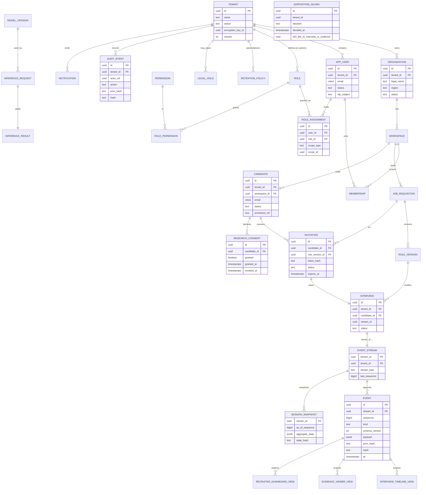

# Chapter 4 — Data Architecture, Database Design, Event Store & Persistence Model

**Part A of B** — request sections §1–11 (executive summary, persistence strategy, database philosophy, multi-tenant data model, complete ER model, ER diagram, aggregate persistence, event store, event schemas, read models, projection architecture). Part B covers §12–27.

> **Status of this chapter relative to the codebase.** Chapters 1–3 are treated as immutable source documents. The system as it exists today (2026-08-04) persists to the **local filesystem**: a hash-chained session event log (`lib/core/session/session_event_log.dart` `[IMPL]`), JSON audit stores (`lib/core/persistence/audit_store.dart`, `audit_store_io.dart` `[IMPL]`), JSON role stores (`lib/core/roles/role_store*.dart` `[IMPL]`), and per-enrolment JSON files. **There is no PostgreSQL, Redis, object store, vector database, search index, or analytics warehouse in the repository.** Therefore the overwhelming majority of this chapter is `[PROP]` — a specification the file-based prototype must grow into — with the few genuinely-built mechanisms tagged `[IMPL]` and the subsystem designs that predate this chapter tagged `[DES]`. A statement without `[IMPL]` is a specification, not a description of working software.

**Series continuity.** This chapter continues the global series. It introduces **ED-29 … ED-40**, **OQ-43 … OQ-55**, **R-38 … R-49**. Prior ranges (Ch1 ED-01…12 / OQ-01…17 / R-01…13; Ch2 OQ-18…30 / R-14…25; Ch3 ED-13…28 / OQ-31…42 / R-26…37) are referenced but never renumbered.

**The two load-bearing inheritances from Chapter 3.** Everything in this chapter bends around two Ch3 decisions:

- **ED-14 🔴** — Evidence (BC-07) and Disposition (BC-09) are *Separate Ways* bounded contexts. "NO EDGE. NO KEY. NO SHARED CREDENTIAL." This chapter must make that physical: §21.5 shows the disposition store is a **separate database with no foreign key, no shared connection pool, and no join surface** reaching the evidence store. If this chapter allowed a `disposition.session_id` column, it would silently reverse ED-14. It does not, and §5 documents the deliberate absence.
- **ED-13** — `InterviewSession` is event-sourced from an append-only, hash-chained log; `ClaimAudit` and `EvidenceGraph` are *derived projections*, rebuildable by replay. This chapter is where the log stops being an in-memory `List<SessionEntry>` and becomes a durable, partitioned, integrity-verifiable event store.

---

## 1 Executive Summary

### 1.1 Why data architecture is the foundation

CogniHire's entire product claim — from Chapter 1 §1 — is that it produces a **defensible, tamper-evident record of what a candidate demonstrated**, with **no hidden composite score** and **no reconstructible training dataset of hiring outcomes**. Every one of those guarantees is, in the end, a *data* guarantee:

- "Tamper-evident" is a property of *how the record is stored* (append-only + hash chain), not of any UI.
- "No hidden score" is enforced by the *absence of a column* — the read models in §10 physically have no score field to leak.
- "No reconstructible training dataset" (Ch1 ED-04) is enforced by the *physical separation* of the evidence store from the disposition store (§21.5), not by a policy document.

In a conventional CRUD product the data model is an implementation detail downstream of the features. Here it is the inverse: the product's central promises **are** invariants of the persistence layer. If the data architecture is wrong, no amount of application code can restore the guarantee, because the guarantee is defined as a shape of stored data. That is why this chapter is the canonical specification: a later chapter may choose *how* to deploy Postgres, but may not add a foreign key that this chapter forbids.

### 1.2 The eight stores and how they relate

CogniHire is not "a database." It is a **polyglot persistence system** in which each store holds exactly the class of data whose access pattern and integrity requirement it is suited to. The relationship between them is a directed flow — writes converge on the event store; everything else is derived, cached, or write-once-read-many.

```
                        ┌──────────────────────────────────────────┐
   COMMANDS ───────────▶│  EVENT STORE  (source of truth)          │
   (StartInterview,     │  append-only · hash-chained · CP         │
    SubmitAnswer, …)    │  partitioned by (tenant_id, stream_id)   │
                        └───────────────┬──────────────────────────┘
                                        │  event feed (ordered per stream)
                        ┌───────────────┼───────────────┬────────────────┐
                        ▼               ▼               ▼                ▼
                 ┌────────────┐  ┌────────────┐  ┌────────────┐   ┌────────────┐
                 │ SNAPSHOTS  │  │ PROJECTION │  │ PROJECTION │   │ PROJECTION │
                 │ (rehydrate │  │  WORKERS   │  │  WORKERS   │   │  WORKERS   │
                 │  fast-fwd) │  └─────┬──────┘  └─────┬──────┘   └─────┬──────┘
                 └────────────┘        ▼               ▼                ▼
                                 ┌──────────┐    ┌──────────┐     ┌──────────┐
                                 │ POSTGRES │    │  VECTOR  │     │  SEARCH  │
                                 │ read     │    │  DB      │     │  INDEX   │
                                 │ models + │    │ (pgvector│     │ (resume  │
                                 │ relational│   │  claims, │     │  text,   │
                                 │ master   │    │  resume  │     │  jobs)   │
                                 │ data     │    │  chunks) │     └──────────┘
                                 └────┬─────┘    └──────────┘
                                      │ CDC (outcomes-free, de-identified)
                                      ▼
                                 ┌──────────┐         ┌────────────────────┐
                                 │ ANALYTICS│         │  OBJECT STORAGE     │
                                 │ WAREHOUSE│         │  resumes, PDFs,     │
                                 │ (columnar│         │  screenshots,       │
                                 │  facts)  │         │  exports, audio*    │
                                 └──────────┘         └────────────────────┘

   ┌───────────────────────────────────────────────────────────────────────┐
   │  REDIS  — ephemeral only: session working-set, locks/leases, rate      │
   │  limits, projection checkpoints cache. Never a system of record.       │
   └───────────────────────────────────────────────────────────────────────┘

   ┌───────────────────────────────────────────────────────────────────────┐
   │  DISPOSITION STORE (BC-09) 🔴 — SEPARATE Postgres instance. No FK, no   │
   │  shared pool, no join, no event subscription to BC-07 topics. (§21.5)  │
   └───────────────────────────────────────────────────────────────────────┘

   * audio/video capture is OQ-44 — not confirmed in scope; see §12.
```

| Store | Role | System of record for | Derived / rebuildable? | Ch3 tie |
|---|---|---|---|---|
| **Event store** | Source of truth for behavioural aggregates | `InterviewSession`, `ClaimAudit` inputs, all domain events | No — authoritative | ED-13 |
| **Snapshots** | Fast rehydration of long event streams | nothing (pure optimisation) | Yes — deletable & recomputable | ED-13, §7 |
| **Projections** | The *process* turning events into read models | nothing | — | Ch3 §14 |
| **PostgreSQL (relational)** | Master data + CQRS read models | Organizations, Users, Roles, Jobs, Invitations, Candidates *identity*, read models | Read models: yes. Master data: **no** | Ch3 §14 |
| **Object storage** | Large binary blobs | resume files, generated PDFs, screenshots | No (binary originals) | Ch2 §16, Ch3 §7 |
| **Vector DB** | Semantic retrieval | claim/resume/question embeddings | Yes — re-embeddable from source | Ch3 §16 AI-4 |
| **Search index** | Keyword/structured search | nothing | Yes — reindexable | §14 |
| **Analytics warehouse** | Aggregate product metrics | nothing | Yes — from de-identified CDC | Ch2 §17, ED-04 |
| **Redis** | Ephemeral coordination & cache | nothing | Yes — reconstructable | Ch3 §22 |
| **Disposition store 🔴** | Hire/reject decisions | `Disposition` | No — authoritative, **isolated** | ED-14 |

The single most important sentence in this chapter: **the event store is the only store that is both authoritative and not derived from anything else; every other store except master data and the disposition store can be dropped and rebuilt.** That property is what makes the tamper-evidence claim survivable — an attacker who corrupts a read model changes a cache, not the truth.

---

## 2 Persistence Strategy — what lives where

### 2.1 PostgreSQL `[PROP]`

Two logical roles, one engine:

1. **Master / reference data** (authoritative, mutable, relational): `organization`, `workspace`, `app_user`, `role`, `permission`, `role_assignment`, `membership`, `job_requisition`, `role_version`, `invitation`, `candidate` (identity record only), `research_consent`, `retention_policy`, `feature_flag`, `model_version`. These are *not* event-sourced — they are ordinary normalized tables with optimistic-concurrency `version` columns (§3.9). Rationale: they are low-volume, edited by humans, need referential integrity, and gain nothing from event sourcing. Ch3 explicitly event-sources only the behavioural aggregates.
2. **Read models** (derived, disposable): `recruiter_dashboard_view`, `candidate_transparency_view`, `interview_timeline_view`, `evidence_viewer_view`, `claim_comparison_view`, etc. (§10). Rebuilt by projection workers from the event store.

**Trade-off:** using one Postgres for both master data and read models simplifies operations at MVP scale but couples their scaling. Accepted for V1; §19 documents the split path (read models move to read-replicas / separate schema) when they diverge in load.

### 2.2 Event store `[PROP]` (mechanism `[IMPL]` in-memory)

The append-only, hash-chained log. Today `SessionEventLog` is an in-memory `List<SessionEntry>` serialised to JSONL `[IMPL]`. The target is a durable event store — a dedicated Postgres table family (`event_stream`, `event`, `snapshot`) is the V1 choice (§8.2), with EventStoreDB named as an alternative and rejected for operational-surface reasons in ED-30. Holds: every domain event from Ch3 §12, ordered per stream, immutable, hash-chained.

### 2.3 Redis `[PROP]`

**Ephemeral only. Never a system of record.** Holds: (a) the **session working set** (Ch2's renamed "AI memory" — the current turn-planning context for a live interview), (b) **single-writer leases** for `InterviewSession` (Ch3 ED-21), (c) rate-limit counters, (d) projection checkpoint cache (durable copy in Postgres), (e) short-TTL read-through cache for hot read models. Everything in Redis must be reconstructable from a durable store; a total Redis flush may degrade latency but must never lose truth. See §15.

### 2.4 Object storage `[PROP]` (S3-compatible)

Large binaries whose bytes never belong in a row: uploaded **resume files** (PDF/DOCX), **generated report PDFs**, **exported audit HTML/JSON** (the current export writer targets the local FS `[IMPL]` — `lib/core/export/export_writer_io.dart`), **screenshots** captured for integrity evidence, **attachments**. Objects are content-addressed (SHA-256 key), write-once, referenced by URI from relational rows. Audio/video is **OQ-44** (not confirmed in scope — Ch2 kept interviews text/telemetry-first). See §12.

### 2.5 Vector database `[PROP]` (pgvector, co-located with Postgres at V1)

Embeddings for semantic retrieval: **claim embeddings**, **resume-chunk embeddings**, **question-bank embeddings** for retrieval, **session working-set** semantic recall. Not authoritative — every vector is re-derivable from its source text via the Inference Gateway (Ch3 ED-16). Versioned by embedding model (§13.5). See §13.

### 2.6 Search index `[PROP]` (Postgres FTS at V1; OpenSearch at scale — OQ-45)

Keyword and structured search over resume text, job requisitions, and candidate identity fields (name/email, tenant-scoped). Fully rebuildable. See §14.

### 2.7 Analytics warehouse `[PROP]` (columnar)

Aggregate product and operational metrics from Ch2 §17's analytics catalogue, fed by **de-identified, outcome-free** CDC. This store is where Ch2 §17.5's hazard lives, and §22 is dedicated to structurally preventing it: **the warehouse must not be able to join an evidence record to a hire/reject outcome**, because that join *is* the prohibited training set (ED-04). See §22.

### 2.8 Temporary storage `[PROP]`

Two kinds: (a) **upload staging** — a short-TTL object-store prefix (`/tmp-uploads/{tenant}/…`) for resumes mid-virus-scan/mid-parse, promoted to permanent on success, reaped after 24 h `[EST]`; (b) **scratch compute** — projection rebuild working tables, never referenced by application reads. See §12.8.

---

## 3 Database Philosophy

| # | Principle | Application in CogniHire |
|---|---|---|
| 3.1 | **Normalization** (master data) | Master/reference tables are 3NF. `role_assignment` is a proper join table; permissions are not duplicated onto users. Rationale: humans edit this data and referential integrity matters more than read speed. |
| 3.2 | **Denormalization** (read side) | Read models are aggressively denormalized — a `recruiter_dashboard_view` row carries pre-joined candidate name, job title, and *state* so a dashboard is one indexed scan. Justified because read models are disposable and rebuildable; a denormalization bug is fixed by a replay, not a migration. |
| 3.3 | **CQRS** | Physical separation of write and read models (Ch3 §14). Commands mutate aggregates → emit events → projections build read models. The write side never serves a query; the read side never accepts a command. |
| 3.4 | **Event Sourcing** | Behavioural aggregates only (`InterviewSession`, and the audit/evidence projections derived from its stream) — ED-13. Master data is deliberately **not** event-sourced (see trade-off in §2.1). This split is itself a decision: **ED-29**. |
| 3.5 | **Immutable history** | The event store and the disposition store are append-only. No `UPDATE`, no `DELETE` in normal operation. A correction is a *new* compensating event, never an edit — preserving the hash chain (§8.3). |
| 3.6 | **Soft delete** | Master-data "deletion" is a `deleted_at` timestamp + exclusion from default queries. Applies to `candidate`, `job_requisition`, `invitation`, `app_user`. Rationale: recoverability, audit, and referential safety. |
| 3.7 | **Hard delete** | Reserved for **GDPR erasure** and **retention expiry** (§16). Hard delete of PII is a *crypto-shred* (destroy the per-subject key, §20.3) plus a tombstone in the event stream, never a raw `DELETE` that would break the hash chain. This reconciles "immutable history" with "right to erasure" — see ED-33. |
| 3.8 | **Retention** | Every persistent class has a `retention_policy` row (§5) defining TTL, legal-hold behaviour, and post-expiry action. No data class is retained "forever by default" — that would violate Ch1 data-minimisation. |
| 3.9 | **Versioning** | Two distinct kinds: (a) **optimistic-concurrency `version`** integer on every mutable aggregate/master row (bumped per write, `WHERE version = :expected`); (b) **schema/semantic `schema_version`** on events and payloads (§9, §17). These are different columns with different jobs and must not be conflated — **ED-34**. |

> **Contradiction watch (not silently resolved).** Ch1 §9 NFR-Compliance implied "records are retained for audit" while Ch1 also mandates GDPR erasure. Ch3 did not fully reconcile "immutable append-only" with "right to be forgotten." This chapter resolves it explicitly via **crypto-shredding + tombstone (ED-33, §16.6, §20.3)** rather than by editing history. This is a *resolution of an under-specified area*, documented here and cross-referenced, not a reversal of any prior decision.

---

## 4 Multi-Tenant Data Model

Resolves the physical shape of Ch3 ED-15 (TenantId in the Shared Kernel) and Ch1 R-05 (no aggregate carried a tenant key). Ch3 §20 chose the *model*; this section chooses the *isolation mechanism*.

### 4.1 The tenancy hierarchy

```
Tenant (billing + isolation boundary)
  └── Organization (the customer company; 1:1 with Tenant at V1 — see OQ-46)
        └── Workspace (a team / hiring unit within the org)
              ├── Membership ──▶ User  (a human principal; may span workspaces)
              │        └── RoleAssignment ──▶ Role ──▶ Permission (RBAC, Ch1 §7)
              ├── JobRequisition ──▶ RoleVersion
              ├── Candidate (identity) ──▶ Invitation ──▶ Interview(Session)
              └── (evidence/audit streams, tenant-partitioned in event store)
```

| Concept | Definition | Table |
|---|---|---|
| **Tenant** | The isolation + billing root. Owns an encryption key (§20.3). | `tenant` |
| **Organization** | The customer company. 1:1 with tenant at V1; the seam for future multi-org tenants is OQ-46. | `organization` |
| **Workspace** | A hiring unit/team; the scope most permissions are granted within. | `workspace` |
| **User** | A human principal (recruiter, HM, admin). Global identity, per-workspace membership. | `app_user` |
| **Role** | A named permission set (Ch1 §7, `lib/core/auth/user_role.dart` `[IMPL]`). | `role` |
| **Permission** | A single capability (`lib/core/rbac/permission.dart` `[IMPL]`). | `permission` |
| **Membership** | User ∈ Workspace, with status. | `membership` |
| **RoleAssignment** | User holds Role in a scope (workspace or org). | `role_assignment` |
| **Ownership** | Every row's owning tenant, enforced physically (§4.3). | `tenant_id` column + RLS |

### 4.2 Isolation model decision — **ED-30**

**Decision:** **Shared database, shared schema, row-level tenant isolation via `tenant_id` on every table + PostgreSQL Row-Level Security (RLS)**, with **two exceptions physically isolated per tenant**: (a) the **per-tenant biometric encryption key** (Ch3 §20 — a tenant's face-embedding data is encrypted with its own key, so cross-tenant read is cryptographically, not just logically, denied), and (b) the **disposition store** (ED-14 🔴 — a separate database entirely, §21.5).

**Alternatives considered:**

| Model | Isolation strength | Ops cost | Chosen? |
|---|---|---|---|
| Database-per-tenant | Strongest | O(n) databases; migrations × n; expensive at MVP | No — revisit at enterprise tier (OQ-47) |
| Schema-per-tenant | Strong | Connection/migration complexity grows with tenants | No |
| **Shared schema + RLS + `tenant_id`** | Strong *if* enforced at type + DB layer | Lowest; one migration path | **Yes (V1)** |

**Consequences:** the entire burden of isolation rests on *never issuing an unscoped query*. Ch3 §11 already made the repository interface enforce this at the **type level** (`findById(TenantContext ctx, ID id)` with no single-arg overload). This chapter adds the **second and third fences**: RLS policies at the DB (a query missing the tenant GUC returns zero rows, not all rows), and a CI check (§21 of Ch3) that greps for raw SQL bypassing the repository. Three independent layers, because "we'll remember to filter" is exactly the failure Ch1 R-05 warned about. **Trade-off:** RLS adds per-query planning overhead (`[EST]` low single-digit %) and makes some admin/cross-tenant reporting queries harder — accepted; those go through an explicitly-audited `platform_admin` path (§20.5).

### 4.3 Isolation guarantees (what we promise)

1. **G-T1** No application query returns a row from another tenant. Enforced at three layers (type, RLS, CI).
2. **G-T2** A tenant's biometric/face data is encrypted with a key no other tenant's context can load (crypto isolation, not just RLS).
3. **G-T3 🔴** No query, in any store, can join a tenant's **evidence** to that tenant's **disposition** — because they live in separate databases with no shared credential (ED-14). This is *stronger* than tenant isolation: it is intra-tenant context isolation.
4. **G-T4** Deleting a tenant (§16.7) destroys its key (crypto-shred), tombstones its streams, and drops its RLS-scoped rows — with a documented ordering (Ch3 §20.3 M-steps) so nothing is orphaned.

---

## 5 Complete ER Model

Conventions applied to **every** table below unless noted:

- **Tenant field:** `tenant_id UUID NOT NULL` (except `tenant` itself and truly global tables, which are marked). RLS-enforced.
- **Audit fields:** `created_at timestamptz NOT NULL DEFAULT now()`, `updated_at timestamptz NOT NULL`, `created_by UUID` (actor ref), `updated_by UUID`.
- **Concurrency:** `version integer NOT NULL DEFAULT 0` on mutable rows (optimistic locking).
- **Soft delete:** `deleted_at timestamptz NULL` where §3.6 applies.
- **PK:** `id UUID` (application-generated UUIDv7 for time-ordering) unless a natural key is noted.
- All FKs are `ON DELETE RESTRICT` by default (soft-delete instead); GDPR hard-delete is a separate governed path (§16).

> Types are PostgreSQL. `citext` = case-insensitive text. `jsonb` used only where the shape is genuinely open; never as a dumping ground to dodge a column.

### 5.1 Tenancy & Identity

**`tenant`** — isolation & billing root. *Global (no `tenant_id`).*
| Column | Type | Notes |
|---|---|---|
| id | UUID PK | |
| name | text NOT NULL | |
| status | text NOT NULL | `active` / `suspended` / `terminating` / `terminated` (Ch2 org state machine) |
| encryption_key_id | UUID NOT NULL | ref to KMS key alias for this tenant (§20.3); the *material* never sits here |
| created_at / updated_at / version | | |
- **Indexes:** `UNIQUE(name)`. **Lifecycle:** created on signup → active → (suspend) → terminating → terminated (crypto-shred). Never hard-deleted while any legal hold exists.

**`organization`** — the customer company.
| Column | Type | Notes |
|---|---|---|
| id | UUID PK | |
| tenant_id | UUID NOT NULL FK→tenant | 1:1 at V1 (OQ-46) |
| legal_name | text NOT NULL | |
| region | text NOT NULL | data-residency region (Ch1 compliance); drives which DB cluster (§19) |
| status | text NOT NULL | |
| audit fields, version, deleted_at | | |
- **Indexes:** `UNIQUE(tenant_id)` (enforces 1:1), `INDEX(region)`.

**`workspace`** — hiring unit.
| Column | Type | Notes |
| id UUID PK · tenant_id FK · organization_id FK→organization · name text NOT NULL · status text · audit/version/deleted_at |
- **Indexes:** `INDEX(organization_id)`, `UNIQUE(organization_id, name) WHERE deleted_at IS NULL`.

**`app_user`** — human principal. (`Principal`, `lib/core/auth/principal.dart` `[IMPL]`.)
| Column | Type | Notes |
|---|---|---|
| id | UUID PK | |
| tenant_id | UUID NOT NULL FK | a user belongs to one tenant at V1 (cross-tenant users = OQ-48) |
| email | citext NOT NULL | |
| display_name | text NOT NULL | |
| status | text NOT NULL | `invited`/`active`/`disabled` (Ch2 auth state machine) |
| idp_subject | text NULL | external IdP subject (Ch3 IdP ACL); no password hash stored — auth is delegated |
| audit/version/deleted_at | | |
- **Indexes:** `UNIQUE(tenant_id, email) WHERE deleted_at IS NULL`, `INDEX(idp_subject)`.
- **Note:** the current `InMemoryAuthStore` `[IMPL]` is a test double with a `password` field; production auth is IdP-delegated and stores **no credential** here — resolving the secret-scan concern from the commit history. **Credential storage is OQ-49** (fully IdP-delegated vs. local fallback).

**`role`** — named permission set. (`UserRole`, `[IMPL]`.)
| id UUID PK · tenant_id FK (NULL ⇒ system-defined global role) · key text NOT NULL · name text · is_system boolean · audit/version |
- **Indexes:** `UNIQUE(COALESCE(tenant_id,'00..0'), key)`.

**`permission`** — single capability. *Global, seeded from `lib/core/rbac/permissions.dart` `[IMPL]`.*
| id UUID PK · key text NOT NULL UNIQUE · description text |
- **Lifecycle:** append-mostly; a removed permission is deprecated, not deleted (would orphan role grants).

**`role_permission`** — role ⇢ permissions (the RBAC matrix, `[IMPL]` as `AccessPolicy`).
| role_id FK · permission_id FK · PK(role_id, permission_id) |

**`role_assignment`** — user holds role in a scope.
| id UUID PK · tenant_id FK · user_id FK→app_user · role_id FK→role · scope_type text (`workspace`/`org`) · scope_id UUID · audit/version |
- **Indexes:** `UNIQUE(user_id, role_id, scope_type, scope_id)`, `INDEX(scope_type, scope_id)`.
- **Note — the wiring gap:** Ch1/Ch3 flagged that RBAC is *built and tested but unwired* (`ARCHITECTURE_DISCOVERY_REPORT.md`). This table is `[PROP]`; the *logic* that would consume it is `[IMPL]` but has zero importers in the running app. **R-38** tracks the persistence-vs-enforcement gap.

**`membership`** — user ∈ workspace.
| id UUID PK · tenant_id FK · user_id FK · workspace_id FK · status text · audit/version |
- **Indexes:** `UNIQUE(user_id, workspace_id)`.

### 5.2 Hiring master data

**`job_requisition`** — an open role to hire for.
| id UUID PK · tenant_id FK · workspace_id FK · title text · status text (`draft`/`open`/`closed`) · current_role_version_id FK→role_version · audit/version/deleted_at |
- **Indexes:** `INDEX(workspace_id, status)`.

**`role_version`** — an immutable published version of a role's competency/question profile. (Ch3 AG: `PublishRoleVersion`.)
| id UUID PK · tenant_id FK · job_requisition_id FK · version_no int · profile jsonb (competencies, question weights) · published_at · published_by · schema_version int |
- **Immutable** once published (append-only; a change is a new version). **Indexes:** `UNIQUE(job_requisition_id, version_no)`.

**`candidate`** — identity record only (NOT evidence).
| id UUID PK · tenant_id FK · workspace_id FK · full_name text · email citext · status text (Ch2 candidate state machine) · enrolment_ref text NULL (object-store key for face template, encrypted per-tenant) · audit/version/deleted_at |
- **Indexes:** `UNIQUE(tenant_id, email) WHERE deleted_at IS NULL`, `INDEX(workspace_id, status)`.
- **Boundary note:** this row holds *who the candidate is*, never *how they performed*. Performance lives only in the event store / evidence projections. A `candidate` row has **no** score, verdict, or claim column — by design, not omission.

**`invitation`** — an invite to interview. (Ch2 invitation state machine.)
| id UUID PK · tenant_id FK · candidate_id FK · job_requisition_id FK · role_version_id FK · token_hash text (never the raw token) · status text (`pending`/`accepted`/`expired`/`revoked`) · expires_at · audit/version |
- **Indexes:** `UNIQUE(token_hash)`, `INDEX(candidate_id, status)`.

**`interview`** — the durable handle for an interview session (the *identity/metadata* of the session; the *behaviour* is the event stream).
| id UUID PK · tenant_id FK · candidate_id FK · invitation_id FK · role_version_id FK · stream_id UUID NOT NULL (→ event store stream) · status text (Ch2 interview state machine) · started_at · ended_at · schema_version int · audit/version |
- **Indexes:** `UNIQUE(stream_id)`, `INDEX(candidate_id)`, `INDEX(status)`.
- **Relationship to event store:** `interview.stream_id` is the *only* pointer from relational-land into the event store. The `InterviewSession` aggregate is **not** stored here as columns; it is rehydrated by replaying `stream_id` (§7).

**`research_consent`** — the candidate's consent flag (`session_draft.dart researchConsent` `[IMPL]`).
| id UUID PK · tenant_id FK · candidate_id FK · granted boolean · scope text · granted_at · revoked_at NULL · schema_version |
- **Append-only** (a revocation is a new row/event, not an update). Gate for whether *any* data may enter the analytics research path (§22).

### 5.3 Derived / evidence-side (read models & projection state)

**`session_snapshot`** — rehydration accelerator (§7).
| stream_id UUID · tenant_id FK · as_of_sequence bigint · aggregate_state jsonb · state_hash text · created_at · PK(stream_id, as_of_sequence) |
- **Disposable:** may be deleted anytime; recomputed by replay. Never a source of truth.

Read-model tables (`recruiter_dashboard_view`, `candidate_transparency_view`, `interview_timeline_view`, `evidence_viewer_view`, `claim_comparison_view`) — schemas in §10. All carry `tenant_id`, a `projection_checkpoint` linkage, and **no numeric score/rank column** (enforced; §10.6).

**`projection_checkpoint`** — how far each projection has consumed.
| projection_name text · partition text · last_sequence bigint · updated_at · PK(projection_name, partition) |

### 5.4 Cross-cutting operational tables

**`notification`** — outbound notification record (Ch2 §16 catalogue).
| id UUID PK · tenant_id FK · recipient_user_id FK NULL · recipient_candidate_id FK NULL · type text (N-01…N-20) · channel text · status text · payload_ref jsonb (content-minimised — **no claims/verdicts/similarity**, Ch2 rule) · sent_at · audit |
- **Constraint (CHECK/CI):** `payload_ref` schema forbids fields named like a verdict/score/claim (§22 vocabulary ban reused).

**`model_version`** — registry of AI model artefacts (Inference Gateway, ED-16).
| id UUID PK · kind text (`embedding`/`generation`/`face`) · name text · digest text (weights hash) · params jsonb · active boolean · created_at |
- *Global* (models are not tenant-specific), but *usage* is tenant-scoped via events. Drives §13.5 re-embedding.

**`inference_request` / `inference_result`** — audit of AI calls through the Gateway (ED-16 ACL). **Metadata only — never the raw prompt text if it contains candidate PII beyond what the grounding gate already recorded.**
| inference_request: id · tenant_id · model_version_id FK · purpose text · input_digest text · created_at |
| inference_result: id · request_id FK · output_digest text · latency_ms int · adapter text (`localOllama`/`remotePool`/`deterministicFallback`) · created_at |
- **Retention:** short (§16); these are operational, not evidence. **OQ-50:** do inference records count as evidence for disputes, or purely as ops telemetry?

**`feature_flag`** — runtime toggles.
| id UUID PK · tenant_id NULL (NULL ⇒ global) · key text · enabled boolean · rollout jsonb · updated_at · version |
- **Indexes:** `UNIQUE(COALESCE(tenant_id,'0'), key)`.

**`retention_policy`** — per data-class retention rules (§3.8, §16).
| id UUID PK · tenant_id NULL · data_class text (`resume`/`interview_stream`/`evidence`/`inference`/`notification`/`analytics_fact`) · ttl_days int · legal_hold_default boolean · post_expiry_action text (`crypto_shred`/`hard_delete`/`archive`) · version |
- **Indexes:** `UNIQUE(COALESCE(tenant_id,'0'), data_class)`.

**`legal_hold`** — suspends deletion for a subject/scope (§16.5).
| id UUID PK · tenant_id FK · scope_type text · scope_id UUID · reason text · placed_by · placed_at · released_at NULL |

**`audit_event`** — *administrative/compliance* audit (distinct from the *interview* event store). Who-did-what on master data & admin actions (Ch3 BC-15).
| id UUID PK (append-only) · tenant_id FK · actor_ref UUID · action text · target_type text · target_id UUID · at timestamptz · prev_hash text · hash text |
- **Hash-chained** like the interview log (§8), but a *separate* stream for admin actions. **Immutable.**

### 5.5 Tables that intentionally DO NOT exist

Documented as first-class design (the absence *is* the design — Ch3 §14 "deliberately absent read models"):

| Non-table | Why it must never exist |
|---|---|
| `candidate_score` / `overall_rating` | Ch1 "no hidden composite score." A single numeric verdict column is the exact thing the product refuses. |
| `candidate_ranking` / `top_candidates` | Ranking implies a total order = a composite score by another name. |
| `disposition` *in this database* | ED-14 🔴 — Disposition lives in a **separate DB** (§21.5). Putting it here, joinable to evidence, reconstructs the ED-04 training set. |
| `hire_outcome` on any evidence/analytics row | §22 — the outcome label + evidence = the prohibited dataset. |
| `similarity_score` on `verification` where result is `Unchecked` | Ch3 VO rule: `Unchecked` has **no** similarity field. A NULLable column would invite fabrication. |

---

## 6 Mermaid ER Diagram

> Master data + evidence-side pointers. The **disposition store is drawn as a detached island with no relationship line** — that visual gap is ED-14 made literal. The event store is shown as the stream target of `interview`.



---

## 7 Aggregate Persistence — how each Chapter 3 aggregate is stored

Ch3 Part B defined 20 aggregates (AG-01…AG-20). Their persistence splits into three disciplines:

| Aggregate (Ch3) | Persistence discipline | Store | Rehydration |
|---|---|---|---|
| **AG-10 InterviewSession** | **Event-sourced** (ED-13) | Event store stream = `interview.stream_id` | Replay events → optional snapshot fast-forward (§7.2) |
| **AG-11 ClaimAudit** | **Derived projection** (immutable, rebuildable) | Postgres read model + object-store export | Rebuilt by replaying the session stream |
| **AG-12/13 EvidenceGraph nodes/edges** | **Derived projection** | Postgres (`evidence_viewer_view`) | Rebuilt from audit projection |
| **AG-01 Organization, AG-02 Workspace, AG-03 User, AG-04 Role** | **State-stored** (master data) | Postgres relational, optimistic `version` | Direct row load |
| **AG-05 JobRequisition, AG-06 RoleVersion, AG-07 Candidate, AG-08 Invitation** | **State-stored** | Postgres relational | Direct row load |
| **AG-15 Disposition 🔴** | **State-stored, isolated** | **Separate disposition DB** (ED-14) | Direct row load, no cross-context key |
| **AG-14 ConsentRecord** | **Append-only rows** | Postgres `research_consent` | Latest-wins by candidate |
| **AG-16 AuthSession, AG-17 Credential** | **State-stored / ephemeral** | Postgres + Redis (session) | — |
| Others (AG-09 NotificationDispatch, AG-18 GuardDefinition, AG-19 ModelVersion, AG-20 RetentionPolicy) | **State-stored** | Postgres | Direct row load |

### 7.1 The event-sourced aggregate in detail (AG-10)

`InterviewSession` is **never** stored as a row of columns. It is the *fold* of its event stream:

```
InterviewSession.state = replay(events_for(stream_id), from=0)
```

The current `[IMPL]` `SessionEventLog` already implements the fold semantics (append + ordered replay + integrity check). The `[PROP]` step is durability: the `List<SessionEntry>` becomes rows in the `event` table keyed by `(stream_id, sequence)`, and `append()` becomes an INSERT guarded by a unique constraint on `(stream_id, sequence)` (§8.4 — this is also the optimistic-concurrency guard for the aggregate: two writers computing sequence *N* collide on the unique index; loser retries — Ch3 ED-21 single-writer lease makes this rare, the constraint makes it *safe*).

### 7.2 Snapshots (optimisation, never truth)

For a long interview (hundreds of events), replaying from zero on every load is wasteful. A **snapshot** stores the folded `aggregate_state` at sequence *N* plus a `state_hash`. Rehydration = load latest snapshot ≤ target, replay only events *> N*. Rules:

1. A snapshot is **always deletable** — if absent, replay from zero still yields identical state. **ED-31** makes this a hard invariant: *no code path may read a snapshot without being able to fall back to full replay.*
2. `state_hash` must equal the hash re-derived by full replay; a mismatch means a corrupt snapshot → discard and replay (self-healing).
3. Snapshots are **not** hash-chained into the event log (they are outside the tamper-evidence boundary); trusting a snapshot's *state* without the `state_hash` check would be a way to smuggle in a fabricated state, so the check is mandatory.

**Trade-off:** snapshots trade storage + a projection worker for read latency. Snapshot cadence (every N events / every T seconds) is **OQ-51**.

---

## 8 Event Store

### 8.1 Properties (target `[PROP]`; mechanism `[IMPL]`)

| Property | How | Tag |
|---|---|---|
| **Append-only** | INSERT-only table; no UPDATE/DELETE grant on `event` to the app role | `[PROP]` (in-memory append `[IMPL]`) |
| **Hash chain** | each event stores `prev_hash` = hash of prior event in stream, `hash` = SHA-256(prev_hash ‖ canonical(content)) | `[IMPL]` (`session_event_log.dart`) |
| **Integrity verification** | `verifyIntegrity()` recomputes the chain, reports first broken sequence | `[IMPL]` |
| **Ordering** | strict per-stream `sequence` (1-based, gap-free) via unique constraint | `[IMPL]` semantics; `[PROP]` DB constraint |
| **Partitioning** | by `(tenant_id, stream_id)`; table partitioned by hash(tenant_id) | `[PROP]` |
| **Snapshots** | §7.2 | `[PROP]` |
| **Replay** | ordered scan of a stream | `[IMPL]` (`fromJsonl`/`entries`) |
| **Archival** | cold streams → object storage as sealed JSONL + chain head | `[PROP]` |
| **Migration** | upcasting on read (§9.4, §17) | `[PROP]` |

### 8.2 Physical layout decision — **ED-30 (store choice)**

**Decision:** implement the event store as **PostgreSQL tables** at V1, not a dedicated event-store product.

```sql
-- event_stream: one row per aggregate stream
CREATE TABLE event_stream (
  stream_id     uuid PRIMARY KEY,
  tenant_id     uuid NOT NULL,
  stream_type   text NOT NULL,          -- 'interview' | 'admin_audit' | ...
  last_sequence bigint NOT NULL DEFAULT 0,
  head_hash     text NOT NULL DEFAULT '0000...0000',  -- genesisHash
  created_at    timestamptz NOT NULL DEFAULT now()
) PARTITION BY HASH (tenant_id);

-- event: the append-only, hash-chained log
CREATE TABLE event (
  id             uuid NOT NULL DEFAULT gen_uuidv7(),
  stream_id      uuid NOT NULL REFERENCES event_stream(stream_id),
  tenant_id      uuid NOT NULL,
  sequence       bigint NOT NULL,        -- 1-based, gap-free within stream
  kind           text NOT NULL,          -- SessionEventKind + future kinds
  schema_version integer NOT NULL,
  payload        jsonb NOT NULL,
  metadata       jsonb NOT NULL,         -- correlation/causation/actor (§9)
  prev_hash      text NOT NULL,
  hash           text NOT NULL,
  at             timestamptz NOT NULL,
  PRIMARY KEY (stream_id, sequence)
) PARTITION BY HASH (tenant_id);

CREATE UNIQUE INDEX ux_event_hash ON event (stream_id, hash);
CREATE INDEX ix_event_kind ON event (tenant_id, kind, at);
REVOKE UPDATE, DELETE ON event FROM app_role;   -- append-only at the grant level
```

**Alternatives:** EventStoreDB / Kafka-as-log. **Rejected for V1** because (a) they add an operational surface Ch1's constraints don't yet justify, (b) transactional consistency between an event append and its outbox row (§11.3) is trivial in one Postgres transaction but a distributed problem across two systems, and (c) the existing `[IMPL]` semantics map 1:1 to rows. **Consequence:** Postgres won't match a purpose-built log's throughput; §19 + Ch1 §11.2 capacity (~900 concurrent sessions `[EST]`) shows headroom, and OQ-52 tracks the migration trigger.

### 8.3 Corrections without mutation

An identity mismatch recorded in error is **not** edited (that breaks the chain and defeats the point). A correction is a **new event** (`integrityObserved`/a compensating kind) appended after it, referencing the corrected sequence in metadata (`causationId`). History shows *both* the original observation and the correction — which is exactly the audit property Ch1 wants. Ch3 §18 "forward recovery, not rollback" is the same principle at the saga level; here it is at the event level.

### 8.4 Ordering & concurrency

`sequence` is gap-free per stream. Two concurrent appends computing sequence *N* both attempt `INSERT … (stream_id, N)`; the `PRIMARY KEY(stream_id, sequence)` lets exactly one win. The loser reloads the stream head and retries at *N+1*. This is the aggregate's optimistic concurrency (§7.1). Ch3 ED-21's single-writer lease (Redis) makes collisions rare; the PK makes them **safe even if the lease fails** — belt and suspenders, deliberately, because a fabricated or lost event is a correctness violation, not a performance one (Ch3 R-37 lineage).

### 8.5 Archival & partitioning

- **Partitioning:** `HASH(tenant_id)` for even spread + tenant-local scans. Within a tenant, streams are independent, so cross-stream global ordering is *not* provided (and not needed — Ch3 events are ordered per stream, and cross-context ordering goes through the bus, not the store).
- **Archival:** a closed interview older than its retention window's *hot* period is sealed — its events exported to object storage as canonical JSONL plus the stream `head_hash`, verifiable offline — and the hot rows optionally dropped from the partition (the sealed export remains the chain-verifiable record). **OQ-53:** hot-window duration per data-residency region.

---

## 9 Event Schemas

Every event — the nine `[IMPL]` kinds (`sessionStarted`, `sessionEnded`, `claimOpened`, `claimAnswered`, `followUpAsked`, `identityChecked`, `integrityObserved`, `keystrokeBatch`, `resumeIngested`, `researchConsentSet`) plus every Ch3 §12 domain event — shares one **envelope** and a **kind-specific payload**.

### 9.1 The envelope (metadata) — required on every event

```jsonc
{
  "schema_version": 1,          // semantic version of THIS event kind's payload
  "kind": "claimAnswered",      // closed set (SessionEventKind + domain events)
  "stream_id": "uuid",
  "sequence": 42,               // 1-based, gap-free
  "tenant_id": "uuid",
  "at": "2026-08-04T10:11:12.000Z",  // ISO-8601, from the caller (deterministic)
  "actor": { "type": "candidate|recruiter|system|planner", "ref": "uuid|null" },
  "correlation_id": "uuid",     // groups all events of one logical flow (an interview)
  "causation_id": "uuid|null",  // the event/command that directly caused this one
  "prev_hash": "sha256-hex",    // chain link
  "hash": "sha256-hex"          // SHA-256(prev_hash | canonical({kind,at,payload}))
}
```

The hash covers `{kind, at, payload}` with **sorted keys** (the `[IMPL]` `_canonicalJson`); `correlation_id`/`causation_id` live in `metadata` and are *not* hashed at V1 (they are routing aids, not evidence). **OQ-54:** should correlation/causation be inside the hash boundary? (Including them strengthens provenance but complicates replay-from-archive if routing changes.)

### 9.2 Payload schemas (the `[IMPL]` kinds)

| kind | payload (content-only; never raw keystrokes or raw embeddings — §5 rule from code) |
|---|---|
| `sessionStarted` | `{ role_version_id, invitation_id }` |
| `sessionEnded` | `{ reason: "completed"|"abandoned"|"timeout"|"terminated" }` |
| `claimOpened` | `{ claim_id, source: "resume"|"role_profile", span_ref }` |
| `claimAnswered` | `{ claim_id, answer_ref, response_ms }` |
| `followUpAsked` | `{ claim_id, followup_id, planner_model_version }` |
| `identityChecked` | `{ result: "verified"|"mismatch"|"unchecked", capture_ref }` — **no similarity number when `unchecked`** (Ch3 VO rule) |
| `integrityObserved` | `{ rule_id, observation_ref }` — an observation, never a verdict |
| `keystrokeBatch` | `{ reduced: { … aggregate cadence stats … } }` — **reduced values only**, never characters |
| `resumeIngested` | `{ resume_object_key, parser_version, chunk_count }` |
| `researchConsentSet` | `{ granted: bool, scope }` |

Each has a JSON Schema (`prompts/schemas/` houses the analogous LLM schemas `[IMPL]`; event schemas are a `[PROP]` sibling). Strict decoding (unknown field / missing field ⇒ reject) is inherited from the `[IMPL]` codec discipline — "a log that silently drops the record it cannot read is the omission-shaped version of a fabricated pass."

### 9.3 Domain-event payloads (Ch3 §12)

Ch3's ~50 domain events (`OrganizationCreated`, `RoleVersionPublished`, `CandidateInvited`, `InterviewStarted`, `AnswerSubmitted`, `AuditCompiled`, `DispositionRecorded` 🔴, …) each get a payload schema following the same envelope. **`DispositionRecorded` is special:** it is published on the **disposition context's own stream**, has **exactly two consumers, neither in BC-07/08/10/13** (Ch3 §12), and its payload carries **no `session_id`, no `audit_id`, no evidence reference** — the schema *cannot express* the link (ED-14). §21.5 shows the physical enforcement.

### 9.4 Versioning & upcasting

`schema_version` per kind. On read, an **upcaster** transforms an old payload to the current shape *in memory* (never rewriting the stored event — that would break the hash). Upcasters form a chain (v1→v2→v3). **ED-34** separates this `schema_version` from the optimistic-concurrency `version` (§3.9). §17 details rolling upgrades.

---

## 10 Read Models

Read models are **denormalized, disposable projections** (Ch3 §14). Each is owned by exactly one projection worker (§11) and carries `tenant_id`, `last_source_sequence` (for staleness display), and **no score/rank column** (§10.6).

### 10.1 `recruiter_dashboard_view`
Purpose: a recruiter's list of interviews + *states* (never verdicts).
| tenant_id · workspace_id · interview_id · candidate_name · job_title · state (Ch2 interview SM) · started_at · last_activity_at · integrity_flag_count int · claim_count int · **NO score, NO rank** |
- Indexes: `(tenant_id, workspace_id, state)`. Ownership: `RecruiterDashboardProjection`.

### 10.2 `candidate_transparency_view` (ED-20 — distinct artefact)
Purpose: what the *candidate* is allowed to see about their own session (Ch2). Structurally **different** from the recruiter view — it may show *their* claims and *what was verified*, but no comparative or ranking data.
| tenant_id · candidate_id · interview_id · claims_demonstrated jsonb · identity_status · **NO comparison to other candidates** |

### 10.3 `interview_timeline_view`
Purpose: the ordered event timeline for one interview (Evidence Viewer's spine).
| tenant_id · interview_id · sequence · kind · at · display_payload jsonb (redacted for the viewer's role) |
- Rebuilt directly from the stream; effectively a read-optimised, role-redacted mirror of the event order.

### 10.4 `evidence_viewer_view`
Purpose: the evidence graph (nodes + edges, Ch3 AG-12/13) for one audited interview.
| tenant_id · interview_id · node_id · node_type · edge_from · edge_to · attribution jsonb (**numbers copied from exact decomposition, never recomputed** — Ch3 AttributionExplanation VO) |

### 10.5 `claim_comparison_view`
Purpose: per-claim resume-vs-demonstrated comparison (the grounding-gate output surface). Carries the `VerificationResult` VO faithfully — `Verified`/`Mismatch`/`Unchecked`, with **no similarity field on `Unchecked`**.

### 10.6 The score-absence guarantee (physical)
**ED-32:** read-model DDL is generated from a schema linter that **rejects any column whose name or type implies a composite score, rank, or hire-probability** (`score`, `rating`, `rank`, `probability`, `fit`, `percentile`). A CI check re-runs the linter against live DDL. This makes Ch1's "no hidden score" a *build failure* if violated, not a code-review hope. **Trade-off:** the linter's name-based heuristic can false-positive on legitimate columns (e.g. `screen_rank` for UI ordering) — mitigated by an explicit allowlist with justification, itself reviewed.

---

## 11 Projection Architecture

### 11.1 Projection workers
A **projection** is a deterministic function `(read_model_state, event) → read_model_state`. Each runs as a worker that: reads its `projection_checkpoint`, fetches events after it (ordered per stream), applies them idempotently, advances the checkpoint **in the same transaction** as the read-model write (so a crash never double-applies or skips). One worker owns each read model (§10); no read model has two writers (mirrors the event-store single-writer discipline).

### 11.2 Idempotency
Every projection apply is keyed by `(read_model, stream_id, sequence)`; re-applying an already-seen sequence is a no-op. This is what makes at-least-once event delivery safe (Ch3 §23 duplication table).

### 11.3 The outbox (why events reach projections reliably)
On command handling, the event append **and** an `outbox` row are written in **one Postgres transaction** (possible precisely because the event store is Postgres — §8.2 rationale). A relay publishes outbox rows to the bus; projections subscribe. No lost events, no dual-write inconsistency. **ED-35.**

### 11.4 Replay & rebuild
Because read models are disposable: to rebuild, **truncate the read model, reset its checkpoint to 0, replay the whole stream set**. This is the operational realisation of "derived, not authoritative." A schema change to a read model is deployed by building the *new* projection alongside the old, replaying into it, then cutting reads over (blue/green projections) — zero-downtime read-model migration (§17.4).

### 11.5 Recovery
| Failure | Recovery |
|---|---|
| Projection worker crashes mid-batch | checkpoint didn't advance (same-txn) → resume from last committed sequence |
| Read model corrupted | truncate + full replay (§11.4) |
| Snapshot corrupt | discard, full replay (§7.2) |
| Bad projection logic shipped | fix code, rebuild affected read model only; event store untouched |
| Poison event (a payload a projection can't handle) | park to a dead-letter, alert, **never silently skip** (Ch3 R-37 discipline); the projection halts for that stream rather than fabricate a gap |

> **R-39:** a projection that *silently skips* a poison event would create an evidence gap indistinguishable from "nothing happened" — the omission-shaped fabrication again. Mitigation: halt-and-alert per stream, dead-letter, integrity dashboard.

---

*Part A ends here. Part B covers §12–27: object storage, vector storage, search, caching, data lifecycle, schema evolution, backup/DR, performance, security, privacy (incl. the physical enforcement of ED-14), analytics data model, data quality, and the chapter's Risks / Open Questions / Engineering Decisions / Engineering Notes.*
