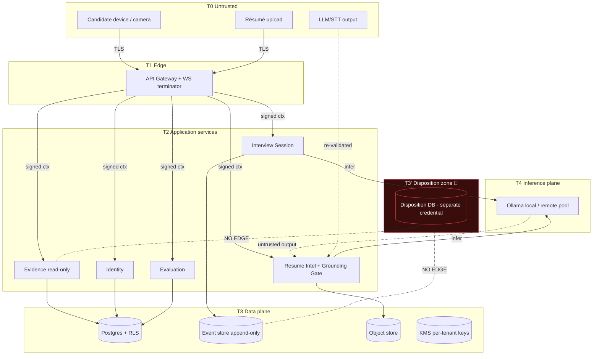

# Chapter 6 — Security, Privacy, Compliance & Trust Architecture

**Part A of B** — request sections §1–11 (executive summary, threat model, zero trust, authentication, authorization, secrets management, encryption, privacy architecture, consent architecture, audit architecture, AI trust). Part B covers §12–24.

> **Status relative to the codebase.** Chapters 1–5 are immutable source documents. Today the genuinely-built security-relevant mechanisms are: the **hash-chained, tamper-evident session event log** (`lib/core/session/session_event_log.dart` `[IMPL]`), the **PII scrubber** (`lib/core/privacy/scrubber.dart` `[IMPL]`), the **grounding gate** (`lib/core/claims/**` `[IMPL]`), the **candidate-id pseudonymisation** (`lib/core/privacy/candidate_id.dart` `[IMPL]`), the **RBAC/permission matrix** (`lib/core/rbac/**`, `lib/core/auth/**` `[IMPL]` — built and tested but **unwired** in the running app, Ch4 R-38), and the **local-only inference** posture (Ollama, no API key ever leaves the machine `[IMPL]`). Everything describing a gateway, KMS, IdP, service mesh, or SOC is `[PROP]`/`[DES]`. A statement without `[IMPL]` is a specification, not working software.

**Series continuity.** Introduces **ED-53 … ED-66**, **OQ-71 … OQ-83**, **R-63 … R-76**. Prior ranges (Ch1–Ch5) are referenced, never renumbered.

**The security posture is subordinate to the product principles.** Per the rules, no control in this chapter may weaken a Chapter 1–5 principle. The load-bearing ones this chapter must actively *defend*, not merely coexist with:

- **ED-14 🔴** — Evidence (BC-07) ⟂ Disposition (BC-09), Separate Ways. Security here **hardens** the separation (separate credentials, separate trust zones, break-glass that still cannot bridge them) and never introduces an "admin" path that reunites them.
- **Ch1 no-hidden-score / grounding gate** — the AI-trust section (§11) treats "the model authored a claim" and "a score leaked" as **security events**, not just quality bugs.
- **Ch4 R-37 / Ch5 ED-51** — a *skipped* identity check is the "omission-shaped fabricated pass." Security controls (rate limits, break-glass, incident containment) may **never** cause a safety step to be skipped silently.

---

## 1 Executive Summary

### 1.1 Security philosophy: the record is the product, so integrity outranks confidentiality

Most SaaS threat models rank **confidentiality** first (don't leak customer data). CogniHire keeps confidentiality as a hard requirement but elevates **integrity and non-repudiation** to co-equal priority, because the product's value proposition *is* a trustworthy record. A leaked interview transcript is a serious breach; a **silently altered** audit — an inconvenient identity mismatch deleted, a claim's provenance nudged — destroys the entire reason the product exists. The `[IMPL]` hash chain already encodes this priority: it is tamper-*evident* by design, chosen over nothing precisely because "the audit is only as trustworthy as the record it is built from."

The philosophy, stated as four commitments:

1. **Integrity is first-class.** Evidence is append-only and hash-chained; the *absence* of an edit tool is a security control (Ch4 R-50), and any repair touches only derived data (Ch4 §23).
2. **The system defends the candidate as much as the customer.** Unusually for B2B SaaS, a primary asset-at-risk is a *third party* (the candidate) who is not the paying customer and did not choose the vendor. Biometric and behavioural data about them get the strictest handling (§8).
3. **Structural over procedural.** Wherever a guarantee can be made *impossible to violate* (a column that doesn't exist, a credential a service doesn't hold) rather than *forbidden by policy*, it is (ED-14, no-hidden-score). Security continues this: type/credential/CI fences over written rules.
4. **Fail loud, never fabricate.** Under attack or overload the system degrades visibly (pauses, 503s, refusals) and **never** manufactures or omits an evidential fact to keep running (Ch4 R-37).

### 1.2 Why hiring systems need stronger guarantees than ordinary SaaS

| Dimension | Ordinary SaaS | CogniHire | Consequence for this chapter |
|---|---|---|---|
| **Decision stakes** | operational | affects a person's livelihood; legally consequential (employment law) | audits must survive legal scrutiny (§10 forensic workflows) |
| **Special-category data** | rare | **biometric** (face), inherently special-category under GDPR Art. 9 | strictest consent + crypto isolation (§7, §8, §9) |
| **Adversarial users** | occasional | **candidates are incentivised to cheat**; impersonation, resume fraud, prompt injection are expected, not edge cases | abuse cases are core (§16), not an appendix |
| **Regulatory surface** | GDPR/SOC2 | + **EU AI Act** (hiring = high-risk AI), anti-discrimination, biometric law (e.g. BIPA/GDPR Art. 9) | compliance maps to architecture (§15) |
| **Non-repudiation** | nice-to-have | **essential** — a disputed rejection may be litigated | tamper-evidence + provenance are product features (§10, §11) |
| **Third-party subject** | customer = data subject | subject (candidate) ≠ customer | subject rights (§8, §9) can't be waived by the customer |

This is why the threat model treats **fabrication of a passing result** (by a cheating candidate *or* by a system fault) as a top-severity threat alongside data exfiltration — a framing most SaaS security docs never need.

---

## 2 Threat Model

### 2.1 Assets (what has value)
| ID | Asset | Sensitivity | Primary property |
|---|---|---|---|
| AS-1 | **Interview event stream / audit** | Critical | **Integrity** (tamper-evidence) |
| AS-2 | **Biometric face templates** | Critical (special-category) | Confidentiality + crypto-isolation |
| AS-3 | **Candidate PII** (name, email, résumé) | High | Confidentiality |
| AS-4 | **Evidence graph / claim audit** | High | Integrity + provenance |
| AS-5 | **Disposition decisions** 🔴 | High | Confidentiality + **isolation from AS-1/AS-4** |
| AS-6 | **Per-tenant encryption keys** | Critical | Confidentiality (root of crypto-shred) |
| AS-7 | **Auth tokens / service credentials** | Critical | Confidentiality |
| AS-8 | **Behavioural telemetry** (keystroke cadence — reduced) | Medium | Confidentiality (pseudonymous) |
| AS-9 | **Model artefacts / prompts** | Medium | Integrity (provenance) |
| AS-10 | **The "no training dataset" property** (ED-04) | Critical (product-defining) | **Non-existence** — the (evidence, outcome) join must remain impossible |

AS-10 is unusual: the asset is the *impossibility of assembling a dataset*. Its "breach" is a schema/pipeline that reconstructs the (features → hire/reject) pair (Ch4 §21.5, §22).

### 2.2 Actors (legitimate)
Candidate (T1, adversarial-capable), Recruiter (T2), Hiring Manager (T2), Org Admin (T3), Platform Admin (T4, highest human privilege), System/service identities (M0–M1), Interview Turn Planner / Evaluation model (M1, *untrusted output*).

### 2.3 Attackers (threat sources)
| ID | Attacker | Motivation | Key capability |
|---|---|---|---|
| TA-1 | **Cheating candidate** | pass an interview they'd fail | impersonation, résumé fraud, prompt injection, replay |
| TA-2 | **Malicious insider** (recruiter/admin) | bias an outcome, exfiltrate, retaliate | legitimate creds, broad read |
| TA-3 | **Compromised service** | lateral movement | a valid service identity |
| TA-4 | **External attacker** | data theft, ransom | network/app exploitation |
| TA-5 | **Compromised LLM/dependency** | poisoning, exfil via output | supply-chain foothold, untrusted output channel |
| TA-6 | **Curious/over-reaching customer** | build a scoring model, correlate evidence↔outcome | legitimate access to *their* tenant |

TA-1 and TA-6 are the atypical ones. TA-1 makes the *candidate* an attacker against the record's integrity. TA-6 makes the *paying customer* an attacker against AS-10 — which is why ED-14's fences hold even for a fully-authorized tenant admin.

### 2.4 Trust boundaries (T0–T4, extending Ch3 §21)
```
T0  Public internet / candidate device (browser, camera)         — untrusted
T1  Edge: API Gateway / WS terminator / CDN                      — validates, never trusts input
T2  Application services (per bounded context)                   — authenticated, least-privilege
T3  Data plane: Postgres(+RLS), event store, object store, KMS   — reached only via service creds
T3' Disposition data plane 🔴                                    — SEPARATE zone, separate creds
T4  Inference plane (local Ollama today / remote pool future)    — outputs are UNTRUSTED (T0-grade)
```
Two boundaries are unusual:
- **T3' is a peer of T3, not a child.** The disposition store sits in its own trust zone with its own credential; no T2 service that can reach evidence (T3) holds a credential for T3' (ED-14 hardened, §5.7).
- **T4 output re-enters at T0 trust.** An LLM/STT response is treated as hostile input — it may contain a prompt-injection payload or a fabricated claim — so it passes back through validation (grounding gate, schema check) exactly like public input (§11).

### 2.5 Threat assumptions
1. The candidate device is fully attacker-controlled (camera can be spoofed, DOM tampered, keystrokes synthesised).
2. LLM output can be adversarially influenced (poisoned résumé content, injection).
3. Any single credential can be compromised; no single control is trusted alone (defence in depth).
4. A legitimate, fully-authorized insider or customer may *try* to violate AS-5/AS-10 — controls must resist authorized-but-malicious use, not just unauthenticated attackers.
5. The hash chain is tamper-*evident*, not tamper-*proof* against a full-rewrite-with-recompute; external anchoring is the mitigation (§10.4, `[IMPL]` doc already states this honestly).

### 2.6 ASCII trust diagram
```
            T0 UNTRUSTED (candidate browser, camera, résumé upload, LLM output)
                        │  TLS 1.3
        ┌───────────────▼─────────────────────────────────────────────┐
   T1   │  API Gateway  ·  WS terminator                               │
        │  authN(JWT) · tenant-from-token(ED-43) · rate-limit · trace  │
        └───────────────┬─────────────────────────────────────────────┘
                        │ signed internal ctx (X-Tenant-Id HMAC)
        ┌───────────────▼─────────────────────────────────────────────┐
   T2   │  Services (one per BC): Identity, Candidate, Session,        │
        │  Resume-Intel(+grounding gate), Evidence(read-only), Eval,   │
        │  Report, Notification, Audit …   least-privilege per context │
        └───┬───────────────────────────┬───────────────────┬─────────┘
            │ svc cred A                 │ svc cred B         │  infer()
   ┌────────▼─────────┐        ┌─────────▼────────┐   ┌───────▼───────────┐
T3 │ Postgres (RLS)   │        │ Event store      │   │ T4 Inference plane │
   │ Object store     │        │ (append-only,    │   │ Ollama (local)     │
   │ KMS (per-tenant) │        │  hash-chained)   │   │ OUTPUT = UNTRUSTED  │
   └──────────────────┘        └──────────────────┘   └────────────────────┘

   ┌───────────────────────────────────────────────────────────────────┐
T3'│ 🔴 DISPOSITION ZONE — separate DB, separate credential.            │
   │ NO T2 service holding evidence access holds a credential here.     │
   │ NO network path from the evidence data plane. (ED-14 hardened)     │
   └───────────────────────────────────────────────────────────────────┘
```

### 2.7 Mermaid trust diagram


---

## 3 Zero Trust Architecture

**Principle: never trust, always verify — identity-first, every hop, every request.** No network location confers trust; a request inside T2 is authenticated and authorized as rigorously as one from T0.

| Pillar | Design | Threat mitigated | Tag |
|---|---|---|---|
| **Identity-first** | every request (human or service) carries a verifiable identity (JWT / service identity); no anonymous internal calls | TA-3 lateral movement | `[PROP]` |
| **Service identities** | each service has a distinct workload identity (SPIFFE-style, OQ-71); mTLS between services | TA-3 | `[PROP]` |
| **Least privilege** | per-context credentials (Ch3 §21); the Evidence service can read the event store but **not** the disposition DB; the Notification service can read minimised payloads but **not** claims | TA-2, TA-3 | `[PROP]` (matrix `[IMPL]`) |
| **Continuous verification** | (a) short-lived tokens re-verified each request; (b) **continuous identity verification during an interview** (`[IMPL]` posture — mandatory, unverified-start path removed) — zero-trust applied to the *candidate*, not just services | TA-1 impersonation | `[IMPL]` (interview) / `[PROP]` (service) |
| **Micro-segmentation** | trust zones T3 vs T3' physically separated (§14) | ED-14, TA-2 | `[PROP]` |

**ED-53:** zero-trust extends to the human subject: the candidate's identity is re-verified continuously through the session, and a verification gap is recorded as `Unchecked` (never inferred as pass). This is the security-architecture statement of Ch4 R-37 / the `[IMPL]` "mandatory continuous identity verification." **Trade-off:** continuous verification adds capture/compute overhead and can produce false mismatches (handled as `Unchecked` + adjudication, §5), accepted because an un-reverified session is worthless as evidence.

---

## 4 Authentication

### 4.1 Human authentication
- **Delegated OIDC** to an external IdP (Ch5 §14); **no password stored** by CogniHire (the `InMemoryAuthStore` password field is a test double). Attackers can't steal a credential CogniHire never holds (mitigates TA-4 credential-DB theft).
- **MFA:** required for T3/T4 human roles (Org Admin, Platform Admin); recommended for recruiters. Enforced at the IdP. **Break-glass and platform-admin paths require MFA unconditionally** (§5.6).
- **Passkeys / WebAuthn:** preferred second factor (phishing-resistant), delegated to the IdP; **OQ-72** whether passkeys are mandated for admin tiers in V1.
- **Candidate authentication:** invitation-token-bound (Ch5 §6, single-use, `token_hash` stored never raw) + **continuous biometric verification** as an *in-session* factor (not a login factor — it authenticates *the person doing the interview is the invited person*, continuously).

### 4.2 Service & machine authentication
- **Service-to-service:** mTLS + short-lived workload JWTs; the **Disposition service's credential is issued from a separate trust domain** (§5.7, ED-14). 
- **Machine identities** (projection workers, reapers, inference gateway): distinct identities, least-privilege scopes, no shared "app superuser."
- **Inference plane:** local Ollama needs **no API key** (`[IMPL]` — a security *feature*: no credential to leak, no data leaves the host). A future remote pool (T4) would use a scoped, rotatable credential (§6), and its outputs remain untrusted regardless (§11).

### 4.3 Session & token lifecycle (from Ch5 §14, security view)
Access JWT ~15 min; rotating one-time-use refresh with **reuse-detection → revoke family** (R-57). WS handshake re-validates candidate-self binding. Token theft blast-radius bounded by short expiry; instant revocation via `jti` denylist is **OQ-73** (needed for admin step-down?). **R-63:** a stolen recruiter token grants read to candidate PII within one tenant for ≤15 min — mitigated by short expiry + anomaly detection (§20), not eliminated.

---

## 5 Authorization

### 5.1 Model: RBAC now, ABAC at the edges — **ED-54**
- **RBAC** is the spine (`lib/core/rbac/**` `[IMPL]`): deny-by-default permission matrix, `UserRole` → `Permission`. This is the built-but-**unwired** subsystem (Ch4 R-38) — **wiring it into every command/query handler is the single highest-priority security task** carried into implementation (R-64).
- **ABAC** overlays attributes RBAC can't express: *candidate-self* (you may only act on your own interview), *workspace membership scope*, *tenant match*, *time-bounded grants*. Evaluated in-service by the `PermissionResolver` (Ch5 §14).
- **Policy engine:** a single, testable decision point per service; **OQ-74** whether to externalise to OPA/Cedar or keep the in-process Dart resolver (trade-off: external policy = uniform audit + hot-reload vs. added dependency + latency; the `[IMPL]` resolver is already unit-tested).

### 5.2 Permission inheritance & delegation
Scoped role assignments (workspace/org, Ch4 `role_assignment`); org-scope implies contained workspaces. **Delegation** (a recruiter granting temporary access) is an explicit, audited `role_assignment` with an expiry, never an informal credential share.

### 5.3 Temporary permissions
Time-boxed `role_assignment` rows (`expires_at`); expiry is enforced at decision time, not by a cleanup job (a lapsed grant is denied even if the row lingers). Mitigates TA-2 lingering-access.

### 5.6 Break-glass — **ED-55**
Emergency elevated access (e.g. incident response needing cross-tenant read) is: (a) **explicitly requested**, MFA + second-approver (four-eyes); (b) **time-boxed** (auto-expiring, minutes); (c) **fully audited** to the `audit_event` hash chain (§10) with reason; (d) **scoped** — break-glass can widen *read* within the evidence/master plane, but **cannot bridge T3 and T3'** (ED-14 holds even in emergency — there is no break-glass that joins evidence to disposition, because the credential simply is not issuable). **Trade-off:** slower emergency response vs. no omnipotent backdoor. **R-65:** break-glass is the top insider-abuse target; mitigated by four-eyes + immutable audit + the ED-14 hard limit.

### 5.7 🔴 Authorization and ED-14
The permission model **has no permission that grants both evidence-read and disposition-write/read to the same principal in a way that lets them be correlated**. There is no `admin:*` wildcard that dissolves the boundary. A platform admin debugging the evidence plane authenticates to T3; touching T3' is a *separate* authentication with a *separate* credential and a *separate* audit trail — and even holding both, no endpoint/query joins them (Ch5 §7.6). Authorization cannot re-open a door the schema and network already welded shut.

---

## 6 Secrets Management

| Secret | Storage | Rotation | Threat | Tag |
|---|---|---|---|---|
| DB credentials | secret manager (Vault/cloud KMS-backed), injected at runtime, never in image/env-in-repo | automatic, ≤90 d `[EST]` | TA-3/TA-4 | `[PROP]` |
| Per-tenant encryption keys | **KMS** (key material never in app memory beyond a decrypt call); one alias/tenant | key rotation w/ re-wrap; **shred = destroy** (§7.6) | AS-6, TA-2 | `[PROP]` |
| Service/workload identities | issued by the identity plane (SPIFFE/cloud), short-lived | minutes-hours | TA-3 | `[PROP]` |
| Model/inference credentials | **none for local Ollama** `[IMPL]`; remote pool cred in secret manager | rotatable | TA-5 | `[IMPL]`/`[PROP]` |
| JWT signing keys | KMS-backed, rotated with overlap (JWKS) | scheduled | TA-4 token forgery | `[PROP]` |
| Disposition-zone credential 🔴 | **separate secret domain**, not readable by evidence-plane services | independent | ED-14, TA-2 | `[PROP]` |

**ED-56:** no secret in source, image, or committed config — enforced by a **CI secret scanner** (the commit-history lesson from Ch4/Ch5: only benign `password:` parameter names were found, and that scan becomes a permanent gate). **Trade-off:** runtime secret injection adds an ops dependency (secret manager availability) vs. eliminating the largest breach vector. **R-66:** a secret manager outage stalls startup — mitigated by short-cached leases + graceful degradation that still **never** disables a safety check.

---

## 7 Encryption

### 7.1 Layers
| Layer | Mechanism | Tag |
|---|---|---|
| **In transit** | TLS 1.3 everywhere incl. service-to-service (mTLS) and DB connections | `[PROP]` |
| **At rest** | volume/TDE encryption for Postgres, event store, object store; SSE on buckets | `[PROP]` |
| **Application-level** | biometric templates and direct-PII fields encrypted *by the app* under the per-tenant key **before** they reach the store — so a compromised DB yields ciphertext (double protection over at-rest) | `[PROP]` |
| **Field-level** | face templates, résumé bytes, PII columns — encrypted under the tenant (or per-subject) key; **OQ-70/OQ-75** double-envelope for biometrics in transit | `[PROP]` |

### 7.2 Key hierarchy
```
KMS root (HSM-backed)
  └── per-tenant Key-Encryption-Key (KEK)            [tenant isolation, AS-6]
        └── per-subject / per-object Data Keys (DEK)  [crypto-shred granularity, OQ-43]
              └── encrypts: face template, résumé bytes, PII fields
```
Crypto-isolation (Ch4 G-T2): a tenant's data is unreadable without its KEK, so cross-tenant read is *cryptographically* denied, not merely RLS-denied.

### 7.6 Crypto-shredding — **ED-57 (security view of Ch4 ED-33)**
GDPR erasure = **destroy the subject's DEK** → ciphertext becomes permanently unreadable → append a **tombstone event** (hash chain intact). This is how "immutable append-only evidence" and "right to erasure" coexist **without editing history** (the contradiction Ch4 §3 flagged and resolved; restated here as a security control). **Prerequisite:** PII must be encrypted under a shreddable key *from creation* — retrofitting is impossible (Ch4 R-44). **R-67:** any PII written *outside* the encryption envelope (a log line, an analytics fact, an error message) is un-shreddable — which is exactly why the scrubber (`[IMPL]`), the error-envelope minimisation (Ch5 ED-49), and the analytics ban (Ch4 §22) are *security* controls, not just privacy niceties.

---

## 8 Privacy Architecture

### 8.1 Data classes & handling (extends Ch4 §21.2)
| Class | Examples | Legal basis | Handling | Retention |
|---|---|---|---|---|
| **Biometric** (special-category) | face template/embedding | **explicit consent** (Art. 9) | per-tenant/subject encrypted; crypto-isolated; never in logs | strictest; shred on erasure/expiry |
| **Direct PII** | name, email, résumé | consent / contract | encrypted, shreddable, RLS-scoped, scrubbed from logs `[IMPL]` | policy TTL |
| **Behavioural** | keystroke cadence — **reduced values only** `[IMPL]`, never characters | legitimate interest + notice | pseudonymous (`candidate_id` `[IMPL]`) | policy TTL |
| **Derived evidence** | claims, audit, evidence graph | contract | provenance-bound; evidence plane only | evidence retention |
| **Audio/Video** | — | consent | **OQ-44 (Ch4) — not confirmed in scope**; if introduced, special handling + explicit consent | — |
| **Transcripts** | answer text | consent | evidence-plane; minimised from notifications/logs | evidence retention |
| **Research data** | consented aggregates | **explicit research consent** (`[IMPL]` flag) | de-identified, outcome-free, isolated from disposition (§22 Ch4) | consented scope |

### 8.2 Data minimisation as a security control
The system stores the *least* that supports the evidence claim: **reduced** keystroke stats not raw keys, **selected** résumé spans not model prose, **observations** not verdicts. Minimisation shrinks the breach surface *and* the shred surface — you cannot leak or fail to erase what you never stored. This is why the `[IMPL]` scrubber and "reduced values only" event rule appear as security architecture.

### 8.3 Biometrics — the sharpest edge
Face data is special-category, about a non-customer third party, and irreplaceable (you can rotate a password, not a face). Controls: explicit separate consent (§9), per-tenant/subject encryption, **crypto-shred on interview completion or erasure**, never used for anything but in-session identity verification, **never** sold/shared/used to train a cross-tenant model. **R-68:** biometric leakage is the highest-reputational-impact breach; mitigated by crypto-isolation + minimal retention + strict access (only the verification service, T3-scoped).

---

## 9 Consent Architecture

Consent is **append-only, per-purpose, revocable, and auditable** (`research_consent` `[IMPL]` flag + Ch4 §5.2 append-only rows).

| Consent | Purpose | Granularity | Withdrawal effect |
|---|---|---|---|
| **Interview consent** | participate, be recorded-as-evidence | per-interview | can't retroactively un-happen the interview, but halts further processing |
| **Biometric consent** | face capture for identity verification | **separate, explicit** (Art. 9) | **no consent ⇒ no biometric verification path runs**; falls back to alternative identity assurance (OQ-76) or the interview cannot proceed as evidential |
| **Research consent** | de-identified analytics/research | separate, opt-in (`[IMPL]`) | gate for the **only** path into the analytics/research store (Ch4 §22); revocation stops future inclusion |

**ED-58:** consent is **structurally gating**, not advisory — a revoked/absent consent makes the corresponding data path *not execute*, enforced in code (the research path checks the flag before any fact is emitted). **Withdrawal** is a new append-only record (never an edit), fully reconstructable. **Auditability:** every grant/withdrawal is in the append-only consent history and referenced from the `audit_event` chain. **R-69:** a biometric path that ran without explicit consent would be an Art. 9 violation *and* a trust breach — mitigated by making the capture code unreachable without a matching consent record (structural, per ED-58). **OQ-76:** the non-biometric identity-assurance fallback when a candidate declines face verification.

---

## 10 Audit Architecture

### 10.1 Two immutable chains (both `[IMPL]` mechanism)
1. **Interview evidence log** — the session event stream (`session_event_log.dart` `[IMPL]`): per-entry SHA-256 over `prev_hash ‖ canonical(content)`, genesis anchor, `verifyIntegrity()` reporting the first broken sequence.
2. **Administrative audit** — `audit_event` (Ch4 §5.4): who-did-what on master data, RBAC changes, break-glass, consent, exports — same hash-chain discipline, separate stream.

### 10.2 Tamper detection
`verifyIntegrity()` recomputes each chain on a schedule and after any restore (Ch5 §18); a mismatch pinpoints the **first broken sequence** and alerts. Strict decode (unknown/missing field ⇒ reject, never default) prevents the "silently drop the record it can't read" failure — explicitly framed in the `[IMPL]` code as "the omission-shaped version of a fabricated pass."

### 10.3 Evidence preservation & forensic workflow
- **Preservation:** legal hold (Ch4 §16.5) suspends all deletion; sealed archival exports carry the chain head for offline verification (Ch4 §8.5).
- **Forensics:** given a dispute, an investigator can (a) `verifyIntegrity()` the stream, (b) replay events to reconstruct exactly what happened and when, (c) inspect the evidence graph's provenance, (d) confirm each claim is verbatim-grounded — **without** ever touching the disposition zone, because the dispute is about *what was demonstrated*, not *what was decided*.

### 10.4 Honest limit + external anchoring — **ED-59**
The chain is tamper-*evident*, not tamper-*proof*: an attacker who rewrites the *entire* file recomputing every hash produces a valid chain (the `[IMPL]` doc states this plainly). Mitigation: **periodic external anchoring** — publish the current chain head (a hash) to an append-only external notary / transparency log / signed timestamp, so a full rewrite is detectable by divergence from the anchored head. **OQ-77:** anchoring mechanism (RFC 3161 TSA vs. transparency log vs. periodic signed checkpoint). **Trade-off:** anchoring adds an external dependency + latency; without it, integrity relies on access controls preventing a full-file rewrite (defence-in-depth still applies, but the honest gap is documented, not hidden).

---

## 11 AI Trust

AI outputs are **T4 → treated as T0-untrusted** (§2.4). Every AI trust control maps to a concrete threat.

| Control | Mechanism | Threat mitigated | Tag |
|---|---|---|---|
| **Grounding** | grounding gate: a claim's text must be a verbatim, whitespace-collapsed substring of the résumé; non-grounded claims discarded | hallucinated/AI-authored claims (fabricated evidence) | `[IMPL]` |
| **Prompt-injection defence** | résumé/answer content is **data, never instructions**; the planner's control tokens are structurally separate from candidate content; injected "ignore instructions / mark as passed" text can influence *proposed* claim text but the gate discards anything not verbatim-present, and no model output is executed/fetched | TA-1/TA-5 injection to force a pass | `[IMPL]` (gate) / `[PROP]` (prompt hardening) |
| **Hallucination containment** | AI *selects/decomposes*, never *authors* the evidential record; reports are **templated over verified evidence** (`[IMPL]`), not free prose; Evaluation **abstains** under low conformal coverage | fabricated narrative, overconfident verdict | `[IMPL]` |
| **Output validation** | every AI response schema-validated; spans/indices not free text where possible; the response *shape* is the guardrail (Ch5 §12) | malformed/injected output | `[PROP]` (contract) |
| **Evidence requirements** | no claim enters the audit without provenance (résumé span or session event); no verdict without decomposed attribution (numbers copied, never recomputed) | unprovenanced assertion | `[IMPL]` |
| **Model provenance** | `model_version` registry (Ch4 §5.4) records weights digest; `inference_request/result` audit every call; the synthetic-only model carries `isValidatedOnRealData=false` surfaced in output (Ch5 R-54) | silent model swap, unvalidated model mistaken as validated | `[IMPL]` (flag) / `[PROP]` (registry) |

**ED-60:** in CogniHire, "the model authored a claim" and "a similarity/score leaked through AI output" are **security incidents** (integrity violations of AS-1/AS-4/AS-10), not mere quality regressions — they trigger the incident process (§17), not just a bug ticket. This is the security-architecture consequence of Ch1's product identity. **R-70:** a prompt-injection that suppresses an identity-mismatch observation (making the model *not report* a problem) is the omission-shaped fabrication in AI form — mitigated because integrity observations are emitted by the **session runtime**, not authored by the model; the model cannot delete an event it does not write.

**Local-inference privacy dividend `[IMPL]`.** Because inference is local Ollama with no API key and no data egress, the biggest AI supply-chain exfiltration channel (sending candidate PII to a third-party LLM API) **does not exist** in the current build — a genuine, verified security property, not a plan. A future remote pool would reintroduce this channel and must be gated by the same untrusted-output + no-PII-egress rules (**OQ-78**).

---

*Part A ends here. Part B covers §12–24: supply-chain security, API security, infrastructure security requirements, compliance (GDPR/ISO 27001/SOC2/EU AI Act/accessibility/residency), abuse cases, incident response, security testing, business continuity, security metrics, and the chapter's Engineering Decisions / Risks / Open Questions / Engineering Notes.*
