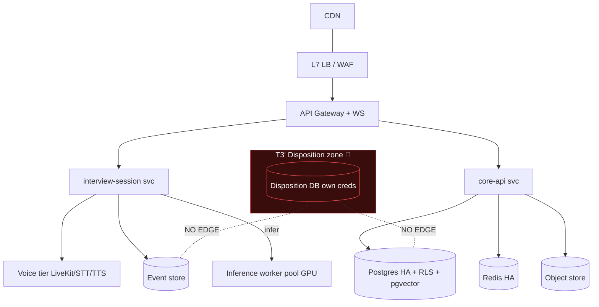

# Chapter 7 — Infrastructure, Cloud Architecture, Scalability, DevOps & Operations

**Part A of B** — request sections §1–12 (executive summary, deployment topology, cloud architecture, Kubernetes architecture, container strategy, CI/CD, environment strategy, IaC, AI infrastructure, voice infrastructure, storage infrastructure, networking). Part B covers §13–24.

> **Status relative to the codebase.** Chapters 1–6 are immutable source documents. Today CogniHire is a **single-process Flutter application** plus one out-of-process **Python FastAPI face-embedding service** (`service/` `[IMPL]`) and **local Ollama** for inference (`[IMPL]`, no API key, no data egress). Persistence is **local files** (Ch4). **There is no cloud account, container, Kubernetes cluster, CI/CD pipeline, IaC, or managed datastore in the repository.** This entire chapter is therefore `[PROP]` except where it describes the existing local shape (`[IMPL]`) or a prior design doc (`[DES]`). A statement without `[IMPL]` is a specification, not running infrastructure.

**Series continuity.** Introduces **ED-68 … ED-80**, **OQ-84 … OQ-96**, **R-77 … R-89**. Prior ranges (Ch1–Ch6) are referenced, never renumbered.

### The three deployment tiers (used throughout this chapter)
Per the explicit guidance not to over-engineer the MVP, every section below is written against **three named targets**, and a control that belongs only to a later tier says so:

| Tier | Name | Shape | When |
|---|---|---|---|
| **T-MVP** | **MVP — single customer, low cost** | One VM (or a tiny managed pair), Docker Compose, managed Postgres, local/embedded everything else. **No Kubernetes, no service mesh, no fleet.** | First real customer / pilot |
| **T-SaaS** | **Production SaaS — multi-tenant** | Managed Kubernetes, horizontal services, managed datastores, the full Ch4/Ch5/Ch6 control set | Multiple tenants, scale-out |
| **T-ENT** | **Enterprise — dedicated / on-prem / air-gapped** | Single-tenant isolated stack, customer-controlled, optionally air-gapped (local Ollama is the enabler) | Regulated / high-security customer |

**ED-68 (the anti-over-engineering decision):** the MVP tier is a **deliberately small, boring, single-node deployment** that runs the *same* application/domain code as T-SaaS but with collapsed infrastructure (one box, Compose, managed Postgres). Kubernetes, mesh, autoscaling, and a service fleet are **T-SaaS concerns introduced only when tenant count or load demands them** — never on day one. **Trade-off:** two operational shapes to maintain (Compose + K8s) vs. shipping a pilot in days for tens of dollars/month rather than standing up a cluster first. The application code is identical across tiers precisely because Chapters 3–6 kept infrastructure out of the domain (pure-Dart `lib/core/**`), so tier is a packaging/deployment choice, not a rewrite.

---

## 1 Executive Summary

### 1.1 Infrastructure philosophy
Five commitments, each traceable to an earlier chapter:

1. **Same code, three tiers.** The domain is infrastructure-agnostic (Ch3–6); tier changes *how it's packaged and run*, not *what it does*. This is what makes "start on one VM, grow to a cluster" real rather than aspirational.
2. **Boring by default, scale on evidence.** Introduce each piece of heavy infrastructure (K8s, mesh, autoscaling, sharding) only when a measured limit is hit (§15 scaling calculations), not speculatively (ED-68).
3. **The safety controls are tier-invariant.** ED-14 isolation, the hash chain, continuous identity verification, "never skip a safety step" (Ch6 ED-66) hold identically on one VM and on a 100-node cluster. Infrastructure may not weaken a Chapter-6 guarantee to save cost or complexity.
4. **Air-gap-capable by construction.** Because inference is local Ollama with no external API (`[IMPL]`), a fully offline Enterprise deployment is *possible* — a rare property that becomes a selling point for regulated buyers (§2.5).
5. **Everything reproducible.** IaC + GitOps (§8); no click-ops in T-SaaS/T-ENT; the MVP may bootstrap by script but converges to the same IaC.

### 1.2 Why operational architecture is separate from application architecture
Chapters 1–6 answered *what the system is and guarantees*; this chapter answers *how it runs, scales, and recovers*. Keeping them separate matters because:

- **Different rate of change.** The domain model changes with product; the infrastructure changes with load, cost, and compliance geography — on different clocks and owned by different roles (SRE/platform vs. backend/domain).
- **Tier independence.** The *same* application must run as T-MVP, T-SaaS, and T-ENT. If operational concerns leaked into the domain (as they deliberately did not — `lib/core/**` is pure Dart), a new tier would be a rewrite. Because they didn't, a tier is a deployment manifest.
- **Guarantee preservation.** The security/privacy guarantees are defined at the application/data layer (Ch4/Ch6); infrastructure's job is to *not break them* and to *enforce the ones that are physical* (network segmentation for ED-14, residency zoning). Mixing the two invites an infra shortcut that silently voids a product promise.

---

## 2 Deployment Topology

For each: Purpose · Advantages · Limitations · Migration path.

### 2.1 Local Development `[IMPL]`-ish
- **Purpose:** run the whole thing on a laptop — today literally the Flutter app + `service/` + local Ollama.
- **Advantages:** zero cloud cost; fast loop; offline; matches the air-gap posture.
- **Limitations:** single user; file persistence; no multi-tenancy exercised.
- **Migration path:** Docker Compose file that stands up Postgres + object store (MinIO) + the services locally, so dev matches T-MVP topology.

### 2.2 T-MVP — Single Organization (single customer, low cost) `[PROP]`
- **Purpose:** first paying pilot; one tenant; minimal spend.
- **Shape:** **one VM** (or a small managed app + managed Postgres) running **Docker Compose**: the API/backend process(es), the face service, Ollama (CPU or a single modest GPU), Postgres (managed), Redis (single), MinIO or managed object storage, Caddy/nginx as gateway+TLS. pgvector in the same Postgres (Ch4 §13). No K8s.
- **Advantages:** ~tens of USD/month `[EST]`; deployable in days; one thing to operate; still runs the full domain + safety controls.
- **Limitations:** vertical scaling only; single-AZ (availability gap); manual failover; not for many tenants.
- **Migration path → T-SaaS:** containers are already the unit; move Compose services into K8s Deployments (§4), swap single Postgres/Redis for managed HA, externalise secrets to a manager. **No application change** — the code is tier-agnostic (ED-68).

### 2.3 T-SaaS — Multi-Tenant `[PROP]`
- **Purpose:** many tenants on shared infrastructure with the full Ch4/§4.2 shared-schema-RLS isolation + per-tenant crypto keys.
- **Shape:** managed Kubernetes (§4), horizontal stateless services behind a gateway, managed Postgres (HA + read replicas), managed Redis, object storage, an inference worker pool, a voice tier, observability stack. Regional clusters for residency (Ch4 §19, Ch6 §14).
- **Advantages:** elastic; multi-AZ HA; per-tenant isolation without per-tenant infra; cost amortised.
- **Limitations:** operational complexity; noisy-neighbour risk (mitigated by rate limits Ch5 §17 + resource quotas); shared blast radius (mitigated by RLS + crypto isolation).
- **Migration path → T-ENT:** deploy the same Helm chart into a single-tenant isolated cluster/account.

### 2.4 T-ENT — Enterprise Dedicated `[PROP]`
- **Purpose:** a regulated/high-security customer needing isolation, their own cloud account/region, or on-prem.
- **Shape:** the T-SaaS chart in a **single-tenant** cluster; tenancy collapses to one, so `tenant_id`/RLS still work but the whole stack is physically theirs; optional customer-managed keys (BYOK) into their KMS.
- **Advantages:** strongest isolation; customer data-residency/compliance control; per-tenant key custody.
- **Limitations:** highest per-customer ops cost; upgrade fan-out (N clusters); support complexity.
- **Migration path:** from T-SaaS by dedicating a cluster; toward T-AirGap by cutting external egress.

### 2.5 Air-Gapped Deployment `[PROP]` (a special case of T-ENT)
- **Purpose:** no-internet environments (gov, defence, some finance).
- **Advantages:** **enabled by the local-Ollama, no-API-key inference posture (`[IMPL]`)** — the one hard blocker (a cloud LLM dependency) does not exist. Notifications degrade to internal-only; external anchoring (Ch6 ED-59) uses an internal notary.
- **Limitations:** no managed services (self-host Postgres/Redis/object store); no external IdP unless the customer runs one; updates are offline bundles; external tamper-anchoring must be internalised (weaker than a public transparency log — **R-77**, documented not hidden).
- **Migration path:** offline artefact bundles (signed, SBOM'd) imported through a data diode; model artefacts pinned by digest.

> **Contradiction watch (not silently resolved).** Ch6 §10.4/ED-59 recommends **external** anchoring of the hash-chain head to defeat a full-file rewrite. In an **air-gapped** deployment there is by definition no external notary. This chapter does **not** pretend the guarantee is identical: air-gapped anchoring is *internal* (a separate append-only host / signed checkpoints on removable media), which is weaker against a sufficiently-privileged internal attacker. This is flagged as **R-77** and **OQ-84**, not resolved silently.

---

## 3 Cloud Architecture

### 3.1 Component map by tier
| Component | T-MVP | T-SaaS | T-ENT |
|---|---|---|---|
| **API Gateway** | Caddy/nginx (TLS, routing) | managed API GW or Envoy/Kong (OQ-65) | same as SaaS, single-tenant |
| **Load Balancer** | none (single node) | cloud L7 LB | cloud/on-prem LB |
| **CDN** | optional (static assets) | CDN for web/static + signed URLs for exports | optional / internal |
| **Compute** | 1 VM | K8s node pools | dedicated cluster |
| **Containers** | Docker Compose | K8s Deployments | K8s Deployments |
| **AI workers** | Ollama on the box (CPU/1 GPU) | inference worker pool (GPU node pool) | on-prem GPU or CPU |
| **Voice workers** | optional/off | LiveKit + STT/TTS tier (§10) | on-prem media |
| **Databases** | 1 managed Postgres (+pgvector) | HA Postgres + replicas; separate **disposition DB** 🔴 | same, single-tenant |
| **Redis** | single | managed HA/cluster | self-host/managed |
| **Object storage** | MinIO/managed bucket | managed S3-compatible | on-prem S3-compatible |
| **Vector store** | pgvector in Postgres | pgvector (→ dedicated at scale, OQ-45) | pgvector |
| **Search** | Postgres FTS | Postgres FTS → OpenSearch (OQ-45) | Postgres FTS |
| **Analytics** | off / tiny | warehouse (outcome-free, Ch4 §22) | optional |
| **Secrets manager** | env-injected from a file (still not in repo) | cloud secret manager + KMS | customer KMS/BYOK |
| **Monitoring/Logging** | container logs + uptime check | full stack (§13) | full stack, self-host option |
| **Backup** | Postgres snapshot + bucket versioning | PITR + cross-region (§19) | customer-controlled |

### 3.2 T-SaaS reference diagram (ASCII)
```
                 Internet (candidates, recruiters)
                          │ TLS 1.3
                   ┌──────▼───────┐   CDN (static + signed export URLs)
                   │  L7 LB / WAF │
                   └──────┬───────┘
                   ┌──────▼───────────────────────┐  T1 edge
                   │ API Gateway + WS terminator   │  authN, tenant-from-token, rate-limit
                   └──────┬───────────────────────┘
        ┌─────────────────┼─────────────────────────────┐  T2 (K8s, stateless)
        ▼                 ▼                               ▼
  ┌───────────┐   ┌────────────────┐              ┌──────────────┐
  │ core-api  │   │ interview-      │  infer()     │ inference    │  GPU node pool
  │ (BC 01-05,│──▶│ session (WS,    │─────────────▶│ workers      │  (Ollama/vLLM)
  │  11,12,14)│   │ event append)  │              │ (pool, §9)   │
  └─────┬─────┘   └───────┬────────┘              └──────────────┘
        │                 │ events (outbox→bus)          │
        ▼                 ▼                               ▼
  ┌──────────────────────────────────┐            ┌──────────────┐
  │ T3 data plane                    │            │ voice tier    │ (§10)
  │ Postgres(HA,RLS,pgvector) · Redis│            │ LiveKit/STT/TTS│
  │ Object store · Event store       │            └──────────────┘
  │ KMS (per-tenant keys)            │
  └──────────────────────────────────┘
  ┌──────────────────────────────────┐  T3' SEPARATE (ED-14 🔴)
  │ disposition DB (own creds/segment)│  no route from evidence plane
  └──────────────────────────────────┘
```

### 3.3 Mermaid (T-SaaS)


---

## 4 Kubernetes Architecture (T-SaaS / T-ENT only)

> **Not used in T-MVP** (ED-68). This section applies once tenant count/load justifies a cluster.

| Concern | Design |
|---|---|
| **Namespaces** | `edge` (gateway/WS), `app` (stateless services), `ai` (inference workers), `voice`, `data` (operators/proxies), **`disposition` (separate namespace + NetworkPolicy denying app↔disposition, ED-14)**, `observability`, `system` |
| **Deployments** | all stateless services (core-api, interview-session, projections, notification) — HPA-scaled |
| **StatefulSets** | only where a managed service isn't used (self-hosted Postgres/Redis in T-ENT/air-gap); in T-SaaS prefer managed datastores over in-cluster state |
| **DaemonSets** | node-level agents: log shipper, metrics exporter, security agent |
| **Ingress** | gateway behind cloud LB; WS ingress with sticky/long-lived connections; TLS termination at edge, mTLS inside (mesh) |
| **Autoscaling** | HPA on CPU + custom metrics (queue depth, concurrent sessions); **inference pool scales on GPU utilisation + queue latency**, not CPU (§9) |
| **Node pools** | `general` (services), `gpu` (inference — tainted), `memory` (Postgres/vector if in-cluster) |
| **Affinity** | interview-session anti-affinity across AZs; inference pods on `gpu` pool; **disposition workloads scheduled to nodes with no evidence-plane workload** (defence-in-depth for ED-14) |
| **Taints/tolerations** | `gpu=true:NoSchedule` on GPU pool so only inference tolerates it (cost control) |

**ED-69:** the **disposition context gets its own namespace + NetworkPolicy + node scheduling separation**, so ED-14 is enforced at the orchestration layer, not just the network (Ch6 ED-62's fourth fence made concrete in K8s). **Trade-off:** more manifests + a small scheduling inefficiency vs. a cluster-level guarantee that no evidence pod can even reach a disposition pod.

---

## 5 Container Strategy

| Aspect | Design | Tag |
|---|---|---|
| **Docker images** | one image per service; multi-stage builds; Dart AOT for backend, slim Python for the face service | `[PROP]` |
| **Base images** | distroless/minimal (no shell in prod images) to shrink attack surface | `[PROP]` |
| **Security** | non-root user, read-only root FS, dropped capabilities, no secrets baked in (Ch6 ED-56) | `[PROP]` |
| **Image signing** | cosign/Sigstore; deploy admits only signed images (Ch6 ED-61) | `[PROP]` |
| **SBOM** | CycloneDX per image, stored with the artefact, scanned for CVEs in CI (Ch6 §12) | `[PROP]` |
| **Model images** | Ollama model pinned by **digest**; verified before serving (Ch6 §12) | `[IMPL]` posture / `[PROP]` enforce |

**ED-70:** production images are **distroless, non-root, read-only-root, signed, SBOM-attested**; the deploy gate rejects anything failing these (fail-closed). Applies to T-SaaS/T-ENT; T-MVP uses the same images (just fewer of them).

---

## 6 CI/CD Pipeline

```
 feature branch ──PR──▶ [ validate ] ──merge──▶ [ build ] ──▶ [ deploy staging ]
                          │                        │                │
   analyze/lint ──────────┤   unit + widget tests  │  sign + SBOM   │  smoke + contract
   guardrail linters ─────┤   integration tests    │  image push    │  DAST
   (ED-45/ED-46) ─────────┤   contract tests       │                ▼
   secret scan ───────────┤   security scans (SAST)│         [ approval gate ]
   SBOM/CVE ──────────────┘                        │                │ (manual for prod)
                                                    │                ▼
                                                    └────────▶ [ deploy prod: canary→full ]
                                                                     │ rollback on SLO breach
```

| Stage | Detail | Tag |
|---|---|---|
| **Branch strategy** | trunk-based + short-lived feature branches; protected `main` (the repo already lives on `main` tracking origin `[IMPL]`) | `[IMPL]`/`[PROP]` |
| **PR validation** | `dart analyze` (clean today `[IMPL]`), format, **guardrail linters as blocking** (vocabulary-ban ED-46, ED-14 schema test ED-45, Ch6 ED-65) | `[PROP]` |
| **Unit + widget tests** | the existing suite (537 tests `[IMPL]`) incl. `screens_widget_test.dart` (added after a green-but-crashing regression — that history mandates widget tests stay in the gate) | `[IMPL]` |
| **Integration tests** | cross-tenant returns 0/404; reconnect-resumes-from-sequence; idempotent replay (Ch5 §20) | `[PROP]` |
| **Contract tests** | provider verifies OpenAPI/AsyncAPI; consumer-driven (Ch5 §20) | `[PROP]` |
| **Security scans** | SAST, secret scan, dependency CVE (Ch6 §18) | `[PROP]` |
| **SBOM + signing** | generate SBOM, sign image (Ch6 ED-61) | `[PROP]` |
| **Deployment approvals** | staging auto; **prod requires manual approval**; **DB migrations gated + ordered** (Ch4 §17, and Ch4 R-34: M5-before-M3 orphans enrolments — migration order is a release-gate check) | `[PROP]` |
| **Rollback** | image rollback instant; **schema rollback via expand/contract** (never destructive); **read models rebuilt not rolled back** (Ch4 ED-39); **events never rolled back** (append-only) | `[PROP]` |

**ED-71:** the CI gate treats the **product-guarantee regression tests as release-blocking** (Ch6 ED-65) — a red guardrail linter or a broken-hash-chain test fails the build. This is the mechanism by which every earlier chapter's promise stays true release-over-release. **R-78:** a rushed hotfix bypassing the gate could reintroduce a score/disposition leak — mitigated by making the guardrails un-skippable (no `--no-verify` path in prod deploy) and requiring the same gate for hotfix branches.

---

## 7 Environment Strategy

| Env | Purpose | Tier mapping | Data |
|---|---|---|---|
| **Development** | local loop | Local/Compose | synthetic only |
| **Testing/CI** | automated gates | ephemeral | synthetic; **never real candidate data** |
| **Staging** | pre-prod, prod-like | mini T-SaaS | synthetic or de-identified; **no real biometrics** |
| **Production** | live | T-MVP → T-SaaS → T-ENT | real, full controls |
| **Preview** | per-PR ephemeral | namespace/Compose | synthetic |
| **Disaster Recovery** | standby | cross-region replica (§19) | replicated prod (encrypted) |

**ED-72:** **no real candidate PII or biometrics in any non-production environment** — staging/preview use synthetic or de-identified data. This is a privacy control (Ch6 §8) at the environment layer; a "copy prod to staging to debug" habit would be an Art. 9 exposure. **R-79** tracks it. **Trade-off:** harder to reproduce prod-only bugs vs. no special-category data sprawl; mitigated by de-identified fixtures + the ability to replay *synthetic* event streams.

---

## 8 Infrastructure as Code

| Layer | Tool | Scope | Tag |
|---|---|---|---|
| **Cloud resources** | **Terraform** | VPC, clusters, managed Postgres/Redis, buckets, KMS, IAM, DNS | `[PROP]` |
| **App deployment** | **Helm** | services, HPA, NetworkPolicies (incl. the ED-14/ED-69 deny), ingress | `[PROP]` |
| **GitOps** | Argo CD / Flux | declarative sync from a config repo; drift detection | `[PROP]` |
| **Secrets** | secret manager + external-secrets operator | **never in Git**; sealed/external refs only (Ch6 ED-56) | `[PROP]` |
| **Configuration** | per-tier values files (T-MVP/T-SaaS/T-ENT) | one chart, three value sets | `[PROP]` |

**ED-73:** **one Helm chart, three value files** (mvp/saas/ent) — the tiers differ by configuration, not by divergent manifests, so a security fix (e.g. the ED-14 NetworkPolicy) lands in all tiers at once. **Trade-off:** the chart carries conditional complexity vs. three drifting infra codebases. GitOps means the **ED-14 network deny rule is version-controlled with a policy test** (Ch6 R-72) — a human can't quietly open the route.

---

## 9 AI Infrastructure

| Concern | T-MVP | T-SaaS / T-ENT |
|---|---|---|
| **Inference Gateway** | in-process ACL → local Ollama `[IMPL]` | ACL → inference **worker pool** (ED-16 topology-agnostic port makes this swap invisible to callers) |
| **Model workers** | Ollama on the box | pooled GPU workers (Ollama/vLLM); horizontally scaled |
| **GPU scheduling** | 1 GPU or CPU | tainted GPU node pool; workers scale on **GPU util + queue latency** |
| **Model versioning** | `model_version` digest `[IMPL]` flag | registry + digest-verified load (Ch6 §12) |
| **Fallback strategy** | `DeterministicFallbackAdapter` `[IMPL]` | same; fallback for **non-evidential** text only — **never** to fabricate identity/answer (Ch5 ED-48, Ch6) |
| **Model rollout / canary** | manual | canary a new model to a small % of *non-evidential* traffic; compare latency/quality; **shadow re-embed** for embeddings (Ch4 ED-36) |
| **A/B testing** | n/a | A/B allowed on planner phrasing/latency; **never A/B a scoring model** (there is none, Ch1) and **never** on the identity-verification threshold without explicit governance |

**ED-74:** the **Inference Gateway ACL (Ch3 ED-16) is what lets AI infrastructure evolve (local → pool → canary) without touching domain code** — callers hold a port, not a provider. **Warm-up is a scheduling constraint, not just app logic:** the pool keeps warm workers so a live session never hits the 40s cold-start (memory: warm 2.2s vs cold 40s `[IMPL]`); a cold request is a 503 + queue, never a hang (Ch5 R-55). **R-80:** GPU capacity shortfall under burst could stall interviews — mitigated by queue + backpressure that **slows but never skips** identity checks (Ch6 ED-66/Ch5 ED-51), autoscaling the GPU pool, and the deterministic fallback for non-evidential paths. **OQ-85:** self-host GPU vs. managed GPU inference for T-SaaS cost/latency.

**Scaling calc `[EST]`:** Ch1 §11.2 targets ~15 generations/s and ~45 embeddings/s at ~900 concurrent sessions. If one GPU worker sustains ~5 generations/s `[EST]`, generation needs ~3 warm GPU workers + headroom (~4–5); embeddings are cheaper/batchable. This is modest — a handful of GPUs, not a farm — reinforcing that the MVP can run inference on a single GPU and only T-SaaS needs a pool.

---

## 10 Voice Infrastructure

> Voice is **optional and gated by OQ-44 (is audio even retained?) and OQ-64 (provider)** — not confirmed in V1 scope (Ch2 kept interviews text+telemetry-first). This section is contingent `[PROP]`.

| Component | Design |
|---|---|
| **LiveKit** (or equivalent SFU) | media transport for the live interview WS (Ch5 §10) if real-time audio is adopted |
| **STT** | streaming provider behind the Voice port; partial→final transcript (Ch5 §11) |
| **TTS** | streamed synthesis; first-audio-byte ≤400ms `[EST]` |
| **TURN/STUN** | NAT traversal for WebRTC media |
| **Scaling** | media workers scale on concurrent sessions; separate node pool (CPU-heavy) |
| **Latency** | STT partial ≤300ms, end-to-end turn ≤1.5s `[EST]` (Ch5 §11) |

**ED-75:** voice infrastructure is **deferred and provider-abstracted** — the Voice port (Ch5 §11) means adopting/declining voice, or swapping local vs cloud STT/TTS, is a config choice. **Air-gap/on-prem caveat:** cloud STT/TTS breaks air-gap and sends candidate audio off-box — so T-ENT/air-gap requires **local** STT/TTS or text-only, interacting with the biometric/PII posture (Ch6 §8). **R-81:** cloud voice would create a PII-egress channel the local-inference posture otherwise avoids — gated by OQ-78/OQ-64.

---

## 11 Storage Infrastructure

| Store | T-MVP | T-SaaS / T-ENT | Backup |
|---|---|---|---|
| **Postgres** (master + events + read + pgvector) | 1 managed instance | HA primary + read replicas; partitioned event tables (Ch4 §8.5/§19) | PITR (WAL) + nightly base (§19) |
| **Disposition Postgres** 🔴 | **separate small instance** (still isolated even at MVP — ED-14 is tier-invariant) | separate HA instance, separate creds/segment | **independent** backup (never joint) |
| **Redis** | single | managed HA/cluster | ephemeral — reconstructable (Ch4 ED-37), not backed up as truth |
| **Object storage** | MinIO/managed bucket | managed S3-compatible, versioned, cross-region | versioning + replication |
| **Vector DB** | pgvector in Postgres | pgvector (→ dedicated at scale) | re-embeddable (Ch4 §13), not primary-backed |
| **Analytics** | off/minimal | columnar warehouse (outcome-free, Ch4 §22) | standard |

**ED-76 (tier-invariant isolation):** even in **T-MVP**, the **disposition store is a physically separate database** (a second small Postgres/schema-with-separate-credential), because ED-14 cannot be "added later" without a migration that reintroduces the very join it forbids. **Trade-off:** a second tiny DB at MVP (marginal cost) vs. a T-SaaS-time migration that would risk the boundary. This is the one place the MVP is *not* collapsed — isolation is not an optimisation to defer.

---

## 12 Networking

| Concern | T-MVP | T-SaaS / T-ENT |
|---|---|---|
| **VPC** | single VPC/subnet | multi-AZ VPC; public (edge) + private (app/data) subnets |
| **Private networking** | app↔DB on private interface | all T2/T3/T4 private; only edge public (Ch6 §14) |
| **Service mesh** | none (Compose network) | mTLS mesh; identity-based policy; **evidence↔disposition denied at mesh** (Ch6 ED-62, ED-69) |
| **Firewalls / SGs** | host firewall | deny-by-default SGs; **no rule permitting disposition↔evidence** |
| **DNS** | single record | internal service DNS + external per-region |
| **Load balancing** | nginx/Caddy | L7 LB + WS-aware balancing (sticky/long-lived) |
| **Egress control** | outbound allow-list | **no general egress from T2**; only IdP/inference/notification endpoints (Ch6 §14) — the parser/embedder cannot exfiltrate |

**ED-77:** the **ED-14 network deny rule and the T2 egress allow-list are policy-as-code with tests** (Ch6 R-72/R-71), present from T-SaaS onward; T-MVP's single-box firewall achieves the same intent more coarsely, and its migration to T-SaaS **must** carry these rules (a checklist gate, so the boundary isn't lost in the move). **R-82:** collapsing to one box at MVP could tempt running the disposition DB on the same host with shared creds — forbidden (ED-76); it stays a separate DB with a separate credential even co-located.

---

*Part A ends here. Part B covers §13–24: observability, performance engineering, scalability strategy (1→10M interviews with calculations), reliability, cost engineering, operations, disaster recovery, carried-forward infrastructure security, and the chapter's Engineering Decisions / Risks / Open Questions / Engineering Notes.*
