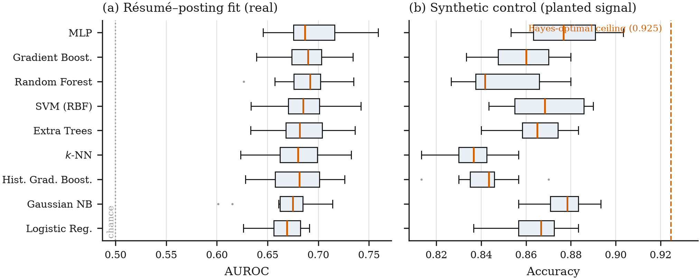
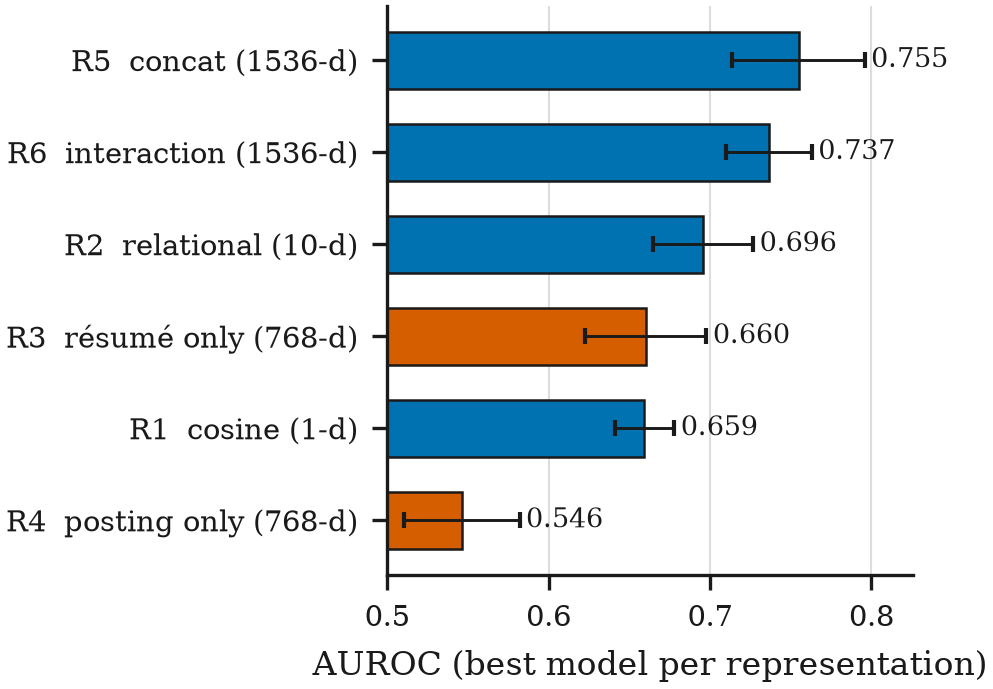
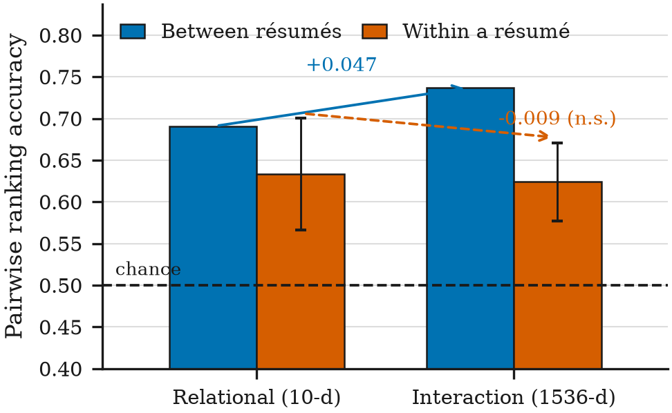
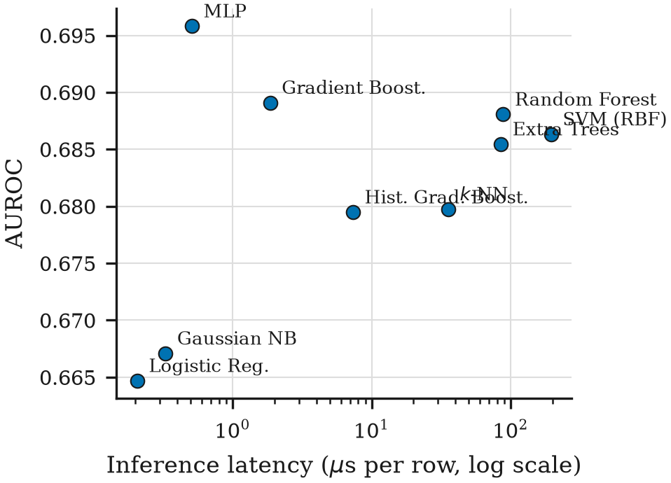
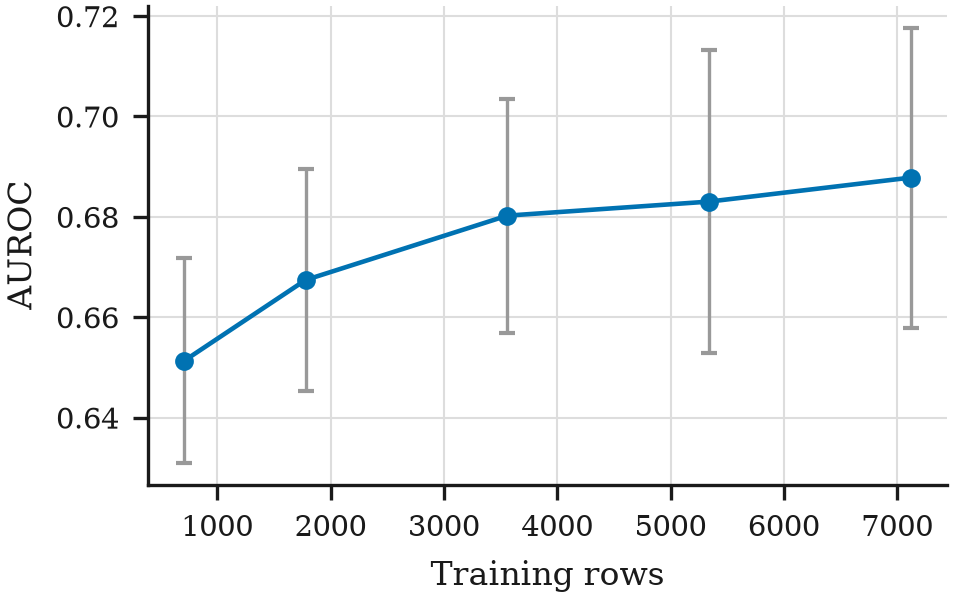

# Nine Algorithms, One Ceiling: A Diagnostic Study of Résumé–Job-Description Fit Prediction

**Devesh S V**
Department of Computer Science and Engineering
*[institution — to complete]*
`deveshsv.386@gmail.com`

---

## Abstract

Multi-algorithm comparisons are a staple of applied machine learning and are routinely reported
without grouped cross-validation, significance testing, or any check that the benchmark rewards the
capability its name implies. We conduct one carefully on a public résumé–job-description fit
benchmark (7,910 pairs over 643 résumés and 351 postings), and report what the care reveals.

Nine classifiers spanning six model families, evaluated under 10-fold cross-validation grouped by
job posting with per-fold leakage controls, converge into a band 0.031 AUROC wide; after
Holm–Bonferroni correction the leading model is statistically indistinguishable from all four tree
ensembles tested. To establish that this null is informative rather than underpowered, we run the
identical protocol on a synthetic control with a pre-specified generative process and a known Bayes
ceiling, where it separates the same nine models decisively (Friedman *p* = 3.7 × 10⁻⁹, against
6.5 × 10⁻⁶ on the real task).

Changing the representation moves performance roughly twice as far as changing the algorithm. A
probe that never sees the job posting reaches 0.660 AUROC — 87% of the best model's score — which
initially suggested to us that the benchmark's labels were not relational. Two experiments refute
that reading: 80.6% of label variance is within-résumé, and withholding every test résumé from
training does not degrade performance.

What survives is a decoupling. Moving to a 1536-dimensional interaction encoding gains 0.041 pooled
AUROC and 0.047 between-résumé ranking accuracy, while within-résumé ranking — which cancels résumé
identity exactly and therefore isolates matching — changes by −0.009 (*p* = 0.45). The pooled metric
sums two capabilities, ranking candidates and matching candidates to roles, and moved because the
easier one moved.

We propose the within-query ranking statistic as a routine companion to pooled metrics for any
paired benchmark with a recurring entity: it needs no additional labels, costs one pass over
predictions already computed, and has a fixed null of 0.5. For algorithmic hiring it is the
measurement that separates a system that ranks matches from one that ranks people. All code,
per-fold results, and figures accompany this paper (Appendix A).

**Keywords:** model comparison, benchmark critique, data leakage, cross-validation, statistical power, algorithmic hiring, résumé matching, negative results

---

## 1. Introduction

A recurring pattern in applied machine learning is the model bake-off: several classifiers are
trained on one dataset, a table of scores is reported, and the largest number is declared the best
method for the task. The pattern is routine enough that its preconditions are rarely stated, let
alone checked. Three of them matter.

The first is that the evaluation protocol controls the leakage paths the dataset actually contains.
The second is that reported differences exceed what fold-to-fold variation would produce by chance.
The third, and the subject of this paper, is that **the quantity the benchmark rewards is the
quantity the task is named for**.

The third precondition can fail while the first two hold, and it fails quietly. A benchmark may
contain genuine signal, reward genuine learning, and still direct effort somewhere other than the
capability it advertises — because a shortcut is available that the pooled metric cannot
distinguish from the real thing. No amount of care about splits or significance detects this, since
both are computed on the same pooled metric that conflates the two.

We work the problem through on a concrete, publicly available benchmark. The task is
résumé–job-description fit: given a résumé and a job posting, predict whether the pair is a match.
It has obvious commercial application, a public dataset with over a thousand downloads, and the
shape of a problem for which model selection ought to matter.

We first compare nine classifiers spanning six model families under a protocol built to make the
comparison decidable — grouped cross-validation, per-fold leakage controls, non-parametric
significance testing, and measured efficiency. The nine converge into a band roughly three
percentage points of AUROC wide, and after multiplicity correction the leader is statistically
indistinguishable from every tree ensemble in the study. Because a null result of that shape has
two explanations that a table cannot separate — the algorithms genuinely do not differ, or the study
cannot tell — we run the identical protocol on a synthetic task with a pre-specified generative
process and a known noise ceiling. There it separates the same nine models decisively. The null is a
property of the task, not of the study.

Having established that algorithm choice is not the bottleneck, we vary the representation instead,
including two probes constructed so that they *cannot* be matching: one never sees the job posting,
the other never sees the résumé. The one that never sees the posting reaches 87% of the best model's
AUROC.

That result initially suggested to us that the benchmark's labels were not relational at all. **A
direct test refutes it.** Decomposing label variance shows that 80.6% is *within*-résumé — the same
résumé labelled fit for one posting and not for another — and a ranking test restricted to pairs
drawn from a single résumé, which cancels résumé identity exactly, shows models performing well
above chance (0.633, *p* < 10⁻⁶⁵). Genuine matching signal exists, and models capture some of it.

The finding that survives is narrower and, we think, more useful. Moving from ten engineered
features to a 1536-dimensional interaction encoding buys 0.041 AUROC on the pooled metric and 0.047
on between-résumé ranking, while producing **no measurable change in within-résumé matching**
(−0.009, *p* = 0.45). What the pooled metric recorded as a clear improvement was, so far as we can
measure, an improvement at ranking résumés against one another rather than at matching. On this
benchmark, progress up the leaderboard and progress at the task can come apart — and the pooled
metric cannot show you which one you bought.

### 1.1 Contributions

1. **A within-query ranking diagnostic** (§6.4) that separates matching ability from
   entity-level quality on any paired benchmark where one side of the pair recurs. It requires no
   additional labels, costs one pass over existing predictions, and is the only measurement here
   that distinguishes the two capabilities. We argue it should accompany pooled metrics as standard
   practice for matching tasks.

2. **A demonstration that pooled score and matching ability can be decoupled** (§6.3, §6.4): a
   representation change worth +0.041 pooled AUROC delivers no measurable within-query improvement.

3. **A statistically disciplined nine-algorithm comparison** on a public résumé–fit benchmark, using
   grouped cross-validation, per-fold leakage controls, Friedman testing, and Holm-corrected
   pairwise Wilcoxon tests (§5, §6.1). We are not aware of a prior comparison on this dataset that
   reports fold variance or any significance test.

4. **A synthetic positive control establishing the protocol's statistical power** (§5.5, §6.2),
   converting an ambiguous null into an informative one. We argue this should be standard whenever a
   comparison reports no significant difference.

5. **A representation ablation with one-sided probes** (§6.3) quantifying how much of the
   benchmark's score is reachable without seeing one side of the pair at all.

6. **Robustness analyses against the two most natural objections** (§6.5) — that the split still
   permits leakage, and that binarising a three-class label destroyed the relational signal — plus
   the incidental finding that generalising to an unseen *posting* is harder than to an unseen
   *candidate*, which is the condition every new job requisition presents.

7. **Efficiency measurements** (§6.6) showing predictive quality and computational cost are
   decoupled here across three orders of magnitude in inference latency and nearly five in model
   size.

8. **A provenance finding about the benchmark** (§3.2): it is in active use and carries no
   description, licence, citation, or documented labelling procedure.

9. **A survey of the replication landscape** (§3.4) showing that no public résumé–fit corpus
   currently qualifies as an independent replication target — the largest alternative shares 100%
   of its documents with the corpus under study while reporting 0% exact-pair overlap, and the
   genuinely independent ones pair each résumé with exactly one posting. We give the normalisation
   procedure that exposes this class of contamination, which raw-text hashing misses.

We note explicitly that contribution 2 corrects our own initial hypothesis, which the experiment in
§6.4 was designed to test and did not support. We report the sequence because the diagnostic's value
is precisely that it was capable of overturning the conclusion we expected.

All code, per-fold results, and figures accompany this paper; every number in it is reproducible
from a single command per experiment (Appendix A).

---

## 2. Related Work

**Model-comparison critiques.** The closest methodological ancestors of this paper are studies that
re-ran published comparisons under controlled protocols and found the reported progress did not
survive. Ferrari Dacrema, Cremonesi, and Jannach [1] examined eighteen neural recommendation methods
from top-tier venues, could reproduce only seven with reasonable effort, and found six of those seven
were often outperformed by comparably simple heuristic baselines — a result that took the RecSys 2019
best-paper award and reframed a subfield's sense of its own progress. Musgrave,
Belongie, and Lim [2] performed the analogous exercise for deep metric learning and attributed
apparent gains to inconsistent experimental practice rather than to method quality. Our contribution
sits in this tradition but differs in target: rather than showing that a complex method fails to
beat a simple one, we show that on this benchmark *no* method separates from any other, and then
trace why.

**Statistical protocol for comparing classifiers.** Demšar [3] is the standard reference for
comparing multiple classifiers, recommending the Friedman test with post-hoc procedures over
repeated parametric tests, and cautioning specifically against reading a ranking off raw score
differences. We follow that protocol. Nadeau and Bengio [4] show that naive variance estimates over
overlapping cross-validation folds understate variability, so a difference that appears significant
under an uncorrected test frequently is not; we use non-parametric paired tests over folds and apply
Holm–Bonferroni correction for the multiplicity introduced by comparing one model against eight.

**Splits, leakage, and reproducibility.** Gorman and Bedrick [5] showed that system rankings
established on a single standard split of a part-of-speech tagging corpus frequently fail to
reproduce under randomly regenerated splits, and argued that evaluation on one fixed split is
insufficient to support a ranking claim. Kapoor and Narayanan [6] surveyed machine-learning-based
science across seventeen fields, documented leakage affecting 294 papers, and introduced a taxonomy
of eight leakage types; several of their categories — notably the illegitimate inclusion of features
whose availability depends on the split — describe the mechanism we quantify in §6.3 and §6.5. Our
split-scheme comparison is a direct instrument for one such category.

**Tabular models.** Grinsztajn, Oyallon, and Varoquaux [7] benchmarked tree ensembles against neural
architectures across 45 tabular datasets and found tree-based models remained state of the art at
medium sample sizes. Our engineered-feature results are consistent with the weaker version of that
claim — tree ensembles are competitive — but the more relevant observation for this paper is that
the *spread* between families is small enough on our task to be dominated by fold variance, which is
a statement about the task rather than about the models.

**Algorithmic hiring.** Raghavan, Barocas, Kleinberg, and Levy [8] surveyed vendors of algorithmic
pre-employment assessment and examined their bias-mitigation claims, drawing attention to the
consequences of vendors' choices of prediction target. That concern is directly relevant here: if a
system marketed as predicting *fit between a candidate and a role* is in fact predicting a property
of the candidate alone, the choice of prediction target has been misdescribed, and the legal and
ethical analysis that follows from the stated target does not apply to the deployed one. Our §6.4
provides a measurement procedure for detecting exactly that substitution.

---

## 3. The Benchmark

### 3.1 Dataset

We use `cnamuangtoun/resume-job-description-fit`, a publicly hosted dataset of résumé–job-description
pairs with a three-valued fit label. Its composition:

| Split | Rows | Unique postings | Unique résumés | No Fit | Potential Fit | Good Fit |
|---|---|---|---|---|---|---|
| train | 6,241 | 280 | 642 | 3,143 | 1,556 | 1,542 |
| test | 1,759 | 71 | 477 | 857 | 444 | 458 |

The structure that matters is the ratio of rows to unique documents. Eight thousand rows are built
from 643 distinct résumés and 351 distinct postings, so each document appears in many rows. Any
evaluation that does not hold documents out therefore evaluates partly on documents the model has
already seen.

The dataset's own split is by job description: the 71 test postings appear nowhere in training. This
is a deliberate and defensible choice — it tests generalisation to a new posting. It also leaves the
other side entirely unheld: 476 of the 477 test résumés appear in the training split. That asymmetry
is the subject of §6.3 and §6.5.

Labels are internally consistent. Of 7,993 unique (résumé, posting) pairs, only 6 carry conflicting
labels, so annotation noise sets no meaningful ceiling. 141 of 643 résumés (21.9%) carry an
invariant label across every posting they appear with; the remaining 78% vary, which means the label
is *not* a pure function of the résumé and there is, in principle, relational structure to learn.

### 3.2 Provenance

The dataset card carries no description, no licence, no citation, and no statement of how the labels
were produced. The metadata record shows creation in July 2024, 1,304 downloads and 80 likes at time
of writing, and no `cardData` fields beyond automatically inferred format tags.

We report this because it bears on interpretation. Without a documented labelling procedure it is
not possible to say whether the labels were assigned by human annotators, derived from an
application-outcome proxy, or generated by a model — and those three possibilities imply very
different things about what a classifier trained on them has learned. A benchmark with a thousand
downloads and no provenance statement is itself a finding about evaluation practice.

### 3.3 Task formulation

We binarise `{Good Fit, Potential Fit} → positive` and `{No Fit} → negative`, matching the binary
match/no-match decision a screening system actually makes, and balance classes by downsampling so
that 50% is the exact random baseline and accuracy is directly interpretable. This yields **7,910
rows across 643 résumés and 351 postings at a positive rate of 0.500**.

Binarisation is a modelling choice that could in principle destroy relational signal by collapsing
the fuzzy middle class into the positive one. §6.5 tests that directly.

### 3.4 The absence of an independent replication corpus

We attempted to replicate these results on a second benchmark and could not. The reason is itself a
finding about the field, so we report the search rather than omit it.

We screened six publicly hosted résumé–fit datasets against three requirements: **independence** from
the corpus under study; **recurring entities**, meaning a résumé that appears with several postings
carrying at least one positive and one negative label, without which the diagnostic of §6.4 is
structurally impossible; and a **binarisable fit label**.

| Candidate | Rows | Independent | Recurring entities | Outcome |
|---|---|---|---|---|
| `med2425/resume-job-fit-merged-v1` | 93,733 | **no** — 100% document overlap | yes | contaminated |
| `0xnbk/resume-ats-score-v1-en` | — | **no** — card states derivation | — | derivative |
| `batuhanmtl/job_resume_fit` | 2,385 | yes | **no** — 1:1 pairing | unusable |
| `OlaniyanIsrael/job_resume_fit` | 2,385 | yes | **no** — identical to the above | unusable |
| `aswindhanasekar/job_resume_fit` | 2,385 | yes | **no** — identical to the above | unusable |
| `netsol/resume-score-details` | 1,031 | — | — | fails to load |
| `nonameee12233/job-resume-matching` | 9,544 | — | — | fails to load |

None satisfied all three.

**The largest alternative is the same corpus wearing different labels.**
`med2425/resume-job-fit-merged-v1` passes an exact-hash contamination check and fails a normalised
one. After lower-casing, stripping punctuation, and collapsing whitespace, **100% of its résumés and
100% of its postings are present in the corpus under study** — 640 résumés and 280 postings in its
train split, 476 and 71 in its test split, matching the original's two splits exactly. Its own
`source` column reads `generated_smart` for train and `synthetic_test` for test. It is the original's
documents, re-paired combinatorially into 39,989 new pairs, with machine-generated labels. Exact-pair
overlap reads 0% precisely because the pairings are new; the documents are not.
`0xnbk/resume-ats-score-v1-en` states on its card that it is derived from the same source.

**The genuinely independent candidates cannot support the measurement.** The three `job_resume_fit`
datasets are byte-identical triplicates of one another and share no documents with the corpus under
study. But they pair 2,383 unique résumés with 23 unique postings across 2,383 unique pairs: **every
résumé appears exactly once, and no résumé is paired with two postings.** Within-résumé variance is
therefore identically zero, and the within-query statistic is not merely weak on this corpus but
undefined. Their label is a continuous AI-generated match score rather than a human fit judgement.

Two consequences follow.

First, the single-dataset limitation recorded in §8 is not a matter of effort. The public ecosystem
does not currently offer a second corpus meeting the requirements, and we would rather say so than
replicate on a derivative and present it as independent confirmation.

Second, and more consequential for the field: a benchmark whose most-downloaded derivatives
regenerate its labels by model and re-pair its documents combinatorially is a benchmark whose
apparent diversity is illusory. Work reporting evaluation across "several résumé-fit datasets" may be
evaluating repeatedly on one, and the standard dataset-card metadata gives no warning of it. This
compounds the provenance problem of §3.2: undocumented corpora beget undocumented derivatives.

**A methodological note for anyone running such an audit.** Our exact-hash contamination check
reported the contaminated corpus as clean, and only normalised matching — lower-cased, punctuation
stripped, whitespace collapsed — exposed the overlap. A re-upload that alters whitespace or encoding
defeats raw-text hashing entirely. Contamination audits should normalise before hashing, and should
compare entity sets rather than only pair sets, since re-pairing the same documents preserves
document overlap while destroying pair overlap.

---

## 4. Representations

All representations are computed from the same source texts and the same encoder. Documents are
embedded with `nomic-embed-text` (768-d) served locally; embeddings are cached by content hash, so
the ~1,470 unique documents are embedded once and every experiment reuses them. Texts are truncated
to 2,000 characters for embedding; token-level features read the untruncated text.

| ID | Representation | Dim | Sees résumé | Sees posting |
|---|---|---|---|---|
| R0 | Fixed cosine ≥ 0.5 threshold (no learning) | — | via cosine | via cosine |
| R1 | Embedding cosine similarity | 1 | via cosine | via cosine |
| R2 | Engineered relational features | 10 | relationally | relationally |
| R3 | Résumé embedding | 768 | **fully** | **never** |
| R4 | Posting embedding | 768 | **never** | **fully** |
| R5 | Concatenation `[r ; j]` | 1536 | fully | fully |
| R6 | Interaction `[ abs(r − j) ; r ⊙ j ]` | 1536 | partially | partially |

**R2**, the engineered set, is the representation a practitioner would build. Every one of its ten
features is *relational* — computed between the résumé and the posting, never from either alone —
which is a deliberate accuracy sacrifice made to prevent the model from scoring well by recognising
résumés. The features are: embedding cosine; token Jaccard; IDF-weighted coverage of the posting's
terms by the résumé; unweighted posting-term coverage; rare-term overlap (restricted to terms with
IDF > 3.0); signed seniority gap and a known-flag; signed years-of-experience gap and a known-flag;
and résumé-to-posting length ratio. IDF statistics are fitted on each fold's training rows only.

**R3 and R4 are the load-bearing probes.** A model given only the résumé embedding cannot be
performing matching, because it has no access to the thing being matched against; whatever it
achieves is attributable to résumé identity and résumé-level properties alone. R4 is its mirror.
Their *asymmetry* is more informative than either number alone.

**R5 and R6** test whether the engineered features are simply too impoverished. R6 is the standard
sentence-pair encoding used for relational tasks and carries far more information than a single
cosine.

---

## 5. Experimental Protocol

### 5.1 Cross-validation and leakage control

All experiments use **10-fold `GroupKFold` grouped by job description**, so every fold's test
postings are absent from that fold's training data. This preserves the dataset's own intended
generalisation target while replacing its single split with ten, yielding a distribution of scores
per model rather than one number.

Two quantities are fitted **inside each fold on training rows only**: the IDF corpus statistics used
by R2, and the feature scaler. Fitting either over the pooled corpus would leak the test fold's term
distribution into training. Identical fold assignments are reused across every representation and
model, so all comparisons are paired.

### 5.2 Models

Nine classifiers spanning six families, at fixed modest hyper-parameters with no per-model tuning
budget. Tuning one model harder than another converts an algorithm comparison into a comparison of
tuning effort; a nested search within the cross-validation would be the alternative, and we note in
§8 what its absence does and does not threaten.

| Family | Models |
|---|---|
| Linear | Logistic regression (L2, C=1) |
| Probabilistic | Gaussian naive Bayes |
| Instance-based | *k*-nearest neighbours (k=25, distance-weighted) |
| Kernel | SVM with RBF kernel (C=2, γ=scale) |
| Bagging ensemble | Random forest (400 trees, depth 12); extra trees (400, depth 16) |
| Boosting ensemble | Gradient boosting (300, lr 0.05); histogram gradient boosting (400 iters) |
| Neural | Multi-layer perceptron (64–32, early stopping) |

Scale-sensitive models (linear, naive Bayes, *k*-NN, SVM, MLP) receive standardised features; tree
ensembles receive raw features, since they are scale-invariant and standardising them would compare
preprocessing rather than algorithms.

### 5.3 Metrics

Per fold we record AUROC, accuracy, macro F1, Brier score, log loss, and expected calibration error
over ten equal-width bins. AUROC is the primary metric: it is threshold-free and insensitive to the
class balance we imposed. Calibration is reported because an advisory screening system's
probabilities matter as much as its ranking, and because a model can rank well while being badly
miscalibrated. AUROC is reported as undefined rather than as 0.5 when a fold contains a single
class, since with no negatives (or no positives) there is no ranking to score and a plausible-looking
number would be worse than none.

### 5.4 Statistical testing

We apply the Demšar protocol [3]. The Friedman test over per-fold scores asks whether the nine
models differ at all. Where it rejects, we compare the top-ranked model against each of the other
eight with a paired Wilcoxon signed-rank test over the ten folds and apply **Holm–Bonferroni**
correction for the eight comparisons. We report adjusted *p*-values, and we treat a non-significant
difference as non-significant rather than as a ranking.

### 5.5 The positive control

A comparison that finds no difference is uninformative unless the protocol can be shown to detect a
difference when one exists. We therefore construct a synthetic task and run it through the identical
protocol — same ten-fold grouped scheme, same nine models, same metrics, same code path.

The generative process is specified in advance and fully disclosed. Twelve features are drawn i.i.d.
from *U*(−1, 1); eight carry linear weights **[1.8, −1.6, 1.4, −1.2, 1.0, −0.9, 0.8, −0.7]**; an
interaction term contributes 1.2·*x*₁*x*₃ and a quadratic term 1.1·(*x*₅² − ⅓), so that models
capable of representing non-linear structure have something to find; four features carry weight
exactly zero, so that a model's ability to ignore irrelevant inputs is exercised. Labels are
thresholded at *p* ≥ 0.5 and then **flipped with probability 0.07**, which imposes a known
Bayes-optimal accuracy. Rows are assigned to 40 synthetic groups so the grouped splitter has
something to separate.

**This synthetic task is not a résumé task and its scores are not résumé-screening performance.** It
exists solely to characterise the protocol's power, and every artifact it writes is flagged
`isSynthetic: true` and `notRealWorldPerformance: true` so the numbers cannot be lifted out of
context. Its role in this paper is the same as that of a positive control in an assay: an
instrument that reports nothing must be shown capable of reporting something.

### 5.6 Efficiency

For every model and fold we record wall-clock fit time, per-row inference latency, and serialised
model size in kilobytes. Reporting these alongside accuracy is what allows the conclusion in §6.6,
which is not a statement about accuracy at all.

---

## 6. Results

### 6.1 Nine algorithms converge

**Figure 1.** Per-fold distributions over ten grouped folds. **(a)** The nine models on the real
résumé–posting task; boxes overlap almost completely. **(b)** The same nine models, same folds, same
code path, on the synthetic control with planted signal, against its Bayes-optimal ceiling. Models
appear in the same order in both panels — the order of panel (a) — so vertical position is
comparable across panels. The contrast between the panels is the paper's power analysis: an
instrument that reports no difference in (a) is shown in (b) to be capable of reporting one.

Table 1 reports mean ± standard deviation over the ten grouped folds, ranked by AUROC.

**Table 1.** Nine classifiers on résumé–posting fit, 10-fold `GroupKFold` by posting, engineered
relational features (R2). Efficiency columns are per-fold means.

| Model | AUROC | Accuracy | Macro F1 | ECE | Fit (s) | Latency (µs/row) | Size (KB) |
|---|---|---|---|---|---|---|---|
| MLP | **0.696 ± 0.031** | 0.634 ± 0.021 | 0.658 ± 0.038 | 0.057 | 0.44 | 0.5 | 74.7 |
| Gradient boosting | 0.689 ± 0.028 | **0.636 ± 0.024** | 0.655 ± 0.041 | 0.047 | 2.44 | 1.9 | 393.3 |
| Random forest | 0.688 ± 0.030 | 0.628 ± 0.026 | 0.647 ± 0.042 | 0.047 | 0.59 | 88.2 | 24,732.6 |
| SVM (RBF) | 0.686 ± 0.028 | 0.635 ± 0.023 | 0.651 ± 0.039 | 0.053 | 4.64 | 195.0 | 526.8 |
| Extra trees | 0.685 ± 0.030 | 0.632 ± 0.026 | 0.641 ± 0.044 | **0.046** | 0.39 | 84.9 | 63,415.9 |
| *k*-NN | 0.680 ± 0.031 | 0.628 ± 0.029 | 0.639 ± 0.041 | 0.057 | 0.01 | 35.5 | 1,272.8 |
| Hist. gradient boosting | 0.679 ± 0.029 | 0.626 ± 0.020 | 0.643 ± 0.037 | 0.057 | 0.41 | 7.3 | 591.8 |
| Gaussian NB | 0.667 ± 0.033 | 0.620 ± 0.027 | 0.633 ± 0.051 | 0.117 | 0.00 | 0.3 | 1.1 |
| Logistic regression | 0.665 ± 0.022 | 0.616 ± 0.020 | 0.637 ± 0.042 | 0.052 | 0.01 | 0.2 | **0.9** |
| *Fixed-threshold baseline* | — | *0.513 ± 0.028* | — | — | — | — | — |

The nine span 0.031 AUROC from best to worst. Every model's standard deviation across folds is of
the same order as that entire spread — the weakest model's fold-to-fold variation (±0.022) is
comparable to its distance from the strongest (0.031).

The Friedman test rejects the hypothesis that all nine perform identically
(χ² = 38.35, *p* = 6.5 × 10⁻⁶), so the models are not interchangeable. But the post-hoc picture is
what matters for a ranking claim:

**Table 2.** Top model (MLP) against each other model. Paired Wilcoxon signed-rank over 10 folds,
Holm–Bonferroni corrected for eight comparisons.

| Comparison | ΔAUROC | Holm-adjusted *p* | Significant at 0.05 |
|---|---|---|---|
| MLP vs gradient boosting | +0.007 | 0.262 | no |
| MLP vs random forest | +0.008 | 0.262 | no |
| MLP vs extra trees | +0.010 | 0.193 | no |
| MLP vs hist. gradient boosting | +0.016 | 0.078 | no |
| MLP vs SVM (RBF) | +0.009 | 0.016 | yes |
| MLP vs *k*-NN | +0.016 | 0.049 | yes |
| MLP vs Gaussian NB | +0.029 | 0.016 | yes |
| MLP vs logistic regression | +0.031 | 0.016 | yes |

The leading model is **statistically indistinguishable from all four tree ensembles**. It separates
only from the linear, probabilistic, instance-based, and kernel baselines, and even there the
largest effect is three AUROC points. A study that reported only the ranked table would license the
claim "the MLP is the best model for résumé–job fit." The significance analysis does not support it.

Note also the non-monotonicity between metrics: the MLP leads on AUROC while gradient boosting leads
on accuracy, and extra trees leads on calibration. Which model "wins" depends on which column is
placed first.

### 6.2 The protocol has power

Run through the identical protocol, the synthetic control separates the same nine models decisively.

**Table 3.** The same nine models and the same ten-fold grouped protocol on the synthetic control.
Bayes-optimal accuracy is 0.925 by construction.

| Model | Accuracy | AUROC | Macro F1 |
|---|---|---|---|
| MLP | **0.878 ± 0.017** | **0.920 ± 0.013** | 0.862 ± 0.015 |
| Gaussian NB | 0.876 ± 0.010 | 0.916 ± 0.013 | 0.859 ± 0.010 |
| SVM (RBF) | 0.869 ± 0.017 | 0.914 ± 0.013 | 0.852 ± 0.016 |
| Extra trees | 0.864 ± 0.013 | 0.916 ± 0.014 | 0.844 ± 0.012 |
| Logistic regression | 0.864 ± 0.014 | 0.913 ± 0.013 | 0.847 ± 0.015 |
| Gradient boosting | 0.859 ± 0.014 | 0.914 ± 0.014 | 0.842 ± 0.013 |
| Random forest | 0.849 ± 0.017 | 0.912 ± 0.014 | 0.828 ± 0.019 |
| Hist. gradient boosting | 0.842 ± 0.014 | 0.904 ± 0.013 | 0.822 ± 0.018 |
| *k*-NN | 0.836 ± 0.012 | 0.900 ± 0.013 | 0.806 ± 0.013 |
| *Bayes-optimal ceiling* | *0.925* | — | — |

Friedman χ² = 55.42, *p* = 3.7 × 10⁻⁹ — three orders of magnitude more decisive than on the real
task, on the same number of folds and models. The best model recovers 94.9% of the achievable
accuracy, confirming the models are competently configured rather than crippled.

The comparison between Table 1 and Table 3 is the argument. Identical folds, identical models,
identical code: when learnable signal is present the protocol resolves it clearly, and when applied
to the résumé task it does not. **The null result in §6.1 is a property of the task, not a
limitation of the study.**

One incidental observation deserves recording because it cuts against an expectation we held before
running it. We inserted interaction and quadratic terms specifically so that models capable of
representing non-linear structure would separate from linear ones, and predicted that logistic
regression and naive Bayes would trail. They did not: Gaussian NB places second and logistic
regression fifth, both above three tree ensembles. The linear component of the planted signal is
strong enough that the non-linear terms shift the ranking without partitioning it by family. We
report this rather than retuning the generative process, because tuning a control until it produces
the expected ordering is the point at which a control stops being one.

### 6.3 Where the ceiling is

Holding the protocol and the folds fixed and varying only the representation localises the
limitation. Table 4 reports the best model for each representation.

**Figure 2.** Best AUROC per representation, identical folds throughout. Highlighted bars are the
one-sided probes, which cannot be performing matching: R3 never sees the job posting, R4 never sees
the résumé. R3 reaches the level of the single-cosine baseline; R4 sits near chance.

**Table 4.** Representation ablation. Identical folds throughout; best of {logistic regression,
random forest, MLP} per representation.

| Representation | Dim | Best model | AUROC | Accuracy |
|---|---|---|---|---|
| R5 concatenation `[r ; j]` | 1536 | MLP | **0.755 ± 0.041** | **0.681 ± 0.045** |
| R6 interaction `[ |r−j| ; r⊙j ]` | 1536 | Random forest | 0.737 ± 0.026 | 0.661 ± 0.032 |
| R2 engineered relational | 10 | MLP | 0.696 ± 0.031 | 0.634 ± 0.021 |
| **R3 résumé only — posting never seen** | 768 | Random forest | **0.660 ± 0.037** | 0.613 ± 0.027 |
| R1 cosine similarity | 1 | Logistic regression | 0.659 ± 0.019 | 0.613 ± 0.023 |
| **R4 posting only — résumé never seen** | 768 | MLP | **0.546 ± 0.036** | 0.531 ± 0.026 |
| *Résumé-identity lookup (no features)* | — | — | — | *0.609 ± 0.028* |
| *Fixed-threshold baseline* | — | — | — | *0.513 ± 0.028* |

Three readings, in ascending order of consequence.

**Richer representations do help — so the engineered features were not optimal.** R6 exceeds R2 by
0.041 AUROC and R5 exceeds it by 0.059. Ten hand-built relational features leave signal on the
table relative to the full embedding pair. This partially exonerates the algorithms: the ceiling in
§6.1 is a ceiling *at that representation*, not an absolute one.

**But the ordering tracks résumé access, not relational richness.** R5, plain concatenation, is the
best representation in the study — better than R6, the encoding purpose-built for relational tasks.
Concatenation's distinguishing property is not that it captures the relation better; it is that it
preserves each side intact, and therefore permits a model to recognise the résumé. The
representation that most enables memorisation wins.

**And the two one-sided probes are starkly asymmetric.** A model that never sees the job posting
reaches **0.660 AUROC** — statistically indistinguishable from the single-cosine baseline (0.659),
and within 0.036 of the full engineered relational model. A model that never sees the résumé reaches
**0.546**, barely above chance. A featureless lookup table that memorises each résumé's majority
label and ignores the posting entirely achieves 0.609 accuracy, against the best model's 0.681.

The asymmetry has a mechanical explanation that is itself the point. Under grouping by posting,
résumés recur between training and test folds while postings do not — so R3 can memorise and R4
cannot. That is precisely the recurrence channel the dataset's own split leaves open, and R3 measures
what is reachable through it. §6.5 closes the channel by grouping on résumés instead, and finds
performance does not fall — so the channel is available but not load-bearing.

**A reading to resist.** The natural inference from Table 4 — and the one we drew before testing it
— is that the benchmark's labels are not relational, and that the apparent performance is
memorisation end to end. Table 4 cannot support that inference, because a pooled metric cannot
distinguish a model that ranks résumés from one that ranks matches: both raise AUROC, and R3
establishes only that the first is *sufficient* to reach 0.660, not that the second is absent.
§6.4 measures the second directly, and finds it present.

### 6.4 Isolating matching from résumé quality

A pooled metric rewards two distinct capabilities and cannot separate them. A model that knows which
*résumés* tend to be labelled fit will score well, and so will a model that knows which *postings* a
given résumé fits. Only the second is matching. §6.3 established that the first is sufficient to
reach 0.660 AUROC; it says nothing about whether the second is present.

**Decomposing the label.** Total label variance (0.25, by construction of the balanced sample)
splits into a between-résumé component — some résumés are labelled fit more often than others — and
a within-résumé component, where the same résumé's label changes with the posting. Only the second
is relational.

| Component | Variance | Share |
|---|---|---|
| Between-résumé | 0.0485 | 19.4% |
| **Within-résumé** | **0.2015** | **80.6%** |

502 of 643 résumés (78%) carry a label that varies across the postings they appear with. **The
labels are predominantly relational**, and the majority of the variance is in principle available
only to a model that performs matching. This alone refutes the hypothesis that the benchmark
measures résumé quality and nothing else.

**The within-résumé ranking test.** To measure whether models access that variance, we restrict
evaluation to pairs of rows sharing a résumé, one positive and one negative, and ask whether the
model assigns the positive posting the higher probability. Because both items of a pair carry the
same résumé, every résumé-level property — identity, quality, base rate, verbosity, seniority —
cancels exactly. Chance is 0.5 by construction. Ties count as one half, following the standard AUROC
convention. For contrast we compute the same statistic over pairs drawn from *different* résumés,
where résumé-level information is fully usable.

**Table 5.** Pairwise ranking accuracy. Random forest, identical folds, chance = 0.5. Within-résumé
values are pooled over folds; ± is the standard deviation across the ten per-fold values.

| Representation | Between-résumé | Within-résumé | Pairs (within) | Binomial *p* vs chance | Per-fold *t* vs chance |
|---|---|---|---|---|---|
| Relational (10-d) | 0.6905 | **0.6333 ± 0.067** | 4,112 | 3.8 × 10⁻⁶⁶ | *t* = 6.05, *p* = 1.9 × 10⁻⁴ |
| Interaction (1536-d) | **0.7372** | 0.6240 ± 0.047 | 4,112 | 2.0 × 10⁻⁵⁷ | *t* = 7.96, *p* = 2.3 × 10⁻⁵ |

**Figure 3.** Pairwise ranking accuracy, chance = 0.5. Moving from the engineered features to the
1536-dimensional interaction encoding raises between-résumé ranking by 0.047 while leaving
within-résumé matching unchanged (−0.009, *p* = 0.445). Error bars are standard deviations across
the ten folds. This is the decoupling the paper reports: the pooled metric moved because the blue
bar moved.

**Models do match.** Both representations rank within-résumé pairs well above chance, by every test
we applied — pooled binomial across 4,112 pairs and a per-fold *t*-test that treats each fold as one
observation. The effect is large and it is not an artifact of pooling. A model given a single résumé
and two postings picks the fitting one roughly 63% of the time. Whatever else is true of this
benchmark, it is not empty.

**But the pooled gain does not come from matching.** Compare the two rows. Moving from the ten
engineered features to the 1536-dimensional interaction encoding raises between-résumé ranking by
**+0.047** and pooled AUROC by **+0.041** (Table 4), while within-résumé matching changes by
**−0.009**, which a paired Wilcoxon test over the ten per-fold values does not distinguish from zero
(*p* = 0.445). We state this as *the gain does not transfer*, not as *matching degrades*: the data
support the absence of an improvement, not the presence of a loss.

This is the paper's central measurement. The representation change that a leaderboard would record
as a clear improvement bought a better ordering of résumés against each other and left the model's
ability to tell which posting suits a candidate exactly where it was. The pooled metric reports the
sum of two capabilities and moved because one of them moved; nothing in that metric reveals which.

**The diagnostic generalises.** Nothing in the construction is specific to résumés. Any benchmark
whose instances are (entity, item) pairs and in which entities recur — candidate–job, patient–
treatment, user–item, student–question, query–document — admits the same test: condition on the
entity, rank within it, compare against the pooled number. It needs no extra labels and one pass
over predictions already computed. Where the within-entity and pooled numbers diverge, the pooled
number is measuring something other than the advertised capability, and reporting both makes the
difference visible at negligible cost.

### 6.5 Robustness

Two objections bear directly on the interpretation above, and both are testable. Neither survives,
and one of them fails in a direction we did not predict.

**Objection 1: the protocol still permits résumé leakage.** Grouping by posting holds postings out
but leaves résumés shared between folds. We hold the features and model fixed (engineered
relational, random forest) and vary only the splitting scheme.

**Table 6.** Split-scheme comparison. Identical features, identical model, 10 folds throughout.

| Scheme | Held out from training | AUROC | Accuracy |
|---|---|---|---|
| S1 *k*-fold, no grouping | nothing | **0.7137 ± 0.016** | 0.6485 |
| S3 GroupKFold by résumé | every test résumé | 0.7032 ± 0.031 | 0.6449 |
| S2 GroupKFold by posting *(protocol used above)* | every test posting | 0.6894 ± 0.016 | 0.6331 |

**The naive protocol inflates, modestly.** S1 — the ungrouped scheme a conventional bake-off would
use — scores 0.024 AUROC above the posting-grouped protocol we adopt. A study reporting S1 would
overstate generalisation to unseen postings by roughly that margin. The effect is real and worth
controlling, and it is smaller than the leakage literature's more dramatic cases [6].

**Closing the résumé channel does not collapse performance — it raises it.** We expected S3, in
which no test résumé has been seen during training, to fall sharply if the model's apparent skill
were résumé recognition. It scores 0.014 *above* S2. A strong-memorisation account predicts the
opposite sign and is refuted.

The ordering instead tracks **which side of the pair is novel**. S2 confronts the model with
postings it has never seen; S3 with résumés it has never seen but postings it has. Generalising to a
new posting is the harder problem of the two. That is worth stating in its own right: in deployment,
every new job requisition is an S2 instance, so S2 is the protocol that reports the number a
practitioner would actually experience — which is why we adopted it, and it is the most pessimistic
of the three.

This also refines §6.3. R3 established that the résumé side *alone* supports 0.660 AUROC. S3 shows
that relational features reach 0.703 with the résumé side entirely held out. Memorisation is
available and worth something; it is not load-bearing, and the "shortcut" reading of Table 4 that we
warned against there is now excluded from two independent directions.

**Objection 2: binarising the three-class label destroyed the relational signal.** `Potential Fit` is
a fuzzy middle class, and collapsing it into the positive class could plausibly blur the boundary
that carries the matching information.

**Table 7.** Label-granularity comparison. GroupKFold by posting throughout.

| Formulation | Rows | AUROC | Accuracy |
|---|---|---|---|
| L1 Good + Potential vs No Fit *(as used above)* | 8,000 | **0.6894 ± 0.016** | 0.6331 |
| L2 Good Fit vs No Fit, Potential dropped | 6,000 | 0.6810 ± 0.050 | 0.6497 |
| L3 three-class, macro one-vs-rest | 8,000 | 0.6518 | — |
| — one-vs-rest: No Fit | | 0.6894 ± 0.016 | 0.6331 |
| — one-vs-rest: Good Fit | | 0.6365 ± 0.068 | 0.6267 |
| — one-vs-rest: Potential Fit | | 0.6296 ± 0.029 | 0.5918 |

The cleanest available contrast — Good Fit against No Fit with the ambiguous class removed entirely —
does **not** exceed the binarisation we use (0.6810 vs 0.6894), and its fold-to-fold variance
triples. The three-class macro AUROC is lower still, and the `Potential Fit` class is the hardest of
the three to separate from the rest. Binarisation is not concealing signal; the middle class carries
information that discarding it loses.

*A note on sample size.* This experiment uses all 8,000 rows, which are already balanced 4,000/4,000
under the binarisation, with class weights handling the residual imbalance in L2 and L3. The main
experiments balance within each of the dataset's own splits and so retain 7,910. The two pipelines
agree where they overlap: S2/L1 here reaches 0.6894, against the random forest's 0.688 in Table 1.

### 6.6 Accuracy and cost are decoupled

**Figure 4.** AUROC against inference latency (log scale). The frontier is nearly flat: three orders
of magnitude of latency buy 0.031 AUROC, most of which is not statistically resolvable.

The efficiency columns of Table 1 support a conclusion independent of the accuracy analysis. Across
the nine models, inference latency spans **0.2 to 195.0 µs per row** — a factor of roughly 1,000 —
and serialised model size spans **0.9 KB to 63.4 MB**, a factor of about 70,000. Predictive quality
spans 0.031 AUROC.

The two are not merely weakly related; they are close to unrelated. Logistic regression is the
smallest model in the study by a factor of 27,000 and the fastest by a factor of 975, and sits
0.031 AUROC below the leader — a gap that is significant but small. Extra trees occupies 63 MB to
land mid-table. The RBF SVM is the slowest model at inference and ranks fourth.

For a deployment that must score candidates interactively, this is the operative finding. The
cost-quality frontier on this task is nearly flat, so the rational choice is the cheapest model that
is not significantly worse — which here is a kilobyte of logistic-regression coefficients, not a
64-megabyte forest.

### 6.7 More data does not close the gap

**Figure 5.** Learning curve for the engineered representation with a random forest, over the same
ten folds. The curve flattens well below any useful operating point.

The learning curve on R2 with a random forest, computed over the same folds:

| Training fraction | ≈ rows | AUROC |
|---|---|---|
| 10% | 712 | 0.6514 |
| 25% | 1,779 | 0.6674 |
| 50% | 3,559 | 0.6802 |
| 75% | 5,339 | 0.6830 |
| 100% | 7,119 | 0.6878 |

Quadrupling the training data from 25% to 100% buys 0.0204 AUROC; doubling from 50% to 100% buys
0.0076. The curve is flattening well below any useful operating point. The limitation is not sample
size, and collecting more rows of this kind would not resolve it.

---

## 7. Discussion

### 7.1 What these results establish

Four things, in order of confidence.

**Algorithm choice is not the bottleneck at a fixed representation.** Nine classifiers spanning six
families span 0.031 AUROC, and the leader is statistically indistinguishable from four of them
(§6.1). The synthetic control (§6.2) rules out the interpretation that the protocol simply could not
tell them apart. For practitioners, the operational reading is that effort spent selecting among
these families on this task is effort not spent on the thing that does move the number.

**Representation matters roughly twice as much as algorithm.** Changing the representation while
holding the model family fixed moves AUROC by 0.059 (R2 → R5); changing the algorithm while holding
the representation fixed moves it by 0.031 across all nine models, with most of that range not
statistically resolvable. This is consistent with the broader tabular-learning literature [7] and
unsurprising in itself. It is worth stating precisely because the bake-off format invites the
opposite allocation of effort.

**The benchmark contains genuine relational signal, and models capture part of it.** 80.6% of label
variance is within-résumé, and within-résumé ranking runs well above chance at 0.633 (*p* < 10⁻⁶⁵,
and *p* < 10⁻³ by the conservative per-fold test). Independently, holding every test résumé out of
training does not reduce performance (§6.5) — it slightly increases it — which a memorisation
account cannot produce. Two experiments designed to expose a shortcut instead established that the
underlying task is being partly solved. We emphasise this because a paper of this genre is prone to
overclaiming in the sceptical direction, and because both results contradicted our own hypothesis.

**Generalising to a new posting is harder than generalising to a new candidate.** The three
splitting schemes order as S1 > S3 > S2 (§6.5): the protocol that withholds postings is the most
demanding of the three. This has a direct deployment reading — every new job requisition presents
the S2 condition — and it suggests that reported figures obtained under ungrouped splits overstate
the performance a screening system would show on a newly opened role by roughly 0.024 AUROC.

**Pooled score and matching ability are nonetheless decoupled.** The representation change worth
+0.041 pooled AUROC and +0.047 between-résumé ranking produced no measurable within-résumé
improvement (§6.4). The two capabilities that the pooled metric sums moved independently, and the
metric could not indicate which one had moved.

### 7.2 What they do not establish

We are not claiming that résumé–posting matching is unlearnable, that this dataset is unfit for use,
or that any specific published result using it is incorrect — we have not audited other work's
protocols and make no claim about them. We are also not claiming that the shortcut is a defect
introduced by the dataset's authors: grouping by job description is a reasonable choice, and the
recurrence of résumés across rows is intrinsic to how a résumé–posting corpus is built. The claim is
narrower: on this benchmark, the pooled metric conflates two capabilities, one of which is far
easier to acquire, and nothing in the standard reporting format reveals the composition.

### 7.3 The within-query diagnostic should be routine

The measurement in §6.4 costs one pass over predictions that have already been computed, requires no
additional labels, and has a fixed null value of 0.5 that needs no baseline model to establish. Its
diagnostic content is high precisely because entity-level information cancels exactly rather than
approximately: unlike a controlled feature ablation, there is no residual leakage to argue about.

Any benchmark whose instances are (entity, item) pairs with recurring entities admits it —
candidate–job, patient–treatment, user–item, student–question, query–document. In each case the
pooled metric rewards both "this entity tends to be positive" and "this item suits this entity," and
in each case only the second is usually the advertised capability. We suggest reporting the
within-entity statistic alongside the pooled one as a matter of course, and treating a divergence
between them as information rather than as an anomaly to be explained away.

The general form of the recommendation: **when a benchmark's instances pair a recurring entity with
a varying item, report the metric conditioned on the entity.** If the conditioned number is flat
while the pooled number rises, the improvement is in entity ranking, and the leaderboard is not
measuring the task.

### 7.4 Implications for algorithmic hiring

Raghavan et al. [8] observed that vendors' choice of prediction target carries much of the ethical
and legal weight in algorithmic hiring, because downstream fairness analysis is conducted against
the stated target. Our results give that observation a concrete measurement problem.

A model marketed as scoring *fit between a candidate and a role* but whose measured improvements
come from ranking *candidates against one another* is, functionally, a general-purpose candidate
ranker carrying a role-specific label. The distinction is not cosmetic. A fit score is contestable
in a specific way — a candidate can ask which requirement of this posting they were judged not to
meet. A latent résumé-quality score offers no such handle, generalises across every posting the
system serves, and reproduces whatever the training labels encoded about what a good résumé looks
like. Those are materially different artifacts with materially different disparate-impact profiles,
and the difference is invisible in a pooled AUROC.

We are not in a position to say what any deployed system does; we have measured one public
benchmark. What we can say is that the standard reported metric would not distinguish the two cases,
and that a within-query statistic would. For a domain under active regulatory attention, a
diagnostic that separates "ranks people" from "ranks matches" at negligible cost seems worth
adopting.

### 7.5 On reporting a hypothesis we refuted

We designed §6.4 to confirm that this benchmark's labels were not relational, having been led there
by the résumé-only probe reaching 87% of the best model's AUROC. The test refuted the hypothesis
cleanly, and we have kept the sequence visible in §1.1 and §6.3 rather than presenting the surviving
result as though it had been the plan.

The methodological point is not about candour for its own sake. A diagnostic whose value is that it
can distinguish two hypotheses is only demonstrated to have that value when it actually overturns
one. Had we reported only the final claim, the within-query test would read as a confirmatory
statistic; the fact that it contradicted the conclusion we expected is the strongest available
evidence that it measures something the pooled metric does not.

---

## 8. Threats to Validity

**A single dataset.** Every result here concerns one benchmark. We do not claim that our conclusions
generalise beyond it, and replication on an independent résumé–fit corpus remains the most valuable
extension of this work. As §3.4 documents, we attempted that replication and found no public corpus
that qualifies: the most-downloaded alternatives are derivatives of the corpus under study — one
shares 100% of its documents — and the genuinely independent candidates pair each résumé with exactly
one posting, which makes the within-query statistic undefined rather than merely noisy. The
limitation is real and we do not minimise it; we record that it presently binds on data availability
rather than on effort.

**Encoder choice and truncation.** Documents are embedded with a single 768-d encoder and truncated
to 2,000 characters for embedding. A stronger encoder, or a cross-encoder that attends jointly over
both documents, could extract relational signal that ours cannot. Two considerations bound this
threat. First, the résumé-only probe (R3) uses the *same* encoder, so its near-parity with the full
relational model cannot be explained by encoder weakness — a weak encoder would degrade both. What
must be explained is the *asymmetry* between R3 and R4, which is a property of the split and the
labels, not of the embedding. Second, token-level features read untruncated text, so the truncation
affects only the embedding-derived components.

**No hyper-parameter tuning.** Models run at fixed modest settings. Tuning could shift the ranking
in Table 1. It is unlikely to change the conclusion, because the conclusion is that the models are
within noise of one another and the ceiling is representational — and §6.3 shows the representation
matters far more than the model. A nested tuning search would strengthen the ranking claim we
decline to make, not the null we do.

**Class balancing by downsampling.** We discard majority-class rows to make 50% the exact random
baseline. This costs data and could in principle alter the learnable structure; the retained sample
is large relative to the flattening point of the learning curve in §6.7.

**The synthetic control is a control, not a simulation.** Its generative process is not a model of
résumé screening and its ceiling is an artifact of a flip rate we chose. It licenses exactly one
inference — that the protocol can detect differences of this magnitude at this sample size — and
nothing about résumé data.

**The within-résumé test runs on a subset.** It requires a résumé to appear with both a positive and
a negative posting *inside the same test fold*, which yields 4,112 pairs across the ten folds and
excludes résumés whose postings did not co-occur in a fold. Those résumés may differ systematically
from the included ones. Per-fold variation is also substantial (±0.067 for the engineered features,
with one fold at 0.481), which is why we report both a pooled binomial test and a conservative
per-fold *t*-test, and why the R2-versus-R6 comparison is reported as a null rather than as a
difference. We additionally cap the pairs contributed by any one résumé at 40 so that a prolific
résumé cannot dominate the statistic.

**A negative result about transfer is not a proof of no transfer.** §6.4 shows no measurable
within-résumé gain from a representation change worth +0.041 pooled AUROC. With ten folds and this
variance, a true within-résumé improvement of one or two points would likely have gone undetected.
The claim is that the pooled gain is not *predominantly* matching improvement, not that matching
improvement is exactly zero.

---

## 9. Conclusion

We set out to determine which of nine classifiers is best for résumé–job-description fit, and found
that the question is not answerable on this benchmark and not the useful question to ask of it. Nine
algorithms spanning six families converge into a three-point AUROC band in which the leader is
statistically indistinguishable from every tree ensemble tested. A synthetic control run through the
identical protocol separates the same nine decisively, so the convergence is a property of the task
rather than of the study.

Asking what does move the number produced a more useful answer than the ranking would have. A model
that never sees the job posting reaches 87% of the best model's AUROC, and the highest-scoring
representation in the study is plain concatenation — the encoding that most preserves each document
intact and therefore most enables the model to recognise a résumé it has seen.

That evidence pointed toward a strong conclusion, that the benchmark's labels were not relational at
all, and a direct test refuted it. Four-fifths of the label variance is within-résumé, and models
rank within-résumé pairs well above chance. The task is real and the models partly solve it.

What survives is a decoupling. A representation change worth +0.041 pooled AUROC and +0.047
between-résumé ranking delivered no measurable change in within-résumé matching. The pooled metric
reports the sum of two capabilities — ranking candidates, and matching candidates to roles — and
moved because the easier one moved. Nothing in the reported number distinguishes the two, and a
leaderboard built on it will reward the shortcut whenever the shortcut is cheaper, which here it is.

The remedy is inexpensive. Conditioning the metric on the recurring entity cancels entity-level
information exactly, costs one pass over existing predictions, needs no additional labels, and has a
null value of 0.5 that requires no baseline to establish. Where the conditioned number tracks the
pooled one, the pooled one is reporting what its name suggests. Where they diverge — as here — the
divergence is the finding.

For a task whose deployed form decides who is considered for work, the difference between a system
that ranks matches and one that ranks people is not a technicality, and it should not require a
dedicated study to detect.

---

## References

[1] M. Ferrari Dacrema, P. Cremonesi, and D. Jannach, "Are We Really Making Much Progress? A
Worrying Analysis of Recent Neural Recommendation Approaches," in *Proc. 13th ACM Conference on
Recommender Systems (RecSys '19)*, Copenhagen, Denmark, 2019, pp. 101–109. Best Long Paper Award.
arXiv:1907.06902.

[2] K. Musgrave, S. Belongie, and S.-N. Lim, "A Metric Learning Reality Check," in *Computer Vision
– ECCV 2020*, Lecture Notes in Computer Science, vol. 12370, Springer, 2020, pp. 681–699.
doi:10.1007/978-3-030-58595-2_41. arXiv:2003.08505.

[3] J. Demšar, "Statistical Comparisons of Classifiers over Multiple Data Sets," *Journal of Machine
Learning Research*, vol. 7, pp. 1–30, 2006.

[4] C. Nadeau and Y. Bengio, "Inference for the Generalization Error," *Machine Learning*, vol. 52,
no. 3, pp. 239–281, 2003. doi:10.1023/A:1024068626366.

[5] K. Gorman and S. Bedrick, "We Need to Talk about Standard Splits," in *Proc. 57th Annual Meeting
of the Association for Computational Linguistics (ACL)*, Florence, Italy, 2019, pp. 2786–2791.
doi:10.18653/v1/P19-1267.

[6] S. Kapoor and A. Narayanan, "Leakage and the Reproducibility Crisis in Machine-Learning-Based
Science," *Patterns*, vol. 4, no. 9, 100804, 2023. doi:10.1016/j.patter.2023.100804.

[7] L. Grinsztajn, E. Oyallon, and G. Varoquaux, "Why Do Tree-Based Models Still Outperform Deep
Learning on Typical Tabular Data?," in *Advances in Neural Information Processing Systems 35
(NeurIPS 2022), Datasets and Benchmarks Track*, 2022.

[8] M. Raghavan, S. Barocas, J. Kleinberg, and K. Levy, "Mitigating Bias in Algorithmic Hiring:
Evaluating Claims and Practices," in *Proc. 2020 Conference on Fairness, Accountability, and
Transparency (FAT* '20)*, Barcelona, Spain, 2020, pp. 469–481. doi:10.1145/3351095.3372828.
arXiv:1906.09208.

[9] F. Pedregosa et al., "Scikit-learn: Machine Learning in Python," *Journal of Machine Learning
Research*, vol. 12, pp. 2825–2830, 2011.

[10] cnamuangtoun, "resume-job-description-fit," Hugging Face Datasets, 2024.
https://huggingface.co/datasets/cnamuangtoun/resume-job-description-fit

---

## Appendix A — Reproduction

Every experiment is a single command from `service/`, deterministic at seed 100 given a fixed
embedding cache.

**On the embedding cache.** Document embeddings are cached by content hash in
`service/ml/resume_fit/cache/embeddings.json` (~16 MB). That file is **not** committed — it is
excluded by `.gitignore` on size grounds — so a first run must regenerate it, which requires a local
Ollama instance serving `nomic-embed-text`. Regeneration touches only the ~1,470 unique documents
and is a one-off cost; every experiment thereafter reads the cache. Note that regenerated embeddings
are reproducible only against the same encoder version, so exact numerical replication of the
embedding-derived features depends on that model being unchanged. All splitting, fitting, and
statistical steps are seeded and exactly reproducible.

| Experiment | Section | Command |
|---|---|---|
| Nine-algorithm comparison | §6.1 | `python -m ml.resume_fit.train_benchmark` |
| Synthetic positive control | §6.2 | `python -m ml.synthetic_benchmark` |
| Representation ablation, learning curve | §6.3, §6.7 | `python -m ml.resume_fit.ablation` |
| Matching isolation | §6.4 | `python -m ml.resume_fit.matching_isolation` |
| Split-scheme and label robustness | §6.5 | `python -m ml.resume_fit.robustness` |
| Dataset diagnostics | §3.1 | `python -m ml.resume_fit.diagnose` |
| Replication-corpus screen | §3.4 | `python -m ml.resume_fit.probe_datasets` |
| Contamination verification | §3.4 | `python -m ml.resume_fit.verify_med2425` |
| Figures | all | `python -m ml.make_figures` |

Outputs: per-fold CSVs and JSON reports next to each script; figures in `docs/paper/figures/`.
`matplotlib` is required for figures only and is deliberately absent from `requirements.txt`, which
feeds the deployed image.
